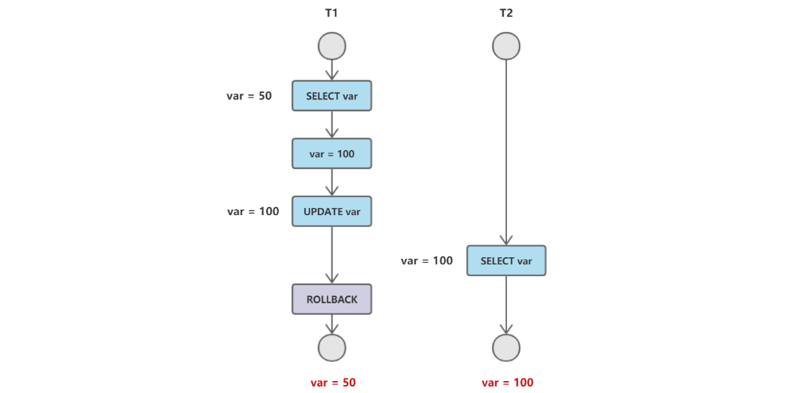
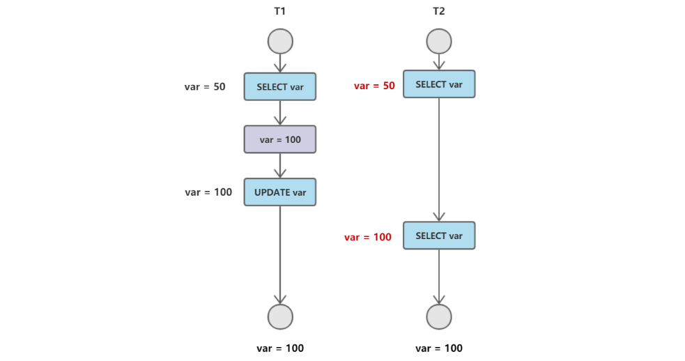
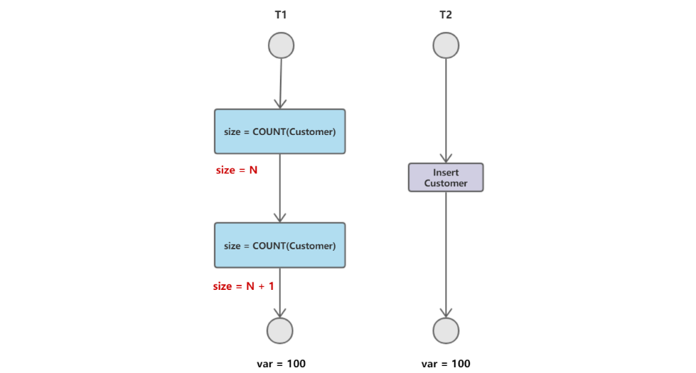

[TOC]

### MySQL事务与并发控制

#### 基础

##### 1. 事务基础

**事务**是指**满足 ACID** 的一组操作，可以通过 Commit **提交**一个事务，也可以通过 Rollback 进行**回滚**。保证**成批**的 SQL 语句**要么全部执行**，要么全部不执行，可以用来维护数据库的完整性。


**基本术语**：

- **事务**（transaction）指一组满足 ACID 条件的 SQL 语句。
- **回滚**（rollback）指撤销指定 SQL 语句的过程。
- **提交**（commit）指将未存储的 SQL 语句结果写入数据库表。
- **保留点**（savepoint）指事务处理中设置的**临时占位符**（placeholder），你可以对它发布回退（与回退整个事务处理不同）。

##### 2. 事务的四大特性ACID

一般来说，**事务**是必须满足 4 个条件（ACID）：**原子性（Atomicity，或称不可分割性）、一致性（Consistency）、隔离性（Isolation，又称独立性）、持久性（Durability）**。

###### (1) 原子性Atomicity

**原子性**：一个事务（transaction）中的所有操作可以被视为一个不可分割的**最小执行单元**，要么**全部完成**，要么全部不完成，不会结束在中间某个环节。

事务在执行过程中发生错误，会被**回滚**（Rollback）到事务开始前的状态，就像这个事务从来没有执行过一样。回滚可以用**回滚日志**来实现，回滚日志记录着事务所**执行的修改操作**，在回滚时**反向执行**这些修改操作即可。比如：A 在银行取钱，密码输入完成还没确定取钱，A 可以决定不取了，此时回滚到没取的状态。

###### (2) 一致性Consistency

数据库在**事务执行前后都保持一致性状态**。在一致性状态下，所有**事务对一个数据的读取结果都是相同**的。在事务开始之前和事务结束以后，数据库的完整性没有被破坏。

比如：A 向 B 转账，不可能 A 扣了钱，B 却没有收到。

###### (3) 隔离性Isolation

一个事务所做的修改在**最终提交**以前，对其它事务是**不可见**的。

数据库允许多个并发事务同时对其数据进行读写和修改的能力，隔离性可以**防止多个事务并发**执行时由于**交叉执行**而导致数据的**不一致**。**事务隔离**分为不同**隔离级别**，包括读未提交（Read uncommitted）、读提交（read committed）、可重复读（repeatable read）和串行化（Serializable）。

比如：A 正在从一张银行卡里面取钱，在 A 取钱的过程中，B 不能向这张银行卡打钱。

###### (4) 持久性Durability

事务完成之后，它对于数据的**修改是永久性**的，即使出现系统故障也能够保持。使用**重做日志**来保证持久性。

比如：A 在银行存了钱，某天断电银行系统宕机，来电之后存的钱依然这么多。

###### (5) 总结


事务的 ACID 特性概念简单，但不是很好理解，主要是因为这几个特性**不是一种平级关系**：

- 只有**满足一致性**，事务的执行结果才是正确的。
- 在**无并发**的情况下，事务**串行**执行，隔离性一定能够满足。此时只要能满足**原子性**，就一定能满足**一致性**。
- 在**并发**的情况下，多个事务**并行**执行，事务不仅要满足**原子性，还需要满足隔离性**，才能满足**一致性**。
- 事务满足持久化是为了能应对数据库崩溃的情况。

##### 3. MySQL事务操作

**不能回退 SELECT** 语句，回退 SELECT 语句也没意义；也**不能回退 CREATE 和 DROP 语句**。

###### (1) 隐式事务AUTOCOMMIT

隐式事务也就是没有明显的开启和结束事务的标志，MySQL **默认采用自动隐式提交模式**。也就是说如果不显式使用 **START TRANSACTION** 语句来开始一个事务，那么每个查询**都会被当做一个事务自动提交**。

当出现 START TRANSACTION 语句时，会关闭隐式提交；当 COMMIT 或 ROLLBACK 语句执行后，事务会自动关闭，重新恢复隐式提交。设置 autocommit 为 0 可以**取消自动提交**；autocommit 标记是针对**每个连接**而不是针对服务器的。

如果**没有设置保留点**，ROLLBACK 会回退到 **START TRANSACTION** 语句处；如果设置了**保留点**，并且在 ROLLBACK 中**指定**该保留点，则会回退到该保留点。

###### (2) 事务相关操作

下面是事务相关的语句。

```mysql
SET AUTOCOMMIT = 0; # 关闭隐式事务
START TRANSACTION;	# 开启显示事务
COMMIT;				# 提交事务
ROLLBACK;			# 回滚事务

SAVEPOINT 断点	   # SAVEPOINT
COMMIT TO 断点	   # 提交到SAVEPOINT
ROLLBACK TO 断点 	   # 回滚到SAVEPOINT
```

默认情况下自动提交是**开启**的。

```java
mysql> SHOW VARIABLES LIKE 'autocommit';
+---------------+-------+
| Variable_name | Value |
+---------------+-------+
| autocommit    | ON    |
+---------------+-------+
1 row in set (0.00 sec)
```

使用显式事务：

```mysql
# 关闭自动提交
SET autocommit = 0;
START TRANSACTION;	# 开启事务
# 编写一组事务的语句
UPDATE account SET balance = 1000 WHERE username='Tom';
UPDATE account SET balance = 1000 WHERE username='Jack';

# 回滚
# ROLLBACK;
# 提交事务
COMMIT;

SELECT * FROM account;
```

演示 **SAVEPOINT** 的使用：

```mysql
SET autocommit = 0;
START TRANSACTION;
DELETE FROM account WHERE id = 25;
SAVEPOINT a;	# 设置保存点
DELETE FROM account WHERE id = 28;
ROLLBACK TO a;	# 回滚到保存点
SELECT * FROM account;
```


#### 并发一致性问题

在**无并发**情况下，事务串行执行，**一致性**容易保证。但在**并发环境**下，事务之间**交替执行**，可能出现**多个事务操作==同一个数据==来完成各自的业务**，事务的==**隔离性**==很难保证，因此会出现很多**并发一致性**问题。它主要强调在**并发状态**下可能出现的**一致性**问题。

##### 1. 丢失修改

一个事务的修改**覆盖**了另一个事务的**修改**。

T1 和 T2 两个事务**都对一个数据进行修改**，**T1 先修改**，**T2 随后**修改，T2 的修改**覆盖了** T1 的修改，这样第一个事务的修改就丢失了。


##### 2. 脏读

读到了**未提交**的数据。

T1 **修改**一个数据，T2 随后**读取**这个数据。如果 T1 **撤销了这次修改**（T1 事务读取 T2 事务**==尚未提交==**的数据，），那么 T2 读取的数据是**脏数据**。



实例：如下面的**取款转账**操作，按照正确逻辑，最后的账户余额应该为 **4000** 元，但是**脏读**之后只有 3000 元了。

| 时间线 |                         转账事务                          |                         取款事务                          |
| :----: | :-------------------------------------------------------: | :-------------------------------------------------------: |
|   1    |                                                           |                         开始事务                          |
|   2    |                         开始事务                          |                                                           |
|   3    |                                                           |                查询账户**余额为 2000 元**                 |
|   4    |                                                           |          **取款 1000 元**，余额被更改为 1000 元           |
|   5    |        查询账户余额为 **1000** 元（产生**脏读**）         |                                                           |
|   6    |                                                           | 取款操作发生未知错误，事务**回滚**，余额变更为**2000** 元 |
|   7    | 存入 2000 元，余额被更改为 **3000** 元（脏读的1000+2000） |                                                           |
|   8    |                  **提交事务（脏数据）**                   |                                                           |

##### 3. 不可重复读

**前后多次**读取，**数据内容不一致**。

T2 **读取**一个数据，T1 对该数据做了**修改**。如果 T2 **再次读取这个数据**，此时读取的结果和第一次读取的**结果不同**。



实例：假设事务 A 在执行**读取**操作，由整个事务 **A 操作较多**，且需要前后读取同一条数据，假设两次读取需要经历很长的时间。如果这时候 B 事务对这个数据进行修改，就造成了两次读到数据不一致。按照正确逻辑，事务 A 前后两次读取到的数据应该一致。

| 时间线 |           事务A（操作多，持续时间长）            |         事务B          |
| :----: | :----------------------------------------------: | :--------------------: |
|   1    |                   **开始事务**                   |                        |
|   2    |        第一次查询，小明的年龄为 **20** 岁        |                        |
|   3    |                                                  |      **开始事务**      |
|   4    |             其他操作（用了较长时间）             |                        |
|   5    |                                                  | 更改小明的年龄为 30 岁 |
|   6    |                                                  |      **提交事务**      |
|   7    | 第二次查询，小明的年龄为 30 岁（**不可重复读**） |                        |

##### 4. 幻读

T1 读取**某个范围**的数据，T2 在这个**范围内插入新的数**据，T1 再次**读取这个范围**（比如年龄小于 50 的范围）的数据，此时读取的结果和和第一次读取的**结果不同**。



实例：事务 A 在执行读取操作，且需要在前后间隔较长时间内进行两次统计数据的**总量**，前一次查询数据总量后，此时事务 B 执行了**新增**（或删除）数据的操作并提交后，这个时候事务 A 读取的数据**总量**和之前**统计的不一样**，就像产生了幻觉一样，平白无故的**多了几条数据**，发生幻读。

| 时间线 |                     事务A                     |           事务B           |
| :----: | :-------------------------------------------: | :-----------------------: |
|   1    |                 **开始事务**                  |                           |
|   2    |       第一次查询，数据**总量为 100 条**       |                           |
|   3    |                                               |       **开始事务**        |
|   4    |                   其他操作                    |                           |
|   5    |                                               | 新增（删除）**50** 条数据 |
|   6    |                                               |         提交事务          |
|   7    | 第二次查询，数据**总量**为 150 条（**幻读**） |                           |

> **不可重复读和幻读的区别**

- **不可重复读的重点是==修改同一条数据==**，比如多次读取一条记录发现其中的数据值被修改。

- **幻读的重点是==新增或者删除范围内的数据==**，比如多次读取某个范围的记录发现范围内的记录数量改变了。

不可重复读的重点是修改比如**多次读取一条**记录发现其中**某些列的值被修改**，幻读的重点在于新增或者删除**范围记录**。

##### 5. 总结

产生**并发一致性**问题主要原因是**破坏了事务的隔离性**，解决方法是通过**并发控制**来保证**隔离性**。

**并发控制**可以通过**加锁**来实现，但是**加锁机制**操作需要**用户自己控制**，相当复杂。于是数据库管理系统**提供了事务的==隔离级别==**，让用户以一种更轻松的方式**处理并发一致性问题**。

OK，下面先介绍**锁机制**的相关内容（**封锁粒度、类型、协议**等），再引入事务**隔离级别**。


#### MySQL锁机制

锁是计算机协调多个进程或线程并发访问某一资源的机制。在数据库中，除了传统的计算资源（如 CPU、RAM、I/O 等）的争用以外，数据也是一种供需要用户**共享的资源**。如何保证数据并发访问的一致性、有效性是所有数据库必须解决的一个问题，锁冲突也是影响数据库并发访问性能的一个重要因素。

##### 1. 锁的分类

- 从性能上分：**乐观锁**(用版本对比来实现)和**悲观锁**。
- 从对数据库操作的类型分：**读锁**和**写锁**(都属于悲观锁)。
- 从对数据操作的粒度分：**表锁和行锁**。

###### (1) 读写锁

- **排它锁**（Exclusive），简写为 X 锁，又称**写锁**。
- **共享锁**（Shared），简写为 S 锁，又称**读锁**。

有以下两个规定：

- 一个事务对数据对象 A 加了 X 锁，就可以对 A 进行读取和更新。加锁期间其它事务不能对 A 加任何锁。
- 一个事务对数据对象 A 加了 S 锁，可以对 A 进行读取操作，但是不能进行更新操作。加锁期间其它事务能对 A 加 S 锁，但是不能加 X 锁。

锁的兼容关系如下：

|     -     | X写锁 | S读锁 |
| :-------: | :---: | :---: |
| **X写锁** |   ×   |   ×   |
| **S读锁** |   ×   | **√** |

总结一下：**只能共享读锁，含写锁的都是排他的**。

###### (2) 意向锁

**问题：**在存在**行级锁和表级锁**的情况下，事务 T 想要对**表 A** 加 X 锁，就需要先检测是否有其它事务对表 A 或者表 A 中的**任意一行**加了锁，那么就需要对表 A 的**每一行都检测一次**，这是非常耗时的。

使用意向锁（Intention Locks）可以更容易地支持**多粒度**封锁。意向锁在原来的 **X/S 锁**之上引入了 **IX/IS，IX/IS 都是表锁**，用来表示一个事务==**想要**==在表中的某个数据行上**加 X 锁或 S 锁**。有以下两个规定：

- 一个事务在获得某个数据行对象的 **S 读锁之前**，必须先获得表的 **IS 锁或者更强的锁**。
- 一个事务在获得某个数据行对象的 **X 写锁**之前，必须先获得表的 **IX 锁**。

**解决**：通过引入**意向锁**，事务 T 想要对表 A 加 **X 锁**，只需要先检测**是否有其它事务**对表 A 加了 **X/IX/S/IS 锁**，如果**加了**就表示有其它事务**正在使用**这个表或者表中某一行的锁，因此事务 T 加 X 锁**失败**。从而避免了每一行都去检查是否加锁。

各种锁的兼容关系如下：

|   -    |  X   |  IX  |  S   |  IS  |
| :----: | :--: | :--: | :--: | :--: |
| **X**  |  ×   |  ×   |  ×   |  ×   |
| **IX** |  ×   |  √   |  ×   |  √   |
| **S**  |  ×   |  ×   |  √   |  √   |
| **IS** |  ×   |  √   |  √   |  √   |

解释如下：

- **任意 IS/IX 锁**之间都是**兼容**的，因为它们只是表示**想要**对表加锁，而不是真正加锁。
- S 锁只与 S 锁和 IS 锁兼容，也就是说事务 T 想要对数据行加 S 锁，其它事务可以已经获得对表或者表中的行的 S 锁。

##### 2. 封锁粒度

MySQL 中提供了两种封锁粒度：**行级锁以及表级锁**。**MyISAM 仅支持表级锁。InnoDB 支持行级锁和表级锁，默认行级锁。**

###### (1) 表锁

**表级锁：** MySQL中锁定**粒度最大**的一种锁，对当前操作的**整张表加锁**，实现简单，资源消耗也比较少，加锁快，**不会出现死锁**。其锁定粒度最大，触发锁冲突的概率最高，并发度最低，MyISAM 和 InnoDB 引擎都支持表级锁。

来个表格。注意**引擎为 MyISAM**。

```mysql
CREATE TABLE `mylock` (
    `id` INT (11) NOT NULL AUTO_INCREMENT,
    `NAME` VARCHAR (20) DEFAULT NULL,
    PRIMARY KEY (`id`)
) ENGINE = MyISAM DEFAULT CHARSET = utf8;

# 插入数据
INSERT INTO`test`.`mylock` (`id`, `NAME`) VALUES ('1', 'a');
INSERT INTO`test`.`mylock` (`id`, `NAME`) VALUES ('2', 'b');
INSERT INTO`test`.`mylock` (`id`, `NAME`) VALUES ('3', 'c');
INSERT INTO`test`.`mylock` (`id`, `NAME`) VALUES ('4', 'd');
```

相关操作：

```mysql
# 手动增加表锁
LOCK TABLE 表名称 READ(WRITE), 表名称2 READ(WRITE); 
# 查看表上加过的锁,如果inuse字段为1，说明这个表已经加锁了
SHOW OPEN TABLES; 
# 删除表锁
UNLOCK TABLES;  
```

**加读锁**：当前 session 和其他 session 都可以**读**该表，当前 session 中插入或者更新锁定的表都会报错，其他 session 插入或更新则会等待。

```mysql
lock table myLock read;
```

**加写锁**：当前 session 对该表的增删改查都没有问题，**其他** session 对该表的**所有操作被阻塞**。 

```mysql
lock table myLock write;
```

**MyISAM 在执行==查询==语句(SELECT)前，会自动给涉及的所有表==加读锁==，在执行==增删改==操作前，会自动给涉及的表加==写锁==。**

对 MyISAM 表的读操作(加读锁)，不会阻寒其他进程对同一表的读请求，但会阻赛对同一表的写请求。只有当读锁释放后,才会执行其它进程的写操作。对 MylSAM 表的写操作(加写锁)，会阻塞其他进程对同一表的读和写操作，只有当写锁释放后，才会执行其它进程的读写操作。数据迁移的时候，可以加一个表锁。

总结：==**读锁会阻塞写，但是不会阻塞读。而写锁则会把读和写都阻塞**。==  

###### (2) 行锁

**行级锁：** MySQL中锁定**粒度最小**的一种锁，每次操作**锁住一行数据**。 行级锁能大大减少数据库操作的冲突。其加锁粒度最小，并发度高，但加锁的开销也最大，**加锁慢**，**可能会出现死锁**。 

后面的很多讨论都是跟行锁有关。

###### (3) 选择

应该尽量只锁定需要修改的那部分数据，而不是所有的资源。锁定的数据量越少，发生锁争用的可能就越小，系统的并发程度就越高。但是加锁需要消耗资源，锁的各种操作（包括获取锁、释放锁、以及检查锁状态）都会增加系统开销。因此封锁粒度越小，系统开销就越大。所以在选择封锁粒度时，需要在**锁开销和并发程度**之间做一个**权衡**。

##### 3. 封锁协议

###### (1) 三级封锁协议

**一级封锁协议**

事务 T 要**修改数据** A 时必须加 **X 锁**，直到 T **结束才释放锁**。

这可以解决**丢失修改**问题，因为不能同时有两个事务对同一个数据进行修改，那么事务的修改就不会被覆盖。

| T<sub>1</sub> | T<sub>2</sub> |
| :-----------: | :-----------: |
|   lock-x(A)   |               |
|   read A=20   |               |
|               |   lock-x(A)   |
|               |     wait      |
|  write A=19   |       .       |
|    commit     |       .       |
|  unlock-x(A)  |       .       |
|               |    obtain     |
|               |   read A=19   |
|               |  write A=21   |
|               |    commit     |
|               |  unlock-x(A)  |

**二级封锁协议** 

在一级的基础上，要求**读取数据** A 时必须**加 S 锁**，读取完==**马上释放 S 锁**==。

可以**解决读脏数据**问题，因为如果一个事务在对数据 A 进行**修改**，根据 1 级封锁协议，会加 **X 锁**，那么就**不能再加 S 锁**了，也就是**不会读入**数据。

|      T<sub>1</sub>      |           T<sub>2</sub>            |
| :---------------------: | :--------------------------------: |
|    lock-x(A)（写锁）    |                                    |
|        read A=20        |                                    |
|       write A=19        |                                    |
|                         |        lock-s(A)（请求锁）         |
|                         |     wait（发现加了X锁，等待）      |
|    rollback（回滚）     |                 .                  |
|          A=20           |                 .                  |
| unlock-x(A)（释放写锁） |                 .                  |
|                         |          obtain（得到锁）          |
|                         |          read A=20（读）           |
|                         | unlock-s(A)（读完**立即释放**S锁） |
|                         |               commit               |

**解决不了不可重复读问题**，试想一下，如果 T2  事务需要读取 A 两次，第一次读了 A，读完就释放了 S 锁，然后 T2 事务继续做其他的，此时数据 A 没有锁是可以加写锁的，如果此时 T1 事务修改了数据 A，那么之后 T2 读到的数据就变了，也就是产生不可重复读问题。

**三级封锁协议** 

在二级的基础上，要求**读取数据 A** 时必须**加 S 锁**，直到==**事务结束**==了**才能释放 S 锁**。（注意前面是读完**立即**释放）。

可以解决**不可重复读**的问题，因为**读 A** 时，其它事务**不能对 A 加 X 锁**，从而**避免了在读的期间数据发生改变**。

|            T<sub>1</sub>             |           T<sub>2</sub>           |
| :----------------------------------: | :-------------------------------: |
|         lock-s(A)（加读锁）          |                                   |
|   read A=20（读数据，读完不释放）    |                                   |
|                                      |       lock-x(A)（请求写锁）       |
|                                      |      wait（发现有S锁，等待）      |
| read A=20（再次读数据，读完不释放）  |                 .                 |
|          commit（提交事务）          |                 .                 |
| unlock-s(A)（事务提交之后再释放S锁） |                 .                 |
|                                      | obtain（读锁事务结束，才获得X锁） |
|                                      |             read A=20             |
|                                      |            write A=19             |
|                                      |        commit（提交事务）         |
|                                      |      unlock-X(A)（释放写锁）      |

###### (2) 两段锁协议

**加锁和解锁**分为**两个阶段**进行。

事务遵循两段锁协议是**保证可串行化调度**的充分条件。可串行化调度是指，通过**并发控制**，使得**并发执行**的事务结果与**某个串行**执行的事务结果**相同**。例如以下操作满足两段锁协议，它是**可串行化调度**。

```html
lock-x(A)...lock-s(B)...lock-s(C)...unlock(A)...unlock(C)...unlock(B)
```

但不是必要条件，例如以下操作不满足两段锁协议，但是它还是可串行化调度。

```html
lock-x(A)...unlock(A)...lock-s(B)...unlock(B)...lock-s(C)...unlock(C)
```

##### 4. 隐式与显示锁定

MySQL 的 **InnoDB 存储**引擎采用**两段锁协议**，会根据**隔离级别**在需要的时候**自动加锁**，并且所有的锁都是在**同一时刻**被释放，这被称为**隐式锁定**。

InnoDB 也可以使用特定的语句进行**显示锁定**：

```sql
SELECT ... LOCK In SHARE MODE;
SELECT ... FOR UPDATE;
```

##### 5. 锁的实现

MySQL 默认**隔离级别是可重复读**，解决不了幻读问题。 单独有**MVCC** **不能解决幻读**问题，Next-Key Locks 就是为了解决这个问题而存在的，它是 InnoDB 存储引擎的一种**锁实现**。在**可重复读**（REPEATABLE READ）隔离级别下（可以解决脏读和不可重复读），使用 **==MVCC + Next-Key Locks== 可以解决幻读问题**。

###### (1) 行锁Record Locks

**对单个行记录加锁**。如果表没有设置索引，InnoDB 会自动在**主键**上创建隐藏的**聚簇索引**，因此 Record Locks 依然**可以使用**。

###### (2) 间隙锁Gap Locks

间隙锁，**锁定一个范围**，不包括记录本身。也就是锁定**索引**之间的**间隙**，但是**不包含索引本身**。例如当一个事务执行以下语句，其它事务就不能在 t.c 中插入 15。

```sql
SELECT c FROM t WHERE c BETWEEN 10 and 20 FOR UPDATE;
```

###### (3) Next-Key Locks

它是 **Record Locks 和 Gap Locks 的结合**，不仅锁定一个记录上的**索引**（包含记录本身），也锁定索引之间的**间隙**。例如一个索引包含以下值：10, 11, 13, and 20，那么就需要锁定以下**区间**：

```sql
(-∞, 10]
(10, 11]
(11, 13]
(13, 20]
(20, +∞)
```

**锁定间隙有什么用**？？因为幻读就是 A 事务**第一次读了一个范围的数据**之后（此时 A 没有结束），另一个 B 事务在这个范围插入或者删除数据行所致，锁定间隙可以防止其他事务在之中改变数据行数，就**解决了幻读问题**。

**间隙锁在某些情况下可以解决幻读问题**。要避免**幻读**可以用**间隙锁**在 Session_1 下面执行 update account set name = 'Lucy' **where id > 10 and id <=20**; ，则其他 Session **没法在这个范围所包含的间隙（10 - 20 之间就是间隙）里插入或修改任何数据**。上面的语句就**默认**在 10   到 20 之间加了**间隙锁**。需要注意写 SQL 的时候注意检索范围，**避免间隙锁锁太多行**。

##### 6. 行锁分析

通过检查 **InnoDB_row_lock** 状态变量来分析系统上的**行锁的争夺**情况。

```mysql
show status like'innodb_row_lock%';
```

对各个状态量的说明如下：

- Innodb_row_lock_current_waits：当前正在等待锁定的数量。
- Innodb_row_lock_time：从系统启动到现在锁定总时间长度。
- Innodb_row_lock_time_avg：每次等待所花平均时间。
- Innodb_row_lock_time_max：从系统启动到现在等待最长的一次所花时间。
- Innodb_row_lock_waits：系统启动后到现在总共等待的次数。

对于这 5 个状态变量，比较重要的主要是：

- **Innodb_row_lock_time_avg （等待平均时长）**
- **Innodb_row_lock_waits （等待总次数）**
- **Innodb_row_lock_time（等待总时长）**

尤其是当**等待次数很高**，而且每次等待时长也不小的时候，就需要分析系统中为什么会有如此多的等待，然后根据分析结果着手制定优化计划。

##### 7. 死锁

```mysql
# 设置隔离级别为可重复读
SET tx_isolation='repeatable-read';
Session_1执行：SELECT * FROM account WHERE id=1 FOR UPDATE;
Session_2执行：SELECT * FROM account WHERE id=2 FOR UPDATE;
Session_1执行：SELECT * FROM account WHERE id=2 FOR UPDATE;
Session_2执行：SELECT * FROM account WHERE id=1 FOR UPDATE;
```

查看近期死锁日志信息：

```mysql
show engine innodb status\G;
```

大多数情况 MySQL 可以**自动检测死锁**并回滚产生死锁的那个事务，但是有些情况 MySQL 没法自动检测死锁。

##### 8. 索引与锁的关系

**无索引行锁会升级为表锁**：锁主要是加在**索引**上，如果对非索引字段更新, 行锁可能会变表锁。比如 session1 执行：

```mysql
update account set balance = 800 where name = 'lilei';
```

session2 对该表**任一行**操作都会**阻塞**住。InnoDB 的**行锁是针对==索引==加的锁**，**不是针对记录**加的锁。并且该索引不能失
效，否则都会**从行锁升级为表锁**。  锁定某一行还可以用 lock in share mode(共享锁) 和 for update(排它锁)。

例如：

```mysql
select * from test_innodb_lock where a = 2 for update;
```

这样其他 session 只能**读**这行数据，修改则会被阻塞，直到锁定行的 session 提交。  

##### 9. 锁优化

- 尽可能让所有**数据检索都通过==索引==来完成**，避免**无索引行锁升级为表锁**。同时合理设计索引，尽量**缩小锁的范围**。
- 尽可能减少检索条件范围，**避免间隙锁**。
- 尽量控制事务大小，减少锁定资源量和时间长度，涉及事务加锁的 SQL。尽可能低级别事务隔离。


#### 事务隔离级别

##### 1. 概述

事务隔离级别就是为了解决上面**并发一致性**的几种问题（丢失修改、脏读、不可重复读、幻读等）而诞生的。为什么要有事务隔离级别，因为事务隔离**级别越高**，在并发下会产生的问题就**越少**，但同时付出的性能消耗也将越大，因此很多时候必须在并发性和性能之间做一个权衡。所以设立了**几种事物隔离级别**，以便让**不同的项目可以根据自己项目的并发情况**选择合适的事务隔离级别，对于在事务隔离级别之外会产生的并发问题，在代码中做补偿。

**并发控制**可以通过**封锁**来实现，但是**加锁机制**操作需要**用户自己控制**，相当复杂。数据库管理系统**提供了事务的==隔离级别==**，让用户以一种更轻松的方式**处理并发一致性问题**。

设置隔离级别：

```mysql
SET SESSION|GLOBAL TRANSACTION ISOLATION LEVEL 隔离级别名;
```

查看隔离级别：

```mysql
SELECT @@tx_isolation;
```

每个**会话都有自己的事务隔离级别**，不同的**连接**可以设置不同的隔离级别。

##### 2. 分类

###### (1) 读未提交（READ UNCOMMITTED）

事务中的**修改**，即使**没有提交**，对其它事务也是**可见**的。问题多多。

###### (2) 读已提交（READ COMMITTED）

一个事务只能**读取已经提交的**事务所做的修改。换句话说，一个事务所做的**修改**在提交之前对**其它事务是不可见**的。解决了**脏读**的问题。

###### (3) 可重复读（REPEATABLE READ）

保证在同一个事务中**多次读取==同样数据==的**结果是一样的，是**默认的隔离级别**。可重复读解决了脏读与不可重复读问题，但是理论上依然不能解决幻读问题。

但是与 SQL 标准不同的是 InnoDB 存储引擎在可重复读事务隔离级别下使用的是 **MVCC** 实现，并配合 **Next-Key Lock 锁算法**，因此可以**避免幻读**的产生，这与其他数据库系统(如 SQL Server) 是不同的。所以说 InnoDB 存储引擎的默认支持的隔离级别是 **REPEATABLE-READ（可重读）** 已经**可以完全保证事务的隔离性要求**，即达到了 SQL 标准的 **SERIALIZABLE(可串行化)** 隔离级别。

因为隔离级别越低，事务请求的锁越少，所以许多数据库系统的隔离级别都是 **READ-COMMITTED(读已提交)** ，但是 InnoDB 默认使用 **REPEATABLE-READ（可重读）** 并不会有任何性能损失。

###### (4) 可串行化（SERIALIZABLE）

强制事务**串行执行**，解决一切问题，但是性能消耗严重。需要**加锁**实现。

##### 3. 总结

各个隔离级别可以解决的并发一致性问题表，可以根据项目的需求进行选择。

|            隔离级别             |   脏读   | 不可重复读 |   幻读   |
| :-----------------------------: | :------: | :--------: | :------: |
|  Read uncommitted（读未提交）   | :scream: |  :scream:  | :scream: |
| Read committed（**读已提交**）  | :smile:  |  :scream:  | :scream: |
| Repeatable read（**可重复读**） | :smile:  |  :smile:   | :scream: |
|   Serializable（**串行化**）    | :smile:  |  :smile:   | :smile:  |


#### 多版本并发控制MVCC

##### 1. 概述

看了隔离级别，问题来了，这些隔离级别在 MySQL 中是如何**具体实现**的？

**多版本并发控制**（Multi-Version Concurrency Control, **MVCC**）是 MySQL 的 **InnoDB** 存储引擎**实现隔离级别**的一种**具体方式**，用于实现**提交读**和**可重复读**这两种隔离级别。而**未提交读**隔离级别总是读取**最新的数据行**，**无需**使用 MVCC。**可串行化**隔离级别需要对所有读取的行都**加锁**，单纯使用 MVCC **无法实现**。

MVCC 是一种**并发控制**的方法，一般在数据库管理系统中，实现对数据库的**并发访问**。

在 MVCC 协议下，每个**读**操作会看到一个**一致性**的 Snapshot，并且可以实现**非阻塞的读**。MVCC 允许数据具有==**多个版本**==，这个版本可以是时间戳或者是全局递增的事务 ID。MVCC 的实现是通过保存**数据**在某个时间点的**快照**来实现的。这意味着一个**事务**无论运行**多长时间**，在**同一个事务**里能够看到**数据一致的视图**。根据**事务开始的时间不同**，同时也意味着在同一个时刻**不同事务**看到的相同表里的数据可能是**不同**的。

**==MVCC 中的快照点只是解决了并发读的问题，对于增删改都会使用到数据库中最新的数据。==**并发读的是快照。

##### 2. 版本号

- **系统版本号**：是一个**递增**的数字，每开始一个**新的事务**，系统版本号就会**自动递增**。
- **事务版本号**：事务开始时对应的**系统版本号**。

begin/start transaction 命令**并不是一个事务**的起点，在执行到它们之后的第一个操作 InnoDB 表的语句时事务才真正启动，才会向 MySQL 申请事务 id，MySQL 内部是**严格按照事务的启动顺序来分配事务 id 的**。 

##### 3. 隐藏的列

MVCC 在**每行**记录后面都保存着两个**隐藏的列**，用来存储**两个版本号**：

- **创建版本号**：指示**创建**一个数据行的**快照**时的**系统版本号**。
- **删除版本号**：如果该快照的**删除版本号大于当前事务版本号**表示该**快照有效**，否则表示该**快照已经被删除**了。

其实这两个版本号可以理解成一个**事务**的版本号。

##### 4. Undo日志

MVCC 使用到的**快照**存储在 **Undo 日志**中，该日志通过**回滚指针**把一个**数据行（Record）的所有快照**连接起来，这样数据就可以有**多个版本**。


##### 5. 可重复读的实现过程

以下实现过程针对**可重复读**隔离级别。

当开始一个事务时，**该事务的版本号肯定大于当前所有数据行快照的创建版本号**，理解这一点很关键。数据行快照的创建版本号是创建数据行快照时的系统版本号，系统版本号随着创建事务而递增，因此新创建一个事务时，**当前这个事务的系统版本号就会比所有数据行快照的创建版本号都大**。

###### (1) SELECT

**多个事务**必须读取到同一个数据行的快照，并且这个快照是**距离现在最近**的一个**有效快照**。但是也有例外，如果有一个事务**正在修改**该数据行，那么它可以读取事务本身所做的修改，而不用和其它事务的读取结果一致。

把没有对一个数据行做修改的**事务称为 T**，T 所要读取的数据行快照的创建版本号必须**小于 T 的版本号**，因为如果大于或者等于 T 的版本号，那么表示该数据行快照是其它事务的最新修改，因此**不能**去读取它。除此之外，T 所要读取的数据行快照的**删除版本号**必须**大于 T 的版本号**，因为如果小于等于 T 的版本号，那么表示该数据行快照是**已经被删除**的，不应该去读取它。

###### (2) INSERT

将当前**系统版本号**作为数据行快照的**创建版本号**。由于旧数据并不真正的删除，所以必须对这些数据进行**清理**，InnoDB 会开启一个后台线程执行清理工作，具体的规则是将**删除版本号小于当前系统版本的行删除**，这个过程叫做 **purge**。

###### (3) DELETE

将当前**系统版本号**作为数据行快照的**删除版本号**。对于**删除**操作，MySQL 底层会记录好被删除的数据行的**删除事务 id**，对于**更新**操作 MySQL 底层会**新增一行相同数据（使用 undoLog 实现）**并记录好对应的**创建事务 id**。

- **创建事务 id <= max (当前事务 id(12)，快照点已提交最大事务 id）**
- **删除事务 id> max (当前事务 id(12)，快照点已提交最大事务 id）**  

###### (4) UPDATE

将当前**系统版本号**作为更新前的数据行快照的**删除版本号**，并将当前**系统版本号**作为更新后的数据行快照的**创建版本号**。可以理解为**先执行 DELETE 后执行 INSERT**。

##### 6. 快照读与当前读

###### (1) 快照读

使用 **MVCC** 读取的是**快照中**的数据，这样可以**减少加锁**所带来的开销。

```sql
SELECT * FROM TABLE ...;
```

###### (2) 当前读

**读取**的是**最新**的数据，需要**加锁**。以下第一个语句需要加 **S 锁**，其它都需要加 **X 锁**。

```sql
SELECT * FROM TABLE WHERE ? LOCK IN SHARE MODE;
SELECT * FROM TABLE WHERE ? FOR UPDATE;
INSERT;
UPDATE;
DELETE;
```


#### 参考资料

- [The InnoDB Storage Engine](https://dev.mysql.com/doc/refman/5.7/en/innodb-storage-engine.html)
- [Transaction isolation levels](https://www.slideshare.net/ErnestoHernandezRodriguez/transaction-isolation-levels)
- [Concurrency Control](http://scanftree.com/dbms/2-phase-locking-protocol)
- [The Nightmare of Locking, Blocking and Isolation Levels!](https://www.slideshare.net/brshristov/the-nightmare-of-locking-blocking-and-isolation-levels-46391666)
- [Database Normalization and Normal Forms with an Example](https://aksakalli.github.io/2012/03/12/database-normalization-and-normal-forms-with-an-example.html)
- [The basics of the InnoDB undo logging and history system](https://blog.jcole.us/2014/04/16/the-basics-of-the-innodb-undo-logging-and-history-system/)
- [MySQL locking for the busy web developer](https://www.brightbox.com/blog/2013/10/31/on-mysql-locks/)
- [浅入浅出 MySQL 和 InnoDB](https://draveness.me/mysql-innodb)
- Innodb 中的事务隔离级别和锁的关系