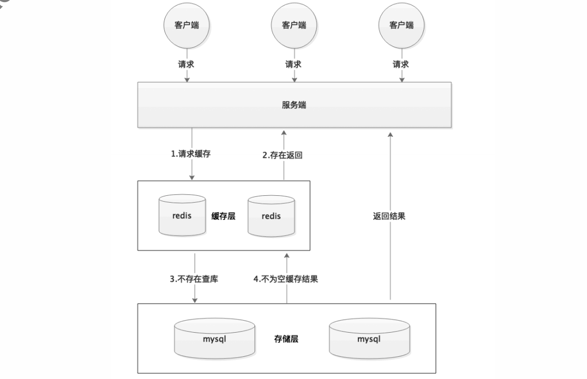
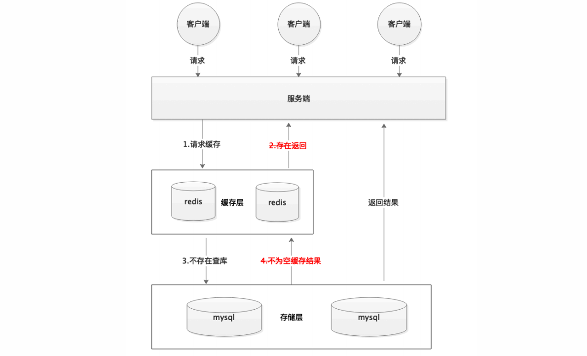

[TOC]

### 缓存理论

#### 缓存基础

##### 1. 概述

**命中率**：当某个请求能够通过访问缓存而得到响应时，称为**缓存命中**。缓存命中率越高，缓存的利用率也就越高。

**最大空间**：缓存通常位于内存中，内存的空间通常比磁盘空间小的多，因此缓存的最大空间不可能非常大。当缓存存放的数据量**超过最大空间**时，就需要**淘汰**部分数据来存放新到达的数据。

##### 2. 缓存淘汰(更新)策略

剔除算法通常用于缓存使用量**超过了预设最大值**的时候，如何对现有数据进行剔除。例如 Redis 使用 **maxmemory-policy** 参数配置剔除策略。这种方式一致性最差。

###### (1) FIFO/LRU/LFU算法剔除

**FIFO 先进先出策略**：FIFO（First In First Out）：先进先出策略，在实时性的场景下，需要经常访问最新的数据，那么就可以使用 FIFO，使得最先进入的数据（最晚的数据）被淘汰。

**LRU 最近最久未使用策略**：LRU（Least Recently Used）：最近最久未使用策略，优先淘汰最久未使用的数据，也就是上次被访问时间距离现在最久的数据。该策略可以保证内存中的数据都是热点数据，也就是经常被访问的数据，从而保证缓存命中率。

**LFU 最不经常使用策略**：LFU（Least Frequently Used）：最不经常使用策略，优先淘汰一段时间内使用次数最少的数据。

###### (2) 超时剔除

通过给缓存数据**设置超时时间**，让其在过期时间后**自动删除**，如 Redis 提供的 **expire** 命令。

###### (3) 主动更新

对于**高一致性要求**场景下，需要在真实数据更新后，**立即**更新缓存数据。

##### 3. 手写LRU实例

以下是基于 **双向链表 + HashMap** 的 LRU 算法实现，对算法的解释如下：

- **访问**某个节点时，将其从原来的位置**删除**，并重新插入到**链表头部**。这样就能保证链表**尾部**存储的就是**最近最久未使用**的节点，当节点数量**大于**缓存最大空间时就**淘汰**链表尾部的节点。
- 为了使**删除**操作时间复杂度为 **O(1)**，就不能采用遍历的方式找到某个节点。**HashMap** 存储着 **Key 到节点**的映射，通过 Key 就能以 O(1) 的时间得到节点，然后再以 O(1) 的时间将其从**双向队列**中删除。

采⽤这两种数据结构的组合，get 操作就可以在 O(1) 时间复杂度内完成了。由于 put 操作我们要删除的节点⼀般是尾部节点，所以我们可以⽤⼀个变量 tail 时刻记录尾部节点的位置，这样 put 操作也可以在 O(1) 时间内完成了。  

这里实现就是需要先来一个结点类。

```java
private static class LRUNode {
    String key;
    Object value;
    LRUNode next;
    LRUNode pre;

    public LRUNode(String key, Object value) {
        this.key = key;
        this.value = value;
    }
}
```

注意：不管是 put 方法还是 get 方法，**都需要将访问的结点重新放到链表头部**，所以会抽出一个公共的方法。

```java
public class LRUCache {

	Map<String, LRUNode> map = new HashMap<>();
	LRUNode head;
	LRUNode tail;
	// 缓存最⼤容量大于1
	int capacity;

	public LRUCache(int capacity) {
		this.capacity = capacity;
	}

	/**
	 * 插入元素
	 * @param key 键
	 * @param value 值
	 */
	public void put(String key, Object value) {
		// 说明缓存中没有任何元素
		if (head == null) {
			head = new LRUNode(key, value);
			tail = head;
			map.put(key, head);
		}
		// 说明缓存中已经存在这个元素了
		LRUNode node = map.get(key);
		if (node != null) {
			// 更新值
			node.value = value;
			// 把这个结点从链表删除并且插⼊到头结点
			removeAndInsert(node);
		} else {
			// 说明当前缓存不存在这个值
			LRUNode newHead = new LRUNode(key, value);
			// 此处溢出则需要删除最近最近未使用的节点
			if (map.size() >= capacity) {
				map.remove(tail.key);
				// 删除尾结点
				tail = tail.pre;
				tail.next = null;
			}
			map.put(key, newHead);
			// 将新的结点插入链表头部
			newHead.next = head;
			head.pre = newHead;
			head = newHead;
		}
	}

	/**
	 * 从缓存中取值
	 */
	public Object get(String key) {
		LRUNode node = map.get(key);
		// 如果有值则需要将这个结点放到链表头部
		if (node != null) {
			// 把这个节点删除并插⼊到头结点
			removeAndInsert(node);
			return node.value;
		}
		return null;
	}

	private void removeAndInsert(LRUNode node) {
		// 特殊情况先判断，例如该节点是头结点或是尾部节点
		if (node == head) {
			return;
		} else if (node == tail) {
			tail = node.pre;
			tail.next = null;
		} else {
			node.pre.next = node.next;
			node.next.pre = node.pre;
		}
		// 插⼊到头结点
		node.next = head;
		node.pre = null;
		head.pre = node;
		head = node;
	}
}
```

**LinkedHashMap** 也可以用来实现固定大小的 LRU 缓存，当 LRU 缓存已经满了的时候，它会把最老的键值对移出缓存。LinkedHashMap 提供了一个称为 **removeEldestEntry**() 的方法，该方法会被 put() 和 putAll() 调用来删除最老的键值对。

##### 4. 缓存实现与缓存位置

###### 1. 浏览器

当 HTTP 响应**允许**进行缓存时，浏览器会将 HTML、CSS、JavaScript、图片等**静态**资源进行缓存。

###### 2. ISP

**网络服务提供商**（ISP）是网络访问的**第一跳**，通过将**数据缓存在 ISP 中**能够大大提高用户的**访问速度**。

###### 3. 反向代理

反向代理位于服务器之前，**请求与响应都需要经过反向代理**。通过将**数据缓存在反向代理**，在用户请求反向代理时就可以直接使用缓存进行响应。

###### 4. 本地缓存

使用 **Guava Cache** 将数据缓存在**服务器本地内存**中，服务器代码可以直接读取本地内存中的缓存，速度非常快。

缓存分为**本地缓存和分布式缓存**。以 Java 为例，使用**自带的 map 或者 guava** 实现的是本地缓存，最主要的特点是轻量以及快速，**生命周期**随着 JVM 的销毁而结束，并且在多实例的情况下，每个实例都需要各自保存一份缓存，缓存不具有一致性。

###### 5. 分布式缓存

使用 Redis、Memcache 等**分布式缓存**将数据缓存在分布式缓存系统中。相对于本地缓存来说，分布式缓存单独部署，可以根据需求分配硬件资源。不仅如此，**服务器集群都可以访问分布式缓存**，而本地缓存需要在服务器集群之间进行同步，实现难度和性能开销上都非常大。

在多实例的情况下，各实例共用一份缓存数据，**缓存具有一致性**。缺点是需要保持 Redis 或 memcached 服务的**高可用**，整个程序架构上较为复杂。

###### 6. 数据库缓存

MySQL 等数据库管理系统具有自己的**查询缓存机制**来提高查询效率。

###### 7. Java内部缓存

Java 为了优化空间，提高字符串、基本数据类型包装类的创建效率，设计了字符串常量池及 Byte、Short、Character、Integer、Long、Boolean 这六种包装类**缓冲池**。

###### 8. CPU多级缓存

CPU 为了解决运算速度与**主存 IO 速度不匹配**的问题，引入了**多级缓存**结构，同时使用 MESI 等缓存一致性协议来解决多核 CPU 缓存数据一致性的问题。

##### 5. CDN

**内容分发网络**（Content distribution network，CDN）是一种**互连的网络系统**，它利用**更靠近用户的服务器**从而更快更可靠地将 HTML、CSS、JavaScript、音乐、图片、视频等**静态资源分发给用户**。

CDN 主要有以下优点：

- 更快地将数据分发给用户。
- 通过部署多台服务器，从而提高系统整体的带宽性能。
- 多台服务器可以看成是一种冗余机制，从而具有高可用性。


#### 缓存问题

**缓存**也可能存在一些问题。

##### 1. 缓存穿透

###### (1) 概述

指的是对某个**缓存中一定不存在**的数据进行请求，该请求将会**穿透缓存到达数据库**。举个例子：某个黑客故意制造缓存中**不存在的 key** 发起大量请求，导致大量请求落到数据库。

正常缓存处理流程：



缓存穿透情况：



一般 MySQL 默认的最大连接数在 150 左右，这个可以通过 **show variables like '%max_connections%';** 命令来查看。最大连接数一个还只是一个指标，CPU，内存，磁盘，网络等无力条件都是其运行指标，这些指标都会限制其并发能力！所以一般 3000 个并发请求就能打死大部分数据库了。

###### (2) 解决方案

首先可以在**应用层**记录一下**缓存穿透的次数**，方便问题查找与预警。

**(1) 参数校验**

**最基本**的就是首先**做好参数校验**，一些不合法的参数请求直接**抛出异常信息**返回给客户端。比如查询的**数据库 id 不能小于** 0、传入的邮箱**格式不对**的时候直接返回错误消息给客户端等等。

**(2) 缓存无效的key**

如果缓存和数据库**都查不到**某个 key 的数据就**写一个**这个键的**空对象**到 Redis 中去并**设置过期时间**，具体命令如下：

```mysql
SET key value EX 10086
```

这种方式可以解决请求的 **key 变化不频繁**的情况，如果黑客恶意攻击，每次构建不同的请求key，会导致 Redis 中缓存大量无效的 key 。很明显，这种方案并不能从根本上解决此问题。如果非要用这种方式来解决穿透问题的话，**尽量将无效**的 key 的过期时间设置**短一点**比如 1 分钟。

一般情况下是这样设计 key 的： `表名:列名:主键名:主键值`。

如果用 Java 代码展示的话，差不多是下面这样的：

```java
public Object getObjectInclNullById(Integer id) {
    // 从缓存中获取数据
    Object cacheValue = cache.get(id);
    // 缓存为空
    if (cacheValue == null) {
        // 从数据库中获取
        Object storageValue = storage.get(key);
        // 缓存空对象
        cache.set(key, storageValue);
        // 如果存储数据为空，需要设置一个较短的过期时间(300秒)
        if (storageValue == null) {
            // 必须设置过期时间，否则如果键变化较大可能造成Redis内存不够用
            cache.expire(key, 60 * 5);
        }
        return storageValue;
    }
    return cacheValue;
}
```

**(3) 使用布隆过滤器**

需要做的就是**判断 key 是否合法**。**事先**就把所有**可能存在的请求的值都存放在布隆过滤器**中，当用户请求过来，先判断**请求的值是否存在于布隆过滤器**中。**不存在**的话，直接返回**请求参数错误**信息给客户端，存在的话才会走下面的流程。布隆过滤器在缓存层**之前**。总结一下就是下面这张图：


这种方法适用于数据**命中率不高、数据相对固定**、实时性低（通常是**数据集较大**）的场景。使用 BloomFilter 布隆过滤器的话，需要**提前将已存在的 KEY** ，**初始化存储**到 BloomFilter 缓存中。

构建 BloomFilter 数据结构，在 BloomFilter 中查看**对应的 KEY 是否存在**，如果**存在**，说明该 KEY 对应的值**不为空**。那么整个逻辑的如下：根据 KEY 查询 BloomFilter 缓存。如果**不存在对应的值，直接返回**；如果存在就说明是大概率是系统预先存入的键，这时候就可以去 Redis 中查询是否存在缓存。如果存在缓存值，直接返回；如果不存在则继续到数据库去查数据。找到的数据可以再次存储到 Redis 中，并且可以**更新 BloomFilter** 缓存记录。

> 具体怎么实现 BloomFilter？

- **Redisson BloomFilter**：Java Redis 库，实现 BloomFilter 的功能。
- 基于 Guava 实现。
- 基于 Redis 自带的 Bitmaps 结构。

##### 2. 缓存雪崩

###### (1) 概述

指的是由于**数据没有被加载到缓存**中，或者缓存数据在**同一时间大面积失效**（过期），又或者**缓存服务器宕机**，导致大量的请求都同时到达数据库。

在有缓存的系统中，系统非常依赖于缓存，缓存分担了很大一部分的数据请求。当发生缓存雪崩时，数据库无法处理这么大的请求，导致数据库崩溃。就像**雪崩**一样。

###### (2) 解决方案

- 为了防止缓存在同一时间大面积过期导致的缓存雪崩，可以通过**观察用户行为**，合理设置**缓存过期时间**。
- 为了防止缓存服务器宕机出现的缓存雪崩，可以使用**分布式缓存**，保证**缓冲层的高可用**。分布式缓存中每一个节点只缓存部分的数据，当某个节点宕机时可以保证其它节点的缓存仍然可用，实现**高可用**。
- 也可以进行**缓存预热**，**提前放一些数据到缓存中**，避免在系统刚启动不久由于还未将大量数据进行缓存而导致缓存雪崩。
- **依赖隔离组件为后端限流并降级**。可以考虑进行**服务降级**，并对重要的资源进行**隔离**。

另一个答案：

- **事前**：尽量保证整个 Redis 集群的**高可用性**，发现机器宕机尽快补上。选择合适的**内存淘汰策略**。
- **事中**：**本地 Ehcache 缓存** + **hystrix 限流&降级**，避免 MySQL 崩掉。
- **事后**：利用 Redis **持久化**机制保存的数据**尽快恢复缓存**。

##### 3. 缓存一致性问题

###### (1) 概述

**缓存层和存储层**的数据存在着一定时间窗口的**不一致性**。缓存一致性要求数据**更新的同时缓存数据也能够实时更新**。

更新 DB 和操作缓存两个动作之间，明显**缺乏原子性**，有可能更新 DB 完成，但是操作（淘汰或者更新）缓存失败，反之亦然。所以两者之间必然是存在断层的，那么先选择操作谁才是最佳的方案？

###### (2) 解决方案

**可以考虑先更新数据库，再更新缓存**。如果采用先淘汰缓存，后更新 DB 操作，如果在 DB 更新完成之前，来了一个新的读请求，那么就会查询出数据库的旧数据，缓存到 Redis，导致 DB 更新完成之后，两者数据不一致。如果先更新 DB，然后操作缓存失败，客户端读取到的是旧的数据，此时也是存在 DB 与缓存不一致，但是实际业务上，更多的**还是以 DB 数据为准**，这种读取到旧数据的业务影响可能比读取到为未更新到 DB 的数据影响要小。使用缓存本身就能容忍有一定的脏数据出现。

要保证缓存一致性需要付出很大的代价，**==缓存数据最好是那些对一致性要求不高的数据，允许缓存数据存在一些脏数据==**。

##### 4. 缓存无底洞

###### (1) 概述

缓存"无底洞"指的是为了满足业务要求**添加了大量缓存节点**，但是**性能不但没有好转反而下降**了的现象。

**产生原因**：缓存系统通常**采用 hash 函数将 key 映射到对应的缓存节点**，随着缓存节点数目的增加，**键值分布到更多的节点上**，导致客户端一次批量操作会涉及**多次网络操作**，这意味着批量操作的**耗时会随着节点数目的增加而不断增大**。此外，网络连接数变多，对节点的性能也有一定影响。

###### (2) 解决方案

- 优化**批量数据**操作命令。
- 减少网络通信**次数**。
- 降低**接入成本**，使用长连接 / 连接池，**NIO** 等。

**分布式**条件下，以 Redis 的 **mget** 指令为例，有**四种批量操作的解决方案**。

- 串行命令。逐次执行 n 个 get 命令。
- 串行 IO。在客户端缓存键--槽--节点的对应关系，在同一个节点的数据使用 Pipeline 请求完成。
- 并行 IO。使用多线程方式进行串行 IO。
- hash_tag 实现。Redis cluster 的 hash_tag 功能可以将多个 key 强制分配到一个节点上，减少操作。


#### 数据分布方式

##### 1. 顺序分布

将数据划分为**多个连续**的部分，按数据的 ID 或者时间分布到不同节点上。例如 User 表的 ID 范围为 1 \~ 7000，使用顺序分布可以将其划分成多个子表，对应的主键范围为 1 \~ 1000，1001 \~ 2000，...，6001 \~ 7000。

顺序分布相比于哈希分布的主要优点如下：

- 能保持数据原有的**顺序**。
- 并且能够准确控制每台服务器存储的数据量，从而使得存储空间的利用率最大。

##### 2. 哈希分布

**哈希分布**就是将数据计算哈希值之后，按照**哈希值**分配到不同的节点上。例如有 N 个节点，数据的主键为 key，则将该数据分配的节点序号为：**hash(key) % N**。

传统的哈希分布算法存在一个问题：当节点数量变化时，也就是 N 值变化，那么几乎所有的数据**都需要重新分布**（再哈希），将**导致大量的数据迁移**。

##### 3. 一致性哈希分布

**Distributed Hash Table**（DHT） 是一种**哈希分布方式**，其目的是为了解决传统哈希分布在服务器节点数量变化再哈希时**大量数据迁移**的问题。

###### (1) 基本原理

将哈希空间 [0, 2<sup>n</sup>-1] 看成一个**哈希环**，每个服务器**节点**都配置到**哈希环**上。**==每个数据对象通过哈希取模得到哈希值之后，存放到哈希环中顺时针方向第一个大于等于该哈希值的节点上==**。


一致性哈希在**增加或者删除节点时只会影响到哈希环中相邻的节点**，例如下图中新增节点 X，只需要将它前一个节点 C 上的数据重新进行分布即可，对于节点 A、B、D 都没有影响。


###### (2) 虚拟节点

上面描述的一致性哈希依然可能存在数据**分布不均匀**的问题，节点存储的数据量有可能会存在**很大的不同**。数据不均匀主要是因为**节点在哈希环上分布的不均匀**，这种情况在**节点数量很少**的情况下尤其明显。

解决方式是通过**增加虚拟节点**，然后将**虚拟节点映射到真实节点**上。虚拟节点的数量比真实节点来得**多**，那么虚拟节点在哈希环上分布的均匀性就会比原来的真实节点好，从而使得数据分布也更加均匀。


#### 参考资料

- 大规模分布式存储系统
- [缓存那些事](https://tech.meituan.com/cache_about.html)
- [一致性哈希算法](https://my.oschina.net/jayhu/blog/732849)
- [内容分发网络](https://zh.wikipedia.org/wiki/%E5%85%A7%E5%AE%B9%E5%82%B3%E9%81%9E%E7%B6%B2%E8%B7%AF)


