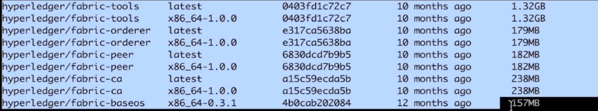
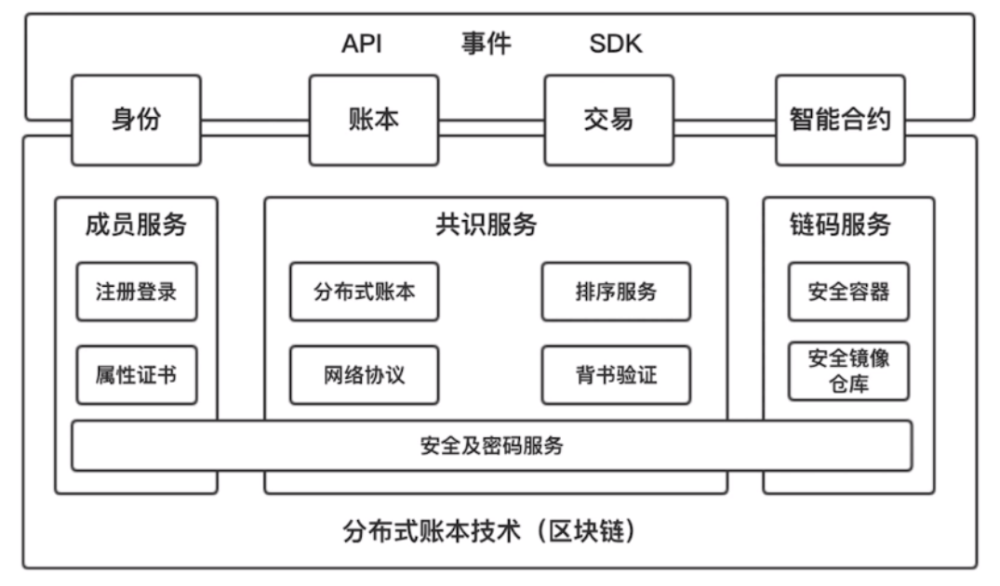
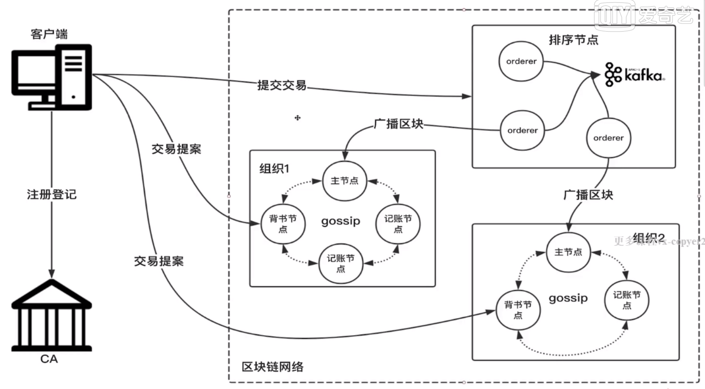
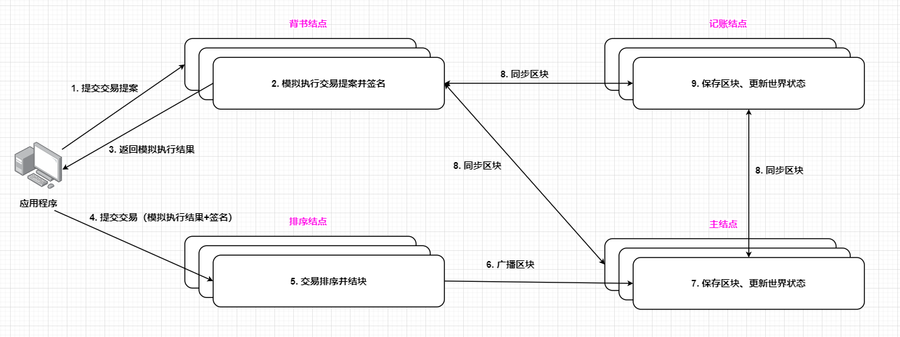

### Hyperledger

#### 概述

##### 1. 生态

###### 框架

**Fabric**：最重要的框架。

**Indy**：去中心化数据身份平台。

**Sawtooth**：对以太坊的拓展。

**Burrow**：对以太坊的拓展。

###### 工具

**Caliper**：区块链性能测试工具，可以测试 Fabric 的 QPS 等。

**Cello**：基于上述框架搭建服务平台。

**Composer**：模块化部署工具。

**Explorer**：Fabric 的区块链浏览器。

##### 2. Fabric概览

###### 项目介绍

- 企业级联盟链基础设施。
- 可插拔的共识机制（solo、Kafka...）
- 多链多通道隔离

##### 3. 智能合约

分布式有限状态机。执行环境安全隔离、不受第三方干扰（EVM虚拟机、Docker等）。

**链码**：在 Fabric 中智能合约就叫链码。链码编程接口：**init() 与 invoke() 方法**。

##### 4. 环境安装

- 操作系统：CentOS
- Docker、Docker Compose
- Fabric组件Docker镜像：在 Docker 商店中找组件。

- Fabric源码库：cryptogen、configtxgen工具编译、fabric-samples。

**步骤**：去 GitHub 下载 fabric 和 fabric-samples 两个项目。

#### 核心技术

##### 1. 整体架构

##### 2. 网络拓扑 

- 客户端（应用程序/SDK/命令行工具）

- Peer（Anchor（锚节点）/Endorser（背书结点）/Committer（计算结点））
- Orderer（排序结点）：搭配 Kafka 集群。
- CA（身份相关）（可选）

联盟链中有多个组织，排序结点存放在公网中， 每个组织只暴露其主节点到公网中，其余的结点在内网中，这样组织自己内部的数据也可以得到严格的控制。

##### 3. 交易流程

过程可以分成三个大部分：

- 交易背书：模拟 @Endorser
- 交易排序：排序 @Orderer
- 交易验证：验证 @Committer

#### 共识机制

一般认为**交易排序**阶段是需要进行共识的。

##### 1. Orderer结点作用

###### 交易排序

目的：保证系统交易顺序的一致性（有限状态机）。

###### 区块分发

###### 多通道数据隔离

