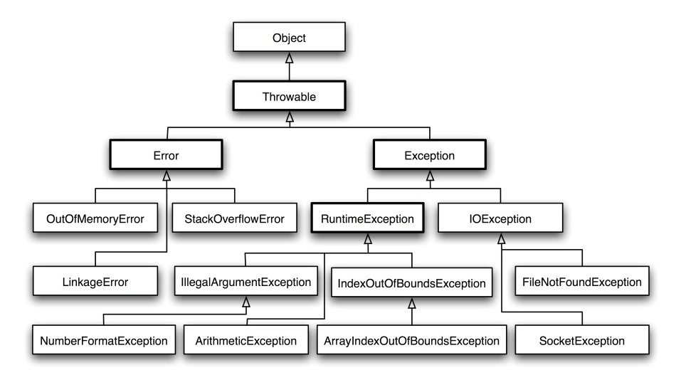
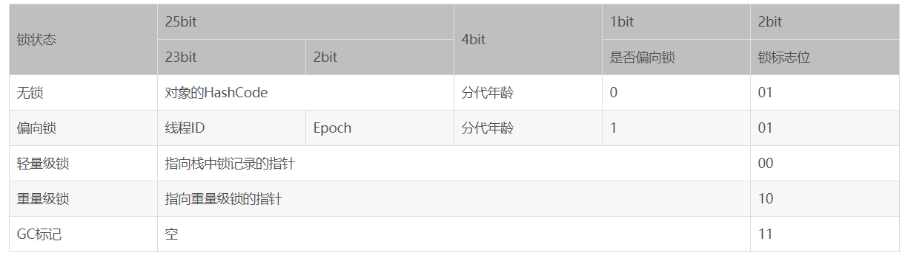
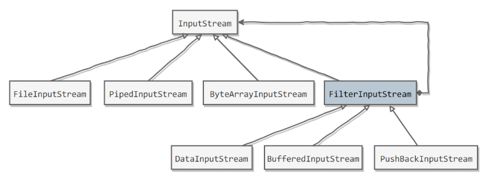
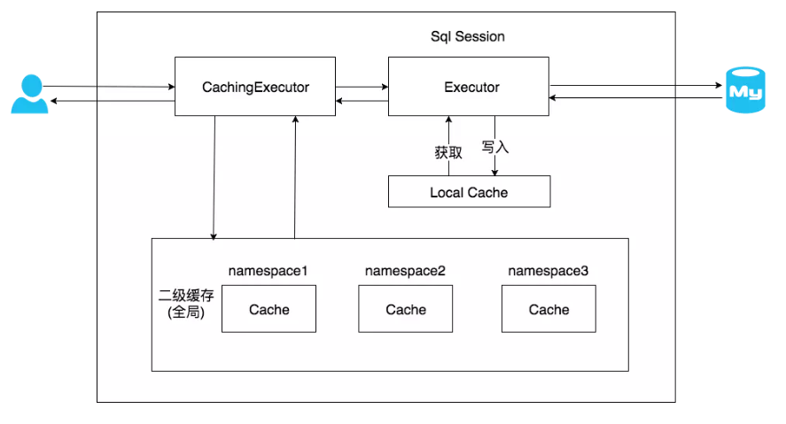

#### Java

##### 1. 数据类型与程序结构

float 存储格式：符号（1 位）+ 指数（8 位）+ 有效数字（23 位）。

**浮点数运算也是不精确的**，==**比较的时候别用 float**==。金融计算用 BigDecimal 类或者采用整型存储最小单位（人民币的分），在需要时转换。

基本数据类型所占字节：**11224488**。

int 类型是 **4 字节**，范围：**(-2 ^ 31, 2 ^ 31 - 1)**，因为有一位是**符号位**。注意一个 Integer 对象是 16 字节，因为包含有 12 字节的对象头信息。

char 用于表示**一个字符**，本质上是一个固定占用**两个字节**的无符号**正整数**。

Java 的参数是以**==值传递==**的形式传入方法中，而**不是**引用传递。对于引用类型，传递的是对象的**==地址值==**。

switch 表达式支持的类型可以是 ==**byte, short, int, char，枚举， String（Java7 之后）**==。支持的都是==**小整数类型**==（String 转为 **hashCode** 也为整数）。不支持 null 与 long。switch 语句如果分支比**较少**，可以直接转换为**跳转指令**。如果分支较多，则会使用**跳转表**（**32 位**），**存储不下** long 型值（64 位 / **8 字节**）。

##### 2. 类的基础与继承

###### 构造方法

**构造方法不能被继承，不能被覆写，不能被直接调用。**但是可以多个构造方法**重载**。构造方法也可以是==**私有**==的，比如用在**单例模式**中。

###### 初始化

**普通初始化块**会在 **==构造方法调用之前==** 执行，**==每次==构造对象**时就会执行。**构造方法**与普通初始化块在每次生成实例对象时**都执行一次**。

**静态初始化块**会在==**类第一次加载**==的时候调用，仅调用**一次**。可对类中的**静态域**进行初始化。

执行顺序：**静态初始化块 -> 初始化块 -> 构造方法**。

存在**继承**的情况下较复杂，**初始化顺序**为（常考）：==**静态优先、父类优先、初始化块优先于构造方法**==。执行顺序为：

- 父类（**静态变量、静态语句块**）
- 子类（**静态变量、静态语句块**）
- 父类（**实例变量、普通语句块**）
- 父类（**构造方法**）
- 子类（**实例变量、普通语句块**）
- 子类（**构造方法**）

静态变量初始化时，首先会**首先声明所有静态变量并赋==默认值==**，然后再**按代码顺序对被初始化**的变量**重新赋值**，这里的赋值可以是直接赋值也可以是静态初始化块内部赋值。**静态变量**的**声明与初始化**是两个不同的操作，静态变量的**声明**在**编译时**已经明确了**内存的位置**。由于静态变量的声明在**编译**时已经**明确**，所以静态变量的声明与初始化在编码顺序上可以**颠倒**。也就是说**可以先**编写初始化的代码，再编写声明代码。

###### 覆写与重载

**覆写**指在类的**继承体系**中，子类实现了一个与父类在**方法签名上完全相同**的一个方法。**元空间有一个方法表保存着每个可以实例化类的方法信息**，JVM 可以通过方法表快速的激活实例方法。如果某个类覆写了父类的某个方法，则方法表中的方法指向引用会指向子类的实现处。覆写时**方法名、参数类型及个数必须严格一致**，为了满足里式替换原则，覆写还有**三个限制条件**，可以总结为：**一大两小两同**。

- **一大**：子类的方法访问权限控制符只能相同或变大。
- **两小**：子类抛出异常和返回值只能相同或变小，能够转型为父类对象。
- **两同**：方法名和参数名必须完全相同。

重载存在于**同一个类**中，指不同方法**方法名称上相同**，但是**参数类型、个数、顺序**至少有一个不同。也就是**方法签名不同**。

**方法签名 = 方法名 + 参数类型**。==**返回类型不是**==方法签名的一部分，所以返回值不同而其它都相同**不算**是重载。

###### 多态

**多态**指的是编译层面无法确定最终调用的方法体，以覆写为基础来实现面向对象特性，在运行期由 JVM 进行动态绑定，调用合适的覆写方法体来执行，**本书认为多态专指覆写**。多态是同一个**行为**具有多个**不同表现形式或形态**的能力。

对于 **private、static 和 final 方法或者构造器**，编译器可以**准确知道**要调用哪个方法，将这种调用方式称为**静态绑定**。

**静态类型**：指出现在**声明**中的类型，静态类型是在**编译**时确定的。所以变量 animal 的静态类型是 **Animal** 。 

**动态类型**：指**运行时**某一时刻变量**指向对象**的类型，动态类型随着运行进程改变。所以 Animal animal = dog 使得变量 animal 的动态类型为 Dog。

**变量决定使用哪个方法名，动态类型决定了可以调用的方法版本。**

**多态实现原理**：JVM 的**方法调用**指令有五个，分别是：

- **invokestatic**：调用静态方法；

- **invokespecial**：调用实例构造器 \<init>方法、私有方法和父类方法；

- **invokevirtual**：调用虚方法；

- **invokeinterface**：调用接口方法，运行时确定具体实现；

- **invokedynamic**：运行时动态解析所引用的方法，然后再执行，用于支持动态类型语言。

其中，invokestatic 和 invokespecial 用于**静态绑定**，invokevirtual 和 invokeinterface 用于**动态绑定**。可以看出，动态绑定主要应用于**虚方法和接口方法**。

##### 3. 接口与抽象类

###### 概述

一个接口中可包含：**常量，普通方法，默认方法，静态方法，私有方法**。

- **Java7 及之前**，它可以看成是一个**完全抽象**的类，也就是说它不能有任何的方法实现。接口里面只能有常量变量和抽象方法，实现类必须实现全部抽象方法。
- **Java8** 接口引入**默认方法**和**静态方法**。默认方法解决修改接口的成本高的问题。
- **Java9** 接口引入 private 方法。可以在接口中编写**私有方法**与私有静态方法。可以解决**多个默认方法之间重复代码**问题。

Java8 之后接口中使用 **default** 修饰**默认方法**，为接口方法提供**默认实现**。Spring 中很多默认实现方法。默认方法是为了解决**接口升级**问题。Java8 之前**修改接口方法成本极高**。Java8 引入**默认方法另一大用处是==函数式数据处理==**的需求，是为了**便于给接口增加新的功能**。**引入默认方法，不仅给接口增加了功能，而且其他实现类不用做任何改变**。

**接口方法冲突**：**接口与超类**之间的冲突(**==超类优先==**)。**接口与接口**之间冲突(需要**覆写方法**来**解决二义性**)。

**接口与抽象类比较**：

==抽象类**不能实例化**==。

- 从**设计层面**上看，**抽象类**提供了一种 **IS-A** 关系，那么就必须满足**里式替换**原则，即子类对象必须能够替换掉所有父类对象。而**接口**更像是一种 **LIKE-A** 关系，它只是提供一种方法实现契约，并不要求接口和实现接口的类具有 IS-A 关系。
- 从**使用层面**上看，一个类可以**实现多个接口**，但是只能**继承一个抽象类**。多数情况下，**==接口优先于抽象类==**。因为接口没有抽象类严格的类层次结构要求，可以灵活地为一个类添加行为。从 Java8 开始，**接口也可以有默认的方法实现，使得修改接口的成本也变的很低**。

##### 4. 内部类

分为：普通内部类、静态内部类、匿名内部类、局部内部类。

内部类是一种**编译器**现象，与虚拟机无关。**编译器**将会把内部类翻译成用 **$** (美元符号）分隔外部类名与内部类名的**常规类文件**， 而虚拟机则对此一无所知。每个内部类都会被编译为一个**独立**的类。

**普通内部类**：**普通内部类对象依赖外部类对象**而存在，即在创建一个普通内部类对象时**首先需要创建其外部类对象**。可以把这个内部类理解为外部类的一个**==实例属性==**。**内部类对象**可以访问**外部类对象中所有访问权限的字段**，原理就是外部类知道内部类的**类型信息**，所以外部类可以访问内部类的类型信息；反过来内部类是通过**编译**后**持有外部类对象的引用**才能访问外部类的**非静态**字段。

**静态内部类**：一个类的**静态成员**独立于这个类的**任何一个对象**存在。在有访问权限的地方就可以通过 **类名.静态成员名** 的形式来访问这个静态成员。**静态内部类**也可以理解为一个外部类的**==静态成员==**，**创建一个类的静态内部类对象不需要依赖其外部类对象**。**内部与外部类的静态属性可以互相访问**。

**匿名内部类**：在匿名内部类中可以使用外部类的属性，但是外部类却**不能**使用匿名内部类中定义的属性，因为是**匿名**内部类，因此在外部类中无法获取这个类的类名，也就**无法得到属性信息**。

**局部内部类**：局部内部类的定义只在其特定的**方法体或代码块**中有效，一旦出了这个**定义域**，那么其定义就**失效**了。局部内部类**不仅能够访问包含它们的外部类**， 还**可以访问==局部变量==**。不过那些局部变量**必须**事实上为 ==**final**==。

**原理解析**：**其实==内部类持有外部类的一个引用==，在==内部类构造函数==中会将外部类的引用传递进来**。这个可以通过反编译得到字节码观察出来。**编译器**给内部类提供了一个接受 InnerClassTest 类型对象（即外部类对象）的**构造方法**，内部类本身还定义了一个名为 **this$0** 的 InnerClassTest 类型的**引用**，这个引用在构造方法中指向了参数所对应的外部类对象。所以内部类是持有外部类对象的**引用**的，因此内部类可以使用外部类的 private 属性。

**匿名内部类和局部内部类**都持有外部类对象的引用，所以可以访问外部类非静态字段，然而外部类是**不知道**匿名内部类和局部内部类的**类型信息**的，所以外部类不能访问其字段。

总之，**非静态内部类（普通、匿名、局部）中都会持有对外部类的对象的引用，从而可以访问外部类对象。反过来就要看外部类是否知道内部类的类型信息了。**

##### 5. 枚举类

**enum 类中的每个属性默认就是 ==static final== 的**。所有枚举类都是 **java.lang.Enum** 类的**子类**。enum 类的构造方法是 protected 的，所以普通**枚举类的构造方法**是特殊的存在，**它可以被定义，但是不能加 public 修饰符**，因为它**默认继承了 enum 类的 protected** 修饰符。

从枚举类**反编译**得到的代码可以看到，枚举类编译出来的**属性**都是 **static** 类型的，而 static 类型的属性会在类被加载之后初始化，而 Java 类的**加载和初始化**过程都是**线程安全**的，所以**创建**一个 enum 类型是天生**线程安全**的。

**好处**：可读性、编译时检查、严格单例。

enum 关键字定义的类，其**实例对象**只能在这个 enum 类中**定义好**，它的实例个数是**有限**的，外部是不能创建实例对象的。如果**不自定义**枚举类的**成员变量和构造方法**，只定义枚举**实例**，则枚举实例内容都将以**字符串**的形式存在，在**类加载**的时候虚拟机会通过 ==**protected**== **Enum**(String name, int ordinal) **构造函数**被创建为基本的 Enum **实例**。比如一个星期的枚举类，定义了七天，那么是由**虚拟机**来调用私有构造方法生成七个枚举实例，其他地方无法生成。

**枚举与单例模式**：**由 JVM 从根本上提供保障，绝对防止多次实例化**，是更简洁、高效、安全的实现单例的方式。枚举实现单例可以解决**序列化和反射**破坏单例的问题。**枚举序列化**确实**不会重新创建新实例**，因为编译器在枚举类中禁止了一些用于序列化与反序列化的方法。对于**防反射破坏**的问题：反射中 **Constructor.newInstance 方法**可以生成实例，但是其**源码**中对当前类是否是 ENUM 类做了判断，如果是就直接抛异常。

##### 6. Object类

```java
// 返回当前运行时对象的Class对象
public final native Class<?> getClass();
// 返回对象的哈希码，主要使用在哈希表中，如HashMap
public native int hashCode();
// 比较2个对象的内存地址是否相等
public boolean equals(Object obj);
// 创建并返回当前对象的一份拷贝。Object本身没有实现Cloneable接口，所以不重写clone方法并且进行调用的话会发生CloneNotSupportedException异常
protected native Object clone() throws CloneNotSupportedException
// 返回类的名字@实例的哈希码的16进制的字符串，建议Object所有的子类都重写这个方法
public String toString();
// 不能重写。唤醒一个在此对象监视器上等待的线程(监视器相当于就是锁的概念)。如果有多个线程在等待只会任意唤醒一个
public final native void notify();
// 不能重写。跟notify一样，唯一的区别就是会唤醒在此对象监视器上等待的所有线程
public final native void notifyAll();
// 不能重写。暂停线程的执行。注意：sleep方法没有释放锁，而wait方法释放了锁。timeout是等待时间
public final native void wait(long timeout) throws InterruptedException
// 多了nanos参数，这个参数表示额外时间，指超时的时间还需要加上nanos毫秒
public final void wait(long timeout, int nanos) throws InterruptedException
// 跟之前的2个wait方法一样，只不过该方法一直等待，没有超时时间这个概念
public final void wait() throws InterruptedException
// 实例被垃圾回收器回收的时候触发的操作
protected void finalize() throws Throwable { }
```

###### equals()

用来检查一个对象与调用这个 。() 的这个对象**是否相等**。Object 类**默认**的 eqauls() 函数进行比较的依据是：调用它的对象和传入的对象的**引用**是否相等，默认进行的是**引用比较**。

**对于引用类型，== 判断两个变量是否引用==同一个==对象，而 equals() 判断两个对象内容是否==等价==。**

**等价的特性**：覆写 equals() 函数的时候要遵守一些**规则**。

- **自反性**：对于任意非空的引用值 x，x.equals(x) 返回值为真。
- **对称性**：对于任意非空的引用值 x 和 y，x.equals(y) 必须和 y.equals(x) 返回**相同**的结果。
- **传递性**：对于任意的非空引用值 x, y 和 z, 如果 x.equals(y) 返回真，y.equals(z) 返回真，那么 x.equals(z) 也必须返回真。
- **一致性**：对于任意非空的引用值 x 和 y，无论调用 x.equals(y) 多少次，都要返回**相同**的结果。在比较的过程中，对象中的数据不能被修改。

**覆写** equals 方法的步骤：

- 检测 this 与 otherObject 是否**引用同一对象**（地址相同）。
- 检测 otherObject **是否为 null**（null 就肯定不是了）。
- 比较 this 与 otherObject 是否属于**同一个类**（类型不同也不是）。
- 将 otherObject **类型转换**为相应的类类型变量。
- 现在开始对**所有需要比较的域依次进行比较**。使用 **==** 比较**基本类型域**，使用 **equals 比较对象域**。这里就需要看对不同类自己的情况写。

```java
// 以下是Employee类的equals方法
public boolean equals(Object otherObject){
     // 检测this与otherObject是否引用同一对象
    if(this == otherObject) return true;   
    // 检测otherObject是否为null
    if(otherObject == null) return false;   
    // 比较this与otherObject是否属于同一种类型
    if(this.getClass() != otherObject.geClass()) return false;
    // 将otherObject转换为相应的类类型变量：类型转换
    Employee other = (Employee) otherObject;    
    // 现在开始对所有需要比较的域进行比较。使用 == 比较基本类型域，使用equals比较对象域。
    return Object.equals(name, other.name) && salary == other.salary && Objects.equals(hireDay, other.hireDay);
}
```


###### hashCode()

hashCode() 返回**散列值**，散列值是由对象导出的一个**整形值**。每个对象都有一个**默认的散列值**，不覆写这个方法就返回对象的**存储地址**。

> 为什么需要同时覆写 equals 方法和 hashCode 方法？

因为两种定义必须**一致**：如果 x.equals(y) 返回 **true**，那么 x.hashCode() 与 y.hashCode() 就必须**相同**。在覆写 **equals**() 方法时应当**总是同时覆写** hashCode() 方法，保证**等价的两个对象散列值**也**相等**。

**因为 HashMap 或 HashSet 就是同时通过这个两个方法来判断对象是否存在的，当键发生哈希冲突时，仅一个方法是不能有效的组织与检索的。**

最方便的就是利用 **Objects 工具类覆写 hashCode** 方法。

```java
// 一个简单的覆写hashCode方法
@Override
public int hashCode() {
    // 传入多个对象到hash()返回hashCode
	return Objects.hash(firstName, lastName);   
}
```

###### wait()

wait 方法会引起**当前线程阻塞**，直到另外一个线程在**对应的锁对象**上调用 notify 或 notifyAll 方法，或达到了方法参数中**指定的时间**，当前线程才会被唤醒。

###### notify()

**唤醒**可能等待**该对象**的**对象锁的其他线程**。由 JVM（与优先级无关）**随机挑选**一个**处于 wait 状态**的线程进行唤醒。

###### finalize()

该方法用于**垃圾回收**。用于对象被回收之前的**自救**（详见 JVM 部分）。

##### 7. 包装类

**缓存池**：为了减少开销，运用了**池化思想**，为这些不可变的对象创造相应的**缓存池**，用于共享数据，是一种==**享元模式**==的思想。由于包装类内部的数据表示是使用 **final** 修饰的所以是**不可变**的，所以缓存的对象可以被**安全的共享**。

Integer 缓存池的大小==默认为 **-128\~127**==。其他的包装类也有缓存池，但是只有 Integer 可以修改缓存池大小，需要配置**虚拟机参数**。

**==valueOf()== 方法**的实现比较简单，就是先判断值是否在**缓存池**中，如果在的话就**直接返回缓存池的内容**。编译器会在**自动装箱**过程调用 **valueOf**() 方法，因此多个值相同且值在缓存池**范围内**的 Integer 实例使用自动装箱来创建，那么就会引用**相同的对象**。

建议包装类都用用 **equals**() 方法比较，不要直接用 == 。

> **new Integer(123)** 与 **Integer.valueOf(123)** 的区别?

- new Integer(123) 每次都会**==新建==一个对象**（用了 new 关键字）。
- Integer.valueOf(123) 会使用**缓存池中的对象**，多次调用会取得**同一个对象**的引用。

##### 8. String类

String 类对象为**==不可变==**字符串。优点是编译器可以共享。String 被声明为 **==final==**，因此它**不可被继承**。在 Java 9 **之后**，String 类的实现改用 **==byte 数组==**存储字符串，同时使用 **coder** 来标识使用了哪种**编码**。**value 数组被声明为 final**，这意味着 value 数组初始化之后就**不能再引用其它数组**。并且 String 内部没有改变 value 数组的方法，因此可以保证 String **不可变**，由于是不可变对象，所以**天生线程安全**。

许多**看似修改** String 的方法，实际上都是通过**创建新的 String 对象**来实现的。

**不可变的好处**：可以换成 hash 值，避免重复计算；可以创建 缓存池；参数安全性；线程安全。

**字符串常量池**（String Pool）保存着所有**字符串字面量**（literal strings），这些字面量在**编译时期**就确定。还可以使用 **String 的 ==intern()==** 方法在运行过程中**将字符串添加到 String Pool** 中。虚拟机为字符串字面量开辟一个**字符串常量池**，类似于**缓存区**，创建**字符串常量**时，首先**查询字符串常量池是否存在该字符串**，如果存在该**字符串**，返回**引用实例**，不存在，**实例化该字符串并放入池**中。

两种创建**字符串对象**的方式：1）采用**字面值**的方式赋值  2）采用 **new** 关键字新建一个**字符串对象**。

**字面量**形式创建会在编译时就**==自动==地将字符串放入 String Pool 中**。

**注意**：**new String()** 方式首先检查 String pool 中有没有这个字符串，如果没有则先在 String pool 中创建一个字符串，然后再在**堆**中创建一个字符串，并返回堆中字符串的引用。如果 String Pool 中已经有了，则仅在堆中创建。所以可能**创建一个对象也可能创建两个对象**。

总结：

- 单独使用 "" 引号创建的字面量字符串和使用只包含常量的字符串连接符如 "aa" + "bb" 创建的字符串都是**常量**，**编译期**就已经确定存储到 String Pool 中。
- 使用 **new String("")** 创建的对象会存储到**堆中**（如果 pool 中没有也会创建），是**运行期**新创建的。
- 使用包含变量的字符串连接如 "aa" + s 创建的对象是**运行期**才创建的，存储到 **堆** 中。
- 运行期调用 String 的 intern() 方法可以向 String Pool 中动态添加字符串。

在 Java7 之前，String Pool 被放在**运行时常量池**中，它属于**永久代**。而在 Java 7，String Pool 被移到**==堆==**中。这是因为永久代的空间**有限**，在大量使用字符串的场景下会导致 OutOfMemoryError 错误。

> **StringBuilder、StringBuffer、String对比**

**可变性** ：String **不可变**（字符数组用 final 修饰），每次操作都是产生**新对象**。StringBuffer 和 StringBuilder 可变，可以多次修改，操作不产生新对象。

**线程安全**：String **不可变**，因此是**线程安全**的；StringBuilder 不是**线程安全**的；StringBuffer 是线程安全的，内部使用 **synchronized** 进行同步，所以**速度慢**。

**基本原则**：如果要操作少量的数据，用 String ；单线程操作大量数据，用 StringBuilder ；多线程操作大量数据，用 StringBuffer。

##### 9. 其他类

BigInteger 用于处理大型数据，可以处理**任意长度**数字序列的数值，BigDecimal 用于**精确计算**（如财务数据）

##### 10. 常用接口

###### 比较器接口

```java
public interface Comparator<T> {
    // 比较方法
    int compare(T first, T second);     
}
```

###### 克隆接口

clone() 是 **protected** 方法，一个类**不显式**去**覆写 clone()**，**其它类**就**不能直接去调用**该类实例的 clone() 方法。

**要克隆必须实现 Cloneable 接口然后再覆写 clone() 方法，并且将 clone 定义为 public 方法，**这样其他类才能调用。否则就会抛出 **CloneNotSupportedException**。clone 方法中可直接调用 Object 类的方法（**由虚拟机实现**的 native 方法）即 **super.clone()**，直接用 clone 方法是实现的**浅克隆**。**深克隆**需要自己去克隆所有的属性。

浅拷贝中 String 等**不可变**的对象即使是浅拷贝也是**安全**的，**基本数据类型**也是。

Effective Java 建议最好不要去使用 clone()，**可以使用==拷贝构造方法==或者==拷贝工厂==来拷贝一个对象**。即自己实现一个用于拷贝原对象的**构造方法**，传入需要拷贝的原对象进行状态拷贝。

**序列化**一个对象时，当一个对象的实例变量引用其它对象，序列化该对象时也会把引用对象进行序列化。所以能**用序列化解决深拷贝问题**。

##### 11. 关键字

###### final

实例域可以包含**基本数据类型**或者**引用类型**，final 修饰后效果不同。

- 对于**基本**类型，final 使==**数值不变**==；声明数据为==**常量**==，可以是编译时常量，也可以是在运行时被初始化后**不能被改变**的常量。
- 对于**引用**类型，final 使==**引用不变**==，构造器初始化之后就不能再修改，也就是这个变量**不能引用其它对象**。相当于该实例域==**没有 setter 方法**==。但是**被引用**对象的**内部数据**是可以修改的。

final 修饰**方法**表示该方法不能被子类**覆写**。final 修饰类时表明该类**不允许**被**继承**。

> **final、finally和finalize区别**

**final**：用于声明**属性、方法和类**，分别表示属性不可变、方法不可覆盖和类不可被继承。

**finally**：用于**搭配 try catch 语句来处理异常情况**。finally 一般情况下是都会执行的（可能也不会执行，参考异常部分），可以用于执行一些关闭资源操作。

**finalize()**：是 **Object** 中的方法。这里涉及到 JVM 如何判定对象是否存活的可达性分析算法，可达性分析算法对 GC Roots 不可达的对象进行标记，如果这个**对象覆写了 finalize 方法**，且在方法将这个对象重新与 GC Roots 关联的话，对象就**不会被回收**，用于对象被回收之前的**自救**（引诱面试官去问 JVM）。

###### strictfp

strictfp，即 **strict float point** (**精确浮点**)。 如果想让**浮点运算更加精确**，而且不会因为不同的硬件平台所执行的结果不一致的话，可以用关键字 strictfp。

###### super与this

- this 引用**当前对象**是实实在在存在的，可以作为**函数参数**，可以作为**返回值**，但 super 只是一个关键字，不能作为参数与返回值，它只是告诉**编译器**访问父类的相关变量与方法。

- super() 和 this() 均需放在构造方法内**第一行**。

- this 和 super **不能同时出现在一个构造函数里面**，因为 this 必然会调用其它的构造函数，其它的构造函数必然也会有 super 语句的存在，所以在同一个构造函数里面有相同的语句，就失去了语句的意义，编译器也不会通过。

##### 12. 注解

Java 注解是**附加在代码**中的一些**元信息**，用于一些工具在编译、运行时进行解析和使用，起到**说明、配置**的功能。

为什么用注解/场景：生成注释文档，实现替代**配置文件**功能，实现**编译时进行格式检查**。

**元注解**：元注解就是**修饰注解**的注解，通常用在注解的定义上，一般用于指定某个注解**生命周期以及作用目标**等信息。

|     元注解      |                             用途                             |
| :-------------: | :----------------------------------------------------------: |
| @**Retention**  | 定义该注解的**生命周期**。RetentionPolicy.**CLASS**，RetentionPolicy.**RUNTIME**等 |
|   @**Target**   | 定义注解可以用于**什么地方**。ElementType.**FIELD**、ElementType.**METHOD**等 |
| @**Documented** |               注解是否将包含在 **JavaDoc** 中                |
| @**Inherited**  |                  是否允许子类**继承**该注解                  |

Annotation 型定义为 @**interface**, 所有的 Annotation 会自动继承 java.lang.**Annotation** 这一**接口**，并且不能再去继承别的类或是接口。**参数成员**只能用基本类型 byte、short、char、int、long、float、double、boolean 八种**基本数据类型**和**String、Enum、Class、annotations** 等**数据类型**，以及这一些**类型的数组**。

要获取类方法和字段的注解信息，需通过**==反射==**来获取 **Annotation 对象**。

**注解本质**是一个继承了 **Annotation** 接口的**特殊接口**，其具体**实现类**是 Java 运行时生成的**动态代理类**。通过**反射获取注解**时，返回的是 Java **运行时生成的动态代理对象 $Proxy1**。通过代理对象**调用自定义注解（注解就是特殊的接口）**的**方法**，会最终调用 **AnnotationInvocationHandler** 的 **invoke** 方法。该方法会从 **memberValues 这个 Map 中索引出对应的值**。而 memberValues 的来源是 Java **常量池**。

##### 13. 异常体系

###### 基础



Throwable 可以用来表示任何可以作为异常抛出的**类**，分为两种： **Error（错误）**  和 **Exception（异常）**。异常和错误的区别是，**异常是可以被处理的，而错误是没法处理的**。 

**Exception** 是异常，主要分为两种：

- **受查异常** ：程序==**编译阶段**==发生异常，必须要使用 **try…catch**（或者 throws）进行处理否则编译不通过；受查就是**可以检查**到的，与 **IO 操作相关**的很多异常就是这个。比如 ：ClassNotFoundException，NoSuchFieldException，NoSuchMetodException。除了 **RuntimeException** 及其子类以外，都是受查异常。
- **非受查异常** ：程序==**运行时**==错误，例如除 0 会引发 ArithmeticException，此时程序崩溃并且无法恢复。派生于 **Error** 类和 **RuntimeException 类**的异常。程序运行过程中才能发现的异常，所以是**不能检查**的异常。

可能会叫说几个异常类型。

**受查异常**使用 ==**throws**== 关键词**声明**异常。**非受查异常**使用 ==**throw**== 关键词**抛出**异常。

###### try-catch-finally

finally 用于**回收资源**。涉及**资源操作**的都需要执行！！比如文件打开、Redis 或 MySQL 连接等。不管是**否有异常被捕获**， finally 子句中的代码**都被执行**。

**注意**：就算 **try 语句中含有 return 语句，那么 finally 语句依然会执行**。try 代码块中的 **break 或 continue** 语句也可能使控制权进入 finally 代码块。

当 **finally 子句包含 return 语句**时，将会出现一种**意想不到**的结果，假设利用 return 语句从 **try** 语句块中**退出**。**在方法返回前，finally 子句的内容将被执行**。如果 finally 子句中也有一个 return 语句，这个返回值将会==**覆盖**==原始的**返回值**。

如果需要**关闭资源**，最好使用**带资源的 try 语句**，但是这个资源实现了 **AutoCloseable** 接口。

> **finally语句块一定会执行吗？**

不一定。1. **代码没有执行到 try 块中**，后面的 finally 也不会执行。2. 当在 try 块或者 catch 块中**有 System.exit(0);** 3. 一个线程在执行 try 语句块或者 catch 语句块时被打断（interrupted）或者被终止（killed）；4. 断电了。

##### 14. 泛型

**泛型的本质是参数实例化，解决不确定具体对象类型的问题。**泛型只是一种编写代码时的语法检查。使用泛型可以让编译器对**类型进行检查**，避免**插入错误类型**的对象。它提供了**编译期的类型安全**，确保你只能把**正确类型**的对象放入集合中，避免了在运行时出现 **ClassCastException**。

泛型只在**编译阶段**有效而不会进入到运行时阶段。在**编译过程**中，正确**检验泛型结果**后，会将泛型的相关信息**擦除**，并且在对象进入和离开方法的边界处**添加类型检查和类型转换**的方法。

**使用泛型的好处**：**安全性、可读性、代码重用**。安全性是指编译器会帮检测类型错误，使类型安全；可读是指编码的时候直接就知道集合里面是什么类型；代码重用是指泛型合并了同类型的处理代码。

泛型可有泛型**类**、泛型**方法**、泛型**接口**。

泛型方法的返回类型之前是==**类型参数**==，可以对类型参数进行**限定**。如 **\<T extends Comparable>**。

**编译期**进行泛型**类型擦除**会把**类型变量**替换为相应的**限定类型**。泛型的诸多限制多半是由**类型擦除**造成的。

**重要★**：==**\<T>**是**类型参数**，**T 是返回类型**==，类型参数放在**返回值之前**。**\<T extends Comparable>** 也是**类型参数**，限定**传入的类型**。

类型参数上界可以是**类或接口**，此时 **T** 必须**实现**这个接口或者继承这个类。如果有多个类型变量和多个限定类型，限定类型用 **& 分隔**，类型变量用**逗号分隔**。

除了用 \<T> 表示泛型外，还有 **\<?>** 这种形式。**？** 被称为**通配符**。Sub 是 Base 的子类，**不代表 List\<Sub> 和 List\<Base> 有继承关系**。Java 中**集合是==不能协变==**的，也就是说 List\<Base> 不是 List\<Sub> 的父类，这时候就可以用到**通配符**了。

通配符主要有以下三类：

- **无边界的通配符**：就是 ==**\<?>**==, 比如 **List<?>**。无边界的通配符的主要作用就是让**泛型能够接受==未知类型==**的数据。
- **固定上边界**的通配符：使用**固定上边界**的通配符的泛型, 就能够接受**指定类及其子类类型**的数据。要声明使用该类通配符, 采用 ==**<? extends E> **== 的形式，这里的 **E** 就是该泛型的**上边界**。注意：这里虽然用的是 **extends** 关键字, 却不仅限于继承了父类 E 的子类, 也可以代指实现了**接口** E 的**类**。
- **固定下边界**的通配符：使用**固定下边界**的通配符的泛型, 就能够接受**指定类及其父类类型**的数据。要声明使用该类通配符, 采用 ==**<? super E>**== 的形式, 这里的 **E** 就是该泛型的**下边界**。

==**类型擦除**：Java 泛型是通过**类型擦除**实现的==。 **类型擦除**指的是**泛型相关的信息在编译后被擦除的情况**，其过程就是**擦除(erased) 类型变量**, 并**替换**为相应的**限定类型**。**类型参数**给类型擦除指定一个**边界**，类型擦除之后所有的类型参数都用它们的**限定类型替换**，无限定类型的变量用 **Object** 替换。所以泛型信息只存在于代码**编译阶段**。

在泛型类被**类型擦除**的时候，如果类型参数**没有指定上限**，如 \<T> 则会被转译成普通的 **Object** 类型，如果指定了类型参数上限如 \<T extends String> 则类型参数就被**替换成类型上限**。

##### 15. 集合类

###### 概述

**集合框架**主要包括 **Collection** 和 **Map** 两大体系，Collection 存储着对象的**集合**，而 Map 存储着键值对（两个对象）的**映射表**。


容器：**普通容器、同步容器、并发容器类**。常见的同步容器类，几乎都是直接加 **synchronized** 实现的：

- **Vector**(implements List)
- **Hashtable**(implements Map)
- **Stack**(extends Vector)。
- **Collections.synchronizedXxxx**。

**同步容器**的**单个操作是安全**的，但是**迭代操作不是**。如果在遍历容器时发生了**结构性变化**，就会**抛出异常**。同步容器没有解决这个问题，要避免这个异常，需要在遍历时给整个容器对象加锁。由于加了**锁**，所以**开销**比较大。

> Hashtable与HashMap对比

- **底层数据结构：** 内部都是用**数组存放元素**。JDK1.8 以后的 HashMap 在解决哈希冲突时有了较大的变化，当链表长度大于阈值（默认为8）（将链表转换成红黑树前会判断，如果当前数组的长度小于 64，那么会选择先进行数组扩容，而不是转换为红黑树）时，将链表转化为红黑树，以减少搜索时间。Hashtable 没有这样的机制。
- **线程安全性**： HashMap 是**非**线程安全的，HashTable 内部的方法基本都经过 **synchronized** 修饰所以是线程安全的。
- **效率：** HashTable 加了锁，效率低下。要同时保证**线程安全与效率**的话就使用 **ConcurrentHashMap**。
- **对 Null key 和 Null value 的支持：** HashMap 中，**null 可以作为键**，这样的**键只有一个，**可以有一个或多个键所对应的值为 null。但是 HashTable **不支持键或值**为 null，插入 null 直接抛出 NPE。
- **内部初始容量大小和数组扩容量大小不同：** ① 不指定容量初始值时 Hashtable 默认的初始大小为 **11**，之后每次扩容为原来的 **2n+1**。HashMap 默认的初始化大小为 **16**。之后每次扩容为原来的 **2 倍**。② 创建时如果**给定**了容量初始值，那么 Hashtable 会**直接使用**这个容量值。而 HashMap 会将其扩充为 **2 的幂次方**大小。

###### ArrayList

- **基本结构**：ArrayList 内部使用**动态数组**实现元素存储，同时也实现了 RandomAccess 接口，所以支持**快速随机访问**。并允许插入所有元素，包括 **null**，元素**可重复**。**动态数组**是通过 **transient** 修饰的，默认**不被序列化**（因为动态数组可能**没有存满**），ArrayList 自定义了序列化与反序列化的方法保证只对数组中的**有效元素**进行序列化。

- **增**：每次**添加元素**时通过  **ensureCapacityInternal() 方法** 检查动态元素数组**容量是否足够**。如果初始化时**没有指定**数组大小，那么**第一次**添加元素时**会扩容**，这时候就会**扩容到默认的 10**。如果容量不够时，需要使用 **grow() 方法进行动态扩容**，新容量的大小为 **oldCapacity + (oldCapacity >> 1)**，也就是旧容量的 **1.5 倍**。扩容时会**复制**原来的数组，所以扩容的开销很大，所以一定要根据业务场景**指定初始化容量**防止过多的扩容与复制开销（阿里规范）。

- **删改查**：指定位置的插入与删除元素效率低，因为需要**移动其它**元素。实现了 **RandomAccess** 接口，可实现**快速随机**访问，按照**索引**进行访问的效率很高，效率为 O(1)。按照内容**查找**元素效率**较低**，效率为 O(N)。

- **安全性**：ArrayList 是线程**不安全**的，建议在**单线程**中才使用 ArrayList，**多线程**可以使用 Vector 类、**Collections.synchronizedList**、JUC 的 **CopyOnWriteArrayList** 类等方法解决并发安全问题。

- **迭代删除**：ArrayList 的**迭代器**会返回一个 **内部类 Itr 对象**，**迭代时删除元素**应该使用**迭代器的 remove** 方法而非 ArrayList **本身的 remove** 方法，否则会产生 **Fail Fast** 异常。当然一般使用一次 ArrayList 的 remove 方法是没问题的。使用 ArrayList 的 **iterator**() 方法获取到**迭代器**进行遍历时，会把 ArrayList **当前状态下的 modCount 赋值给 Itr 类的 expectedModCount** 属性，相当于创建迭代器时候对外部的 modCount 记录了一个**版本快照**。如果在迭代过程中使用了 ArrayList 的 **remove**() 或 **add**() 方法，它们会修改外部的 modCount 就会加 1 ，但是迭代器中的 **expectedModeCount** 并没有变化，当我们再使用迭代器的 next() 方法时，它会调用 **checkForComodification**() 方法，通过对比发现现在的 expectedModCount 已经与外部的 modCount **不一致**了，则会抛出ConcurrentModificationException 异常。

    但是**如果使用**内部类 **Itr 迭代器提供的 remove()方法**，它会调用 ArrayList 提供的 remove 方法，同时还有一个操作：**==expectedModCount = modCount==**;，这会修改当前迭代器内部记录的 expectedModCount 的值，所以就不会存在版本不一致问题，也就不会抛出异常。

- **modCount** 属性是继承自 **AbstractList** 的，用来记录 **结构发生变化的次数**。结构发生变化是指添加或者删除至少一个元素的所有操作，或者是调整内部数组的大小，仅仅只是设置元素的值不算结构发生变化。如果迭代或者序列化会检查 modCount 版本，如果不一致则会产生 **Fail Fast 异常**。

- **序列化**：基于**数组**实现，并且具有**动态扩容**特性，因此保存元素的数组**不一定都会被使用**，那么**就没必要全部**进行序列化。所以保存元素的数组 **elementData** 使用 **transient** 修饰，该关键字声明数组默认**不会被序列化**。ArrayList 实现了 **writeObject**() 和 **readObject**() 来控制==**只序列化数组中有元素填充那部分**==内容。注意：序列化时也会**检查 modCount**，如果序列化时并发**修改**列表，可能造成 Fail Fast 而抛异常。

###### LinkedList

LinkedList 也实现了 List 接口，内部基于**==双向链表==**实现，所以其特点与 ArrayList 几乎**相反**。LinkedList 还实现了 **Deque** 接口，可以按照**队列、栈和双端队列**的方式进行操作。LinkedList 也是线程**不安全**的队列。

**获取数据**：由于具有**双向指针**，所以查找时会判断待搜索的**索引**与整个链表的**长度**关系，如果**小于链表长度一半**，那么就从头遍历，否则从尾部遍历，这样最多也就遍历半个链表长度。可以**提高查找效率**。

**与ArrayList比较**：

- **数据结构与实现**：ArrayList 基于**动态数组**实现，LinkedList 基于**双向链表**实现。
- **线程安全性**：ArrayList 和 LinkedList **都不**保证线程安全。
- **元素访问**：ArrayList 支持快速**随机访问**，LinkedList **不支持**。
- **增删元素效率**： ArrayList 采用**数组**存储，插入元素到数组末尾复杂度为 O(1)，但是在指定位置插入元素与删除元素复杂度为 O(N)。LinkedList 采用**链表**存储，在删除元素的时候不需要挪动后面的元素，操作基本都是修改指针，LinkedList 在**任意位置**添加删除元素**更快**。
- **内存空间占用**：ArrayList 的空间浪费主要体现在 list 列表的结尾会预留一定的**容量空间**，而 LinkedList 的空间花费则体现在它的每一个结点都需要消耗比 ArrayList 更多的空间。

###### ArrayDeque

ArrayDeque 实现了 Dueue 接口，可用于**队列、双端队列、栈**等。当做栈使用效率要高于 Stack；作为**队列**使用时，效率也比基于双向链表的 **LinkedList** 要好一些。

ArrayDeque 内部采用**环形动态数组**进行数据存储，但是要求**数组元素个数为 2 的幂次方**个，这样可以实现**环形索引**，更加高效。数组容量不够也会进行**自动扩容**，扩容时元素会**复制重排**放在环形数组的前面部分位置。

ArrayDeque **不支持**值为 **null** 的元素。

ArrayDeque 在**迭代**时**检查并发修改并没有使用**类似于 ArrayList 等容器中使用的 **modCount**，而是通过**尾部索引**来确定的。这样有可能检查不到。

ArrayDeque 对**数组的大小**(即队列的容量)有特殊的要求，==必须是 **2^n**（**2 的幂次方**）==。传入的容量就算不是 2 的幂次方时也会被 allocateElements 方法修改为 2 的幂次方。

环形数组满的情况：

```java
(tail = (tail + 1) & (elements.length - 1)) == head
```

下一个位置的索引：

```java
(tail + 1) & (elements.length - 1)
```

可见在容量保证为 **2^n** 的情况下，仅通过**位与**操作就可以完成==**环形索引**==的计算，**而不需要**进行边界的判断，实现上更为**高效**。

###### PriorityQueue

PriorityQueue 优先级队列，实现了队列接口 **Queue**，每个元素都有优先级，**队头**的元素永远都是**优先级最高**的。内部元素**不是完全有序**，但是**逐个**出队列会得到**完全有序**的输出（从源码上看入列操作并**没有**对所有加入的元素**进行优先级排序**。**仅仅保证数组==第一个==元素是最小的即可**）。

**效率**：基于**堆**实现。堆在**概念上是树，存储上是数组**，父子有特殊顺序，根是最大/最小值，构建、添加、删除效率都很高。查看头部元素效率很高，为 O(1)， 入队、出队效率比较高，为 O(log2(N))，构建堆 **heapify** 的效率为 O(N)。

###### HashMap

**建议通看源码**。面试非常喜欢问！**重点**是根据 key 获取哈希桶数组**索引位置**、**put 方法**的详细执行、**扩容过程**三个具有代表性的点。

**数据结构**：HashMap 基于**数组+链表+红黑树**（JDK1.8 增加了红黑树部分）实现的。当**链表长度太长（默认超过 8）且元素个数大于 64 时，链表就转换为红黑树**。

**基本属性**：

- **table**：哈希桶**数组**存放 Node 结点链表， table 的**长度**必须是 **2 的幂**。Node[] table 的初始化长度 **length 默认值**是 **16**。**常规的设计**是把**桶的大小设计为素数**来减小哈希冲突，比如 **Hashtable** 初始化桶大小为 **11**，就是桶大小设计为素数的应用（Hashtable 扩容后**不能**保证还是素数）。HashMap 之所以采用这种**非常规**设计，主要是为了在**取模和扩容时做优化**，同时为了减少冲突， HashMap 定位哈希桶索引位置时加入了**高位参与运算**的过程。
- **size**：**实际**存储元素的**数量**，size() 方法实际返回的就是这个值，isEmpty() 也是判断该值是否为空。
- **modCount**：记录**结构被改变的次数**，fail-fast 机制。内部结构发生变化指的是元素增删，某个 key 对应的 value 值被**覆盖修改**不属于结构变化。
- **loadFactor**：**负载因子**。默认为 **0.75**，这是对**空间和时间效率**的一个**平衡选择**，建议用默认值，除非在时间和空间比较特殊的情况下，如果内存空间很多而又对时间效率要求很高，可以**降低**负载因子 loadFactor 的值；相反如果内存空间紧张而对时间效率要求不高，可以增加 loadFactor 的值，这个值**可以大于 1**。
- **threshold**：**扩容阈值**，在 HashMap 中存储的 Node 键值对**超过这个数量**时，就会触发扩容 resize。threshold 是当前 HashMap 所能容纳的**最大数据量的 Node (键值对)个数**。在数组定义好长度之后，负载因子**越大**，所能容纳的键值对**个数越多**。**扩容阈值**：**threshold = loadFactor * table.length**。
- **entrySet：HashMap** 将数据转换成 set 的另一种存储形式，这个变量主要用于**迭代功能**。

**数组容量**：默认为 16，不是也会初始化为 2 的幂次方。

**数组的位置定位**：位置定位应该尽量均匀。

```java
// 求hash值的方法// jdk1.8与jdk1.7
static final int hash(Object key) {   
     int h;
     // h = key.hashCode() 为第一步:取hashCode值
     // h ^ (h >>> 16)  为第二步:高位参与运算
     return (key == null) ? 0 : (h = key.hashCode()) ^ (h >>> 16);
}
```

这里的 **Hash() 算法**本质上就是**三步**：==**取 key 的 hashCode 值、高位运算、取模运算**==。在 JDK1.8 中，优化了**高位运算**的算法，通过键的 **hashCode() 的高 16 位异或低 16 位实现**。**也就是说先通过高位异或低位求取键的哈希值**，之后就需要通过哈希值**寻找**到对应的**数组的槽**。直接取模是开销较大的，由于数组长度为 2 的幂次方，所以求槽的时候是可以用**位运算**的。下面是求**桶位置**的方法。

```java
// 求桶位置的方法// jdk1.7的源码，jdk1.8没有这个方法，但是实现原理一样的
static int indexFor(int h, int length) {  
     return h & (length - 1);  // 第三步:取模运算
}
```

**h & (length - 1)**运算**等价于对 length 取模**，也就是 **h % length**，但是 **& 比 %** 具有更高的**效率**。这也是为什么数组长度 为 2 的幂次方的原因。

**put 方法的流程**：

① 判断键值对**数组 table[i]** 是否为**空**或为 null，否则执行 **resize**() 进行扩容；

② 根据键值 **key** 计算 **hash 值**得到插入的**数组索引 i**（前述内容），如果 **table[i]==null**，表明这个桶**还没有**数据，直接**新建节点**添加，转向 ⑥，如果 table[i] 不为空，说明已经有**数据链表**，则转向 ③；

③ 判断 table[i] 的**首个**元素是否和 key 一样，如果相同直接**覆盖 value**，否则转向 ④，这里的**相同**指的是 **hashCode** 以及 **equals**；

④ 判断 **table**[i] 是否为 **treeNode**，即 **table**[i] 是否是**红黑树**，如果是**红黑树**，则直接在树中**插入键值对**，否则转向 ⑤；

⑤ **遍历** table[i]，判断链表**长度是否大于8**，大于 8 的话把链表转换为**红黑树**，在红黑树中执行**插入操作**，否则遍历链表进行插入操作；遍历过程中若发现 key 已经存在**直接覆盖** value 即可；

⑥ **插入成功**后，判断实际存在的键值对数量 size 是否超多了最大容量 threshold，如果超过，进行**扩容**。

**扩容原理**：和扩容相关的**参数**主要有：capacity、size、threshold 和 loadFactor。

|      参数      |                             含义                             |
| :------------: | :----------------------------------------------------------: |
|  **capacity**  | table 的数组大小，**默认为 16**。需要注意的是 capacity 必须保证为 **2 的 n 次方**。 |
|    **size**    |                   **实际**存放键值对数量。                   |
| **threshold**  | size 的**临界值**，当 size 大于等于 threshold 就必须进行**扩容**操作。 |
| **loadFactor** | **装载因子**，table 能够使用的**比例**，threshold = capacity * loadFactor。默认 **0.75**。 |

**扩容过程**：首先**数组长度**变为原来的**两倍**，由于使用的是 2 次幂的扩展，所以旧元素的位置要么是在**原位置**，要么是在原位置再**移动原数组长度（oldSize）**的位置。Java8 在扩充 HashMap 的时候，**不需要**像 JDK1.7 的实现那样**重新计算 hash**，只需要看看**原来的** hash 值**新增**的那个 **bit 是 1 还是 0** 就好了，**==是 0 的话索引不变，是 1 的话索引变成“原索引 + oldCap==”**。JDK1.7 中 rehash 的时候，旧链表迁移新链表的时候，**如果在新表的数组索引位置相同**，则链表**元素会倒置**（因为是头插法）。JDK1.8 **不会倒置**（因为是尾插法）。

**线程安全**：**JDK7 中的多线程 resize 操作使用头插法可能导致循环链表**。HashMap 在**多线程**并发场景下，**同时扩容**期间存在**结点位置互换指针引用**的问题，可能导致**循环链表**。Java8 修复了这个 Bug。

> **为啥Java8改用了尾插法？**

JDK7 之前采用**头插法**是因为最近到来的数据往往是查询几率较高的，所以放在头部可以提高**查询速率**。

Java8 采用尾插法**主要是为了安全, 防止环化**。**使用头插会改变链表的上的顺序，但是如果使用尾插，在扩容时会保持链表元素==原本的顺序==，扩容转移后前后**链表顺序不变，保持之前节点的引用关系，就不会出现链表成环的问题了。

> **HashMap线程安全吗？**

即使 Java8 采用**尾插法**解决了循环链表的问题，但是由于方法都是**没有加同步锁**的，那么如果多线程同时 put 元素可能因为哈希冲突导致数据丢失情况，所以多线程状态下**依然不安全**。

HashMap **不是线程安全**的，如果需要满足线程安全，可以用 Collections 的 synchronizedMap 方法使 HashMap 具有线程安全的能力，或者使用 **ConcurrentHashMap**。

> **JDK8的优化？**

- **数据结构**：Java7 采用的是数组+链表。Java8 采用的是 数组+链表+红黑树，一个桶存储的**链表长度大于 8** 时会将**链表**转换为**红黑树**。
- **循环链表问题解决**：多线程扩容时，Java7 的头插法可能会导致循环链表的问题，Java8 采用尾插法解决了这个问题。
- **再哈希的优化**：Java7 再哈希时新数组索引是直接**重新计算**的，而 Java8 则是通过**位运算来判断新增的一位**是 0 还是 1，0 的话就索引位置不变，1 的话则新的索引位置需要在原位置基础上增加原数组长度，避免了重新计算。

###### LinkedHashMap

LinkedHashMap 是 HashMap 的**子类**，**覆写**了 HashMap 中的一些**空方法**，从而实现了对顺序的控制。比如 **newNode**（插入新结点时用）、**afterNodeAccess**（get、put 方法中用）、**afterNodeInsertion**（put 方法中用） 方法等。LinkedHashMap 的内部静态**结点类** Entry 直接**继承**了 HashMap 的结点类 **Node**，并**拓展了前后两个指针 before 和 after**，因此实现了**双向链表结构**。

LinkedHashMap 可以保持元素按**插入或访问有序**，顺序为**插入顺序（accessOrder 为 false，默认）或访问顺序（accessOrder 为 true）**。与 TreeMap **按键**排序不同。

**线程安全**：HashMap 是**线程不安全**的，LinkedHashMap 同样是线程**不安全**的。

**数据结构**：LinkedHashMap 其实可以看成 **HashMap + 双向链表**组成。

**LRU**：**配置 accessOrder 为 true** 可以设置为**访问顺序**，这可以当做一个 **LRU**。基于 LinkedHashMap 要实现最大缓存值的 LRU，需要继承 LinkedHashMap 并开启 **accessOrder 为 true**，同时覆写 **removeEldestEntry** 方法才能控制最大的元素个数。

###### TreeMap

TreeMap 是一个**有序的 key-value 集合**，它是通过**红黑树**实现的，红黑树结构**天然支持排序**，默认情况下**通过 Key 值**的**自然顺序**进行排序；TreeMap 是按照**键**而不是值**有序**，都是对**键**进行比较。

TreeMap 继承了 NavigableMap 接口，NavigableMap 接口继承了 SortedMap 接口，可支持一系列的导航定位以及导航操作的方法，当然只是提供了接口，需要 TreeMap 自己去实现。

```java
// String.CASE_INSENSITIVE_ORDER是String类中的一个忽略大小写的Comparator
Map<String, String> map = new TreeMap<>(String.CASE_INSENSITIVE_ORDER);
// 逆序并忽略大小写
Map<String, String> map = new TreeMap<>(Collections.reverseOrder(String.CASE_INSENSITIVE_ORDER));
```

**for 循环**

```java
// 与HashMap迭代类似
for (Map.Entry entry : treeMap.entrySet()) {
      System.out.println(entry);
}
```

底层数据结构**红黑树**：

**红黑树规则特点：**

1. **节点**分为**红色或者黑色**；
2. **根节点**必为**黑色**；
3. **叶子节点都为黑色**，且为 null；
4. 连接**红色节点**的两个子节点都为黑色（红黑树**不会出现相邻的红色节点**）；
5. 从任意节点出发，到其**每个叶子节点的路径中包含相同数量的黑色节点**。
6. 新插入的结点为**红色**。

**红黑树自平衡基本操作：**

1. **变色**：在不违反上述红黑树规则特点情况下，将红黑树某个 node 节点颜色**由红变黑**，或者**由黑变红**。
2. **左旋**：**逆时针**旋转两个节点，让一个节点被其右子节点取代，而该节点成为右子节点的左子节点。
3. **右旋**：**顺时针**旋转两个节点，让一个节点被其左子节点取代，而该节点成为左子节点的右子节点。

###### WeakHashMap

WeakHashMap 主要用来**实现缓存**，通过使用 WeakHashMap 来引用**缓存对象**，由 JVM 对这部分**缓存进行回收**。因为WeakHashMap 的 Entry **继承自 WeakReference**，当某个键不再正常使用时，被 WeakReference 关联的对象在**下一次垃圾**回收时会**被回收**（弱引用）。

###### CopyOnWriteArrayList

**基础**：CopyOnWriteArrayList实现了 **List** 接口，与其他 List 实现类用法类似。它以**原子方式**支持一些复合操作。它的迭代器不支持修改操作，但也不会抛出 ConcurrentModificationException。迭代时不需要像同步容器那边对整个列表对象加锁。

**线程安全性**：是线程安全的，可以被多个线程并发访问。**读取方法不加锁，其他的写（添加、修改、删除）都会加锁。**写操作在一个**复制的数组**上进行，读操作还是在**原始数组**中进行，读写分离，**互不影响**。写操作需要加锁，防止并发写入时导致写入数据丢失。写操作结束之后需要把原始数组**指向新的**复制数组。

**写时复制**：如果有**多个**调用者同时要求读取**相同的资源**（如内存或者是磁盘上的数据存储），他们会共同获取相同的指针**指向相同的资源**，如果某个调用者**尝试修改资源**时，系统才会**真正复制一份专用副本给该调用者**，而其他调用者所见到的依然是**最初**的资源。修改之后，再将原资源的**引用指向新的资源**。这过程对其他的调用者都是透明的。

**锁问题**：CopyOnWriteArrayList **读是完全不用加锁**的，并且**写入也不会阻塞读取操作**，只有写入和写入之间需要进行同步等待，读操作的性能得到大幅度提升。

**源码实现**：底层通过**数组**存储数据，CopyOnWriteArrayList 内部有一个 **ReentrantLock** 显式锁对象，是一种**支持重入的独占锁**，任意时刻只允许**一个线程**获得锁，所以可以安全的并发去**写数组**。**读取**操作**不需要进行同步控制和加锁**，因为内部数组 array **不会发生修改**，只会被另外一个 array 替换，因此可以保证数据安全。如果读的时候有多个线程正在向 CopyOnWriteArrayList **添加数据**，**读**还是会读到**旧的数据**，因为写的时候**不会锁住旧的** CopyOnWriteArrayList。**写操作使用了显式锁**，重点在 **Object[] newElements = Arrays.copyOf(elements, len + 1);** 这里拷贝旧数组元素并生成一个新的数组，然后将新的元素加入到 newElements 中，再将新的数组**替换**成老的数组，修改就完成了。如果不加锁多线程写的时候会 Copy 出 N 个副本出来。当修改完成后，**读取**线程可以**立即察觉**到这个修改，因为 array 被 **volatile** 修饰了。

**由于是读不加锁，所以读读是并行的，而且读写也可以并行，只不过写的过程中读的数据是旧版本的数据**，但是**不允许多个线程同时进行写操作**。每个写操作都需要先获取**锁**。

**每次修改操作，都会创建一个数组**，复制原数组的内容到新数组，在**新**数组上进行修改，然后以**原子方式**设置内部的数组引用，这就是**写时复制**机制的体现。

CopyOnWriteArrayList 的缺点就是**修改代价十分昂贵**，**每次修改都伴随着一次的数组复制**；但同时优点就是它是**线程安全的**。

**写时复制存在的问题**：(1) **内存占用问题**：在进行**写操作**的时候，内存里会**同时驻扎两个对象**的内存。(2) **数据一致性问题**：CopyOnWrite 容器只能保证**数据的最终一致性**，不能保证数据的**实时一致性**，因为部分写操作的数据还**未同步**到**读数组**中，**如果有写的情况发生，那么读可能读到的依然是旧数据**。

**应用场景**：适用于**读多写少**的场景。**不适合内存敏感以及对实时性要求很高**的场景。

###### ConcurrentHashMap

Hashtable 这种是通过全表锁锁住整个表，性能低下。ConcurrentHashMap 锁的粒度更低。

**特点**：并发安全，支持高并发，**读操作完全并行**，**写操作==一定程度==并行**。与**同步容器**相比，**迭代不需要加锁。**具有**弱一致性**。

**JDK7**：JDK1.7 中的数据结构是由一个 **Segment 数组和多个 HashEntry 数组** 构成。这种结构会经历**两次哈希计算**。Segment 数组的意义就是将一个大的 table 分割成多个小的 table 来进行**加锁**，也就是前面提到的**锁分离技术**，而每**一个 Segment 元素存储的是 HashEntry 数组 + 链表**，这个和 HashMap 的数据存储结构一样。**Segment 分段锁继承**自 **ReentrantLock**。具有**显式锁**的机制。Segment 继承了 **ReentrantLock**，也就带**有锁**的功能，当执行 put 操作时，会进行**第一次 key 的 hash 来定位 Segment 的位置**，如果该 Segment **还没有初始化**，即通过 **CAS** 操作进行赋值，然后进行**第二次 hash 操作**，找到相应 **HashEntry** 的位置，这里会利用继承过来的**锁的特性**，在将数据插入指定的 HashEntry 位置时（链表的尾端），会通过继承 ReentrantLock 的 **tryLock**() 方法尝试去**获取锁**，如果**获取成功**就直接插入相应的位置，如果已经有线程获取该 Segment 的锁，那当前线程会以**自旋**的方式去继续的调用 tryLock() 方法去**获取锁**，超过指定次数就**挂起，等待唤醒**。 总结：**ReentrantLock+Segment+HashEntry**。

**JDK8**：JDK1.8 的实现已经**摒弃了 Segment 的概念**，而是直接用 **==Node数组+链表(Node结点)+红黑树(TreeBin 结点)==** 的数据结构来实现，**并发控制使用 ==Synchronized 和 CAS==** 来操作，整个看起来就像是优化过且线程安全的 HashMap。synchronized 只锁定**当前链表或红黑二叉树的首节点**，这样只要 hash 不冲突，就不会产生并发，效率又提升 N 倍。虽然在 JDK1.8 中**还能看到 Segment **的数据结构，但是已经简化了属性，只是为了**兼容**旧版本。总结：**synchronized+CAS+数组+链表+红黑树**。

---

**put 方法**：对当前的 table 进行**无条件自循环**直到 **put** 成功，可以分成以下**六步流程**来概述：

- 如果**没有初始化**就先调用 **initTable**() 方法来进行**初始化**过程。
- 如果**没有 hash 冲突**（也就是 key 对应的数据桶**还没有元素**时）就**直接 CAS 插入**。
- 如果**还在进行扩容**操作就**先进行扩容**（**辅助扩容**）。
- 如果**存在 hash 冲突**（说明 key 对应的数据桶**已有**数据链表了），就**加锁**来保证线程安全（注意这里是对单个 桶 的**头结点**进行加锁），这里有两种情况，一种是**链表形式**就直接遍历到**尾端插入**，一种是**红黑树**就按照红黑树结构**插入**。当然如果是 key 相同则进行值的**替换**。
- 最后一个如果该链表的**数量大于阈值 8**，就要先转换成**红黑树**的结构，break 再一次进入循环。
- 如果添加成功就调用 **addCount**() 方法统计 **size**，并且检查是否**需要扩容**。

**sizeCtl** 是 ConcurrentHashMap 的**初始化**、**扩容操作**中一个至关重要的控制变量，其声明：

```java
private transient volatile int sizeCtl;
```

其取值可能为:

- **0**：初始值。
- **-1**：**正在进行初始化**。
- **负值(小于-1)**：表示正在**进行扩容**，ConcurrentHashMap 支持**多线程并行扩容**。
- **正数**：表示下一次**触发扩容**的**临界值大小**，即**当前值 * 0.75(负载因子)**。

**初始化**：ConcurrentHashMap 只允许**一个线程**进行**初始化**操作，当其它线程竞争失败 (sizeCtl < 0) 时便会进行**自旋**，直到**竞争成功**(初始化)线程**完成初始化**后，那么此时 table 便**不再为 null**，也就**退出了** while 循环。也就是使用 CAS 解决了**并发更新**首节点造成**数据丢失**的问题。

**扩容过程**：如果当前数据槽中的元素个数未达到 **MIN_TREEIFY_CAPACITY**（默认 64），那么**不再转为红黑树**，转而进行**扩容**。ConcurrentHashMap 支持**==多线程并行扩容==**，具体来说，是支持**多线程将节点从老的数组拷贝到新的数组**。helpTransfer() 方法的目的就是**调用多个**工作线程**一起帮助进行扩容**，而不是只有检查到要扩容的那个线程进行扩容操作，**其他线程就要等待扩容操作完成才能工作**。

**转移算法**：关键在于**如何判断是否需要转移结点到新的位置**。

- **无需转移**，即扩容前后节点的桶位**不变**。
- **扩容后的桶位号为扩容前 + 原数组的大小**（这与 Java8 的扩容情况类似），假设原数组大小为 8，扩容后为 16，有节点哈希值为 11，原先在桶位 3，那么扩容后位 3 + 8 = 11.

以大小 8 和 16 为例，8 的**取余 mask** 为：0111。而 16 的 **mask** 为：1111。所以只要用**哈希值 & 8**，判断结果**是否为零**即可。如果是 0 则不动，是 1 则需要变换。

**弱一致性**：ConcurrentHaspMap **迭代器**创建之后，就会按照哈希表结构遍历**读取每个元素**，但在遍历过程中，内部元素可能会因为其他线程的**写入修改发生变化**，如果变化发生在**已遍历的部分**，迭代器就**不会反映**出来，而如果变化部分发生在未遍历过的部分，迭代器就会发现并反映出来，这就是**弱一致性**。

###### BlockingQueue

BlockingQueue 是一个**接口**，继承了 Queue 接口。内部多基于 **ReentrantLock 和 Condition**（Condition 只能在**独占模式**使用）实现。阻塞队列是**线程安全**的。 

阻塞队列（BlockingQueue）是一个支持**两个附加操作**的队列。这两个附加的操作是： 

- 在队列**空**时，**获取元素**的**线程会等待队列**变为非空。 
- 当队列**满**时，**存储元素**的**线程会等待队列**可用。 

提供了**阻塞的 take() 和 put() 方法**：如果队列为空 take() 将**阻塞**，**直到**队列中有内容；如果队列为满 put() 将**阻塞**，直到队列有空闲位置。


**用途：** 阻塞队列常用于**生产者和消费者**的场景，生产者是往队列里添加元素的线程，消费者是从队列里拿元素的线程。阻塞队列就是生产者存放元素的**容器**，而消费者也**只从容器里拿元素**。

| operation | Throws Exception | Special Value | Blocks |          Times Out          |
| :-------: | :--------------: | :-----------: | :----: | :-------------------------: |
|  Insert   |      add(o)      |   offer(o)    | put(o) | offer(o, timeout, timeunit) |
|  Remove   |    remove(o)     |    poll()     | take() |   poll(timeout, timeunit)   |
|  Examine  |    element()     |    peek()     |        |                             |

BlockingQueue 接口有众多**实现类**，如下所示。

- **ArrayBlockingQueue**：由数组支持的**有界队列**。一旦初始化容量之后便不可扩容。
- **LinkedBlockingQueue**：由链接节点支持的可选有界队列。边界是可配置的，如果没有配置就是无边界的。
- **PriorityBlockingQueue**：由优先级堆支持的无界优先级队列。
- **DelayQueue**：由优先级堆支持的、基于时间的调度队列。

##### 16. 并发

###### 多线程基础

**并发与并行**：并发是在**同一时间段**来看，多个任务都在执行，但是**单位时间内不一定同时**执行。并行是**单位时间内**，**多个任务同时执行**，就是多个 CPU 时。

---

**任务类型**：CPU 密集型主要进行大量**计算、逻辑判断**等操作，此时系统运作大部分的状况是 **CPU 负载较高**，这个时候**线程数 = CPU 核数 + 1**。**IO 密集型**指的是涉及到**网络、磁盘 IO** 相关的任务，这类任务的特点是 **CPU 消耗很少**，任务的大部分时间都在**等待 IO 操作完成**。IO 密集型任务线程数一般设置为：**线程数 = （（线程等待时间+线程 CPU 时间）/ 线程 CPU 时间 ）* CPU 数目**。

---

> **线程状态?**

- **New**：新建，创建一个线程实例但是还没开始。
- **Runnable**：可执行，调用 start() 方法之后进入，但是具体执不执行看 CPU 调度。
- **Blocked**：阻塞，就是**等待锁**的状态。当一个线程试图**获取对象锁**（不是显式锁，而是 **synchronized**），而该锁被其他线程持有，则该线程进入阻塞状态。需要由 JVM 调度器来决定唤醒自己，**不响应中断**。
- **Waiting**：无限期等待。当**一个线程**等待**另一个线程**通知调度器一个条件时，该线程进入**等待状态**。它的特点是**需要等待另一个线程显式地唤醒自己，实现灵活，可响应中断**。需要等待**其它**线程**显式地==唤醒==**，否则**不会**被分配 CPU 时间片。进入方法：无参的 Object.**wait**()，无参的 Thread.**join**()，LockSupport.**park**() 方法。退出方法：Object.**notify**() / Object.**notifyAll**()，LockSupport.**unpark**(Thread)。
- **Timed Waiting**：限期等待。**无需等待**其它**线程显式**地唤醒，在一定**时间**之后会被**系统自动唤醒**。进入方法：Thread.**sleep**() 方法，有参的 Object.**wait**() 方法等。
- **Terminated**：可以是线程结束任务之后**自己结束**，或者产生了**异常**而结束。

---

> **sleep与wait的区别？**

- 两者**最主要**的区别：**sleep 方法没有释放锁，而 wait 方法释放了锁**（只有释放锁别的线程才能拿到锁）。
- **所属对象**：sleep 是 **Thread 类**的一个方法，而 wait 是属于 **Object 类**的方法。
- **功能**：两者都可以**暂停**线程的执行。wait 通常是挂起一个线程而用于**线程间交互/通信**，sleep 通常是休眠一个线程用于**暂停执行**。
- **特点**：wait() 方法被调用后，线程**不会自动苏醒**，需要别的线程调用同一个对象上的 notify() 或者 notifyAll() 方法。sleep() 方法执行完成后，线程**会自动苏醒**。

> **锁与阻塞和等待的联系**？

虽然 synchronized 和 JUC 里的 Lock 都有锁的功能，但线程进入的**状态**是**不一样**的。**synchronized 会让线程进入==阻塞==态，而 JUC 里的 Lock 是用 LockSupport.park()/unpark() 来实现阻塞/唤醒的，会让线程进入==等待态==**。虽然等锁时进入的状态不一样，但被唤醒后又都进入 runnable 态，从行为效果来看又是一样的。

> **创建线程的方法？**

- 继承 **Thread** 类。
- 实现 **Runnable** 接口。
- 实现 **Callable** 接口。可以有返回值，返回值通过 **FutureTask** 进行封装。
- 使用**线程池**。阿里推荐。

> **JVM 中如何创建线程？**

JVM 中创建线程有 2 种方式：

- new java.lang.**Thread**().start()。
- 使用 **JNI** 将一个 **native thread** attach 到 JVM 中。

> **线程基本属性与方法?**

**优先级**：使用 **setPriority**() 方法进行设置。其中每个线程的优先级都在**1- 10** 之间，默认为 5。

**start() 方法**：新开启一个线程并执行其 **run**() 方法，内部通过调用 **native start0()** 来实现。一个线程**只能 start 一次**，因为会判断当前线程**是否首次启动**，不是的话抛异常。如果**直接调用 run()** 方法则只是当做一个**普通方法**调用，还是在**主线程**里执行。

**sleep() 方法**：会**休眠**当前正在执行的线程，**==sleep 方法不会释放锁==**，也就是说如果当前线程持有对某个对象的锁，则即使调用 sleep 方法，其他线程也无法得到这个对象锁。

**yield() 方法**：静态方法 Thread.**yield**() 的调用声明了当前线程已经完成了生命周期中最重要的部分，可以**切换**给其它线程来执行。它同样==不会释放锁==。这个方法只是建议 CPU 可以优先调度其他线程，调用 yield 方法并**不会让线程进入阻塞状态**，而是让线程**重回就绪状态**，它只需要**等待重新获取** CPU 执行时间。

**join() 方法**：线程**没有执行完之前**，会一直**阻塞在 join 方法处**，所以可以用来保证线程的**顺序性**的。**join**() 实际是调用了 Object类的 **wait**()，只不过它**不用等待 notify()/notifyAll()**（因为 join 方法在调用 wait 方法时**都设置了超时参数**）。它结束的条件是：1）等待**时间到**；2）目标线程已经 **run 完**（通过 isAlive() 来判断）。

> **线程中断的方法？**

线程中断最重要的 3 个方法都属于 **Thread** 类！

**interrupt**()：中断目标线程，给目标线程发一个**中断信号**，线程被打上**中断标记**。但是这里仅仅是将线程**中断标志位置位**，至于线程作何动作那得**线程自己决定**了。通常有两种：

- 如果线程因为 **sleep()、wait()、join()** 等处于**阻塞**状态，那么线程会**定时检查中断状态位**，如果发现中断状态位为 true，则会在这些阻塞方法调用处抛出 **InterruptedException** 异常，并且在抛出异常后**立即将线程的中断状态位清除**，即重新设置为 **false**。抛出异常是为了线程**从阻塞状态醒过来**，并在结束线程前让程序员有足够的时间来**处理中断请求**。
- 如果线程正在**运行、争用** synchronized、lock() 等，那么是**不可中断**的，它们会忽略。

**interrupted**()：是**静态方法**。此方法读取线程的**中断标志位**，**会清除并重置中断标志位**。如果调用 interrupt() 方法会**设置**线程的**中断标记**，此时调用 **interrupted**() 方法会**返回 true**。因此可以在**循环体**中使用 **interrupted()** 方法来判断线程**是否处于中断状态**，从而提前结束线程。

**isInterrupted**()：是**实例方法**，是**调用该方法的对象所表示的那个线程的 isInterrupted()**，**不会重置**当前线程的中断状态。

> **如何中断一个线程？**

调用一个线程的 **interrupt()** 来**中断**该线程，如果该线程处于**阻塞、限期等待或者无限期等待**状态，那么就会抛出 **InterruptedException**，从而提前结束该线程。但是**==不能==中断 I/O 阻塞和 synchronized 锁阻塞**。

**interrupt() 方法不会抛出 InterruptedException异常**！InterruptedException 异常是由一些**引起阻塞的方法**抛出的！！并且，这些方法抛出异常后会重新**清除中断标志**！！！

可能引起阻塞方法：**join**()、**sleep**()、**wait**() 等，但是这几个方法会在抛出异常后将标志位清除。

如果仅调用了 interrupt() 方法来发送一个中断信号但是没有任何处理中断标志位的逻辑，那么程序就不会有任何响应。可以加上下面的中断标志位的判断。

```java
// 加入中断标志位判断
if (Thread.currentThread().isInterrupted()) {
    System.out.println("Java技术栈线程被中断，程序退出。");
    return;
}
```

###### JMM与Volatile 

> **缓存一致性问题？**

**处理器**上的**寄存器**的读写的速度比**内存**快几个数量级，为了解决这种**速度矛盾**，在它们之间加入了**高速缓存**，而且缓存一般有多级：一级缓存、二级缓存、三级缓存。很多时候寄存器是直接从**缓存**中读取缓存数据的，但是**内存**中才是存放各种数据的主要位置。但是加入**高速缓存**带来了一个新的问题：**==缓存一致性问题==**。如果多个缓存**共享同一块主内存**区域，那么多个缓存的数据可能会不一致，需要一些**协议**来解决这个问题。

> **JMM模型**

**==主内存==**主要存储的是 Java **实例对象**，所有**线程创建的实例对象==都存放在主内存中==**，不管该实例对象是成员变量还是方法中的本地变量(也称局部变量)，当然也包括了共享的类信息、常量、静态变量。由于是共享数据区域，**多条线程对同一个变量进行访问可能会发生线程安全问题**。

**==工作内存==**主要存储当前方法的所有**本地变量信息**(工作内存中**存储着主内存中的变量==副本拷贝==**)，每个线程只能访问自己的工作内存，即线程中的本地变量对其它线程是**不可见**的，就算是两个线程执行的是同一段代码，它们也会各自在自己的工作内存中创建属于**当前线程的本地变量**，当然也包括了字节码行号指示器、相关 Native 方法的信息。注意由于工作内存是每个线程的私有数据，线程间无法相互访问工作内存，因此**存储在工作内存的数据不存在线程安全问题**。

**JVM** 运行程序的实体是**线程**，而每个线程创建时 JVM 都会为其创建一个**工作内存**(有些地方称为栈空间)，用于**存储线程私有的数据**，而 Java 内存模型中规定**所有变量都存储在主内存**，**主内存是共享内存区域，所有线程都可以访问，但线程对变量的操作(读取赋值等)必须在工作内存中进行，首先要将变量从主内存拷贝的自己的工作内存空间，然后对变量进行操作，操作完成后再将变量写回主内存，不能直接操作主内存中的变量，工作内存中存储着主内存中的变量副本拷贝**。

在当前的 Java 内存模型下，线程可以把变量保存**本地内存**（比如机器的**寄存器**）中，**而不是直接在主存**中进行读写。这就可能造成一个线程在主存中修改了一个变量的值，而另外一个线程还继续使用它在寄存器中的变量值的拷贝，造成**数据的不一致**。

> **为什么要有Java内存模型**？

Java **内存模型**试图屏蔽各种**硬件和操作系统的内存访问差异**，以实现让 Java 程序在各种平台下都能达到**一致的内存访问效果**。

> **JMM与JVM模型的联系**

JMM 与 JVM 内存区域的**划分是不同的概念层次**，更恰当说 **JMM 描述的是==一组规则==**，通过**这组规则控制程序中各个变量在共享数据区域和私有数据区域的访问方式**，JMM 是围绕**==原子性，有序性、可见性==**展开。

> **内存间交互的8种操作**

主内存与工作内存之间的**具体交互协议**，即一个变量如何从主内存拷贝到工作内存、如何从工作内存同步到主内存之间的实现细节，Java 内存模型定义了**八种操作**来完成。如下图所示，发现围绕箭头**绕了一圈**。


- **lock**（锁定）：作用于**主内存**的变量，把一个**变量**标识为**一条线程独占**的状态。
- **unclock**（解锁）：作用于**主内存**的变量，把一个处于**锁定状态的变量释放**出来，释放后的变量才可以被其他线程锁定。
- **read**（读取）：作用于**主内存**的变量，把一个变量的值从**主内存**传输到线程的**工作内存**，以便随后的 **load** 动作使用。
- **load**（载入）：作用于**工作内存**的变量，把 read 操作从主内存中得到的变量值**放入工作内存的变量副本**中。
- **use**（使用）：作用于**工作内存**的变量，把**工作内存**中一个变量的值传递给**执行引擎**。
- **assign**（赋值）：作用于**工作内存**的变量，把**执行引擎**接收到的值赋给**工作内存**的变量。
- **store**（存储）：作用于**工作内存**的变量，把工作内存中一个变量的值传送给**主内存**中，以便随后的 write 操作使用。
- **write**（写入）：作用于**主内存**的变量，把 store 操作从工作内存中得到的变量的值放入**主内存的变量**中。

如果要把一个变量从**主内存中复制到工作内存**中，就需要**按顺序地执行 read 和 load 操作**，如果把变量从**工作内存中同步到主内存**中，就需要按**顺序地执行 store 和 write 操作**。但 Java 内存模型**==只要求上述操作必须按顺序执行，而没有保证必须是连续执行。==**  

> **并发编程的可见性&原子性&有序性问题及解决**

**原子性问题**：cnt++ 不是原子性的，这里涉及的**内存间的交互操作**有 3 个：**load、assign、store**。这些**单个操作具备原子性**，**组合在一起不一定具有原子性**。**解决**：使用原子变量如 AtomicInteger，可以通过 **synchronized 和 Lock** 实现**原子性**，因为加锁能够保证任一时刻只有一个线程访问资源。

**可见性问题**：**可见性指的是当一个线程修改了某个共享变量的值，其他线程是否能够马上得知这个修改的值**。串行程序不存在可见性问题，多线程程序存在可见性问题。**解决**：Java 内存模型是通过在变量修改后**将新值同步回主内存**，==在变量**读取前**从主内存**刷新变量值**来实现可见性的==。主要有三种解决可见性问题的方式：

- ==**volatile**==：轻量级。**volatile 关键字保证可见性**。当一个共享变量被 volatile 修饰时，它会保证**修改的值立即被其他的线程看到**，即修改的值**立即更新到主存**中，当其他线程需要读取时，它会去内存中读取新值。
- ==**synchronized 与显示锁**==：可以保证任一时刻只有一个线程能访问共享资源，并保证在其**释放锁之前**将修改的变量**刷新到内存**中。
- ==**final**==：即时编译器在 final 写操作后，会插入**内存屏障**，来禁止重排序，保证可见性。

**有序性问题**：有序性是指：在**本线程**内观察，所有操作都是**有序**的；而在一个线程观察另一个线程，所有操作都是**无序**的，无序是因为发生了**指令重排序**。在 Java 内存模型中，**允许**编译器和处理器对指令进行**重排序**，重排序过程不会影响到单线程程序的执行，却会影响到**多线程并发执行的正确性**。解决方式如下：

- **==volatile==**：通过添加**内存屏障**的方式来**禁止指令重排**，即重排序时不能把后面的指令放到内存屏障之前。
- ==**synchronized 与显示锁**==：保证每个时刻**只有一个线程**执行同步代码，相当于是让**线程顺序执行**同步代码，自然就保证了有序性。  

> **指令重排序**

为了**提高性能**，**编译器和处理器**常常会对**指令做重排序**。**它能使机器指令能更符合 CPU 的执行特性，最大限度的发挥机器性能**。

指令重排序包括：**编译器重排序**和**处理器重排序**。但是重排序需要遵循一定的规则：

**1. 重排序操作不会对存在数据依赖关系的操作进行重排序。**比如：a=1; b=a; 

**2. 重排序是为了优化性能，但是不管怎么重排序，单线程下程序的执行结果不能被改变，这也是必须遵守的 as-if-serial语义**。

**重排序可能导致数据不一致性问题**。

> **解决指令重排序导致的可见性问题**

对于**编译器重排序**，JMM 的编译器重排序规则会**禁止特定类型**的编译器重排序（不是所有的编译器重排序都要禁止）。

对于**处理器重排序**，JMM 的处理器重排序规则会要求 Java 编译器在**生成指令序列时，插入特定类型的==内存屏障指令==**，通过内存屏障指令来禁止特定类型的处理器重排序（不是所有的处理器重排序都要禁止），**Volatile** 关键字就是通过加入内存屏障实现的禁止指令重排序。

> **Volatile**

作用：**(1) 保证可见性**：对 **volatile 变量**的修改操作**其他线程是能够立即感知**到的。将一个共享变量声明为 volatile 后，当**写**一个 volatile 变量时，JMM 会把该线程对应的**本地内存**中的变量**==强制刷新到主内存==**中去，这个写会操作会导致其他线程中的**缓存无效**。**读操作**会强制要求线程去**主内存读取最新的数据**。**(2) 禁止指令重排序优化**。这可以避免多线程环境下程序出现乱序执行的现象，其实现方式就是通过**==添加内存屏障==**实现的。由于编译器和处理器都能执行指令重排优化，而如果在**指令间插入一条内存屏障可以告知编译器或者 CPU 禁止在内存屏障前后的指令执行重排序优化。**

但是像 num++ 这种**复合**操作， volatile **无法保证其原子性**，解决方案就是使用并发包中的原子操作类，通过**循环 CAS** 地方式来保证 num++ 操作的原子性。

> **volatile与CAS的大量使用会有啥问题？**

可能会导致**==总线风暴==**问题。这要看 JMM 模型，由于 volatile 的 **MESI** 缓存一致性协议需要不断的从**主内存嗅探**和 CAS 不断循环无效交互导致**总线带宽达到峰值**。

解决办法：**部分** volatile 和 CAS 使用 **synchronized**。volatile 与 synchronize 同时使用的场景：**单例模式**。

> **内存屏障**

**编译器和处理器**必须**同时遵守重排**规则。**多核处理器**需使用**内存屏障指令**来**确保一致性**。**内存屏障**又称内存栅栏，是一个 **CPU 指令**。内存屏障的作用：

- **强制刷出各种 CPU 的缓存数据**，因此任何 CPU 上的线程都能读取到这些数据的**最新版本**（解决可见性问题）。
- **禁止**指令重排序（解决重排序问题）。

在 volatile **读前插**读屏障，**写后插**写屏障，**避免 CPU 重排序**导致的问题，实现多线程之间数据的**可见性**。

对于处理器来说，**内存屏障**会导致 **CPU 缓存的刷新**，刷新时会遵循缓存一致性协议。

- **Synchronized**：**解锁时**，JVM 会强制**刷新 CPU 缓存**，导致当前线程更改，对其他线程可见。
- **volatile**：标记 volatile 的字段，在**写**操作时，会强制**刷新 CPU 缓存**，每次读取都是**直接读内存**。
- **final**：即时编译器在 final 写操作后，会插入**内存屏障**，来禁止重排序，保证可见性。

> **还有没有什么方法可以禁止指令重排序？**

**禁止指令重排序**其实只需要加**内存屏障**就行了。上述的加锁、volatile、final 等都会加上内存屏障，如果不用这些，还可以**自己手动在代码中加内存屏障**。可以利用 **Unsafe** 类中的 **loadFence()、storeFence()** 等方法。

###### JUC与AQS

AQS 即 **AbstractQueuedSynchronizer**，是 JUC 的核心。JUC 当中的大多数**同步器**实现都是围绕着**共同的基础行为**，比如**等待队列、条件队列、独占获取、共享获取**等，而这个行为的抽象就基于 AQS 实现，AQS 定义了一套**多线程访问共享资源的同步器框架**，是一个**依赖状态(state)的同步器**。使用 AQS 能简单且高效地构造出应用广泛的**大量的同步器**，比如 ReentrantLock，Semaphore，ReentrantReadWriteLock，SynchronousQueue，FutureTask 等等皆是基于 AQS 的。

**AQS 核心思想是，如果被请求的共享资源空闲，则将当前请求资源的线程设置为有效的工作线程，并且将共享资源设置为锁定状态。如果被请求的共享资源被占用，那么就需要一套线程阻塞等待以及被唤醒时锁分配的机制，这个机制 AQS 是用 CLH 队列锁实现的，即将暂时获取不到锁的线程加入到队列中。**

**Node结点**：AQS 是将每条请求共享资源的**线程**封装成一个 CLH 锁队列的一个**结点**（Node）来实现锁的分配。它是 AbstractQueuedSynchronizer 中的一个**静态内部类**，是构成 **CLH 队列**的重要类。

**结点状态waitStatus**：Node 结点是对**每一个等待获取资源的线程的封装**，其包含了**需要同步的线程本身**及其**等待状态**，如是否被阻塞、是否等待唤醒、是否已经被取消等。变量 **waitStatus** 则表示当前 Node 结点的**等待状态**，共有 **5** 种取值 CANCELLED、SIGNAL、CONDITION、PROPAGATE、0。注意，**==负值表示结点处于有效等待状态，而正值表示结点已被取消。所以源码中很多地方用 > 0、< 0来判断结点的状态是否正常==**。

**框架核心组件**：AQS 维护了一个 **==volatile int state==** 状态量（代表共享资源）和一个 **FIFO 线程等待队列（==CLH== 队列）**（多线程争用资源被**阻塞时会进入此队列**）。这里 volatile 是**核心**关键词。AQS 维护一个**共享资源 ==state==**，通过内置的 **==CLH 等待队列==（FIFO队列）** 来完成获取资源线程的**排队**工作。

**(1) state状态量**：AQS 使用一个 int 成员变量来表示**同步状态**，通过内置的 **FIFO 队列**来完成获取**资源线程的排队**工作。AQS 使用 **CAS** 对该**同步状态进行原子操作**实现对其值的修改。

```java
private volatile int state;    // 共享变量，使用volatile修饰保证线程可见性
```

**state 状态信息**通过 protected 类型的 **getState，setState，compareAndSetState** 进行操作与访问。int 类型的 state 共 32 位，分别描述**读锁和写锁的数量**，于是将 state 变量“**按位切割**”切分成了两个部分：

- **高 16 位**表示**读锁**状态（**读锁个数**）。
- **低 16 位**表示**写锁**状态（**写锁个数**）。

**(2) CLH队列**：即AQS 当中的**同步等待队列**。CLH 队列是通过静态内部类 **Node 结点**组成的**双向链表**，每个 Node 结点维护一个 prev 引用和 next 引用，分别指向自己的**前驱和后继结点**。AQS 自身维护两个指针，分别指向队列**头部 head 和尾部 tail**。这个**队列**可以用来构建**锁**或者其他相关的**同步装置**的基础框架。CLH 队列其实就是个**双端双向链表**。当线程**获取资源失败**（比如 tryAcquire 时试图**设置 state 状态失败**），**线程被封装并被构造**成**一个结点**加入 **CLH 队列**中（Node 结点的一个**属性**就是 Thread），同时当前**线程**会被**阻塞**在队列中（通过 **LockSupport.park** 实现，其实是**等待态**）。当持有同步状态的线程**释放同步状态**时，会**唤醒**后继结点，然后此结点线程继续加入到对同步状态的争夺中。

**(3) 条件等待队列**：Condition 是一个多线程间协调通信的工具类，使得某个或者某些线程一起等待某个条件（Condition），只有当该条件具备时，这些等待线程才会被唤醒，从而重新争夺锁。不管是**条件队列**还是 **CLH 等待队列**，都是基于 **AQS 内部类 Node 构建**。注意：**等待队列是双向链表，而条件队列是单向链表**。条件队列里面 prev = null，next = null。条件队列**不是必须**的 , 只有当程序中**需要** Condition 的时候**才会存在这个单向链表** , 并且可能会有**多个条件队列**。

**资源共享方式**：AQS 定义**两种资源共享方式（同步方式）**：

- **Exclusive**（独占）：只有一个线程能执行，如 ReentrantLock。又可分为公平锁和非公平锁。公平锁：按照线程在队列中的排队顺序，先到者先拿到锁。非公平锁：当线程要获取锁时，无视队列顺序直接去抢锁，谁抢到就是谁的。
- **Share**（共享）：多个线程可同时执行，如 Semaphore/CountDownLatch。Semaphore、CountDownLatch、 CyclicBarrier、ReadWriteLock 后面会讲到。

ReentrantReadWriteLock 可以看成是**组合式**，因为 ReentrantReadWriteLock 也就是读写锁允许多个线程同时对某一资源进行读。

不同的**自定义**同步器争用共享资源的方式也不同。**自定义同步器在实现时只需要实现共享资源 state 的获取与释放方式即可**，至于具体线程等待队列的维护（如获取资源失败入队/唤醒出队等），AQS 已经在**顶层**实现好了。自定义**同步器实现时主要实现以下几种方法：**

- **isHeldExclusively**()：该线程是否正在**独占资源**。只有用到 **condition** 才需要去实现它。
- **tryAcquire**(int)：**独占**方式。尝试**获取**资源，成功则返回 true，失败则返回 false。
- **tryRelease**(int)：**独占**方式。尝试**释放**资源，成功则返回 true，失败则返回 false。
- **tryAcquireShared**(int)：**共享**方式。尝试获取资源。**负数表示失败**；0 表示成功，但没有剩余可用资源；正数**表示成功**，且有剩余资源。
- **tryReleaseShared**(int)：**共享**方式。尝试释放资源，如果释放后允许唤醒后续等待结点返回 true，否则返回 false。

一般来说，自定义同步器要么是**独占方式**，要么是**共享方式**，他们也只需实现 **tryAcquire-tryRelease、tryAcquireShared-tryReleaseShared** 中的**一种**即可（当然也有独占和共享**都有**的如 ReentrantReadWriteLock）。

**独占模式源码**：调用自定义同步器的 **tryAcquire**() 尝试**直接去获取资源**，如果成功则直接返回。没成功，则 **addWaiter**() 将该线程加入**等待队列的尾部**，并标记为**独占模式**。acquireQueued() 使线程在**等待队列中休息**，有机会时（轮到自己，会被 unpark()）会去**尝试获取资源**。获取到资源后才返回。如果在整个等待过程中被中断过，则返回 true，否则返回 false。如果线程在等待过程中**被中断过**，它是不响应的。只是获取资源后才再进行自我中断 selfInterrupt()，将中断补上。

**共享模式源码**：**tryAcquireShared**() 尝试获取资源，成功则直接返回；失败则通过 **doAcquireShared**() 进入**等待队列 park()**，直到被 unpark()/interrupt() 并成功获取到资源才返回。整个等待过程也是**忽略中断**的。其实跟 **acquire**() 的流程大同小异，只不过多了个**自己拿到资源后，还会去唤醒后继队友的操作（这才是共享嘛）**。

**AQS与模板方法模式**：AQS 同步器的设计是**基于模板方法模式**的，如果需要自定义同步器一般的方式是这样（模板方法模式很经典的一个应用）：

1. 使用者**继承 AbstractQueuedSynchronizer** 并覆写指定的方法。
2. 将 AQS 组合在自定义同步组件的实现中，并调用其**模板方法**，而这些**模板方法会调用使用者重写的方法**。

**AQS 使用了模板方法模式，自定义同步器时需要覆写上面 5 个 AQS 提供的模板方法（一般独占模式只需要覆写前三个方法就行了）**。具体方式：首先需要继承 **AbstractQueuedSynchronizer** 这个类，然后根据需求去**重写**相应的方法，比如要实现一个**独占锁**，那就去重写 **tryAcquire**，**tryRelease** 方法，要实现**共享锁**，就去重写 **tryAcquireShared**，**tryReleaseShared**；最后，在组件中**调用 AQS 中的模板方法**就可以了，而这些模板方法是**会调用到之前重写的那些方法**的。也就是说只需要很小的工作量就可以实现自己的**同步组件**，重写的那些方法，仅仅是一些简单的对于共享资源 **state 的获取和释放操作**，至于像是获取资源失败，线程需要阻塞之类的操作，自然是 AQS 自己完成了。

###### 锁与互斥同步

Java 提供了**两种锁机制**来控制多个线程对共享资源的**互斥访问**，第一个是 JVM 实现的 **synchronized**，而另一个是 JDK 实现的基于 API 的 **ReentrantLock**。

---

**synchronized** 

> **synchronized基本用法**

synchronized **保护的是一个对象**。

(1) 同步**实例方法**，锁是**当前实例对象**。如果是不同的对象就不会产生竞争，因为两个对象**各自拥有**自己的**锁和等待队列**，因此这两个线程就**不需要同步**。

(2) 同步**静态方法**，锁是当前**类对象**，即 **StaticCounter.class**。**类对象**也有一个**锁与等待队列**。所以多个线程访问同一个加锁的静态方法需要等待。

(3) 同步**代码块**，锁是**括号里面的对象**。

补充：synchronized **几乎不可能跨方法加锁**（即在一个方法中加锁，在一个方法中解锁）。但是实在要跨方法加锁可以使用 **Unsafe 类**中的加**锁方法 + 一个全局对象**。这是越过虚拟机**直接操作底层**，不推荐。

> **项目中用过synchronized吗？**

可以回答用在了单例模式上，**双重校验锁实现对象单例（线程安全）**。

> **synchronized的特性**

(1) 可重入性：即**同一个执行线程**，它获得了**对象锁**之后，可以**直接调用其他需要同样锁的代码**，无需等待。

(2) 内存可见性：synchronized 可以实现**原子操作**，避免出现**竞态条件**。同时还可以**解决内存可见性**问题，在**释放锁**时，所有的写入都会**写回内存**，获得锁后，都会从**内存**读取最新数据，而**不是利用的缓存**。

(3) 死锁：应该避免在**持有一个锁**的同时去**申请另一个锁**，如果确实需要多个锁，所有代码都应该**按照相同的顺序**去申请锁。可以使用**显示锁 Lock** 的方式来**解决部分死锁**问题，它支持尝试获取锁和**带时间限制**的获取锁方法，使用这些方法可以在获取不到锁的时候放弃已经持有的锁。

(4) 性能：早期版本中 synchronized 属于重量级锁。JDK1.6 对锁的实现引入了**大量的优化**，如**自旋锁、适应性自旋锁、锁消除、锁粗化、偏向锁、轻量级锁**等技术来减少锁操作的开销。

> **synchronized原理解析**

synchronized 对应的**内存间交互**操作为：**lock 和 unlock**，在**虚拟机**实现上对应的**字节码**指令为 **monitorenter 和 monitorexit**。**synchronized 关键字底层原理属于 JVM 层面**。

**synchronized同步语句块**：反编译后发现 **synchronized 同步语句块的实现使用的是 monitorenter 和 monitorexit 指令，其中 monitorenter 指令指向同步代码块的开始位置，monitorexit 指令则指明同步代码块的结束位置**。当执行 monitorenter 指令时，线程试图**获取锁**也就是获取 **monitor**(monitor 对象存在于每个 Java 对象的**对象头**中，synchronized 锁便是通过这种方式获取锁的，也是为什么 **Java 中任意对象可以作为锁**的原因) 的持有权。当计数器为 0 则可以**成功获取**，获取后将**锁计数器**设为 1 也就是加 1。相应的在执行 **monitorexit** 指令后，将**锁计数器设为 0**，表明锁被释放。如果获取对象锁失败，那当前线程就要阻塞等待，直到锁被另外一个线程释放为止。如果有**可重入**的情况，锁计数器会持续**增加**。

**虚拟机规范要求，在执行 monitorenter 指令时，首先尝试获取对象的锁。如果对象没有被锁定或者当前线程已经拥有了那么对象的锁，把锁的计数器加 1，执行 monitorexit 时，将锁计数减 1，当锁计数器为 0 时，锁被释放。如果获取对象锁失败，当前线程将阻塞等待。**

**synchronized修饰普通方法**：反编译后发现 synchronized 修饰的方法并**没有** monitorenter 指令和 monitorexit 指令，取得代之的是 **==ACC_SYNCHRONIZED==** 标识，该标识指明了该方法是一个**同步方法**（要看到这个标识，javap 指令必须**加 -v 参数**，不然显示不完全），JVM 通过该 **ACC_SYNCHRONIZED 访问标志**来辨别一个方法是否声明为同步方法，从而执行相应的同步调用。

**synchronized修饰静态方法**：这与修饰**同步语句块**类似，只不过这里获取的是 Class 对象的 monitor 锁。

> **Monitor对象**

**每个对象**在创建的时候在 JVM 中就会维护有一个**自己的 Monitor (监视器锁)**。synchronized 是基于 JVM **内置锁**实现，**维护了内部对象 Monitor (监视器锁)**，通过**进入与退出 Monitor 对象实现方法与代码块同步，监视器锁的实现依赖底层操作系统的 Mutex lock（互斥锁）**。synchronized 关键字被编译成**字节码**后会被翻译成 **monitorenter 和 monitorexit 两条指令**分别在**同步块逻辑代码**的**起始位置与结束位置**。  

如果有多个线程同时请求对象的 **Monitor 锁**，只有成功获取锁的线程能够得到 **Monitor 锁**，并执行相关的业务代码，其他没用得到锁的线程会进入到这个 **Monitor 对象**的**等待队列**中，当线程获取锁后，会通知各个等待的线程再去**竞争锁**。

**monitor 对象**存在每个对象的**对象头**中 (**MarkWord** 结构中存储了指向 **monitor 对象**的指针)，也就是为什么 notify，notifyall，wait 方法都**是属于 Object 对象的方法**的原因。那么对象是**如何记录锁状态**的呢？答案是**锁状态是被记录在每个对象的对象头（Mark Word）**中，看看对象的内存布局。

> **对象内存布局与对头**

对象在内存中存储布局分为 **3 块区域**：**对象头（Header）、实例数据（Instance Data）、对齐填充（Padding）**，这里主要关注对象头。对象头包含：**hash 码**，对象所属的年代，对象锁，**锁状态标志**，偏向锁（线程）ID，偏向时间，数组长度（数组对象）等内容。


**==Mark Word==** 在不同的**锁状态**下存储的内容不同（**锁升级的过程**会改变 Mark Word的值），在 **32 位 JVM** 中是这么存的：



**重量级锁就是 synchronized 锁**，锁的**标记位为 10**，其中指针指向 monitor 对象的**起始地址**。**每一个对象**在 JVM 中都存在一个 **monitor** 对象与之相关联，monitor 对象可以与对象一起创建销毁或者当线程试图获取对象锁的时候**自动生成**，monitor 被**线程持有**之后就处于**锁定的状态**。

> **锁优化与锁升级**

锁优化主要是指 **JVM** 对 **==synchronized==** 的优化。JDK1.6 对锁的实现引入了大量的优化，如**偏向锁、轻量级锁、自旋锁、适应性自旋锁、锁消除、锁粗化**等技术来减少锁操作的开销。

**锁粗化**：如果一系列的连续操作都对**同一个对象**反复加锁和解锁，**频繁的加锁操作就会导致性能损耗**。如 StringBuffer。如果虚拟机探测到由这样的一串零碎的操作都对**同一个对象**加锁，将会把**==加锁的范围扩展==（粗化）**到**整个操作序列**的**外部**，这样只需要**加锁一次**就可以了。

**锁消除**：锁消除是指对于被检测出**不可能存在竞争**的**共享数据**的**锁进行消除**。**锁消除**主要是通过**==逃逸分析==**来决策支持的，如果**堆上**的共享数据**不可能逃逸**出去被其它线程访问到，那么就可以把它们当成**私有数据**对待，也就可以将它们的锁进行消除。比如 String 类的**拼接**。

**锁升级过程**：JDK1.6 引入了**偏向锁和轻量级锁**，从而让锁拥有了**四个状态**：**无锁状态（unlocked）、偏向锁状态（biasble）、轻量级锁状态（lightweight locked）和重量级锁状态（inflated）**。这些状态被保持在**对象头**的 **Mark Word** 中。其中 tag bits 对应了**五个状态**，这些状态在右侧的锁标志位中给出。几种锁会随着**竞争的激烈而逐渐升级**，注意锁**可以升级不可降级**，这种策略是为了提高获得锁和释放锁的效率。


**偏向锁**：当一个锁对象**才创建**时，是**没有任何线程获得过这个锁**的，这个时候是**==无锁状态==**。偏向锁适用于**只有一个线程**访问的场景。偏向锁不会自动释放。其思想是偏向于让**第一个**获取**锁对象的线程**，这个线程在**之后获取该锁**就**不再需要**进行同步操作。当锁对象**第一次**被线程获得的时候，进入**偏向状态**，**这个线程**以后每次进入这个锁相关的同步块就**不需要再进行任何同步**操作。注意：当有**==另外一个线程==**去尝试获取这个锁对象时，**偏向状态就宣告结束**，此时**撤销偏向**（Revoke Bias）后恢复到**未锁定**状态或者**轻量级锁**状态。

**轻量级锁**：如果偏向锁失败，进入轻量级锁阶段。轻量级锁能够提升程序性能的依据是**“对绝大部分的锁，在整个同步周期内都不存在竞争”**。**轻量级锁**是相对于传统的重量级锁而言，它**使用 CAS 操作**来避免重量级锁使用互斥量的开销。对于绝大部分的锁，在整个同步周期内都是**不存在竞争**的，因此也就不需要都使用互斥量进行同步，==可以**先采用 CAS 操作**进行同步，如果 CAS 失败了**再改用互斥锁**进行同步==。CAS 则让需要等待的线程**自旋**（自旋锁），不会释放 CPU 执行权，只需要等待小段时间即可获取到锁。如果有**两条以上的线程争用同一个锁**，那轻量级锁就不再有效，要**膨胀为重量级锁**。

**锁升级带来的问题**：系统并发高的时候可能导致**锁膨胀升级**，但是 JVM 规定 synchronized 锁升级之后**无法锁降级**；升级之后，如果系统的并发下来了，无疑降低了处理速度。因此可以进行一段时间进行统计，**统计并发度已经很低**，如果还是重量级锁，则进行**锁对象的切换**。换一个锁对象，这样又开始偏向锁状态，提升了处理速度；锁对象切换时候，需要注意并发操作。可以用一些第三方架包可以**获取对象的消息头详情**，获取当前锁对象是否处于**重量级锁**状态。

> **Lock基础**

在 **try...catch 模块**之前使用 **lock** 加锁（阿里规范），在 **finally** 模块中**释放锁**（保证锁必须释放）。下面是示范代码。

```java
Lock myLock = ...; 
myLock.lock();
try {
    // access the resource protected by this lock
} finally {
    myLock.unlock();
}
```

Lock 接口源码如下。

```java
// 获取锁。如果锁不可用，出于线程调度目的，将禁用当前线程，并且在获得锁之前，该线程将一直处于休眠状态
void lock();

// 如果当前线程未被中断，则获取锁。
void lockInterruptibly();

// 返回绑定到此Lock实例的新Condition实例。
Condition newCondition();

// 仅在调用时锁为空闲状态才获取该锁。如果锁可用，则获取锁，并立即返回值true。如果锁不可用，则此方法将立即返回值false。
boolean tryLock();

// 如果锁在给定的等待时间内空闲，并且当前线程未被中断，则获取锁。
boolean	tryLock(long time, TimeUnit unit); 

// 释放锁。在等待条件前，锁必须由当前线程保持。调用 Condition.await() 将在等待前以原子方式释放锁，并在等待返回前重新获取锁。
void unlock(); 
```

Lock 接口有三个**实现类**分别是 ==**ReentrantLock**,  **ReentrantReadWriteLock.ReadLock, ReentrantReadWriteLock.WriteLock**==。如下图所示。


> **lock和tryLock的区别**

- lock 拿不到锁会一直等待。tryLock 是去尝试，拿不到就返回 false，拿到返回 true。
- tryLock 是可以被中断的，lock 不可以。

> **ReentrantLock基础**

**ReentrantLock** 是 JUC 包中的一个**可重入的互斥锁**。**ReentrantLock **和 **synchronized** 在基本用法，行为语义上都是类似的，同样都具有**可重入性**。只不过 ReentrantLock 增加了一些**高级的扩展功能**，比如它可以实现**公平锁，**同时可以绑定**多个 Conditon**。

**(1) 可重入性**：可以支持一个线程对锁的重复获取，synchronized 与 ReentrantLock 都是可重入的。已经获取到锁的线程，能够**再次调用** lock() 方法获取锁而不被阻塞。

**(2) 公平锁/非公平锁**：synchronized 是**非公平锁**， ReentrantLock 默认也是非公平的，但是可以通过带 boolean 参数（**fair** 参数）的构造方法**指定使用公平锁**，但**非公平锁的性能一般要优于公平锁**。

> **ReentrantLock源码解析**

```java
// 内部实例
private final Sync sync;

// 无参构造器默认为非公平锁
public ReentrantLock() {
    sync = new NonfairSync();
}

// fair为true，公平锁；反之，非公平锁
public ReentrantLock(boolean fair) {
    // 根据fair参数决定初始化哪个同步组件
    sync = fair ? new FairSync() : new NonfairSync();
}
```

ReentrantLock 的抽象静态内部类 **Sync** 继承了 **AQS**，其子类分为**公平**锁 **FairSync** 和**非公平**锁 **NonfairSync**。此处可以指定是否采用公平锁，**FailSync 和 NonFailSync 亦为 Reentrantlock 的静态内部类，都继承于 Sync**。

- 公平锁：线程获取锁的顺序和调用 lock 的顺序一样，**FIFO**。
- 非公平锁：线程获取锁的顺序和调用 lock 的**顺序无关**。


**基本方法**：

**lock()**：Sync 的 lock 方法是**抽象**的，实际的 lock 会**代理到 FairSync 或是 NonFairSync 上**（根据用户的选择来决定，公平锁还是非公平锁）。

**lockInterruptibly()**：此方法**响应中断**，当线程在**阻塞**中的时候，若被中断，会抛出 InterruptedException 异常 。

**tryLock()**：tryLock，尝试获取锁，成功则直接返回 true，不成功也不耽搁时间，立即返回 false。

**unlock()**：释放锁，调用 syn c的 **release** 方法，其实是 AQS 的 release 逻辑。

**newCondition()**：获取一个 **conditon**，ReentrantLock 支持多个 Condition。

> **Condition**

用来**替代**传统的 **Object 类** 的 **wait**()、**notify**() 实现线程间的**协作**，相比使用Object 的 wait()、notify()，使用 Condition 的 **await**()、**signal**() 这种方式实现线程间协作更加安全和高效。因此通常来说比较推荐使用 Condition。Condition 可以实现**多路通知**功能，也就是在**一个 Lock 对象**里可以创建**多个 Condition**（即对象监视器）**实例**，线程对象可以注册在指定的 Condition 中，从而**可以有选择的进行线程通知，在调度线程上更加灵活**。

Condition 对象是由 **lock 对象**所创建的，且同一个锁可以**创建多个 Condition** 的对象，即创建**多个对象监视器**，这样的好处就是可以**指定唤醒线程**，而 notify 唤醒的线程是随机唤醒一个。

**注意**：调用 Condition 的 **await**() 和 **signal**() 方法，都必须在 **lock 保护之内**，就是说**必须**在 lock.**lock**() 和 lock.**unlock**() **之间**才可以使用。

**Conditon 中的 await() 对应 Object 的 wait()，Condition 中的 signal() 对应 Object 的 notify()，Condition 中的 signalAll() 对应 Object 的 notifyAll()**。

> **Synchronized与ReentrantLock比较**

**(1) 使用选择**：除非需要使用 ReentrantLock 的高级功能，否则**优先使用 synchronized**。使用 synchronized 不用担心没有释放锁而导致死锁问题，JVM 会**确保锁的释放**。性能已经不是选择的依据了。

**(2) 特点对比**：

- **锁的实现**：synchronized 是 **JVM** 实现的，而 ReentrantLock 是 **JDK** 实现的。synchronized 是 Java 原生的**互斥同步锁**，使用方便，对于 synchronized 修饰的方法或同步块，无需再显式释放锁。synchronized 底层是通过 monitorenter 和 monitorexit 两个字节码指令来实现加锁解锁操作的。而 ReentrantLock 做为 **API** 层面的互斥锁（也就是在 API 层面需要 lock() 和 unlock() 方法配合 try/finally 语句块来完成），需要**显式地去加锁解锁**。ReentrantLock 实现 JUC 下面的 **AQS** 实现，需要显式的加锁与解锁。

- **性能**：JVM 对 synchronized 进行了很多**优化**（但是这些优化都是在虚拟机层面实现的），synchronized 与 ReentrantLock 大致相同。**能用 synchronized 尽量用**。
- **两者都是可重入锁**：两者**都是可重入锁**。“可重入锁”概念是：自己可以再次获取自己的内部锁。比如一个线程获得了某个对象的锁，此时这个对象锁还没有释放，当其再次想要获取这个对象的锁的时候还是可以获取的，如果不可锁重入的话，就会造成死锁。同一个线程每次获取锁，锁的计数器都自增 1，所以要等到锁的计数器下降为 0 时才能释放锁。

- **拓展功能**：ReentrantLock 比 synchronized 增加了一些**高级功能**。主要来说主要有三点：**① ReentrantLock 提供了一种能够中断等待锁的线程的机制；而 Synchronized 不可中断；② ReentrantLock 可实现公平锁与非公平锁，而 synchronized 仅有非公平锁；③ 可实现选择性通知（锁可以绑定多个条件）**。

> **ReentrantReadWriteLock**

一般的锁对于**同一受保护对象**的访问，无论是**读还是写**，都要求获得**==同样的锁==**。ReentrantReadWriteLock 主要实现**读共享，写互斥**功能，对比单纯的互斥锁在共享资源使用场景为==**频繁读取及少量修改**==的情况下可以较好的提高性能。**ReentrantReadWriteLock 表示两个锁，一个是读操作相关的锁，称为共享锁；一个是写相关的锁，称为排他锁**。

**只有 “读-读” 操作是可以并行的，“读-写” 和 “写-写” 都不可以**。只有一个线程可以进行写操作，在**获取写锁**时，只有没有任何线程持有任何锁才可以获取到，在持有**写锁**时，其他任何线程都**获取不到任何锁**。在没有其他线程持有写锁的情况下，**多个**线程可以获取和持有**读锁**。

读写锁有以下三个重要的**特性**：

（1）**公平选择性**：支持非公平（默认）和公平的锁获取方式，吞吐量还是非公平优于公平。

（2）**可重入**：ReentrantReadWriteLock 的读锁和写锁都是**可重入**的。

（3）**锁降级**：遵循获取写锁、获取读锁再释放写锁的次序，**写锁能够降级成为读锁**。

AQS 支持两种资源共享方式：**独占式和共享式**，这样方便使用者实现不同类型的**同步组件**，**独占式**如 ReentrantLock，**共享式**如 Semaphore，CountDownLatch，**组合式**的如 ReentrantReadWriteLock。这里的 ReentrantReadWriteLock 就是**==同时实现了独占式和共享式的锁==**。**写锁**的获取与释放就是**调用的==独占式==锁的获取与释放**，因此真实的实现就是 Sync 的 **tryAcquire** 和 **tryRelease**。**读锁**的 lock 和 unlock 的实际实现对应 Sync 的 **tryAcquireShared 和 tryReleaseShared** 方法。

基本使用：

```java
// 定义读写锁
private final ReentrantReadWriteLock rwl = new ReentrantReadWriteLock();
// 从读写锁获取读锁与写锁
private final Lock readLock = rwl.readLock();
private final Lock writeLock = rwl.writeLock();

// 读方法加读锁
public Data get(String key) {
    readLock.lock();
    try { return dataMap.get(key); }
    finally { readLock.unlock(); }
}
```

ReentrantReadWriteLock 有**五个内部类**，五个内部类之间也是相互关联的。内部类的关系如下图所示。


**读写状态**：AQS 中的 **state** 整数变量用于表示锁的状态，16 位给读锁用，16 位给写锁用，使用一个变量便于进行 CAS 操作，锁的等待队列其实也只有一个。读写锁对于**同步状态**的实现是在一个**整形变量**上通过“**按位切割使用**”：将变量切割成两部分，**高 16 位表示读，低 16 位表示写。**


在线程持有**读锁**的情况下，该线程**不能取得写锁**(因为获取写锁的时候，如果发现当前的读锁被占用，就马上获取失败，不管读锁是不是被当前线程持有)。

在线程持有**写锁**的情况下，该线程**可以继续获取读锁**（获取读锁时如果发现写锁被占用，只有写锁没有被当前线程占用的情况才会获取失败）。

**一个线程要想同时持有写锁和读锁，必须先获取写锁再获取读锁；写锁可以“降级”为读锁；读锁不能“升级”为写锁。**

###### 线程安全总结

**线程安全**有以下几种实现方式：

- **阻塞同步**（悲观策略）：Synchronized、ReentrantLock。
- **非阻塞同步**（乐观策略）：CAS。
- **无同步**：ThreadLocal、栈封闭、不可变类。

**(1) 阻塞同步**：互斥同步最主要的问题就是线程**阻塞和唤醒**所带来的性能问题，因此这种同步也称为**阻塞同步**。使用 **synchronized** 和 **ReentrantLock**。是一种**悲观**的并发策略。无论共享数据是否真的会出现竞争，**它都要进行加锁**，会影响性能。

**(2) 非阻塞同步**：可以使用**基于冲突检测的乐观并发策略**：先进行操作，如果没有其它线程争用共享数据，那操作就成功了，否则采取**补偿**措施（不断地重试，直到成功为止）。这种乐观的并发策略的许多实现都不需要将线程阻塞，因此这种同步操作称为**非阻塞同步**。 **乐观锁**需要**操作和冲突检测**这两个步骤具备**原子性**，这里就不能再使用互斥同步来保证了，只能靠**硬件**来完成。**硬件支持的原子性**操作最典型的是：==**比较并交换**（Compare-and-Swap，CAS）==。CAS 指令需要有 **3 个操作数**，分别是**内存地址 V、旧的预期值 A 和新值 B**。当执行操作时，只有当 V 的值等于 A，才将 V 的值更新为 B。但是 CAS **可能存在 ABA 问题**，解决方案就是加个时间戳。

**(3) 无同步方案**：**① 栈封闭**：局部变量存储在**虚拟机栈**中，属于**线程私有**的，不会出现安全问题。**② 不可变类Immutable**：final 修饰的基本类似、String 类、枚举类等。**③ ThreadLocal**：线程本地变量，不存在竞争，每个线程都有自己的副本，空间换安全。

###### JUC组件与线程协作

> **常用协作方式**

**(1) join()**：join 是 **Thead 类**的方法。在**当前线程**中调用**另一个线程的 join()** 方法，**会将当前线程挂起，直到目标线程运行结束**。

**(2) wait() notify() notifyAll()**：==**这些方法是 Object 类的方法**==。调用 wait() 使得线程等待**某个条件满足**，线程在等待时会被挂起，当**其他线程**的运行使得这个条件满足时，其它线程会调用 **notify() 或者 notifyAll()** 来唤醒挂起的线程。它们都属于 **Object** 的一部分，而**不属于 Thread**，**每个对象**都具有上述方法。

wait() notify() 方法只能用在**同步方法或者同步控制块**中使用，即在 **synchronized 代码块内**部使用，否则会在运行时抛出 IllegalMonitorStateException。

使用 **wait**() 挂起期间，线程会**释放锁**。除了用于锁的**等待队列**，每个对象还有一个另一个等待队列，表示**条件队列**，该队列用于线程间的协作。

**(3) await() signal() signalAll()**：**Condition 类**来实现线程之间的**协作**，可以在 **Condition** 上调用 **await**() 方法使线程等待，其它线程调用 **signal**() 或 **signalAll**() 方法唤醒等待的线程。相比于 wait() 这种等待方式，**await() 可以指定等待的条件**，因此更加灵活。但这些方法必须在 **Lock** 的**范围内**进行使用。

> **CountDownLatch**

**用于控制一个线程等待多个线程完成任务之后这个线程再次执行**。

CountDownLatch 可理解为一个**倒计时门栓**，一开始是**关闭**的，所有**希望通过该门**的线程都需要**等待**，然后开始倒计时，倒计时变为 **0** 之后，门栓打开，等待的**所有线程都可以通过**，它是**一次性**的，用完就失效了。

维护了一个**计数器 cnt**，计数器的初始值为**线程的数量**。每次**调用 countDown() 方法**会让计数器的值**减 1**，**减到 0** 的时候，那些**因为**调用 **await()** 方法而在等待的线程就会被**唤醒**。

```java
// 调用await()方法的线程会被挂起，它会等待直到count值为0才继续执行
public void await() throws InterruptedException {};   
// 和await()类似，只不过等待一定的时间后count值还没变为0的话就会继续执行
public boolean await(long timeout, TimeUnit unit) throws InterruptedException {};  
// 将count值减1
public void countDown() {};  
```

**原理分析**：基于 AQS 的共享模式。内部有一个 Sync 类，实现了 AQS 中的 **tryAcquireShared** 和 **tryReleaseShared** 方法，从而实现对**状态变量的控制**。

> **CyclicBarrier**

用来控制**多个线程互相等待**，只有当多个线程都到达时，这些线程才会**继续执行**。与上述的 CountDownLatch 类似，不过它是**循环**的，可以用作**重复**的同步。相当于一个**栅栏**，特别适合用于**并行迭代计算**，每个线程负责一部分计算任务，然后在栅栏处等待其他线程完成，等待**所有线程**到齐后，交换数据和计算结果，进行**下一次**迭代（可重复）。

和 CountdownLatch 相似，都是通过维护**计数器**来实现的。线程执行 **await**() 方法之后计数器**会减 1**，并进行等待，直到**计数器为 0**，所有调用 **await**() 方法而在等待的线程才能继续执行。

CyclicBarrier 和 CountdownLatch 的一个区别是，CyclicBarrier 的计数器通过调用 **reset**() 方法可以**循环使用**，所以它才叫做**循环屏障**。

**源码分析**：CountDownLatch **基于 AQS 的共享模式**，而 CyclicBarrier **基于 Condition 来实现**的。

**比较 CountDownLatch 与 CyclicBarrier**：**CyclicBarrier 的计数器由自己控制，而 CountDownLatch 的计数器则由使用者**来控制，在 CyclicBarrier 中线程调用 await 方法不仅会将自己阻塞还会将计数器减 1，而在 CountDownLatch 中线程调用 **await** 方法只是将自己阻塞而不会减少计数器的值。另外，**CountDownLatch 只能拦截一轮，而 CyclicBarrier 可以实现循环拦截**。

> **Semaphore**

Semaphore 类似于操作系统中的**==信号量==**，可以控制对**互斥资源的访问线程数**。可用于**==限流==**。这跟 Hystrix 的原理其实类似的。用于控制对**公共资源**的获取。信号量主要用于**两个目的，一个是用于多个共享资源的互斥使用，另一个用于并发线程数的控制**。

在**信号量**上定义两种操作： **acquire**（获取） 和 **release**（释放）。当一个线程调用 acquire 操作时，它要么通过成功获取信号量（信号量减 1），要么一直**等下去**，直到有线程释放信号量或超时。**release**（释放）实际上会将信号量的值**加 1**，然后**唤醒**等待的线程。

如果初始化了一个许可为 **1** 的 **Semaphore**，那么就相当于一个**不可重入**的互斥锁（**Mutex**）。

**源码分析**：Semaphore 是信号量，用于管理一组资源。其内部是基于 AQS 的**共享模式**，AQS 的**状态表示许可证的数**量。可以用这个做一个连接池。

> **FutureTask**

Callable 可以有**返回值**，**返回值**通过 **Future** 进行封装。**FutureTask** 实现了 **RunnableFuture** 接口，该接口继承自 **Runnable** 和 **Future** 接口，这使得 **FutureTask 既可以当做一个==任务==执行，也可以有返回值**。

FutureTask 可用于**异步获取执行结果或取消执行任务**的场景。当一个计算任务需要执行**很长时间**，那么就可以用 FutureTask 来封装这个任务，主线程在完成自己的任务之后**再去获取结果**。

```java
// 封装任务,泛型是返回类型
FutureTask<Integer> futureTask = new FutureTask<Integer>(new Callable<Integer>()            {
    @Override
    public Integer call() throws Exception {
        int result = 0;
        // 此处故意计算很久
        for (int i = 0; i < 100; i++) {
            Thread.sleep(100);
            result += i;
        }
        // 返回Integer类型结果
        return result;
    }
});
// 线程传入futureTask
Thread computeThread = new Thread(futureTask);
computeThread.start();
```

> **ForkJoin**

Fork/Join 框架是 Java7 提供了的一个用于**并行执行任务**的框架， 是一个把大任务分割成若干个小任务，最终汇总每个小任务结果后得到大任务结果的框架。Join 就是**合并**这些子任务的执行结果，最后得到这个大任务的结果。

比如计算 1+2+.....＋10000，可以分割成 10 个子任务，每个子任务分别对 1000 个数进行求和，最终汇总这 10 个子任务的结果。ForkJoinPool 主要用于实现“**分而治之**”的算法，特别是分治之后递归调用的函数，例如 QuickSort 等。主要用于**并行计算**中，和 **MapReduce** 原理类似，都是把大的计算任务**拆分**成多个**小任务并行计算**。

ForkJoin 使用 **ForkJoinPool** 来启动，它是一个特殊的**线程池**，**线程数量**取决于 **CPU 核数**。

**工作窃取算法**：ForkJoinPool 实现了==**工作窃取算法**==来提高 CPU 的利用率。每个**线程**都维护了一个**双端任务队列**，用来存储需要执行的任务。工作窃取算法允许**空闲线程**从其它线程的双端队列中**窃取一个任务**来执行。窃取的任务必须是**最晚的**任务，**避免和队列所属线程发生竞争**。例如下图中，Thread2 从 Thread1 的队列中拿出 futureTask的 Task1 任务，Thread1 会拿出 Task2 来执行，这样就避免发生竞争。但是如果队列中**只有一个任务**时还是会发生**竞争**。 


###### Atomic与Unsafe与CAS

> **原子操作与原子变量**

Java 中可以通过**锁和循环 CAS 的方式**来实现原子操作。JVM 中的 CAS 操作正是利用了处理器提供的 **CMPXCHG** 指令实现的。**自旋 CAS 实现的基本思路就是循环进行 CAS 操作直到成功为止**。

**原子操作的实现方式**：(1) 悲观策略：加锁。(2) 乐观策略：CAS 不断重试，一旦发现冲突，**继续尝试**直到成功修改该变量。

> **AtomicInteger**

之所以称为原子变量，是因为它包含一些以**原子方式实现组合操作**的方法。这些方法**都依赖**于下面讲的 ==**CAS**== 方法。

AtomicInteger 类主要利用 **CAS (compare and swap) + volatile 和 native 方法来保证原子操作**，从而避免 synchronized 的高开销，执行效率大为提升。

```java
// 基于原子操作，获取当前原子变量中的值并为其设置新值
public final int getAndSet(int newValue)
// 基于原子操作，比较当前的value是否等于expect，如果是设置为update并返回true，否则返回false
public final boolean compareAndSet(int expect, int update)
// 基于原子操作，获取当前的value值并自增一
public final int getAndIncrement()
// 基于原子操作，获取当前的value值并自减一
public final int getAndDecrement()
// 基于原子操作，获取当前的value值并为value加上delta
public final int getAndAdd(int delta)
// 此外还有一些反向的方法，比如：先自增在获取值的等等
```

内部的 value 字段被 volatile 修饰，**解决内存可见性问题**。主要关注 **incrementAndGet** 方法的实现。

```java
public final int incrementAndGet() {
    for (;;) {	// 无限循环
        // 获取当前值
        int current = get();
        // 计算期望的next值
        int next = current + 1;
        // 进行比较
        if (compareAndSet(current, next)) {
            // 只有设置成功才返回
            return next;
        }
    }
}
```

方法体是一个**死循环**，current 获取到当前原子变量中的值，由于 value 被修饰 volatile，所以不存在**内存可见性**问题，数据一定是**最新**的。然后 current 加一后赋值给 next，调用 CAS 原子操作判断 value 是否被别的线程修改过，如果还是原来的值，那么将 next 的值赋值给 value 并返回 next，否则重新获取当前 value的值，再次进行判断，**直到操作完成**。

==**compareAndSet** 方法==又被称为 **==CAS==**（**比较并设置**），该方法调用 **unsafe** 的一个 **compareAndSwapInt** 方法。作用：比较当前原子变量的值**是否等于 expect**，如果是则将其修改为 **update** 并返回 **true**，否则直接返回 false。即**如果与期望值相等才更新，否则不更新**。

> **CAS**

随着硬件指令集的发展，可以使用基于**冲突检测的乐观并发策略**：先进行操作，如果没有其它线程争用共享数据，那操作就成功了，否则**不断重试**，直到成功为止。

乐观锁需要**操作和冲突检测**这两个步骤具备**原子性**，这里就不能再使用互斥同步来保证，只能靠**硬件来完成**。硬件支持的原子性操作最典型的是：**比较并交换（Compare-and-Swap，CAS）**。CAS 指令需要有 3 个操作数，分别是内存地址 V、旧的预期值 A 和新值 B。当执行操作时，只有当 V 的值等于 A，才将 V 的值更新为 B。

**ABA 问题**：假如一个线程想要对变量 count 进行修改，实际操作之前获取 count 的值为 A，此时来了一个线程将 count 值修改为 B，又来一个线程获取 count 的值为 B 并将 count 修改为 A，此时第一个线程**全然不知道** count 的值已经被修改两次了，虽然值还是 A，但是实际上数据**已经是脏**的。

一个解决办法是对 count 的每次操作都记录下当前的一个**时间戳**，可以使用 AtomicStampedReference 类。

> **Unsafe类**

Unsafe 是位于 **sun.misc 包**下的一个类，主要提供一些用于执行**低级别、不安全操作**的方法，如**直接访问系统内存资源、自主管理内存资源**等，这些方法在提升 Java 运行效率、增强 Java 语言底层资源操作能力方面起到了很大的作用。Unsafe 类为**单例实现**，提供**静态方法 getUnsafe 获取 Unsafe 实例**，当且仅当调用 getUnsafe 方法的类为**引导类加载器 BootstrapClassLoader** 所加载时才合法，否则抛出 SecurityException 异常。

Unsafe 提供的 API 大致可分为**内存操作、CAS、Class 相关、对象操作、线程调度、系统信息获取、内存屏障、数组操作等几类**。

**(1) 内存操作**：这部分主要包含**堆外内存**的分配、拷贝、释放、给定地址值操作等方法。如 DirectByteBuffer 与 NIO 相关的东西。

**(2) CAS相关**：如 AtomicInteger 实现。

**(3) 线程调度**：包括**线程挂起、恢复、锁机制**等方法。  方法 **park、unpark** 即可实现**线程的挂起与恢复**，将一个线程进行**挂起是通过 park 方法**实现的，调用 park 方法后，线程将一直**阻塞直到超时或者中断等条件**出现；**unpark** 可以终止一个挂起的线程，使其恢复正常。AQS 中就用了这个。

**(4) 内存屏障**：加入内存屏障避免指令重排序。

###### 线程池与定时任务

> **为什么用线程池？**

(1) **重用存在的线程，减少线程创建，消亡的开销，提高性能**。(2) 提高**响应速度**。(3) 控制资源，防止资源被无节制使用。

> **Executor框架**

**Executor 框架**包括：**线程池**，Executor，Executors，ExecutorService，CompletionService，Future，Callable 等。其框架大致如下：


**Executor 接口**：线程池框架中**顶级接口**，仅定义了一个用于**执行 Runnable 的 execute 方法**。

**ExecutorService 接口**：继承自 Executor，定义了更多的方法，决定了线程池的具体行为。除了继承而来的 **execute** 方法（执行 **Ruannable** 类型的任务,）这里又增加了一个执行任务的方法：**submit** 方法（可用来提交 **Callable 或 Runnable 任务**，并返回代表此任务的 **Future** 对象）。

> **自带的三种线程池**

**Executors 类**：是一个工具类，可以用于创建各种线程池。Executors 提供了一系列**工厂方法**用于**创建线程池**，返回的线程池都实现了 **ExecutorService** 接口。   

```java
// 创建固定线程数量的线程池
public static ExecutorService newFixedThreadPool(int nThreads);
// 创建不限制线程数量的线程池
public static ExecutorService newCachedThreadPool();
// 创建单线程的线程池
public static ExecutorService newSingleThreadExecutor();
// 创建一个支持定时及周期性的任务执行的线程池，多数情况下可用来替代Timer类
public static ScheduledExecutorService newScheduledThreadPool(int corePoolSize);
```

**newFixedThreadPool**：创建**固定线程数目**的线程池，使用固定数目 nThreads 个线程，使用==**无界阻塞队列 LinkedBlockingQueue**== **存放任务**，线程创建后不会超时终止，由于是无界队列，如果**排队任务**过多，可能消耗过多**内存**。

**newCachedThreadPool**：可以==**创建的线程数量是没有限制**==的。使用的队列是 **SynchronousQueue** 创建一个**可缓存**的线程池，调用 execute 将重用以前构造的线程（如果线程空闲可用），如果现有线程没有可用的，则创建一个**新线程**并添加到池中。终止并从缓存中移除那些已有 **60 秒钟**未被使用的线程。其 **corePoolSize** 是 **0**，**maximumPoolSize** 是 Integer.MAX_VALUE，keepAliveTime 是 60 秒。**核心线程数为 0**，没有任务时所有线程都会被回收。

**newSingleThreadExecutor**：创建一个只有**一个**线程的线程池，使用**无界队列 LinkedBlockingQueue**，线程创建后不会超时终止，该线程**顺序执行**所有任务，适用于**需要确保==所有任务被顺序执行==**的场景。

对比三种线程池。

|       线程池类型       |                    CachedThreadPool                    |              FixedThreadPool               |                     SingleThreadExecutor                     |
| :--------------------: | :----------------------------------------------------: | :----------------------------------------: | :----------------------------------------------------------: |
|     **核心线程数**     |                       ==**0**==                        |            nThreads（用户设定）            |                            **1**                             |
|     **最大线程数**     |                 **Integer.MAX_VALUE**                  |            nThreads（用户设定）            |                            **1**                             |
| **非核心线程存活时间** |                        **60s**                         |            **==无非核心线程==**            |                       **无非核心线程**                       |
|  **等待队列最大长度**  |                         **1**                          |                 **无限制**                 |                          **无限制**                          |
|          特点          | **提交任务优先复用空闲线程，没有空闲线程则创建新线程** |  固定线程数，等待运行的任务均放入等待队列  | 有且仅有**一个**线程在运行，等待运行任务放入等待队列，可保证任务运行顺序与提交顺序一直 |
|        内存溢出        |     大量提交任务后，可能出现**无法创建线程的 OOM**     | 大量提交任务后，可能出现**内存不足的 OOM** |          大量提交任务后，可能出现**内存不足的 OOM**          |

> **线程池任务类型**

任务分两类：一类是实现了 **Runnable** 接口的类，一类是实现了 **Callable** 接口的类。两者都可以被 **ExecutorService** 执行，但是 Runnable 任务没有返回值，而 Callable 任务有返回值。

**Executor 接口的 execute 方法仅执行 Runnable，而 ExecutorService 接口继承自 Executor 接口并拓展了 submit 方法，可以同时执行 Runnable 与 Callable**。

Callable 的 **call**() 方法只能通过 ExecutorService 的 **submit** (Callable\<T> task) 方法来执行，并且返回一个 \<T> Future\<T>，是表示任务**等待完成的 Future**。

需要注意：如果 Future 的返回尚未完成，则 get() 方法会==**阻塞等待**==，直到 Future 完成返回，可以通过调用 **isDone**() 方法判断 Future 是否完成了返回。

1. **execute() 方法用于提交不需要返回值的任务，所以无法判断任务是否被线程池执行成功与否；**
2. **submit() 方法用于提交需要返回值的任务。线程池会返回一个 Future 类型的对象，通过这个 Future 对象可以判断任务是否执行成功**，并且可以通过 Future 的 get() 方法来获取返回值，get() 方法会阻塞当前线程直到任务完成，而使用 get(long timeout，TimeUnit unit) 方法则会阻塞当前线程一段时间后立即返回，这时候有可能任务没有执行完。

> **Executor的中断任务**

调用 Executor 的 **shutdown**() 方法会等待线程都**执行完毕之后**再关闭，但是如果调用的是 **shutdownNow**() 方法，则相当于调用**每个线程的 interrupt()** 方法。

如果只想中断 Executor 中的一个线程，可以通过使用 **submit()** 方法来提交一个线程，它会返回一个 **Future<?> 对象**，通过调用该对象的 **cancel**(true) 方法就可以单独**中断线程**。

> **ThreadPoolExecutor及其核心参数**

着重分析 **execute** 方法。ThreadPoolExecutor 里面使用到 JUC 同步器框架 **AbstractQueuedSynchronizer**（俗称 AQS）、大量的位操作、 CAS 操作。

ThreadPoolExecutor 类的构造方法如下： 

```java
public ThreadPoolExecutor(int corePoolSize,
                          int maximumPoolSize,
                          long keepAliveTime,
                          TimeUnit unit,
                          BlockingQueue<Runnable> workQueue,
                          ThreadFactory threadFactory,
                          RejectedExecutionHandler handler) {
    if (corePoolSize < 0 ||
        maximumPoolSize <= 0 ||
        maximumPoolSize < corePoolSize ||
        keepAliveTime < 0)
        throw new IllegalArgumentException();
    if (workQueue == null || threadFactory == null || handler == null)
        throw new NullPointerException();
    this.corePoolSize = corePoolSize;
    this.maximumPoolSize = maximumPoolSize;
    this.workQueue = workQueue;
    this.keepAliveTime = unit.toNanos(keepAliveTime);
    this.threadFactory = threadFactory;
    this.handler = handler;
}
```

**(1) 核心线程数corePoolSize**：线程池中的**核心线程数**。

**(2) 最大线程数maximumPoolSize**：线程池**最大**线程数，表示在线程池中最多能创建多少个线程。

**(3) 非核心线程存活时间keepAliveTime**：**默认情况**下，只有当线程池中的线程数**大于 corePoolSize** 时，keepAliveTime 才会起作用。如果一个线程空闲的时间达到 keepAliveTime，则会终止，直到线程池中的线程数不超过 corePoolSize。

**(4) 时间单位unit**：keepAliveTime 的单位。 

**(5) 阻塞任务队列workQueue**：用来**保存等待被执行的任务的阻塞队列**，且任务必须实现 Runable 接口，有多种实现。

**(6) 线程工厂threadFactory**：用来创建新线程。

**(7) 拒绝策略handler**：当线程池的**任务缓存队列已满**并且线程池中的**线程数目达到 maximumPoolSize**，如果还有任务到来就会采取**任务拒绝策略**。

- ThreadPoolExecutor.**AbortPolicy**：**丢弃任务并直接抛出异常**，**默认策略；**这将失去对这个任务的处理。
- ThreadPoolExecutor.CallerRunsPolicy：用**调用者所在的线程**来执行任务；对于可伸缩的应用程序，建议使用此策略。当最大池被填满时，此策略为我们提供可伸缩队列。**一般不希望任务丢失会选用这种策略，但从实际角度来看，原来的异步调用意图会退化为同步调用**。
- ThreadPoolExecutor.DiscardOldestPolicy：丢弃阻塞队列中靠**最前**的任务，并执行**当前**任务；
- ThreadPoolExecutor.DiscardPolicy：直接**丢弃**任务，不抛异常；

上面的 4 种策略都是 ThreadPoolExecutor 的**内部类**。当然也可以根据应用场景实现 **RejectedExecutionHandler** 接口，自定义饱和策略，如**记录日志或持久化存储不能处理的任务**。

> **线程池状态**

**状态表示**：**状态控制主要围绕原子整型成员变量 ==ctl==**。ctl 贯穿在线程池的**整个生命周期**中。

```java
private final AtomicInteger ctl = new AtomicInteger(ctlOf(RUNNING, 0));
```

它是一个**原子变量**，主要作用是用来**保存线程数量和线程池的状态**。一个 int 数值是 32 个 bit 位，这里采用**高 3 位来保存==运行状态 runState==**，**低 29 位来保存==有效线程数量 workCount==**。

**线程池五种状态**：线程池的**五种状态**对应五种状态变量：**运行状态**保存在 **ctl 值的高 3 位** (所有数值左移 29 位)。

```java
// 接收新任务,并执行队列中的任务
private static final int RUNNING = -1 << COUNT_BITS;
// 不接收新任务,但是执行队列中的任务
private static final int SHUTDOWN = 0 << COUNT_BITS;
// 不接收新任务,不执行队列中的任务,中断正在执行中的任务
private static final int STOP = 1 << COUNT_BITS;    
// 所有的任务都已结束,线程数量为 0,处于该状态的线程池即将调用 terminated()方法
private static final int TIDYING = 2 << COUNT_BITS; 
// terminated()方法执行完成
private static final int TERMINATED = 3 << COUNT_BITS;
```

状态转换过程如下：


**RUNNING**：线程池被一旦被创建，就处于 RUNNING 状态，能够**接收新任务**，以及对已添加的任务进行处理。

**SHUTDOWN**：调用线程池的 **shutdown**() 接口时，线程池由 RUNNING -> SHUTDOWN。**不接收**新任务，但会把已添加的任务**执行完**。

**STOP**：调用线程池的 **shutdownNow**() 接口时，线程池由 (RUNNING or SHUTDOWN ) -> STOP。**不接收**新任务，**不处理**已添加的任务，并且会**中断正在处理**的任务。

**TIDYING**：当所有的任务已**终止**，**ctl 记录的”任务数量”为 0**，线程池会变为 **TIDYING** 状态。会执行**钩子函数 terminated()**。

**TERMINATED**：线程池**彻底终止**，就变成 TERMINATED 状态。

> **任务执行过程**

**Step1**：假设**核心线程数为 4**。那么前面 4 个提交的任务会直接**创建线程**并执行，直到达到核心线程数 corePoolSize。

**Step2**：当达到核心线程数后，新的任务进入到**任务队列中排队**，这个就是**阻塞队列**，假设这里限制了阻塞队列长度为 4，那么当前还剩下 12 个任务。

**Step3**：此时还有任务，这时候就到第三步创建非核心线程执行任务，假设这里最大线程数 maximumPoolSize 为 6，即还可以创建**两个非核心线程**。这时候还剩下十个任务。

**Step4**：此时多于的任务不能再加了，则采用**拒绝策略**进行处理。


总结流程如下图。


> **Worker线程**

**线程池中的每一个线程被封装成一个 Worker 对象，ThreadPool 维护的其实就是一组 Worker 对象**。Worker 继承于 **AQS** ，并实现了 Runnable 接口。

**runWorker() 方法的核心流程：**

- Worker 先执行一次解锁操作，用于**解除不可中断**状态。
- 通过 **while 循环**调用 **getTask**() 方法从**任务队列中获取任务**，首轮循环也有可能是外部传入的 **firstTask** 任务实例。
- 如果线程池更变为 STOP 状态，则需要确保工作线程是中断状态并且进行中断处理，否则要保证工作线程必须不是中断状态。
- 执行任务实例 Runnale#**run**() 方法，任务**实例执行之前和之后**（包括正常执行完毕和异常执行情况）分别会调用**钩子方法** beforeExecute() 和 afterExecute()。
- **while 循环跳出**意味着 runWorker() **方法结束和工作线程生命周期结束**（Worker#run()生命周期完结），会调用 processWorkerExit() 处理工作线程退出的后续工作。

由于 **While 循环的存在**使得一个线程执行完任务之后也不会退出。

> **线程池关闭**

ExecutorService 接口提供了两个关闭线程池的方法，ThreadPoolExecutor 实现了**两个方法**，用于线程池的关闭，分别是 **shutdown**() 和 **shutdownNow**()，其中：

- **shutdown**()：不会立即终止线程池，而是要**等所有任务缓存队列中的任务都执行完**后才终止，但再也不会接受新的任务。
- **shutdownNow**()：**立即终止线程池**，并尝试打断正在执行的任务，并且清空任务缓存队列，返回尚未执行的任务。

> **如何合理设置线程池的大小**

一般需要根据任务的类型来配置线程池大小：

- 如果是 **CPU 密集型**任务，就需要尽量压榨 CPU，参考值可以设为 NCPU + 1。
- 如果是 **IO 密集型**任务，参考值可以设置为 2 * NCPU。

> **定时任务实现**

**(1) 基于 Timer**：自定义一个任务，继承于 **TimerTask**，重写 run 方法。利用 java.util.Timer 实现任务调度。Timer 内部主要由**任务队列**和 **Timer 线程**两部分组成。任务队列是一个基于**堆实现的优先级队列**，按照下次执行的时间排优先级。Timer 线程则负责执行**所有的定时任务**，需要强调的是，一个 **Timer 对象只有一个 Timer 线程**，所以如果一个任务是**无限循环**的话其他任务可能就执行不了。同时，一个任务**内部抛出异常**将导致 Timer 线程退出，**导致所有的定时任务都被取消**。如果希望各个定时任务不互相干扰，一定要注意在任务**内部捕获异常**。

**(2) ScheduledExecutorService**：每一个被调度的任务都会 **由线程池中一个线程去执行，因此任务是并发执行的，相互之间不会受到干扰**。ScheduledExecutorService 的主要实现类是 ==**ScheduledThreadPoolExecutor**==，它是线程池 **ThreadPoolExecutor** 的子类，是**基于线程池**实现的。它的任务队列是一个**无界**的**优先级队列**。有**多个线程执行任务**，所以一个任务内的**无限循环不会**影响其他的任务，多个任务可以同时执行。一个**任务抛出异常也不会影响**其他任务，但是应该尽量把异常捕获。

**(3) Quartz实现**：开源**作业调度框架**，它实现了**作业和触发器的多对多**的关系，还能把多个作业与不同的触发器关联。

###### ThreadLocal

线程本地变量，在每个线程都有**同一个**变量的**独有拷贝**。内部使用 **ThreadLocalMap** 存储变量的拷贝，数据存储与许多逻辑操作都是委托给静态内部类 ThreadLocalMap 完成的。使用**线性探测法**而不是拉链法解决哈希冲突问题。

**典型应用**：**DateFormat** 的线程安全化，**ThreadLocalRandom** 类，**Spring 上下文**。

ThreadLocal 提供**线程本地变量**。这些变量与正常的变量不同，因为**每一个线程在访问 ThreadLocal 实例的时候（通过其 get 或 set 方法）都有自己的、独立初始化的变量副本**。

**==线程本地变量==**，每个线程都有**同一个**变量的**独有拷贝**，如**多个线程**同时操作的是**同一个** ThreadLocal 对象，但每个线程都有**自己独立的值**，变动不会影响其他的线程。ThreadLocal 对象一般都定义为 **static**，便于**引用**。

ThreadLocal 虽然叫线程本地(局部)变量，但是实际上它**并不存放**任何的信息，可以这样理解：它是线程(Thread)**操作 ThreadLocalMap 中存放的变量的桥梁**。它主要提供了**初始化、set()、get()、remove()** 几个方法。

**ThreadLocal 实例**总是通过 **Thread.currentThread() 获取到当前操作线程实例，然后去操作线程实例中的 ThreadLocalMap 类型的成员变量，因此它是一个桥梁，本身不具备存储功能**。

**ThreadLocalMap** 是 ThreadLocal 内部的一个 **Map** 实现，然而它并没有实现任何集合的接口规范，因为它仅供内部使用，数据结构采用 **数组 + ==开方地址法==**，**Entry** 继承 **WeakReference**，是基于 ThreadLocal 这种**特殊场景**实现的 Map，它的实现方式很值得研究。整体结构如下：


Entry 继承 WeakReference，以 **ThreadLocal** 为 **key**，类似 WeakHashMap，对**内存敏感**。虽然继承 WeakReference，但只能实现对 Reference 的 **key 的回收**，而**对 value 的回收需要手动解决**。value 何时被回收？ **如果没有理解 value 的回收时间，那可能留下==内存泄露==的隐患**。

ThreadLocalMap 中会出现一些 **Key 为 null**，但是 **Value 不为 null** 的 Entry 项，这些 **Entry 项**如果不主动清理，就会一直**驻留**在 ThreadLocalMap 中。

ThreadLocal 中一个设计亮点是 **ThreadLocalMap** 中的 **Entry 结构的 Key 用到了弱引用**。试想如果使用强引用，等于 ThreadLocalMap 中的所有数据**都是与 Thread 的生命周期绑定**，这样很容易出现因为大量线程持续活跃导致的内存泄漏。使用了弱引用的话，JVM 触发 GC 回收弱引用后，ThreadLocal 在**下一次调用get()、set()、remove()方法就可以删除**那些 ThreadLocalMap 中 Key 为 null 的值，起到了**惰性删除释放内存**的作用。因此一定要手动调用 remove 方法。

ThreadLocalMap 的 Entry 继承 WeakReference，而 Entry 的 Key 是 WeakReference 的封装，换句话说 **Key 就是弱引用**，弱引用在下次 GC 之后就会被回收，如果 **ThreadLocal 在 set 之后不进行后续的操作**，因为 **GC 会把 Key 清除掉，但是 Value 由于线程还在存活，所以 Value 一直不会被回收，最后就会发生内存泄漏**。

记住：**每次使用完 ThreadLocal 实例，都调用它的 remove() 方法，清除 Entry 中的数据。**

> **项目中用过ThreadLocal吗？**

SimpleDateFormat 是非线程安全，在采集仪器数据时，是多线程获取时间与日期，可能出现问题。实现安全的一种方式是**使用锁**，另一种方式是每次都**创建一个新的对象**，更好的方式是使用 ThreadLocal，**每个线程使用自己的 SimpleDateFormat **，就不存在线程安全问题了。

##### 17. IO

文件读写：硬盘的访问相对内存慢得多得多。一般读写文件需要**两次数据复制**，比如读文件，需要先从**硬盘中复制到操作系统的内核**，**再从内核复制到应用程序分配的内存**中。操作系统所在的环境是内核态，用户程序所在环境为用户态，切换会有较大的开销。

> **File类**

使用 **File** 来抽象一个**文件**，无论是**普通文件或是目录**，都可对应于一个 **File 对象**。File **==无法==**对其所表示文件**内容**进行**任何读写操作**（那是**流**做的事情，读写需要通过 FileReader 之类的类）。==**File 类**可以用于表示**文件和目录的信息**，但是**它不表示文件的内容**==。

> **属性文件Properties类**

属性文件就是**配置文件**。其中以**键值对**的形式存放信息。注意，每个键值对结尾**没有分号**。用 Properties 类可以**表示属性文件**。

> **IO流**

Java IO 分别为**输入流和输出流**，输入流完成外部数据向计算机内存写入，输出流则反之。而针对输入流和输出流，根据**字节和字符**的不同，又分为**字节流和字符流**。


下面的体系图是自己理解画的，错了不负责。


流操作类大致分为两大类，一类是针对二进制文件的==**字节流**==，另一类是针对文本文件的==**字符流**==。

> **装饰者模式**

以 InputStream 为例，

- **InputStream** 是最基本的**抽象组件**；
- FileInputStream 是 InputStream 的**子类**，属于**具体组件**，提供了字节流的**输入**操作；
- FilterInputStream 属于**装饰者**，用于**装饰具体组件**，为组件提供**额外**的功能。例如 BufferedInputStream 为 FileInputStream 提供**缓存**的功能。



需要**实例化**一个具有**缓存**功能的**字节流对象**时，只需要在 FileInputStream 对象上再**套一层** **BufferedInputStream** 对象即可。

```java
// 具体组件fileInputStream对象
FileInputStream fileInputStream = new FileInputStream(filePath);
// 利用BufferedInputStream装饰fileInputStream对象
BufferedInputStream bufferedInputStream = new BufferedInputStream(fileInputStream);	
```

> **字符流**

字节流处理文件的时候是**基于字节**的，而字符流处理文件则是基于一个个**字符**为基本单元的。字符流操作的本质就是==**字节流操作 + 编解码**==两个过程的**封装**，写一个字符到文件时需要将字符**编码**成二进制，然后以字节为基本单位写入文件，当读一个字符到内存时需要以字节为基本单位读出，然后**解码**成字符。

**编码**就是把**字符**转换为**字节**，而**解码**是把**字节**重新组合成**字符**。如果编码和解码过程使用不同的编码方式那么就出现了**乱码**。

**==几乎所有的字符流都离不开某个字节流实例==**。

> **序列化**

序列化就是将一个**对象**转换成**字节序列**，方便存储和传输。

- **序列化**：ObjectOutputStream.**writeObject**()
- **反序列化**：ObjectInputStream.**readObject**()

==**不会**对**静态变量**进行序列化==，因为序列化只是保存**对象的状态**，静态变量是表示**类**的状态。**==transient==** 代表对象的**临时数据**，也不会被序列化。

当一个对象的实例变量引用其它对象，序列化该对象时也会把引用对象进行序列化。这是能**用序列化解决深拷贝**问题的重要原因。

> **transient**

**transient** 关键字可以使一些属性**不会**被序列化。ArrayList 中存储数据的数组 **elementData** 是用 **transient** 修饰的，因为这个数组是**动态扩展**的，并不是所有的空间都被使用，因此就**不需要**所有的内容都被序列化。通过==**重写**==序列化和反序列化方法，使得可以只序列化数组中**有内容**的那部分数据。

> **其他**

当一个父类实现序列化，子类**自动实现序列化**，不需要显式实现 Serializable 接口。

**并非所有的对象都可以序列化**：**资源分配方面**，比如 socket，thread 类，即使可以序列化，进行传输或者保存，也无法对他们**重新进行资源分配**。

##### 18. 动态与函数式编程

Lambda 核心思想：用**行为参数化把代码传递给方法**。Lambda 表达式是一个**可传递的代码块**，可以在以后执行一次或多次。

> **Lambda基本语法**

- lambda 表达式形式：**参数， 箭头（->) 以及一个表达式**。
- Lambda 表达式可以具有**零个，一个或多个参数**。
- 可以**显式声明参数**的类型，也可以由编译器**自动从上下文推断参数**的类型。
- 多个参数用**小括号**括起来，用**逗号分隔**。例如 (a, b) 或 (int a, int b) 或 (String a, int b, float c)。
- **空括号用于表示一组空的参数**。例如 **() -> 42**。
- 当有且仅有**一个参数**时，如果不显式指明类型，则**不必使用小括号**。例如 a -> return a * a。
- Lambda 表达式的正文可以包含零条，一条或多条语句。
- 如果 Lambda 表达式的**正文只有一条**语句，则**大括号可不用写**，且表达式的**返回值类型**要与匿名函数的返回类型**相同**。
- 如果 Lambda 表达式的**正文有一条以上的语句**必须包含在**大括号 {}（代码块）**中，且表达式的返回值类型要与匿名函数的返回类型相同。**必须每个分支都有返回类型**。如果一个 lambda 表达式只在某些分支返回一个值， 而在另外一些分支不返回值，这是不合法的。 例如，（int x) -> { if (x >= 0) return 1; } 就**不合法**。

> **函数式接口**

函数式接口，即**只定义一个抽象方法的接口**，能够适用到 Lambda 表达式中。**同一个 Lambda 表达式**可以用在**不同**的函数式接口上，只要它们的**抽象==方法签名==能够兼容**。

**1. Supplier\<T>**：为“**提供给定类型对象**”的行为提供了一种抽象，**生产者**。

**2. Consumer\<T>**：消费者模型。

**3. Function<T, R>**：**接受一个 ==T== 类型的参数，参数一个 ==R== 类型的结果，做==类型转换==**。

**4. Predicate\<T>**：只有一个参数的返回布尔类型值的 **断言型** 接口。可以用于**删选**符合条件的对象。

> **方法引用**

方法引用是 Java8 提供的一个新的**语法糖**，以简化 Lamda 代码。

**System.out::println**是一个方法引用，与上述的 Lambda 表达式等价。

要用 **:: 操作符**分隔方法名与对象或类名。主要有 3 种情况：

- 任意类型的实例方法：**Class::instanceMethod**
- 现有对象实例方法：**object::instanceMethod**
- 静态方法：**Class::staticMethod**

**构造器引用**：构造器引用与方法引用很类似，只不过**方法名为 new**。例如， **Person::new** 是 Person **构造**
**器**的一个引用。

> **变量作用域**

lambda 表达式可以==**捕获**==外围作用域中变量的值。在 lambda 表达式中， 只能引用==**值不会改变**==的变量。lambda表达式中捕获的变量必须实际上是**最终变量** ( ==**final 类型**==)。实际上的最终变量是指， 这个变量初始化之后就不会再为它赋新值。lambda 表达式**只能引用标记了 final 的外层局部变量**，这就是说不能在 lambda 内部修改定义在域外的局部变量，否则会编译错误。与局部变量相比，对 lambda 表达式中的**实例字段和静态变量都有读写访问权限**。

> **Optionals**

Optionals 不是函数式接口，而是**用于防止 NullPointerException** 的工具。Optional 是一个简单的容器，其**值可能是 null 或者不是 null**。在 Java8 之前一般某个函数应该返回非空对象但是有时却什么也没有返回，而在 Java8 中，**应该返回 Optional 而不是 null**。

> **流**

流可以在**内部进行迭代遍历**，简化代码。集合与流之间的显著差异在于**什么时候开始计算**。集合是急切创建的，必须得先把所有数据加载到内存中，才能对集合中的元素进行计算；而流是延迟创建的，流只有在需要其中的数据的时候，才会进行计算，并且仅仅提供需要的数据。

**流与集合差别**：流只能遍历一次，集合可多次遍历。集合是外部迭代，流是内部迭代。

可做的操作：筛选、过滤、切片、映射、查找与匹配、排序、计数、规约、分组等。

###### 反射

**运行时动态获取类的信息以及动态调用对象的方法的功能称为反射机制**。每个类都有一个  **Class**  对象，包含了与类有关的信息。利用反射可以获取这个类对象，并以此分析类的信息，比如构造方法、普通方法、属性等等，甚至可以生成新的对象。

> **反射优缺点**

**优点：** 运行期类型的判断，动态加载类，提高代码灵活度。适用于一些系统类开发。

**缺点：** 1. **性能瓶颈**：反射相当于一系列**解释操作**，通知 JVM 要做的事情，性能比直接代码低很多。2. **安全问题**：反射允许代码执行一些在正常情况下不被允许的操作（比如访问**私有**的属性和方法），破坏单例模式等。

> **反射的应用场景**

**反射最重要的用途就是开发各种通用框架**。(1) JDBC驱动加载；(2) 配置化框架开发，解析 XML 配置文件；(3) GSON 等序列化框架；(4) 读取注解信息。

> **获取Class对象的方法**

**方法1：通过对象或已知的类获取。**

```java
Employee e;
 // 通过Object类的getClass()方法获取
Class cl = e.getClass();   
// 或者已经知道类则可以直接获取
Class cl1 = Random.class;   // If you improt java.util.*;
Class cl2 = int.class;
Class cl3 = Double[].class;
```

**方法2：Class.forName() 这种方式适用于运行时动态获取 Class 对象，只需将类名作为 forName 方法的参数：**

```java
// 指定类名或接口名的字符串-全限定名
String className = "java.util.Random";  
// 使用静态方法Class.forName()，可能会抛出异常
Class cl = Class.forName(className);    
```

> **利用反射分析类**

java.lang.**reflect** 有三个类：**Field** (描述类的**域**)、**Method** (描述类的**方法**)和 **Constructor** (描述类的**构造器**)。利用这三个类可以分析一个**类的结构**。

Method类有一个 ==**invoke() 方法**==，允许调用包装在当前 **Method对象** 中的方法。即调用 **Method 对象指向的方法**。它在**运行时**根据业务需要调用相应的方法，这种情况在运行时非常常见，只要通过反射获取到方法名之后，就可以调用对应的方法。

invoke 方法有**两个参数**，第一个参数是**==要调用方法的对象==**，第二个参数是**==调用方法要传入的参数==**。如果有多个参数则用数组。如果调用的是 **static 方法**，invoke() 方法**第一个参数就用 null** 代替。

**访问私有变量**：必须调用 **setAccessible(true)** 方法。使用 Class.**getDeclaredField**(String name) 或者 Class.**getDeclaredFields**() 获取到私有变量。

**访问注解信息**：通过反射可以在**运行时获取到类、方法、变量和参数的注解信息**。

```java
Annotation[] annotations = aClass.getAnnotations();	// 全部注解
Annotation annotation = aClass.getAnnotation(MyAnnotation.class);  // 指定注解
```

> **项目中用过反射吗？**

用过，自定义的注解，使用反射获取注解信息。

###### 代理

代理在 Java 中有着广泛的应用，比如 Spring AOP、Hibernate 数据查询、测试框架的后端 mock、RPC 远程调用、Java 注解对象获取、日志、用户鉴权、全局性异常处理、性能监控，甚至事务处理等。

分为：静态代理、动态代理。

如果**根据字节码的创建时机**来分类，可以分为==**静态代理和动态代理**==：

- **静态代理**：在**程序运行前**就已经存在代理类的**字节码文件**，代理类和真实主题角色的关系在**运行前**就确定了。但是缺点是需要多个代理类，**难以维护**。
- **动态代理**：字节码在程序**运行期间**由 **JVM** 根据**反射**等机制**动态的生成**，所以在**运行前并不存在代理类的字节码**文件。

类加载过程主要分为五个阶段：**加载、验证、准备、解析、初始化**。可以在**加载**阶段通过动态代理机制生成字节码文件。动态代理就是想办法根据接口或目标对象，**计算出代理类的==字节码==，然后再==加载到 JVM 中==使用**。

**常见字节码操作类库**：CGLIB、ASM 框架。

实现动态代理的两种方式：

1. 通过==**实现接口**==的方式：**JDK** 动态代理。
2. 通过==**继承类**==的方式：**CGLIB **动态代理。

> **JDK动态代理**

JDK 动态代理主要涉及**两个类**：java.lang.reflect.**Proxy** 和 java.lang.reflect.**InvocationHandler**。

编写一个代理类并实现 **InvocationHandler** 接口；在代理类中维护一个**目标对象**，这个**对象是被代理的对象**（真实主题角色）；在 **invoke** 方法中编写**方法调用的逻辑处理实现增强**。

获取**动态生成的==代理类的代理对象==**须借助 **Proxy** 类的 **newProxyInstance** 方法。

关键类：

**(1) InvocationHandler接口**：仅一个 **invoke** 方法。这个区别与反射中的 invoke 方法。它定义了**代理对象调用方法时希望执行的动作（在此进行功能增强）**，用于集中处理在动态代理类对象上的方法调用。

**(2) Proxy类**：newProxyInstance 方法需要**传入被代理类的类加载器**，被代理类实现的全部接口数组，以及增强之后的 InvocationHandler 实例。

**原理解析**：反编译动态代理类，UserServiceProxy **继承**了 **Proxy 类**，并且实现了被代理的所有接口，以及 equals、hashCode、toString 等方法。可以看到之所以**==只能代理接口==**是因为**代理类本身已经 extends 了 Proxy，而 Java 是不允许多重继承的**，但是允许实现多个接口。每个方法都有一个 **Method** 对象来描述，Method 对象在 static **静态代码块**中创建，以 `m + 数字` 的格式命名。

> **CGLIB动态代理**

代理类需要实现方式实现 **MethodInterceptor** 接口，重写 **intercept** 方法，通过 **Enhancer** 类的**回调方法**来实现。

> **JDK与CGLIB动态代理对比**

**JDK 动态代理**：基于 Java **反射机制**实现，必须要**实现了==接口==**的业务类才能用这种办法生成代理对象。JDK 动态代理只需要实现 **InvocationHandler** 接口，重写 **invoke** 方法便可以完成代理的实现。JDK 的代理是利用**反射生成代理类 Proxyxx.class** 代理类字节码，并生成对象。JDK 动态代理之所以**只能代理接口**是因为**代理类本身已经 extends 了 Proxy，而 Java 是不允许多重继承的**，但是允许实现多个接口。

JDK Proxy 的优势：最小化依赖关系，减少依赖意味着简化开发和维护，JDK 本身的支持可能比 CGLIB 更加可靠。可以与进行 JDK 版本进行**平滑升级**。

**CGLIB 动态代理**：基于 **ASM** 机制实现，通过生成业务类的**==子类==**作为代理类。CGLib 采用了底层的字节码技术，其原理是通过字节码技术**为一个类创建子类**，并在子类中**采用方法拦截**的技术拦截所有父类方法的调用，通过**织入横切逻辑**来完成动态代理的实现。由于 CGLib 由于是采用动态创建子类的方法，所以 **final 方法**无法进行代理。

**选择**：CGLib 在创建代理对象时所**花费的时间却比 JDK 多得多**（可以理解为生成字节码文件需要花费很多时间），所以对于**单例的对象**，因为**无需频繁创建**对象，用 CGLib 合适，反之使用 JDK 方式要更为合适一些。

##### 19.面试问题

###### 基础

- 几种GC算法，**内存碎片如何解决**
- hashcode 方法的底层实现
- 内存泄漏问题，什么情况会引发（答了各种流未关闭，以及threadlocal中的key）
- 举几个你用过的exception的例子

###### 集合

- HashMap的put()流程，扩容
- 讲一讲concurrentHashMap，如果**下标空**是怎么操作的。concurrenthashmap**加锁和扩容机制**
- aqs原理

###### 并发

- 说一下CAS 以及应用，CAS有什么问题，CAS存在的问题（ABA问题，其他的？）
- CAS为什么是原子性的。底层CAS怎么实现的
- 两个线程读，一个线程写，如何实现，不用锁可以吗
- wait()和sleep()的区别
- callable和runnable有什么本质区别
- 停止一个正在运行的线程
- interrupted与isInterrupted方法的区别。
- 介绍一下ThreadLoacl的实现原理，如果ThreadLoaclMap的Key有null的情况呢？
- ThreadLocal 原理，线程池中使用 ThreadLocal 会有什么问题，为什么？

###### 线程池

- 项目中如何使用线程池
- 线程池参数
- 线程池添加任务的过程
- 拒绝策略？默认拒绝策略？有没有自定义过拒绝策略？

###### JVM

- Class类文件怎么回收
- xms xmx分别代表什么
- GC ROOTS具体是怎么遍历的？GC Root有哪些。
- CMS和G1的优缺点，G1能百分百保证在指定时间内完成回收吗
- 类加载机制，双亲委派模型、findClass 和 loadClass。
- Class.forName与ClassLoader的区别。
- final/static关键字的对象存放在内存什么位置。

###### 其他

- 序列化底层实现


#### 数据结构与算法

##### 面试问题

- 快排时间复杂度。为什么会退化？单次partition的时间复杂度。怎么让它不退化（随机打乱）。
    排序算法的稳定性是什么意思。快速排序讲一哈，时间复杂度，怎么使得快排避免O(n2)复杂度。时间复杂度，怎么计算的，为什么是O(nlogn)
- 可能存在比nlogn还低的，基于交换的排序算法吗？
- 压缩算法：1万个数在文件中，范围在 1- 65536 之间，如何压缩。


#### 网络

##### 1. 网络基础与物理层

**主机间通信方式**：客户端-服务端模式（CS）、对等模式（P2P）。

**网络体系分层**：

- **五层体系**：物理层、数据链路层、传输层、网络层、应用层。
- **OSI七层体系**：共七层，上面的前四层一样 + 应用层扩展为（会话层 + 表示层 + 应用层）。
- **TCP/IP体系**：共四层，数据链路层与物理层合并为 网络接口层。

**五层体系的作用**：

- **物理层**：从物理层面实现传输数据比特流。
- **数据链路层**：为**同一链路的主机**提供数据传输服务。PPP 协议、CSMA/CD 协议等。
- **网络层**：**为==主机==提供数据传输服务**。IP、ARP 协议等。
- **传输层**：**为==进程==提供通用数据传输服务**。**UDP、TCP** 协议等。
- **应用层**：为特定应用程序提供数据传输服务，例如 **HTTP、DNS 等协议**。

**数据在各层传递过程**：在**向下**的过程中，需要**添加**下层协议所需要的**首部或者尾部**，而在**向上**的过程中不断**拆开**首部和尾部。

##### 2. 数据链路层

数据链路层**作用**：将**网络层**交下来的数据报（分组）封**装成帧发送到链路**上，同时也可以取出接收到的帧中的数据交给网络层。数据链路层的协议数据单元：**帧**。

> **信道类型**

**点对点信道**：是**一对一通信**。因为**不会发生碰撞**，因此也比较简单，使用 **PPP 协议**进行控制。

**广播信道**：是**一对多通信**，一个节点发送的数据能够被广播信道上**所有**的节点接收到。所有的节点都在同一个广播信道上发送数据，因此需要有专门的控制方法进行协调，**避免发生冲突**（冲突也叫碰撞）。主要有两种控制方法进行协调，一个是使用**信道复用**技术，一是使用 **CSMA/CD** 协议。

> **点对点信道的三个问题**

**封装成帧**：将网络层传下来的分组添加**首部和尾部**，用于**标记帧的开始和结束**。**MTU：最大传送单元**---即帧的数据部分的长度上限。

**透明传输**：帧使用首部和尾部进行**定界**，如果帧的**数据部分**含有和**首部尾部**相同的内容，**那么帧的开始与结束位置就会被错误的判定**。可以用“**字节填充法”**解决透明传输的问题。

**差错检测**：使用**循环冗余检验**（CRC）来检查比特差错。

> **PPP协议**

互联网用户通常需要连接到某个 **ISP** 之后才能接入到互联网，PPP 协议是**用户计算机和 ISP 进行通信**时所使用的数据链路层协议。

> **局域网的数据链路层**

**广播信道**可以进行**一对多**的通信，而==**局域网**使用的就是**广播信道**==，局域网技术非常重要，所以看看**局域网**的数据链路层。 

**局域网随机接入的碰撞检测协议**： **CSMA/CD** 协议。 

MAC 地址是固化在**网络适配器**的 **ROM** 中的地址，所以又叫**物理地址**。 **MAC 地址**是**==链路层地址==**，长度为 6 字节（48 位），用于唯一标识**网络适配器**（网卡）。**适配器**从网络上每收到一个 **MAC 帧**就首先用硬件检查 **MAC 帧**中的 **MAC 地址**。

**数据链路层拓展以太网**：使用**交换机**。**以太网交换机的特点**：本质上就是一个**多接口的网桥**。以太网交换机是一种**即插即用设备**，其内部的**帧交换表**（又称为**地址表**）是通过**自学习算法**自动地逐渐建立起来的。交换机具有**自学习**能力，学习的是==**交换表的内容，交换表中存储着 MAC 地址到接口的映射**==。**以太网交**换机**不使用共享总线**，==**没有碰撞**==问题，因此**==不使用 CSMA/CD 协议==**，而是以**全双工方式工作**。但仍然**采用以太网的帧结构**。

##### 3. 网络层

> **网际协议IP**

与 **IP 协议**配套使用的还有三个协议：

- **地址解析协议 ARP**（Address Resolution Protocol）
- **网际控制报文协议 ICMP**（Internet Control Message Protocol）
- **网际组管理协议 IGMP**（Internet Group Management Protocol）

**IP  地址的编址方式**经历了三个历史**阶段**：基础分类、子网划分、无分类。

**（1）基础分类**

网络号 + 主机号。


**A 类、B 类、C 类**地址**网络号（net-id）**字段分别是 1 个、2 个、3 个**字节长**。由于 IP 共 4 个字节，所以 A 类、B 类、C 类地址**主机**号（host-id）**，分别是 3 个、2 个、1 个字节长。**而在**网络号字段**的最前面有 **1-3 位**固定的**类别号**，分别为 **==0,  10, 110==**。

**（2）子网划分**

通过在**==主机号==**字段中拿一部分作为**子网号**，把两级 IP 地址划分为**三级 IP** 地址。从主机号**借用若干个位**作为**子网号 subnet-id**，而主机号也就相应**减少**了若干个位。

**IP地址 ::= {<网络号>, <子网号>, <主机号>}**

根据 IP 数据报中的**目的网络号**先找到连接在本单位网络上的**路由器**；然后此路由器在收到 IP 数据报后，再按目的**网络号**和**子网号**找到**目的子网**；**最后**就将 IP 数据报直接交付给目的**主机**。 

**子网掩码规则**：子网掩码的长度还是为 **32 位**。**==某位 ＝ 1==：IP地址中的对应位为==网络号和子网号==**，**==某位 ＝ 0==：IP 地址中的对应位为==主机号==**。


重要的结论：**==(IP 地址)  & (子网掩码)  = 网络地址==**。 

**(3) 无分类编址CIDR**

用于**构建超网**。**无分类编址 CIDR** 消除了传统 ABC 类地址以及子网的概念，使用**==网络前缀和主机号==**来对 IP 地址进行编码，网络前缀的长度可以根据需要变化。

**IP 地址 ::= {< 网络前缀号 >, < 主机号 >}**

CIDR 的记法上采用在 **IP 地址**后面加上**==网络前缀长度==**的方法，例如 128.14.35.7/**20** 表示**前 20 位为网络前缀**  （这个数值**对应于三级编址中==子网掩码中 1 的个数==**） 。CIDR 的地址掩码可以继续称为子网掩码，子网掩码**首 1 长度为网络前缀的长度**。

一个 CIDR 表示的网络就可以表示原来的**很多个网络**，并且在路由表中只需要**一个路由**就可以代替原来的多个路由，**减少了路由表项**的数量。把这种通过使用**网络前缀**来减少路由表项的方式称为**路由聚合**。

---

**路由器只根据目的主机的 IP 地址的网络号进行路由选择**。在**具体的物理网络的链路层只能看见 MAC 帧而看不见 IP 数据报。在 IP 层抽象的互联网上只能看到 IP 数据报。** **IP 地址放在 IP 数据报的首部，而硬件地址放在 MAC 帧的首部。在网络层和网络层以上使用的是 IP地址，而数据链路层及以下使用的是硬件地址。**

**IP 数据报**的首部的**源地址和目的地址**是**不变**的，而 **MAC 帧**首部中的 **MAC 源地址和目的地址**却是在**不断变换**的（通过不同的网络）。

> **地址解析协议ARP**

不管在网络层上使用的是什么协议，在实际**网络的链路**上传送数据帧时，最终还是必须使用**硬件地址**。

主机或路由器怎么知道应当在 **MAC 帧**的首部填入什么样的**硬件地址**？路由器中的**路由表**又是怎么得出的？

第一个问题的答案就是使用**==地址解析协议APR==：从网络层使用的 ==IP 地址解析==出在数据链路层使用的 ==MAC 硬件地址==**，然后**将 MAC 地址放到 MAC 帧的首部**。

每一个主机都设有一个 ==**ARP 高速缓存**== (ARP cache)，记录所在的**局域网**上的各主机和路由器的 **IP 地址**到**硬件地址（MAC 地址）**的**映射表**。

==**ARP** 是解决**同一个局域网**上的主机或路由器的 **IP 地址**和**硬件地址**的**映射**问题。== **如果所要找的主机和源主机不在同一个局域网上，那么就要通过 ARP 找到一个位于本局域网上的某个==路由器==的硬件地址，然后把分组发送给这个路由器，让这个路由器把分组转发给下一个网络。剩下的工作就由==下一个网络==来做**。

**ARP 工作流程**：==**ARP 实现由 IP 地址得到 MAC 地址。**==如果主机 A 知道主机 B 的 **IP 地址**，但是 ARP 高速缓存中**没有**该 IP 地址到 MAC 地址的**映射**，但是 A 主机发送给 B 的 **MAC 数据帧是必须要 MAC 地址**的，此时主机 A 通过**广播的方式发送 ARP 请求分组**，主机 B 收到该请求后会发送 ARP 响应分组给主机 A **告知其 MAC 地址**，随后主机 A 向其 ARP 高速**缓存中写入**主机 B 的 IP 地址到 MAC 地址的**映射**。

**ARP 欺骗**：ARP 欺骗就是通过**伪造 IP 地址和 MAC 地址**对实现 ARP 欺骗的，它能够在网络中**产生大量的 ARP 包**，来让网络堵塞。攻击主机只要持续的**发送假的 ARP 包**，让网络中的主机缓存错误的 IP-MAC 对应信息，造成网络中断或中间人攻击。ARP 攻击主要是在**局域网中的**，因为 ARP 包是不会垮网络传播的。所以划分 VLAN 能够减少当受到 ARP 攻击后，网络受影响的范围。

> **IP数据报格式**

-  **版本**  : IPv4 或 IPv6。
-  **首部长度**  : 占 **4 位**，因此最大值为 15。
-  **总长度**  : 包括首部长度和数据部分长度。最长 **65536** 字节，但总长度也不能超过**数据链路层**的**最大传输单元 MTU** 的长度，超过需要对数据报进行**分片**处理。
-  **==生存时间 TTL==** ：防止无法交付的数据报在互联网中不断兜圈子。以路由器**跳数**为单位，经过一个路由器就会**减 1**。当 **TTL 为 0** 时就**丢弃**数据报。TTL 为 1 则只能在**本局域网**中传播。
-  **协议** ：指出**携带的数据**应该上交给**什么协议**进行处理，例如 **ICMP、TCP、UDP 、IP、IPv6**、OSPF 等。
-  **首部检验和** ：由于数据报每经过一个**路由器**都要重新**计算检验和**。
-  **标识**  : 在数据报长度过长从而发生**分片**的情况下，相同数据报的不同分片具有**相同的标识符**。
-  **片偏移**  : 和标识符一起，用于发生**分片**的情况。片偏移的**单位**为 8 字节。各分出的数据片需要复制原来的头部信息但是改一下片偏移信息，由此判断不同分片属于同一个数据报。
-  **源地址**：4 字节。
-  **目的地址**：4 字节。注意：**IP 包里面有 IP 地址，TCP 包里面只有端口信息，没有 IP 地址**。

> **路由转发**

在路由表中，对每一条路由，最重要的就是**：目的网络地址，下一跳地址**。

**特点**：根据目的**网络地址**就能确定**下一跳路由器**，这样做的结果是： **IP 数据报最终一定可以找到目的主机所在目的网络上的路由器（可能要通过多次的间接交付）**。 只有到达**最后一个路由器**时，才试图向目的主机进行**直接交付**。

Tips: 当**路由器**收到待转发的**数据报**，不是将下一跳路由器的 **IP 地址**填入 IP 数据报，而是送交下层的**网络接口软件**。 网络接口软件使用 **ARP** 负责将**下一跳路由器的 IP 地址**转换成**硬件地址**，并将此硬件地址放在链路层的 **MAC 帧的首部**，然后根据这个**硬件地址找到下一跳路由器**。

> **网际控制报文协议ICMP**

**ICMP 是检测传输网络是否通畅、主机是否可达、路由是否可用等网络运行状态的协议。**它不传输用户数据，但是对于**评估网络健康状态**非常重要。

**报文格式**：它**封装**在 IP 数据报中，但是**不属于**高层协议。ICMP 报文的前 4 个字节是统一的格式，共有三个字段：即**类型**、**代码**和**检验和**。接着的 4 个字节的内容与 ICMP 的类型有关。 


ICMP 报文的种类有**两种**：即 ==**ICMP 差错报告报文**和 **ICMP 询问报文**==。

ICMP **差错报告**报文共有 4 种：**终点不可达**、**时间超过**、**参数问题**、 **改变路由（重定向）(Redirect)** 。

ICMP **询问报文**有 2 种：回送请求和回答报文，时间戳和回答报文 。

**Ping**：测试两台主机之间的**连通性**。Ping 的原理是通过向目的主机发送 **ICMP Echo 请求报文**，目的主机收到之后会发送 **Echo 回答报文**。Ping 会根据时间和成功响应的次数估算出数据包往返时间以及丢包率。

> **路由选择协议**

**路由协议**就是讨论**路由表**是怎么得到的。 互联网采用**分层次**的**路由选择协议**，所以可以把互联网划分为许多个小的==**自治系统**== **AS**：一**个 AS 对其他 AS 表现出的是一个单一的和一致的路由选择策略**。 

互联网的**两大类**路由选择协议：

- **内部网关协议 IGP**（Interior Gateway Protocol）：具体协议有 **RIP 协议，OSPF 协议**等。
- **外部网关协议 EGP** (Extern Gateway Protocol）：具体协议有 **BGP**。


一个**自治系统内部**可以使用**不同的内部网关协议**，如 **RIP 协议、OSPF 协议**。两个**自治系统之间**使用**外部网关协议**进行路由选择，如 **BGP 协议**。

> **内部网关协议之RIP**

RIP 是一种**分布式的、==基于距离向量==**的路由选择协议。 RIP 协议要求网络中的**每一个路由器**都要维护从**它自己到其他每一个**目的网络的**距离记录**。RIP 认为一个好的路由就是它通过的**路由器的数目少**，即“**距离短**”。 **RIP 允许一条路径最多只能包含 ==15== 个路由器**。 “距离”的最大值为 16 时即相当于**不可达**。RIP 选择一个具有**最少路由器的路由**（即**最短路由**），哪怕还存在另一条**高速**(低时延)但路由器较多的路由。可见 **RIP 只适用于==小型互联网==**。 **RIP 不能在两个网络之间同时使用多条路由**。

**RIP 的三个特点**：仅和**相邻路由器**交换信息；交换的信息是当前本路由器知道的**全部信息**，即自己的路由表；按**固定的时间间隔**交换路由信息，如每隔 30 秒。当网络拓扑发生变化时，路由器也及时向**相邻路由器**通告拓扑变化后的路由信息。

**RIP 协议特点**：==**好消息传播得快，坏消息传播得慢**==。 RIP 存在的一个问题：当网络出现**故障**时，要经过比较长的时间 (例如数分钟) 才能将此信息传送到所有的路由器（坏消息传的慢）。仅适用于规模小的网络。 其最大的优点是实现简单，开销较小。

**路由表的建立（**通过距离向量算法**）**：路由器在刚刚开始工作时，它的路由表是空的，**只知道到直接连接的网络的距离**（此距离定义为 1）。以后**每一个路由器也只和数目非常有限的相邻路由器交换并更新路由信息。 经过若干次更新后，所有的路由器最终都会知道到达==本自治系统中任何一个网络==的最短距离和下一跳路由器的地址**。

**距离向量算法**的基础就是 **==Bellman-Ford==** 算法。要点：设 X 是结点 A 到 B 的最短路径上的一个结点。 若把路径 A→B 拆成两段路径 A→X 和 X→B，则每一段路径 A→X 和 X→B 也都分别是结点 A 到 X 和结点 X 到 B 的最短路径。

RIP 协议使用运输层的用户数据报 **UDP** 进行传送。

> **内部网关协议之OSPF**

**开放最短路径优先 OSPF**。**适用于==规模较大==的网络**。 **OSPF** 最主要的特征就是使用**分布式的链路状态控制协议**，而不是像 RIP 那样的**距离向量协议**。

和 RIP 不同的是： （1）向本自治系统中**所有路由器**发送信息，这里使用的方法是**洪泛法**；（2）发送的信息就是与本路由器**相邻**的所有路由器的链路状态，但这只是路由器所知道的**部分信息**；（3）只有当**链路状态发生变化**时，路由器才向所有路由器使用**洪泛法**发送此消息。

**链路状态数据库**：由于各路由器之间**频繁地**交换链路状态信息，因此**所有的路由器**最终都能建立一个**链路状态数据库**。 这个数据库实际上就是==**全网的拓扑结构图**==，它在**全网范围内是一致**的（这称为链路状态数据库的同步）。 OSPF 的链路状态数据库能**较快地进行更新**，使各个路由器能及时更新其路由表。OSPF 的**更新过程收敛得快**是其重要的**优点**。 

OSPF 简单说就是**两个相邻的路由器**通过发**报文的形式成为邻居关系**，邻居再**相互发送链路状态**信息形成邻接关系，之后各自根据**最短路径算法**算出路由，放在 **OSPF 路由表**，OSPF 路由与其他路由比较后优的加入**全局路由表**。OSPF **不用 UDP** 而是**直接使用 IP 数据报**传送，可以减少路由信息的通信量。

> **外部网关协议之BGP**

BGP 即边界网关协议，BGP 是**不同自治系统的路由器之间**交换路由信息的协议，采用了**路径向量路由选择协议**。 BGP 只能尽量寻找一条**比较好**的路由，而**不是最佳**路由。

**每个 AS** 都必须配置 **BGP 发言人**，通过在两个相邻 BGP 发言人之间**建立 TCP 连接**来交换路由信息。

> **路由器**

**路由器**是一种具有**多个输入端口和多个输出端口**的专用计算机，其任务是**转发分组**。也就是说，将**路由器某个输入端口收到的分组**，按照分组要去的目的地（即目的网络），把该**分组从路由器的某个合适的输出端口转发给下一跳路由器**。

路由器是一种典型的==**网络层**==设备，所以路由器只有下面**三层协议**，因为路由器位于网络核心中，不需要为进程或者应用程序提供服务，因此也就不需要传输层和应用层。路由器从功能上可以划分为：**路由选择和分组转发**，转发分组只涉及到**网络层**。

> **交换机和路由器的区别**

(1) 集线器、**交换机**都是做**端口扩展的**，就是**扩大局域网**(通常都是以太网)的接入点，也就是能让局域网可以连进来更多的电脑。而**路由器**是用来做**网间连接**，也就是用来连接不同的局域网络。

(2) **交换机**工作在**中继层**，交换机**根据 MAC 地址寻址**。路由器工作在**网络层**，根据 **IP 地址寻址**，路由器可以处理 TCP/IP 协议，而交换机**不可以**。IP 地址是在软件中实现，MAC 地址通常是硬件自带的。

(3) 路由器提供**防火墙**的服务，交换机不能提供该功能。路由器仅仅转发特定地址的数据包，不传送不支持路由协议的数据包传送和未知目标网络数据包的传送，从而可以防止广播风暴。

> **IPv6**

IPv6 数据报由两大部分组成： **基本首部** (base header) **有效载荷**(payload)。有效载荷也称为净负荷，有效载荷允许有零个或多个扩展首部 (extension header)，再后面是数据部分。 

IPv6 将首部长度变为**固定的 40 字节**，称为**基本首部**。把首部中不必要的功能取消了，使得 IPv6 首部的字段数减少到只有 8 个。

采用 **冒号十六进制记法** 表示。把每个 **16 位**的值用**十六进制**表示，各值之间用**冒号**分隔。

IPV6 的过渡：**双协议栈、隧道技术**。

> **VPN**

有三个专用地址块：

- **10.0.0.0 \~ 10.255.255.255**
- **172.16.0.0 \~ 172.31.255.255**
- **192.168.0.0 \~ 192.168.255.255**

在互联网中的**路由器对目的地址是专用地址的数据报一律不进行转发**。

使用 **==IP 隧道技术==**实现 VPN。

> **网络地址转换NAT**

**网络地址转换 NAT**需要在专用网连接到互联网的**路由器**上安装 **NAT 软件**。专用网内部的主机使用**本地 IP 地址**又想和互联网上的主机通信时，可以使用 **==NAT 来将本地 IP 转换为全球 IP==**。

**网络地址转换的过程**：内部主机 A 用本地地址 IPA 和互联网上主机 B 通信所发送的数据报必须经过 **NAT 路由器**。 NAT 路由器将数据报的**源地址 IPA 转换成全球地址 IPG**，并把转换结果记录到 **NAT 地址转换表**中，目的地址 IPB 保持不变，然后发送到互联网。 NAT 路由器收到主机 B 发回的数据报时，知道数据报中的源地址是 IPB 而目的地址是 IPG。 根据 NAT 转换表，NAT 路由器将**目的地址 IPG 转换为 IPA**，转发给最终的内部主机 A。 

现在常用的 NAT 转换表把传输层的==**端口号**==也用上了，使得多个专用网内部的主机**共用一个全球 IP 地址**。使用端口号的 NAT 也叫做网络地址与端口转换 **NAPT**。

##### 4. 传输层

**网络层和运输层的区别**：**网络层**是为**主机之间**提供逻辑通信，而**运输层**为**应用进程**之间提供端到端的逻辑通信。

传输层协议：UDP、TCP。

基于 UDP 应用层协议：DNS、DHCP、RIP 等。

基于 TCP 应用层协议：HTTP、SMTP、FTP、POP3 等。

> **端口**

端口用一个 16 位**端口号**进行标志，允许 **65535** 个不同端口。**进程**要互相通信，**不仅必须知道对方的 IP 地址**（为了找到对方的计算机），**而且还要知道对方的端口号**。

端口范围：0-49151（服务器端口）、49152-65535（客户端端口）。0-1024 熟知端口。

> **UDP协议**

**用户数据协议 UDP **是**无连接**的，它在 IP 层的数据报服务上只增加了：复用和分用的功能、差错检测的功能。如果接收方 UDP 发现收到的报文中的目的端口**不正确**（即不存在对应端口的进程），就丢弃该报文，并由**==网际控制报文协议 ICMP==**发送“**端口不可达**”差错报文给发送方！！

**由于 UDP 的通信是无连接的，因此==不需要使用套接字==**。 

**UDP首部格式**：数据报有两个字段：**首部字段与数据字段**。首部字段长度仅 8 字节，仅含源端口，目的端口，长度，校验和。（注意不含 IP 地址）

**UDP协议特点**：(1) **UDP 是无连接的**；(2) **UDP 使用尽最大努力交付，即不保证可靠交付**；(3) **UDP 是面向报文的**；(4) **UDP ==没有拥塞控制==**；(5) **UDP 支持一对一、一对多、多对一和多对多的交互通信**；(6) **UDP 的首部开销小**。

**UDP可靠传输**：传输层无法保证数据的可靠传输，只能**通过应用层**来实现了。实现的方式可以参照 TCP 可靠性传输的方式，只是实现不在传输层，实现转移到了**应用层**。主要方式：

- 添加 **seq/ack 机制**，确保数据发送到对端。
- 添加发送和**接收缓冲区**，配合**超时重传机制**进行丢失数据的重传。

相关的协议：**RUDP**、RTP、UDT 等。

> **TCP协议**

**传输控制协议TCP**是**面向连接的运输层协议**，**每一条 TCP 连接只能有两个端点** (endpoint)，**每一条 TCP 连接只能是点对点**的（**一对一**）。

**每一条 TCP 连接唯一地被通信两端的两个端点（即两个套接字）所确定**。

同一个 **IP 地址**可以有多个**不同的 TCP 连接**，而**同一个端口号**也可以出现在**多个不同的 TCP 连接**中。

TCP 为了实现与 UDP 不同的**可靠传输**。需要一些特定的功能：**停止等待协议**、**连续 ARQ 协议 、滑动窗口协议**（**TCP协议的精髓**）。

> **TCP报文格式**

一个 TCP 报文段分为**首部和数据**两部分。TCP 报文段首部的**前 20** 个字节是**固定**的，后面有 4N 字节是根据需要而增加的选项 (N 是整数)。因此 TCP 首部的最小长度是 **20 字节**。


- **==源端口和目的端口==**：各占 **2 字节**。端口是运输层与应用层的服务接口，运输层的**复用和分用**功能都要通过端口才能实现。 
- **==序号 seq==** ：占 **4 字节**。TCP 连接中传送的数据流中的**每一个字节**都有一个**序号**。序号字段的值则指的是**本报文段**所**发送的**数据的**第一个字节**的序号。 
- **==确认号 ack==**：占 4 字节，是**==期望==**收到**对方**的**下一个报文段**的数据的**第一个字节**序号。 若确认号 **ack = N**，则表明到序号 **N - 1** 为止的所有数据都**已正确收到**。
- **数据偏移**：即**首部长度**。占 4 位，它指出当前 TCP 报文段的**数据起始处**距离 TCP 报文段的起始处有多远。"数据偏移"的单位是 32 位字（以 4 字节为计算单位）。 
- **紧急 URG**：当 URG = 1 时，表明紧急指针字段**有效**。它告诉系统此报文段中有紧急数据，应尽快传送(相当于高优先级的数据)。 
- **==确认 ACK 标志位==**：只有当 **ACK = 1** 时**确认号字段才有效**。当 ACK = 0 时，确认号无效。 
- **推送 PSH**：接收 TCP 收到 PSH = 1 的报文段，就尽快地交付接收应用进程，而不再等到整个缓存都填满了后再向上交付。 
- **复位 RST**：当 RST = 1 时，表明 TCP 连接中出现严重差错（如由于主机崩溃或其他原因），必须释放连接，然后再重新建立运输连接。 
- ==**同步 SYN 标志位**==：（**Syn**chronize Sequence Numbers）同步 **SYN = 1** 表示这是一个==**连接请求或连接接受**==报文，在**连接时**用来**同步序号**。   
- **==终止 FIN 标志位==**：用来**释放**一个连接。**FIN = 1** 表明此报文段的**发送端**的数据已**发送完毕**，并**要求释放连接**。 
- **==窗口==**：占 2 字节，是用来**对方设置**发送窗口大小的依据，单位为字节。窗口字段明确指出了现在**允许对方发送**的数据量，窗口值常在**动态**变化着。TCP 根据对方给出**的窗口值**和当前**网络拥塞的程度**来决定一个报文段应**包含多少个字节**（UDP 发送的报文**长度是应用进程给出**的）。TCP 并不关心应用进程一次把多长的报文发送到 TCP 的缓存中，而是根据**对方给出的窗口值**和当前网络拥塞的程序来决定一个报文段应该包含多少个字节。如果缓存的数据块太长可以划分短一些再传送。
- **校验和**：占 2 字节。检验和字段检验的范围包括**首部和数据**这两部分。在计算检验和时，临时在 TCP 报文段的前面加上 12 字节的伪首部。
- **选项**：长度可变。
- **填充**：这是为了使整个首部长度是 **4 字节**的**整数倍**。 

> **TCP如何保证可靠传输**

主要是基于 **ARQ协议（停止等待 ARQ  协议、连续 ARQ 协议）、滑动窗口协议**。

==**注意关系**==：ARQ 协议是**自动重传请求**（Automatic Repeat-reQuest）。包含**停止等待 ARQ** （信道利用率低） 和**连续 ARQ**（信道利用率高），**ARQ** 协议实现**连续发送**是**基于滑动窗口协议**的。除此之外滑动窗口还可以用于**流量控制**。

**自动重传请求**（Automatic Repeat-reQuest，ARQ）是 OSI 模型中数据链路层和传输层的错误纠正协议之一。它通过使用**确认和超时**这两个机制，在不可靠服务的基础上实现可靠的信息传输。如果发送方在发送后一段时间之内没有收到确认帧，它通常会重新发送。**ARQ 包括停止等待 ARQ 协议和连续 ARQ 协议**。

> **ARQ协议**

ARQ 协议的核心就是**自动重传**。

包含：停止等待 ARQ 协议、连续 ARQ 协议。

**停止等待 ARQ 协议**特点：**停止等待**。发送方每次只发送**一个**分组，在**收到确认**后再发送下一个分组。**编号**。对发送的每个分组和确认都进行**编号**。**自动重传请求**。发送方为**每个发送的分组**设置一个**超时计时器**。若超时计时器超时，发送方会**自动重传**分组。**简单**。但信道利用率太低。

**停止等待协议的要点就是对每个分组都进行编号，且每发送完一个分组就停止发送，等待对方的确认，在收到确认后再发送下一个分组**。每个分组发送之后都有一个**超时计时器**，如果超时没有确认那么就会**超时重传**。

连续ARQ 协议：为了提高传输效率，发送方可以不使用低效率的停止等待协议，而是采用**流水线传输**。要点：==**自动请求重传(ARQ) + 流水线**==。连续 ARQ 协议就是在停止等待 ARQ 协议的基础上，发送方一次可以发出**多个分组**。同时使用**滑动窗口协议**控制发送方和接收方所能发送和接收的分组的**数量和编号**。发送方每收到一个确认，就把发送窗口向前滑动。**接收方**一般采用**累积确认**的方式。不必对分组逐个确认，而可以对按序到达的最后一个分组进行确认表示到这个分组为止的所有分组**都已正确**收到了。**超时重传**则采用**回退 N**（Go-Back-N）方法进行。表示需要**再退回来重传已发送过的 N 个分组**。

连续 ARQ 协议是**基于滑动窗口协议**的。

> **滑动窗口协议**

**滑动窗口协议**在在发送方和接收方之间各自维持一个**滑动窗口**，发送发是**发送窗口**，接收方是**接收窗口**，而且这个窗口是随着时间变化可以向前**滑动**的。

窗口是**缓存**的一部分，用来暂时存放**字节流**。发送方和接收方各有一个窗口，**接收方**通过 TCP 报文段中的**窗口字段**告诉发送方自己的窗口大小，发送方根据这个值和其它信息**设置自己的窗口大小**。TCP 的滑动窗口是以**字节**为单位的。

- **发送窗口**表示：即使在**没有收到确认**的情况下，也可以**连续把窗口内的数据**全部发送出去。
- **接收窗口**表示：**只允许**接收**落入窗口内**的数据。

真正的发送窗口值的大小还取决于网络的**拥塞情况**，**发送窗口的上限值 = Min (接收方窗口值，拥塞窗口值)**。

> **TCP流量控制**

**流量控制**就是**控制发送方发送速率**，保证**接收方**来得及接收。**接收方**发送的**确认**报文中的**窗口字段**可以用来**控制发送方窗口值**大小（**利用==滑动窗口==实现流量控制**），从而影响发送方的发送速率。将窗口字段设置为 **0**，则发送方**不能**发送数据。

> **TCP拥塞控制**

网络拥塞往往是由**许多因素**引起的，这是一个非常复杂的问题。

**流量控制与拥塞控制的对比**：

|                        流量控制                        |                           拥塞控制                           |
| :----------------------------------------------------: | :----------------------------------------------------------: |
| 抑制**发送端发**送数据的速率，以使接收端**来得及接收** | **防止**过多的数据**注入到网络**中，使网络中的路由器或链路**不致过载** |
|      是**点对点**通信量的控制，是**端到端**的问题      | 是一个**全局性**的过程，涉及到与降低网络传输性能有关的所有因素 |
|                  使用**滑动窗口**实现                  | 使用**拥塞窗口变量** + **拥塞控制算法**实现，还要**配合滑动窗口** |

**滑动窗口与拥塞窗口的区别**：**滑动窗口**是接收窗口，就是 TCP 头的那个**窗口**，可以理解为一块**内存**，一方面他要接收数据，一方面他要向应用层交付数据。而拥塞窗口是一个**变量**。

**拥塞控制**：基于**拥塞窗口变量+几种拥塞控制算法**实现。

TCP==**发送方**==维持一个**==拥塞窗口 cwnd==** (Congestion Window) 的变量。**发送端**利用**拥塞窗口**根据网络的拥塞情况**调整发送的数据量**。==发送方让自己的**发送窗口**取为**拥塞窗口和接收方的接受窗口**中**较小的一个**。==

> **TCP拥塞控制的四种算法**

(1) **慢开始**：每经过一个**传输轮次**，拥塞窗口值就==**加倍**==，即 **==cwnd = cwnd * 2==**，直到达到慢开始门限 ssthresh。

(2) **拥塞避免**："**拥塞避免**"是说在拥塞避免阶段把拥塞窗口**控制为按线性规律增长**，使网络比较**不容易**出现拥塞。 当 **==cwnd > ssthresh==** 时，停止使用慢开始算法而改用**拥塞避免算法**。**超时之前**，每经过一个**传输轮次**，拥塞窗口 **==cwnd = cwnd + 1==**。这就使拥塞窗口 cwnd 按**线性规律缓慢增长**。当网络**出现拥塞**时，(1) ssthresh = max (cwnd / 2，2)**：**降低门限值**（取一半）**。**（2）cwnd = 1**： 拥塞窗口**重新变为 1**。**（3）执行慢开始算法**：重新执行**慢开始**。

(3) **快重传**：**发送方**只要一连收到**三个重复确认**，就知道接收方确实**没有收到**报文段，因而应当**立即进行重传**（即“**快重传**”），这样就**不会出现超时**，发送方也不就会误认为出现了网络拥塞。因为能够收到三个确认说明应该也没有阻塞，所以用快重传。

(4) **快恢复**：当发送端收到连续**三个重复的确认**时，由于发送方现在认为网络**很可能==没有==发生拥塞**，因此现在**不需要**执行慢开始算法，而是执行**快恢复算法**。**（1）慢开始门限 ssthresh = 当前拥塞窗口 cwnd / 2；（2）新拥塞窗口 cwnd = 慢开始门限 ssthresh ；（3）开始执行拥塞避免算法，使拥塞窗口缓慢地线性增大。** 

总结：AMID：**加法增大、乘法减小**。

> **TCP连接建立**

仅能客户端发起连接。


简化一点（**面试用**）：相当于客户端和服务端**都给**对方发送了 **SYN 和 ACK** 信号。


> **为什么要进行第三次？只握手两次不行？**

**原因 1：三次握手最主要的目的就是双方确认自己与对方的发送与接收是正常的。**

- 第一次握手：Client 什么都不能确认；Server 确认了对方发送正常，自己接收正常。

- 第二次握手：Client 确认了：自己发送、接收正常，对方发送、接收正常；Server 确认了：对方发送正常，自己接收正常。

- 第三次握手：Client 确认了：自己发送、接收正常，对方发送、接收正常；Server 确认了：自己发送、接收正常，对方发送、接收正常。

三次握手是为了确定客户端与服务端都能**正常收发**。

**原因 2：进行第三次握手是为了防止失效的连接请求到达服务器，让服务器错误再次打开连接，占用服务器资源。**

客户端发送的连接请求如果在网络中==**滞留**==，那么就会隔很长一段时间才能收到服务器端发回的**连接确认**。客户端等待一个==**超时重传**==时间之后，就会**重新请求连接**。但是这个滞留的连接请求最后还是会到达服务器，如果不进行三次握手，那么服务器就会**打开两个连接**。如果有第三次握手，客户端会**忽略服务**器之后发送的对滞留连接请求的连接确认（因为序号这些对应不上），不进行第三次握手，因此就不会再次打开连接。

> **TCP释放连接**

通信的双方**都可**释放连接，释放过程是**四报文握手**。


四次挥手流程简化版（面试用）：相当于客户端和服务端**都给**对方发送了 **FIN 和 ACK** 信息，只不过服务端的 分成了两次，所以变成了四次挥手。


> **TIME_WAIT与CLOSE_WAIT **

**TIME_WAIT** 和 **CLOSE_WAIT** 分别表示主动关闭与被动关闭产生的**阶段性状态**，如果在线服务器大量出现这两种状态则会加重机器负载，影响有效的连接。

四次挥手之后之后**客户端**进入 **Time-Wait 状态**，等待 **==2MSL==** 的时间。**MSL** 中文可以译为“**==报文最大生存时间==**”，它是任何报文在网络上**存在的最长时间**，超过这个时间报文将被**丢弃**。一般时间长度是 30 秒。等待 2MSL 时间主要**目的**是**怕最后一个 ACK** 包对方**没收到**，那么对方在**超时后将重发第三次握手的 FIN 包**，主动关闭端接到**重发的 FIN 包后可以再发一个 ACK 应答包**，从而确保四次挥手完成。在 TIME_WAIT 状态时**两端的端口不能使用**，要等到 2MSL 时间结束**才可继续使用**。当连接处于 2MSL 等待阶段时任何迟到的报文段都将被**丢弃**。

**客户端**接收到服务器端的 **FIN 报文**后进入此状态，此时**并不是直接进入 CLOSED** 状态，还需要等待一个**时间计时器**设置的时间 **2MSL**。这么做有两个理由：

- **确认被动关闭方能够顺利进入 CLOSED 状态**。也就是确保**最后一个确认报文**能够到达。如果 **B 没收到** A 发送来的**确认报文**，那么就会**重新发送连接释放**请求报文，A 等待一段时间就是为了处理这种情况的发生。
- **防止失效请求**。等待一段时间是为了让本连接持续时间内所产生的**所有报文都从网络中消失**，使得下一个新的连接**不会出现旧的连接**请求报文。

**CLOSE_WAIT：被动要求关闭的机器收到对方请求关闭连接的 FIN 报文，在第一次 ACK 应答后进入马上进入**。

**CLOSE_WAIT 状态**。这种状态其实是在**等待关闭**，并且通知应用程序**发送剩余数据**，处理现场信息，关闭相应资源。

**注意**：由于 TIME_WAIT 状态无法真正释放句柄资源，此期间 Socket 中使用的本地端口在默认情况下是不能再被使用，对于高并发服务器来说，这会极大的限制有效连接的创建数量，成为性能瓶颈。所以建议将**高并发服务器的 TIME_WAIT 超时时间调小**。

> **TCP连接限制**

TCP 连接的建立是通过**文件描述符（fd）**完成的，通过**创建套接字获取一个 fd**，然后服务端和客户端需要基于获得的 fd 调用不同的函数分别进入监听状态和发起连接请求。**fd 的数量**决定了服务端进程能创建连接的数量。所以需要注意调整服务端进程和操作系统所支持的**最大文件句柄数**。

##### 5. 应用层

|       应用       | 应用层协议 |  端口号   | 传输层协议  |             备注             |
| :--------------: | :--------: | :-------: | :---------: | :--------------------------: |
|   **域名解析**   |  **DNS**   |  **53**   | **UDP/TCP** | 长度超过 512 字节时使用 TCP  |
| 动态主机配置协议 |  **DHCP**  |   67/68   |   **UDP**   |                              |
| 简单网络管理协议 |    SNMP    |  161/162  |     UDP     |                              |
|   文件传送协议   |  **FTP**   | **20/21** |   **TCP**   | **控制连接 21，数据连接 20** |
|   远程终端协议   |   TELNET   |  **23**   |     TCP     |                              |
|  超文本传送协议  |  **HTTP**  |  **80**   |   **TCP**   |                              |
| 简单邮件传送协议 |  **SMTP**  |    25     |   **TCP**   |                              |
|   邮件读取协议   |  **POP3**  |    110    |   **TCP**   |                              |
| 网际报文存取协议 |  **IMAP**  |    143    |   **TCP**   |                              |

> **域名系统DNS**

域名到 IP 地址的解析是由**若干个域名服务器**程序完成的。域名服务器程序在**专设的结点**上运行，运行该程序的机器称为**域名服务器（DNS 服务器）**。 

**域名解析过程**：**(1) 找本地缓存；(2) 找本机的 hosts 文件；(3) 找 DNS 服务器**。**主机向==本地域名服务器==的查询一般都是采用==递归查询==**。如果主机所询问的**本地域名服务器不知道**被查询域名的 IP 地址，那么本地域名服务器就以 **DNS 客户的身份**，向其他**根域名服务器**继续发出查询请求报文。每个**域名服务器**都维护一个**高速缓存**，存放最近用过的名字以及从何处获得**名字映射信息**的记录。

**DNS 传输协议**：DNS 可以使用 **UDP 或者 TCP** 进行传输，使用的端口号都为 **53**。**大多数情况下 DNS 使用 ==UDP== 进行传输**。为啥用 UDP？UDP 速度**更快**；DNS 请求通常非常小；虽然不可靠但是可以在应用层进行可靠性保障。如果返回的响应超过 512 字节则用 TCP 传输。

> **文件传送协议FTP**

基于 TCP 协议传输。使用两个连接，**控制连接**在会话期间一直开启，用于控制；**数据连接**用于传输实际文件。

> **动态主机配置协议DHCP**

DHCP 基于 **UDP** 工作，DHCP **服务器**运行在 67 号端口， DHCP **客户**运行在 68 号端口。

**需要 IP 地址**的主机在启动时就向 DHCP 服务器**广播**发送**发现报文**（**DHCPDISCOVER**），这时该主机就成为 DHCP 客户。本地网络上**所有主机**都能收到此广播报文，但只有 **DHCP 服务器才回答**此广播报文。

DHCP 服务器先在其数据库中查找该计算机的**配置信息**。若找到，则返回找到的信息。若找不到，则从服务器的 IP 地址池 (address pool) 中取一个地址分配给该计算机。DHCP服务器的回答报文叫做**提供报文（DHCPOFFER）**，DHCP 服务器返回信息是以**单播方式**进行。

> **邮件协议**

邮件协议包含**发送协议**和**读取协议**，**发送协议**常用 **SMTP**，**读取协议**常用 **POP3 和 IMAP**。几个协议都**基于 TCP**。

##### 6. 网络安全

> **加密算法**

**对称加密算法**：指加密和解密使用相同密钥的加密算法。对称加密算法用来对敏感数据等信息进行加密，常用的算法包括**DES**、**AES**、**RC4**、RC5、RC6 等。

**非对称加密算法**：指加密和解密使用不同密钥的加密算法，也称为公私钥加密。假设两个用户要加密交换数据，双方交换公钥，使用时一方用对方的公钥加密，另一方即可用自己的私钥解密。如 **RSA**、**DSA**（数字签名用）、**ECC**（移动设备用）等。    

> **跨站脚本攻击XSS**

关键是脚本，利用**恶意脚本发起攻击**。跨站脚本攻击（Cross-Site Scripting, XSS）**指黑客向正常用户请求的 HTML 页面中插入恶意脚本，从而可以执行任意脚本**。XSS 可以将**代码**注入到**用户浏览的网页**上，这种代码包括 **HTML** 和 **JS** 代码，从而达到攻击的目的，如盗取用户的 **cookie**，改变网页的 DOM 结构，重定向到其他网页等。

主要分为：反射型 XSS、存储型 XSS、DOM 型 XSS。

**防范手段**：“**所有用户输入都是不可信的**。”防范方式很简单，**坚决不要相信用户的任何输入**，并**过滤**掉输入中的所有特殊字符。这样就能消灭绝大部分的 XSS 攻击。

- **I 设置 Cookie 为 HttpOnly**：设置了 HttpOnly 的 Cookie 可以**防止 JavaScript 脚本**调用。
- **II 过滤或转义用户输入数据**：例如将 `<` 转义为 `&lt;`，将 `>` 转义为 `&gt;`，从而避免 HTML 和 Jascript 代码的运行。

> **跨站请求伪造CSRF**

跨站请求伪造（Cross-site request forgery，CSRF），是攻击者通过一些技术手段欺骗用户的浏览器去**访问一个自己曾经认证过的网站**并执行一些操作（如发邮件，发消息，甚至财产操作如转账和购买商品）。由于浏览器**曾经认证**过，所以被访问的网站会认为是**真正**的用户操作而去执行。要点是利用已经登录的信息。

总结一下 CSRF 攻击流程：用户登录受**信任网站A**，并在本地**生成 Cookie**。用户在**不登出A**的情况下访问**危险网站 B**，这时候恶意网站就会**利用 cookie** 去发起恶意请求。

**防范**：

- **I 使用 Token 验证**：要求用户浏览器提供**不保存在 Cookie** 中，并且攻击者无法伪造的数据作为校验。所以可以**采用 token（不存储于浏览器）认证**。
- **II 人机交互**：配合**验证码进行验证**。因为 CSRF 攻击是在用户无意识的情况下发生的，所以要求用户**输入验证码**可以让用户知道自己正在做的操作，所以银行转账这些一般都会有短信验证码。
- **III 检查 Referer 首部字段**：**Referer 首部字段**位于 HTTP 报文中，用于**标识请求来源**的地址。检查这个**首部字段**并要求**请求来源**的地址在**同一个域名**下，可以极大的防止 CSRF 攻击。Referer 指的是页面请求来源。意思是，只接受本站的请求，服务器才做响应；如果不是就拦截。

XSS 与 CSRF 的区别：

**XSS 是在正常用户请求的 HTML 页面中执行黑客植入的恶意代码，CSRF 是黑客直接盗用用户浏览器中的登录信息，冒充用户去执行黑客的操作。**

**XSS 的问题出在用户数据没有过滤或者转义；CSRF 的问题出在 HTTP 接口没有防范不受信任的调用。**

> **SQL注入攻击**

**SQL 注入攻击是未将代码与数据进行严格的隔离，导致在读取用户数据的时候，错误的把数据作为代码的一部分执行，从而导致安全性问题**。

**防范**：

- **I 合理使用框架，使用预编译语句**。MyBatis 框架的 **#{} 绑定参数**能防止 SQL 注入。
- **II 输入过滤**：过滤用户输入参数中的特殊字符。

> **DOS攻击**

其目的在于使目标电脑的网络或系统资源耗尽，使服务暂时中断或停止，导致其正常用户无法访问。

典型的 DOS 攻击方式如下：

- **SYN Flood** ： 这是一种利用 **TCP 协议**缺陷，发送大量伪造的 **TCP 连接请求**，从而使得被攻击方资源耗尽（CPU满负荷或内存不足）的攻击方式。
- **CC 攻击**：CC 攻击是目前应用层攻击的主要手段之一，借助代理服务器生成指向目标系统的合法请求，实现伪装和 DDoS。

**防范**：

- 限制同时打开 **SYN 的半连接**数目，缩短 SYN 半连接的 time out 时间。
- 正确设置防火墙。
- 阿里巴巴的安全团队在实战中发现，DDoS 防御产品的核心是**检测技术和清洗技术**。检测技术就是**检测**网站是否正在遭受 DDoS 攻击，而清洗技术就是**清洗掉异常流量**。

> **DNS劫持**

DNS 劫持攻击亦称为 DNS 重定向，攻击者**劫持用户的 DNS 请求，错误地解析网站的 IP 地址**，用户试图加载，从而将其重定向到网络钓鱼站点。

##### 7. HTTP

> **HTTP报文格式**

**请求报文**：


GET 请求的**参数**直接在 URL 中，没有请求体，而 POST 请求的参数通常在请求体中。响应报文结构如下：


> **HTTP方法**

客户端发送的 **请求报文** 第一行为请求行，包含了**方法**字段。

|    方法     |            说明            | 支持的HTTP协议版本 |
| :---------: | :------------------------: | :----------------: |
|   **GET**   |        **获取资源**        |      1.0、1.1      |
|  **POST**   |      传输实**体主体**      |      1.0、1.1      |
|   **PUT**   |          传输文件          |      1.0、1.1      |
|  **HEAD**   |      获得报文**首部**      |      1.0、1.1      |
| **DELETE**  |          删除资源          |      1.0、1.1      |
| **OPTIONS** |     **询问支持的方法**     |        1.1         |
|  **TRACE**  |        **追踪路径**        |        1.1         |
| **CONNECT** | 要求用**隧道协议连接代理** |        1.1         |

LINK 和 UNLINK 已被 HTTP/1.1 **废弃**。

> **HTTP状态码**

服务器返回的 **响应报文** 中第一行为**状态行**，包含了状态码以及原因短语，用来告知客户端请求的结果。

| 状态码  |                 类别                 |            含义            |
| :-----: | :----------------------------------: | :------------------------: |
| **1XX** |  Informational（**信息性**状态码）   |     接收的请求正在处理     |
| **2XX** |      Success（**成功**状态码）       |      请求正常处理完毕      |
| **3XX** |   Redirection（**重定向**状态码）    | 需要进行附加操作以完成请求 |
| **4XX** | Client Error（**客户端错误**状态码） |     服务器无法处理请求     |
| **5XX** | Server Error（**服务器错误**状态码） |     服务器处理请求出错     |

- **100 Continue** ：表明到目前为止都很正常，客户端可以继续发送请求或者**忽略**这个响应。
- **200 OK** ：成功。
- **204 No Content** ：请求已经**成功处理**，但是返回的响应报文**不包含实体的主体**部分。一般在只需要从客户端往服务器发送信息，而不需要返回数据时使用。
- **206 Partial Content** ：表示客户端进行了**范围请求**，响应报文包含由 Content-Range 指定范围的实体内容。
- **301 Moved Permanently** ：**永久性**重定向。
- **302 Found** ：**临时性**重定向。
- ==**304 Not Modified** ：**协商缓存**==。当第一次请求网页时，会把各种资源（如图片等）从服务器拉取下来，浏览器一般会进行资源缓存，第二次如果刷新请求，如果资源的 **Etag** 值会被放到 **If-None-Match** 请求头里被发送给服务器，如果资源没有变化，那么服务器会返回 304，浏览器可以继续用这些资源。
- **307 Temporary Redirect** ：临时重定向，与 302 的含义类似，但是 307 要求浏览器**不会**把重定向请求的 POST 方法改成 GET 方法。
- **400 Bad Request** ：请求报文中存在**语法错误**。
- **401 Unauthorized** ：**未认证**。该状态码表示发送的请求需要有**认证信息**（BASIC 认证、DIGEST 认证）。如果之前已进行过一次请求，则表示用户认证失败。
- **403 Forbidden** ：请求被服务器**拒绝**。
- **404 Not Found** ：资源未找到。
- **405**：服务器**不支持当前的 HTTP 请求方法**。
- **500 Internal Server Error** ：服务器正在**执行请求时**发生错误。
- **502 Bad Gateway**：**网关错误**。
- **503 Service Unavailable** ：服务器暂时处于**超负载**或正在进行**停机维护**，现在无法处理请求。
- **504 Gateway timeout**：代表**网关超时**，是指服务器作为网关或代理，但是没有及时从上游服务器收到请求。

> **HTTP首部字段**

有 4 种类型的首部字段：**通用首部字段、请求首部字段、响应首部字段和实体首部字段**。

**(1) 通用首部字段**：通用首部字段是请求与响应**都可以**使用的字段。

- **Cache-Control**：从字面意思上很容易把 **no-cache** **误解**成为不缓存，但事实上 **no-cache 代表不缓存过期的资源**，缓存会向源服务器进行有效期确认后处理资源，也许称为 do-notserve-from-cache-without-revalidation 更合适。**no-store 才是真正地不进行缓存**，注意区别理解。参数如下：

|        指令         | 参数 |                    说明                    |
| :-----------------: | :--: | :----------------------------------------: |
|  ==**no-cache**==   |  无  | **强制**向源服务器**再次验证**（协商缓存） |
|  ==**no-store**==   |  无  |       **不缓存**请求或响应的任何内容       |
| **max-age = [ 秒]** | 必需 |              响应的最大Age值               |

- **Connection**：(1) 控制**不再转发给代理**的首部字段；(2) 管理**持久**连接。如果要持久连接需要设置为 **Keep-Alive**。
- **Upgrade**：用于检测 HTTP 协议及**其他协议**是否可使用**更高的版本**进行通信，其参数值可以用来指定一个完全不同的通信协议（仅限与客户端和临接服务器之间，因此使用首部字段 Upgrade 时还需要额外指定 connection：Upgrade ），使用 **WebSocket** 需要**切换协议**使用这个。
- **Via**：为了**追踪客户端和服务器之间的请求和响应报文的传输路径**。当报文经过**代理或网关**时，会先在**首部字段 Via 中附加**该服务器的信息，然后在进行转发。多与 TRACE 方法一起使用。

**(2) 请求首部字段**：从客户端往服务器端发送**请求报文**中所使用的字段。

- **Accept**：通知服务器客户端能够处理的**媒体类型**及媒体类型的相对优先级。
- **Accept-Encoding**：首部字段可用来通知服务器用户代理支持的内容编码及编码的优先级。
- **Authorization**：用来告知服务器用户代理的**认证信息**， 用于验证用户身份的凭证。使用 **Token 认证**时，将 Token 放在这个首部字段下。
- **Host**：**唯一一个==必须被包含==在请求内的首部字段**。指明请求服务器的**域名**，及服务器所**监听的 TCP 端口号**。
- **条件请求字段**：if-Match、if-Range、if-None-Match（与 304 响应码配合）等。
- **Range**：用于只需获取部分资源的**范围请求**，字段值表明服务器资源的指定范围。
- **User-Agent**：将创建请求的浏览器和用户代理信息等名称传达给服务器，**爬虫**必备。

**(3) 响应首部字段**：由服务器端向客户端返回**响应报文**中所使用的字段。

- **Location**：指定需要将页面**重新定向**至的地址。
- **Age**：能告知客户端，源服务器在**多久前**创建了响应，字段值的单位为秒。
- **ETag**：它是一种将**资源**以字符串的形式做唯一标识性的方式，服务器会为**每份资源分配对应的 ETag 值**，当资源更新时，ETag值也会更新。

**(4) 实体首部字段**：包含在请求报文和响应报文中的**实体部分所使用的首部**。

- **Allow**：列出资源所支持的 HTTP 方法的**集合**。
- **Expires**：会将**资源失效的日期**告知客户端。
- **Content-type**：说明了实体主体部分的**媒体类型**。

> **代理**

**代理服务器**的基本行为就是接收客户端发送的请求后**转发**给其他服务器。代理**不改变**请求 URI，会直接发送给前方持有资源的目标服务器。每次经过代理服务器转发请求或响应时，会**追加写入 Via 首部**信息。代理一般按两种基准分类：一是是否**使用缓存**，二是是否会**修改报文**。

**代理服务器**作用：缓存、负载均衡、网络访问控制、访问日志记录。

代理服务器分为**正向代理和反向代理**两种：

- **正向代理**：用户察觉得到正向代理的**存在**。
- **反向代理**：一般位于**内部网络**中，用户察觉**不到**。

> **网关**

可以将**其他协议的通信通过网关转换为 HTTP 协议**的请求。

> **隧道**

**隧道**可按要求建立起一条与其他服务器的通信线路，届时使用 **SSL** 等加密手段进行通信。隧道的目的是确保客户端能与服务器进行安全通信。


##### 7. 网络面试题

###### TCP/UDP

> **UDP TCP 的区别？**

**TCP、UDP的区别**：（1）连接：UDP 无连接、TCP 有连接。（2）报文交付：UDP 尽最大努力交付，不保证可靠交付；（3）**拥塞控制**：UDP没有拥塞控制；（4）**通信方式**：UDP 支持一对一、一对多、多对多等，TCP 仅一对一；（5）**首部开销**：UDP 首部 8 字节，TCP 首部 20 字节。

**UDP 首部**：共 8 字节。

> **三次握手、四次挥手各个状态名称**


> **TIME_WAIT 为什么等待 2MSL?**

**MSL** 中文可以译为“**==报文最大生存时间==**”。等待 2MSL 时间主要**目的**是**怕最后一个 ACK** 包对方**没收到**，那么对方在**超时后将重发第三次握手的 FIN 包**，主动关闭端接到**重发的 FIN 包后可以再发一个 ACK 应答包**，从而确保四次挥手完成。

> **为什么是 2MSL？**

这个应该是确保客户端发出的最后一次 ack 包可以到达客户端， 如果等待 2msl 没有收到服务端重发请求，就可以完全断开连接了。如果收到服务端的超时重发请求，断开方就再次发送 ack 包，msl 是报文最长存活时间，客户端发给服务端的
报文，最长会经过 msl 个时间，如果超过这个时间，服务端没有收到，服务端就发报文要求客户端重传，这个报文最多 msl 个时间到达客户端，两个加起来就是 2msl。

> **如何解决 TIME_WAIT 状态过多？**

根据 TCP 协议，主动发起关闭的一方，会进入 TIME_WAIT 状态，持续 2*MSL(Max Segment Lifetime)，缺省为 4 分钟。可以设置变短一些。

> **SYN Flood是什么？有什么解决办法？**

SYN Flood 是一种 Dos 攻击方式。SYN Flood 攻击利用的是 TCP 协议的三次握手(Three-Way Handshake)过程进行的攻击。TCP 服务器收到 TCP SYN request 包时，在发送 TCP SYN + ACK 包回客户机前，TCP 服务器要**先分配好一个数据区专门**服务于这个即将形成的 TCP 连接，这个时候的连接状态称为**半打开连接**(Half-open Connection)。

在最常见的 SYN Flood 攻击中，攻击者在短时间内发送大量的 TCP SYN 包给受害者。受害者(服务器)为每个 TCP SYN 包分配一个特定的数据区，只要**这些 SYN 包具有不同的源地址**(攻击者很容易伪造)。这将给 TCP 服务器造成很大的系统负担，最终导致系统不能正常工作。

解决方法：从前面 SYN Flood 原理可以看到，消耗服务器资源主要是因为当 SYN 数据报文一到达，系统立即分配 TCB（传输控制模块），从而占用了资源。而 SYN Flood 由于很难建立起正常连接，因此**当正常连接建立起来后再分配 TCB 则可以有效地减轻服务器资源的消耗。**常见的方法是**使用 Syn Cache 和 Syn Cookie 技术。**

**(1) Syn Cache 技术**：这种技术是**在收到 SYN 数据报文时不急于去分配 TCB，而是先回应一个 SYN ACK 报文，并在一个专用 HASH 表（Cache）中保存这种半开连接信息，直到收到正确的回应 ACK 报文再分配 TCB。**

**(2) Syn Cookie 技术**：完全不使用任何存储资源，它使用一种特殊的算法生成 Sequence Number，这种算法考虑到了对方的 IP、端口、己方 IP、端口的固定信息，以及对方无法知道而己方比较固定的一些信息，如 MSS、时间等，在收到对方的 ACK 报文后，**重新计算一遍**，看其是否与对方回应报文中的（Sequence Number-1）相同，从而决定是否分配 TCB资源。

**(3) 使用SYN Proxy防火墙**。

> **TCP的长连接与短连接**

所谓长连接，指在一个 TCP 连接上可以连续发送多个数据包，在 TCP **连接保持期间**，如果没有数据包发送，需要双方发**检测包**以维持此连接，一般需要自己做在线维持（不发生RST包和四次挥手）。 

连接→数据传输→保持连接(心跳)→数据传输→保持连接(心跳)→……→关闭连接（一个TCP连接通道多个读写通信）； 

这就要求长连接在没有数据通信时，**定时发送数据包(心跳)**，以维持连接状态。TCP 保活功能，保活功能主要为**服务器**应用提供，服务器应用希望知道客户主机是否崩溃，从而可以代表客户使用资源。

短连接是指通信双方有数据交互时，就建立一个 TCP 连接，数据发送完成后，则断开此 TCP 连接。

**对比**：长连接多用于操作频繁（读写），点对点的通讯，而且连接数不能太多情况。

> **如何使用 UDP 实现可靠传输**

传输层无法保证数据的可靠传输，只能**通过应用层**来实现了。实现的方式可以参照 TCP 可靠性传输的方式，只是实现不在传输层，实现转移到了应用层。主要方式：

- 添加 **seq/ack 机制**，确保数据发送到对端。
- 添加发送和**接收缓冲区**，配合**超时重传机制**进行丢失数据的重传。

相关的协议：

- **RUDP**：提供一组数据服务质量增强机制，如拥塞控制的改进、重发机制及淡化服务器算法等，从而在包丢失和网络拥塞的情况下， RTP 客户机（实时位置）面前呈现的就是一个高质量的 RTP 流。
- **RTP**：为数据提供了具有实时特征的端对端传送服务，如在组播或单播网络服务下的交互式视频音频或模拟数据。
- **UDT**：UDT 建于 UDP之上，并引入新的拥塞控制和数据可靠性控制机制。UDT 是**面向连接的双向的应用层协议**。它同时支持可靠的数据流传输和部分可靠的数据报传输。由于 UDT 完全在 UDP 上实现，它也可以应用在除了高速数据传输之外的其它应用领域，例如点到点技术（P2P），防火墙穿透，多媒体数据传输等等。

> **TCP 连接底层用了哪些系统调用？**

这些系统调用包括 **socket**()、**bind**()、**listen**()、**accept**()、**connect**()、**send**()、receieve()、**close**()、shutdown()。

> **如果服务端与客户端同时调用 close() 会发生什么？**

双端同时 fin_wait_1，同时 time_wait。

> **断开网线？**

如果网线断开的时间短暂，在SO_KEEPALIVE设定的探测时间间隔内，并且两端在此期间没有任何针对此长连接的网络操作。当连上网线后此TCP连接可以自动恢复，继续进行正常的网络操作。

如果网线断开的时间很长，超出了SO_KEEPALIVE设定的探测时间间隔，或者两端期间在此有了任何针对此长连接的网络操作。当连上网线时就会出现ETIMEDOUT或者ECONNRESET的错误。你必须重新建立一个新的长连接进行网络操作。

> **TCP粘包？为什么会发生TCP粘包?**

因此 TCP 的 socket 编程，收发两端（客户端和服务器端）都要有成对的 socket，因此发送端为了**将多个包更有效的发到对方**，使用了优化方法（Nagle算法），将**多次间隔较小、数据量小的数据，合并成一个大的数据块**，然后进行封包。这样接收端就难于分辨出来了，必须提供科学的拆包机制。

出现粘包现象的原因是多方面的，它既可能由**发送方**造成，也可能由**接收方**造成。

**针对粘包的问题，一般有 3 种解决方案：**

**(1)发送固定长度的消息**。

**(2)把消息的尺寸与消息一块发送**。

**(3)使用特殊标记来区分消息间隔**。

> **TCP 的 keep alive 字段与 HTTP的 keep alive 字段**

TCP 属于传输层，所谓 TCP 的keep-alive的说法其实并不科学，TCP 传输层通过三次握手连接后，会**自动发心跳包检测连接还存在**（所谓 keep-alive），如果心跳异常，会发起 FIN 断开连接。

HTTP 属于应用层，而且 HTTP 本质上是短连接，但为了节省创建连接的开销，一般 HTTP 协议中 Header 会带上 keep-alive 字段，目的很简单，**在建立链接后保持的时间由这个字段决定**，若该链接超出 keep-alive 时间**无 HTTP 请求交互（即Idle状态），HTTP将主动发起链路断开**。

不能进入思维误区，HTTP是在TCP之上的，换句话说HTTP的数据包都要走TCP字节流发往对端，HTTP处于IDLE状态时，TCP层依旧是有字节流交互的（心跳），但这并不会影响HTTP层主动发起断开，而在断开交互的过程中，依旧也包含了TCP层FIN起始的4次断开握手行为。

###### DNS

> **DNS 用的传输层协议**

DNS 可以使用 **UDP 或者 TCP** 进行传输，使用的端口号都为 **53**。**大多数情况下 DNS 使用 ==UDP== 进行传输**。那 TCP 是可靠的，UDP 不可靠。DNS 应该是**可靠**的，但它使用 UDP，**为什么？**

- UDP 速度**更快**。TCP 很慢，因为它需要 3 次握手。DNS 服务器上的**负载**也是一个重要因素。DNS 服务器（因为它们使用 UDP）没有保持连接。
- DNS 请求通常非常小，非常适合 UDP 段。
- UDP 不可靠，但可以在**应用层添加可靠性**。应用程序可以使用 UDP，并且可以通过在**应用程序层使用超时和重新发送**来实现可靠性。

在两种情况下会使用 **TCP** 进行传输：

- 如果返回的响应超过的 **512 字节**（UDP 最大只支持 512 字节的数据）。
- 区域传送（区域传送是主域名服务器向辅助域名服务器传送变化的那部分数据）。

> **DNS 解析过程（访问流程）**

**主机向==本地域名服务器==的查询一般都是采用==递归查询==**。如果主机所询问的**本地域名服务器不知道**被查询域名的 IP 地址，那么本地域名服务器就以 **DNS 客户的身份**，向其他**根域名服务器**继续发出查询请求报文。每个域名服务器都维护一个**高速缓存**，存放最近用过的名字以及从何处获得**名字映射信息**的记录。

> **DNS 劫持？**

DNS 劫持现象：输入的网址是[http://www.google.com](https://link.zhihu.com/?target=http%3A//www.google.com)，出来的是百度的页面。

HTTP 劫持现象：打开的是知乎的页面，右下角弹出偶系渣渣辉的广告，有人半途上车塞小广告。HTTP 劫持很好判断，当年正常访问一个无广告的页面时，页面上出现广告弹窗，八成就是运营商劫持了HTTP。

###### ARP

> **ARP 欺骗是什么？如何避免？**

ARP欺骗就是通过伪造IP地址和MAC地址对实现ARP欺骗的，它能够在网络中产生大量的ARP包，来让网络堵塞。攻击主机只要持续的发送假的ARP包，让网络中的主机缓存错误的IP-MAC对应信心，造成网络中断或中间人攻击。ARP攻击主要是在局域网中的，因为ARP包是不会垮网络传播的。所以划分VLAN能够减少当受到ARP攻击后，网络受影响的范围。

- ARP详细说说
- ARP，如果要查找的MAC地址不在同一个网段怎么办
- ARP协议，怎么工作的、属于哪一层，为什么属于数据链路层，数据链路层会认识ip地址吗

###### 其他

- 浏览器输入url发生了什么？（细说，包括每一层涉及到的协议）(3)
- RIP协议怎么解决的环路问题
- 公网ip和内网ip怎么转换
- 应用层有什么协议。HTTP，SMTP，DNS
- ICMP了解吗？是做什么的？ping的具体过程？ICMP作用
- ISO分层
- 路由器和交换机的区别

##### 2. HTTP面试题

- http2.0
- http code
- get和post的区别？
- SSL握手过程，然后问我第一次握手是什么加密，第二次握手怎么加密
- http1.0和1.1和2.0有什么区别
- https怎么实现负载均衡的？有哪些负载均衡的算法？通过 nginx 负载均衡跳转 https。
- https与http的区别，详细讲述一下SSL
- PUT和POST的区别
- get能把参数放body吗，post能把参数放在url里面吗。post不用request body可以吗
- 状态码301 302 502 504。http响应码，问了**502**
- HTTP里面可以放哪些数据？
- **跨域了解吗？知道是什么原理吗？**cookie支持跨域吗？
- 项目HTTPS的握手过程，能被中间人劫持吗？
- cookie session讲一下(N)
- https是对请求头还是请求体加密？：在http请求之前进行SSL握手，握手完成之后才开始进行http通讯，**内容全部**加密。
- 除了get和post，还用到别的方法了吗？
- .content-length一定有吗？如果数据特别长，一次都能读取吗？那length表示的是每次读取的长度还是总长度？
- 长连接是干啥用的？举个场景说。长连接的连接数有限制吗？
- cookie可以包括哪些类型的数据？cookie里面保存了什么数据。
- 用户禁用cookie之后怎么保持有状态连接。
- get和post的区别，post一定会发两个包嘛？
- http2.0和http1.0区别，http2.0可以**推送弹幕消息**吗
- HTTP是怎么找到TCP的
- 服务器如何处理**大文件**传输
- 项目中有没有用 HTTPS？


#### 操作系统

##### 1. 基础

> **孤儿进程与僵尸进程**

一个**父进程**退出，而它的一个或多个子进程还在运行，那么这些**子进程将成为孤儿进程**。孤儿进程将被 **init 进程**（进程号为 1）所**收养**，并由 **init 进程对它们完成状态收集工作**。由于**孤儿进程会被 init 进程收养**，所以孤儿进程不会对系统造成危害。

一个**子进程**的进程描述符在**子进程退出时不会释放**，只有当**父进程通过 wait() 或 waitpid() 获取了子进程信息后才会释放**。如果子进程**退出**，而父进程并**没有调用 wait() 或 waitpid()**，那么子进程的**进程描述符**仍然保存在系统中，这种进程称之为**僵尸进程**。

> **epoll 水平触发与边沿触发**？

**epoll** 的描述符事件有**两种触发模式**：**LT**（level trigger）和 **ET**（edge trigger）。

**水平触发模式**：当 **epoll_wait**() 检测到**描述符事件到达**时，将此**事件通知进程**，进程可以**不立即**处理该事件，下次调用 epoll_wait() 会**再次通知进程**。是**默认**的一种模式，并且同时支持 Blocking 和 No-Blocking。

**边沿触发模式**：和水平模式不同的是，通知之后进程**必须立即处理事件**，下次再调用 epoll_wait() 时不会再得到事件到达的通知。这种模式很大程度上减少了 epoll 事件被重复触发的次数，因此效率要比 LT 模式高。只支持 No-Blocking，以避免由于一个文件句柄的阻塞读/阻塞写操作把处理多个文件描述符的任务饿死。


##### 面试题

- 单个进程分配最大内存多少 (2) 32位的计算机为 4G？
- IO 多路复用，讲下select、poll、epoll，边沿触发，水平触发。
- 用户态、内核态
- 两个进程怎么共享一个物理内存页
- 有操作过共享内存吗

- 32 位，4G 的内存，内存布局，操作系统内存模型？
- 虚拟内存
- 进程栈与线程栈的区别
- 进程、线程、协程区别，有么有用过协程？管程是啥？
- 进程切换怎么切换
- 进程的通信方式(N)，以及对应的应用场景。进程间通信方式及其优缺点
- 父子进程了解吗，如何创建一个子进程？
- 线程能访问虚拟内存的哪些空间
- 线程间通信？
- 虚拟地址和物理地址怎么换算
- 操作系统中的 fork？
- 为什么要IO多路复用
- epoll触发问题，边沿触发，水平触发
- 介绍下虚拟内存和物理内存，如何映射的呢
- CPU中断
- 死锁产生条件
- 栈和堆的区别
- 比较分页与分段
- 操作系统中内存管理用到的数据结构有哪些
- 进程间通信中的共享内存通信，怎么保证安全

##### 2. Linux

> **软连接（符号链接）与硬连接（实体连接）**

**硬链接的文件拥有相同的 inode**，因为操作系统是**靠 inode 来区分文件**的，2 个 inode 相同的文件，就代表它们**是一个文件**。删除一个文件并不会对其他拥有相同 inode 的文件产生影响，只有当 inode 相同的**所有文件被删除**了，也就是把硬链接和源文件都删除，这个文件才会被删除。

**软链接**文件保存着**源文件所在的绝对路径**，在读取时会定位到**源文件**上，可以理解为 **Windows 的快捷方式。**当符号链接被删除时，并不会影响源文件。当**源文件**被删除了，链接文件就**打不开**了。因为记录的是**路径**，所以可以为**==目录==建立链接**。

> **说说常用命令？**

**service**：service 命令用于运行 System V init 脚本，这些脚本一般位于 `/etc/init.d` 文件下，这个命令可以直接运行这个文件夹里面的脚本，而不用加上路径。

- 查看服务状态：`service ssh status` 。
- 查看所有服务状态：`service --status-all` 。
- 重启服务：`service ssh restart` 。

**kill**：先用 **ps -ef** 查找某个进程得到它的**进程号**，然后再使用 **kill -9** 进程号**终止该进程**。

**chmod**：chmod 用于改变文件和目录的权限。

**ifconfig**：ifconfig 用于查看和配置系统的网络接口。

**ps**：ps 命令用于显示**正在运行中的进程**的信息。查看 Java 进程的命令：

- 方式一：`ps -ef |grep java`。
- 方式二：`jps -m`。

**vmstat**：每行会输出一些**系统核心指标**，通过这些指标可以了解系统状态。后面跟的参数 1 ，表示每秒输出一次统计信息，表头提示了每一列的含义。

**mpstat**：该命令可以显示**每个 CPU 的占用情况**，如果有一个 CPU 占用率特别高，那么有可能是一个单线程应用程序引起的。

**pidstat**：输出**进程的 CPU 占用率**，该命令会持续输出，并且不会覆盖之前的数据，可以方便观察系统动态。

**iostat**：输出一些与 IO 状态相关的参数。

**free**：free 命令可以查看**系统内存**的使用情况，`-m` 参数表示按照兆字节展示。

**sar**：可以查看**网络设备的吞吐率**。可用于查看 **TCP 连接状态**。

**top**：top 命令包含了前面好几个命令的检查的内容。比如**系统负载情况**（uptime）、系统**内存使用情况**（free）、系统 CPU 使用情况（vmstat）等。因此通过这个命令可以相对全面的查看系统负载的来源。同时 top 命令支持排序，可以按照不同的列排序，方便查找出诸如内存占用最多的进程、CPU占用率最高的进程等。

**netstat**：可以查看端口、查看网络连接状况、当前进程连接数等等。

**iptables**：是一个配置 Linux 内核**防火墙**的命令行工具。


###### 面试题

- linux进程怎么实现类似一个进程底下多线程的资源共享
- Linux中的流控工具 Traffic Control 的原理
- Linux如何查看内存情况
- Linux命令 给文件改名 查文件 查文件内容 查暴露端口
- 什么是软硬链接
- 线程cpu占用率过高，如何查询
- linux的对象池、内存、写时拷贝
- linux系统 如果有个进程在写数据，另一个进程用remove会怎么样
- Linux内存布局
- linux top命令 具体CPU负载是怎么计算出来的 （不会）  top 的loadaverage是如何计算的？
- 怎么查看端口 netstate
- 提供一个日志文件，里面是用户的访问记录，用shell命令做一些统计工作
- 如何查看服务器负载？
- 如何查看端口占用情况？


#### 数据库

##### 1. 基础

- **数据库范式讲一下**
- ACID
- MySQL 慢查询
- Binlog 是什么，Redo log 和 Undo log 在事务中表现了怎样的角色。mysql redo 日志 undo 日志 二进制日志讲讲。
- 介绍一下 binlog。
- 说一下 高并发情况下 mysql 中 update good set count = count + 1 where id = 1  会发生什么，为什么会这样？
- 说一下 mysql的for update
- 说一下MySQL可重复读的隔离级别下如何保证不幻读
- InnoDB、Myisam区别
- 可重复读的实现(mvcc，锁等等)、
- MySQL的锁，间隙锁，乐观锁，悲观锁怎么实现
- 索引有哪些，数据结构是什么，区别是什么
- inner join、left join、right join的区别？连接分为内连接与外连接，**内连接仅选出两张表中互相匹配的数据，而外连接会选出其他不匹配的记录。**（参考网易的书）
- Mysql回表
- mysql的undolog和redulog的意义。
- MVCC
- 复合索引的数据结构是怎么存储的
- 分布式数据库 二阶段提交
- 数据库的索引是什么，索引为什么提高查找速度，什么时候用索引，什么时候不用
- MySQL默认隔离级别是什么，可重复读是如何避免幻读现象的？gap lock、next-key locks是属于哪种锁？
- 讲一讲gap lock和next-key lock，具体是怎么锁的，比如age=20,锁的是id还是age
- MVCC
- 聚簇索引和非聚簇索引区别，sql 语句执行有哪些步骤？
- MySQL 索引使用的注意事项
- DDL、DML、DCL分别指什么
- explain命令
- left join，right join，inner join
- 数据库事物ACID（原子性、一致性、隔离性、持久性）
- 事物的隔离级别（读未提交、读以提交、可重复读、可序列化读）
- 脏读、幻读、不可重复读
- 数据库的几大范式
- 数据库常见的命令
- 说说分库与分表设计
- 分库与分表带来的分布式困境与应对之策（如何解决分布式下的分库分表，全局表？）
- 说说 SQL 优化之道
- MySQL遇到的死锁问题、如何排查与解决
- 存储引擎的 InnoDB与MyISAM区别，优缺点，使用场景
- 索引类别（B+树索引、全文索引、哈希索引）、索引的原理
- 什么是自适应哈希索引（AHI）
- 为什么要用 B+tree作为MySQL索引的数据结构
- 聚集索引与非聚集索引的区别
- 遇到过索引失效的情况没，什么时候可能会出现，如何解决
- limit 20000 加载很慢怎么解决
- 如何选择合适的分布式主键方案
- 选择合适的数据存储方案
- 常见的几种分布式ID的设计方案
- 常见的数据库优化方案，在你的项目中数据库如何进行优化的
- **for update** 的一个SQL是否**会触发间隙锁**？（猿辅导）
- 覆盖索引
- 索引什么时候失效
- Explain
- MVCC
- 死锁
- 查询优化
- 主从复制
- 读写分离

---

##### 2. 场景设计

- 多线程事务回滚：开启1万个线程，每个线程往mysql中写入1千条数据，共1千万条数据，如何保证这一千万条数据要么都插入成功，要么都插入失败。即当其中一条线程出现异常，或者处理结果为非预期结果，则全部线程均回滚。
- 微博如何设计表，考虑：用户，博文，评论，点赞。
- 场景：火车买票，多区间，设计表。
- 场景：抖音 关注 粉丝 设计表。

##### 3. 撸SQL

> **查询平均成绩大于等于60分的同学的学生编号和学生姓名和平均成绩**

**写法1**：先从成绩表分组过滤平均成绩大于 60 的学生 id 和成绩。再和学生表连接，获取学生姓名。

```mysql
select student.s_id, student.s_name, a.avg from student
inner join (
    select s_id, avg(s_score) from score 
    group by s_id having avg(s_score)>=60
) AS a 
on student.id=a.s_id
```

**写法2**：直接连接两表。

```mysql
select a.s_id, a.s_name, avg(b.s_score) as avg_score
    from student a join score b
    on a.s_id = b.s_id
    group by 
    a.s_id
    a.s_name
    having
    avg_score >= 60;
```

----

> **统计全校重名最多的十个名字**

```mysql
SELECT sname, count(distinct sno) as times
from student
group by sname
order by times desc
limit 10;
```

---

- sql-统计不同分数段人数
- 学生表，求学生的总成绩并按成绩降序。
- 公司表与员工工资表，求平均工资大于5000的公司
- sql查询一个月内数据的前5 的id
- 手写sql 找某个列最大的那条记录
- 写一个简单的去重复的sql语句
- 手撕数据库sql语句：老师表、学生表和老师学生对应表，查询学生最多的老师。


#### Redis

> **项目中的缓存**？

(1) 缓存仪器的实时数据。

(2) 缓存综合信息管理平台主页上的业务数据，比如历史场次信息、采集数量统计信息等。

> **项目的缓存穿透**

**缓存穿透**：指的是对某个**缓存中一定不存在**的数据进行请求，该请求将会**穿透缓存到达数据库**。举个例子：某个黑客故意制造缓存中**不存在的 key** 发起**大量请求**，导致大量请求落到数据库。

**使用布隆过滤器**：这种方法适用于数据**命中率不高、数据相对固定**、实时性低（通常是**数据集较大**）的场景（比如手术信息数据，更新的时间其实比较长）。使用 BloomFilter 布隆过滤器的话，需要**提前将已存在的 KEY** ，**初始化存储**到 BloomFilter 缓存中。

根据 KEY 查询 BloomFilter 缓存。如果**不存在对应的值，直接返回**；如果存在就说明是大概率是系统预先存入的键，这时候就可以去 Redis 中查询是否存在缓存。如果存在缓存值，直接返回；如果不存在则继续到数据库去查数据。找到的数据可以再次存储到 Redis 中，并且可以**更新 BloomFilter** 缓存记录。

如何实现布隆过滤器？(1) **Redisson BloomFilter**：Java Redis 库，实现 BloomFilter 的功能。(2) 基于 Guava 实现。(3) 基于 Redis 自带的 Bitmaps 结构。

本项目使用的是 Guava 的布隆过滤器，设置的参数是期望插入的元素总个数 1000，误差率是 0.01。

还可以缓存无效值，但是设置过期时间较短。

> **项目的缓存一致性**

**缓存一致性**：**缓存层和存储层**的数据存在着一定时间窗口的**不一致性**。缓存一致性要求数据**更新的同时缓存数据也能够实时更新**。更新 DB 和操作缓存两个动作之间，明显**缺乏原子性**，有可能更新 DB 完成，但是操作（淘汰或者更新）缓存失败

缓存一致性的解决方案：

**对于一般的业务数据**：

* **读的时候，先读缓存，缓存没有的话，就读数据库，然后取出数据后放入缓存，同时返回响应**。
* **更新的时候，先更新数据库，然后再==删除缓存==**。删除之后，下一次请求来的时候，由于是合格的键，因此能够通过布隆过滤器，然后再去查缓存，发现这时候是没有的，然后再去数据库查数据，然后将结果放入缓存中。

**对于仪器的实时监测数据**：先存入数据库或者发送到消息队列，然后马上**更新缓存**。因为实时数据场景下缓存查询较多，直接更新就行了。


##### 面试题

- 跳表。介绍一下、画一下基本结构，搜索插入数据过程，**时间复杂度**。问到为什么用跳表而不是红黑树？跳表怎么实现代码描述？查询和插入复杂度
- Redis还有什么高级数据结构？
- Redis了解哪些（我把底层的SDS，渐进式hash，压缩表，raft算法，gossip协议疯狂输出）
- 持久化方式 RDB 和 AOF，然后说了一堆指令，相关的指令。
- 你用redis怎么避免缓存穿透
- redlock
- Redis内存淘汰机制
- redis的五种对象数据结构，底层编码
- Redis分布式锁是怎么实现的。如果多个线程同时要setnx，redis会怎么做
- redis怎么实现事务
- Redis 有哪些数据类型，可参考《[Redis常见的5种不同的数据类型详解](http://mp.weixin.qq.com/s?__biz=MzI1NDQ3MjQxNA==&mid=2247483987&idx=1&sn=5c5e4cd5bc73a7e6f84e5d6adfab0935&chksm=e9c5fbe2deb272f4b5b75bd2ac92bb27950452623ec83c0e1add7e30c773160421fab1571680&scene=21#wechat_redirect)》
- Redis 内部结构
- Redis 使用场景
- Redis 持久化机制，可参考《[使用快照和AOF将Redis数据持久化到硬盘中](http://mp.weixin.qq.com/s?__biz=MzI1NDQ3MjQxNA==&mid=2247483992&idx=1&sn=8f554bc490c4db1a78a30144f873e911&chksm=e9c5fbe9deb272fff47483c241e6d2a7aae99dc8f6fe9fee31f2dd214d0cf81b33d51f7a7dbe&scene=21#wechat_redirect)》
- Redis 集群方案与实现
- Redis 为什么是单线程的？
- 缓存雪崩、缓存穿透、缓存预热、缓存更新、缓存降级
- 使用缓存的合理性问题
- Redis常见的回收策略，数据淘汰策略。
- redis限流如何做的
- Redis是单线程的，如何提高多核CPU的利用率？**一个机器通过不同端口开多个实例**。
- 如何Redis并发竞争key问题。
- 数据分片模型
- 哈希槽
- **缓存与数据库双写一致性**


#### Spring

##### 1. J2EE

**JSP**：JSP 是一种 Servlet，但是与 HttpServlet 的工作方式**不太一样**。HttpServlet 是先由**源代码编译**为 **class 文件**后部署到服务器下，为**先编译后部署**。而 JSP 则是**先部署后编译**。JSP 会在客户端第一次请求 JSP 文件时被编译为 HttpJspPage 类（Servlet 接口的一个子类）。该类会被服务器临时存放在服务器工作目录里面。 

JSP 中的四种作用域包括 page、request、session 和 application。

**Servlet**：Servlet 是在**服务器**上运行的小程序。Servlet 主要负责**接收用户请求 HttpServletRequest**，在 **doGet()，doPost()** 中做相应的处理，并将回应 **HttpServletResponse** 反馈给用户。Servlet 可以设置初始化参数，供 Servlet 内部使用。一个 Servlet 类只会有**一个实例**，在它初始化时调用 **init**() 方法，销毁时调用 **destroy**() 方法。Servlet 需要在 **web.xml** 中配置，一个 Servlet 可以设置多个 URL 访问。**Servlet 不是线程安全的，多线程并发的读写会导致数据不同步的问题**。

Servlet 接口定义了 **5 个方法**，其中**前三个方法与 Servlet 生命周期相关**：

```java
void init(ServletConfig config) throws ServletException;
void service(ServletRequest req, ServletResponse resp) throws ServletException, java.io.IOException;
void destroy();
java.lang.String getServletInfo();
ServletConfig getServletConfig();
```

Servlet 生命周期如下：

- Web 容器加载 Servlet 并将其**实例化**后，Servlet 生命周期开始，容器运行其 **init() 方法**进行 Servlet 的**初始化**。
- **请求到达**时调用 Servlet 的 **service**() 方法，service() 方法会根据需要调用与请求对应的 **doGet 或 doPost** 等方法。
- 当服务器**关闭**或项目被卸载时服务器会将 Servlet **实例销毁**，此时会调用 Servlet 的 **destroy**() 方法。

init 方法和 destroy 方法**只会执行一次**，service 方法客户端每次请求 Servlet 都会执行。Servlet 中有时会用到一些需要初始化与销毁的资源，因此可以把初始化资源的代码放入 init 方法中，销毁资源的代码放入 destroy 方法中，这样就不需要每次处理客户端的请求都要初始化与销毁资源。

Tomcat 是 Web 应用服务器，是一个 Servlet **容器**，负责处理客户请求，把请求传送给 Servlet，并将 Servlet 的**响应传送回给客户**。

##### 2. IOC


##### 3. AOP


##### 4. 事务


##### 5. MVC


##### 6. Spring Boot


##### 7. 面试题

- Spring MVC工作流程
- 常用注解说一下
- Spring里面的设计模式
- @Autowired注解原理
- Servlet的生命周期
- 转发与重定向的区别
- BeanFactory 和 ApplicationContext 有什么区别
- Spring Bean 的生命周期
- Spring IOC 如何实现
- Spring中Bean的作用域，默认的是哪一个
- 说说 Spring AOP、Spring AOP 实现原理
- 动态代理（CGLib 与 JDK）、优缺点、性能对比、如何选择
- Spring 事务实现方式、事务的传播机制、默认的事务类别
- Spring 事务底层原理
- Spring事务失效（事务嵌套），JDK动态代理给Spring事务埋下的坑，可参考《[JDK动态代理给Spring事务埋下的坑！](http://mp.weixin.qq.com/s?__biz=MzI1NDQ3MjQxNA==&mid=2247484940&idx=1&sn=0a0a7198e96f57d610d3421b19573002&chksm=e9c5ffbddeb276ab64ff3b3efde003193902c69acda797fdc04124f6c2a786255d58817b5a5c&scene=21#wechat_redirect)》
- 如何自定义注解实现功能
- Spring MVC 运行流程
- Spring MVC 启动流程
- Spring 的单例实现原理
- Spring 框架中用到了哪些设计模式
- Spring 其他产品（Srping Boot、Spring Cloud、Spring Secuirity、Spring Data、Spring AMQP 等）
- 有没有用到Spring Boot，Spring Boot的认识、原理
- MyBatis的原理


#### MyBatis

> **JDBC执行步骤**

JDBC 查询数据库数据，一般需要以下**几个步骤**：

（1） 加载 JDBC **驱动**。

（2） 提供 JDBC 连接的 URL 并获取数据库连接。

（3） 创建 **JDBC Statement**。静态 SQL 对应 Statement，动态 SQL 对应 PreparedStatement。

（4） **执行** SQL 语句。**Statement** 接口提供了三种执行 SQL 语句的方法：**executeQuery 、executeUpdate 和 execute**。

（6） 对查询结果进行**转换处理**并将处理结果返回。执行**更新**返回的是本次操作**影响到的记录数**。执行**查询**返回的结果是一个 **ResultSet 对象**。

（7） 关闭连接，释放相关资源。

JDBC 用起来是**比较繁杂的，很多步骤都是重复**的，而且存在一些问题，所以才有了 MyBatis 这样的框架。

> **MyBatis对JDBC的优化**

(1) 第一步优化：**连接获取和释放**。使用了数据库连接池。

(2) 第二步优化：**SQL统一存取**：将 SQL 语句**统一集中放到配置文件或者数据库**里面。

(3) 第三步优化：**传入参数映射和动态SQL**：使用 **#变量名#** 表示**占位符变量**，使用 **\$变量名$** 表示**非占位符变量**。

(4) 第四步优化：**结果映射和结果缓存**：对 SQL 执行结果的**缓存**来提升性能。

(5) 第五步优化：**解决重复SQL语句问题**：通过**将 SQL 片段模块化**，将重复的 SQL 片段独立成一个 SQL 块，然后在各个 SQL 语句**引用重复的 SQL 块**，这样需要修改时只需要修改一处即可。 

> **MyBatis执行流程**

**(1) 加载配置并初始化**：加载配置文件（配置文件或者Java注解）。SQL信息加载成 **MappedStatement** 对象，存储在内存中。

**(2) 接收调用请求**：接收执行请求，为 SQL 传入参数。

**(3) 处理操作请求**：根据 SQL 的 **ID** 查找对应的 **MappedStatement** 对象；根据**传入参数对象解析 MappedStatement 对象**，得到最终要**执行的 SQL 和执行传入参数**；获取**数据库连接**，根据得到的最终 SQL 语句和执行传入参数到数据库执行，并得到执行结果；根据 **MappedStatement** 对象中的**结果映射配置对得到的执行结果进行转换处理**，并得到最终的处理结果；**释放**连接资源。

> **框架架构**

整体架构如下：


**(1) 加载配置**：配置来源于两个地方，一是**配置文件**，一是 Java 代码的**注解**，将 SQL 的配置信息加载成为不同的 **MappedStatement** 对象（包括了传入参数映射配置、执行的SQL语句、结果映射配置），存储在**内存**中。这里通过 SqlSessionFactoryBuilder 对配置文件进行加载解析，配置文件中的各个节点在被解析之后映射到**配置对象 Configuration 中**，其属性与配置文件中的熟悉一一对应。xml 中的**配置标签**有：**properties（属性），settings（设置），typeAliases（类型别名），typeHandlers（类型处理器），objectFactory（对象工厂），mappers（映射器）等**，Configuration 对象中也有这些属性。上述的 build() 方法就是传入 configuration 对象并生成 SqlSessionFactory 对象，默认使用的是 **DefaultSqlSessionFactory**。

**(2) SQL解析**：当 API 接口层接收到**调用请求**时，会接收到传入 SQL 的 ID 和**传入对象**（可以是 Map、JavaBean 或者基本数据类型），Mybatis 会**根据 SQL 的 ID 找到对应的 MappedStatement**，然后根据传入**参数对象**对 **MappedStatement** 进行**解析**，解析后可以得到**最终要执行的 SQL 语句和参数**。

**(3) SQL执行**：通过调用 DefaultSqlSessionFactory 的 **openSession** 方法返回一个 **SqlSession 实例**。根据 **Configuration** 对象的信息获取**数据库连接**，并设置**连接的事务隔离级别**等信息（通过传入**参数控制**），将经过**包装数据库连接对象** SqlSession 接口返回，DefaultSqlSession 是 SqlSession 的实现类，所以这里返回的是 **DefaultSqlSession**，SqlSession 接口里面就是对外提供的**各种数据库操作**。进行执行，得到操作数据库的结果。

**(4) 结果映射**：将操作数据库的结果**按照映射的配置进行转换**，可以转换成 HashMap、JavaBean 或者基本数据类型，并将最终结果返回。

> **Mapper文件**

MyBatis 无需在 JAVA 代码中拼接 SQL，而是将其**移至 mapper 文件集中处理 SQL**节约了大量的开发时间。

**Mapper中的元素**：

- cache：对给定命名空间的缓存配置。
- resultMap：结果集映射。
- sql：可被其他语句引用的可重用语句块。
- insert：插入语句。
- update：更新语句。
- delete：删除语句。
- select：查询语句。

> **MyBatis缓存**

MyBatis 提供了一级缓存和二级缓存，用于减轻数据压力，提高数据库性能。

**一级缓存**：也称为**本地缓存**，是 **SqlSession 级别**的缓存，用于保存用户在一次会话过程中查询的结果，用户**一次会话中只能使用一个** sqlSession，一级缓存是**自动开启**的，不允许关闭。**不同的 sqlSession 之间**的缓存数据区域（HashMap）是**互相不影响**的。在**同一次查询会话中如果出现相同的语句及参数**，就会从缓存中取出而不在走数据库查询。一级缓存**只能作用于查询会话**中，所以也叫做**会话缓存**。在应用运行过程中，**在一次数据库会话中，执行多次查询条件完全相同的 SQL，会优先命中一级缓存，避免直接对数据库中直接查询**。

**一级缓存的条件**：必须是**相同的 SQL 和参数**；必须是**相同的会话 session**；必须是同一个 **mapper**；必须是**相同的 statement**；查询语句中间**没有执行 insert update delete 方法**，这些方法会导致一级缓存失效。

**一级缓存解析**：每个 **SqlSession** 中都持有一个 **Excutor**，每个 Excutor 中有一个 **LocalCache**。当用户发起询问时，MyBatis 根据当前执行的语句生成 **MappedStatement**，在 LocalCache 进行查询，如果缓存**命中**的话，直接返回结果给用户，如果缓存没有命中的话，查询数据库，结果写入 LocalCache，最后返回结果给用户。**SqlSession** 在**提交**的时候会**清空本地缓存**，因为 commit 操作一般对应**插入、更新或者删除**操作，**清空缓存防止读取脏数据**。sqlSession 的 insert 方法和 delete 方法，都会统一调用 **update 的流程**。**update 方法**也是委托给了 **Executor 执行**。注意：**刷新缓存是清空这个 SqlSession 的所有缓存， 不单单是某个键**。MyBatis 和 **Spring 整合**后进行 mapper 代理开发，**不支持一级缓存**。

**二级缓存**：也称为**全局缓存**，是 **mapper 级别**的缓存，是针对**一个表的查询结果**的存储，可以**共享给所有针对这张表的查询的用户**。也就是说对于 mapper 级别的缓存不同的 sqlsession 是可以**共享**的。**多个 SqlSession** 去操作同一个 **Mapper 的 SQL 语句**，多个 SqlSession 可以**共用二级缓存**，二级缓存是**跨 SqlSession** 的。

**二级缓存原理**：开启**二级缓存**后，会使用 **CachingExecutor** 装饰 Executor，进入一级缓存的**查询流程前**，先在 CachingExecutor 进行**二级缓存的查询**，具体的工作流程如下所示。**先查全局的二级缓存，如果没有则查各个 session 自己的一级缓存，如果没有再查数据库**。在 **Mapper 上加上 @CacheNamespace** 注解。



**二级缓存**开启后，同一个 **namespace** 下的所有操作语句，都影响着**同一个 Cache**，即二级缓存被**多个 SqlSession 共享**，是一个**全局的变量**。当开启缓存后，数据的查询执行的流程就是 **二级缓存 -> 一级缓存 -> 数据库**。在二级缓存执行流程后就会进入一级缓存的执行流程。二级缓存底层使用了**装饰者模式**。

**二级缓存使用条件**：当会话**提交或关闭**之后才会**填充二级缓存**，也就是必须调用 session.**close**() 方法后**缓存才放到缓存池**；必须是在**同一个命名空间**之下；必须是**相同的 SQL 语句和参数**。任何一种**增删改操作**都会清空整个 namespace 中的缓存。

**二级缓存使用场景**：业务系统中存在很多的静态数据，这些数据的特性是**不会轻易修改但又是查询的热点数据**。

**总结**：由于默认的 MyBatis 缓存实现都是**基于本地**的，**分布式环境下必然会出现读取到脏数据**，需要使用集中式缓存将 MyBatis 的 Cache 接口实现，有一定的开发成本，直接**使用 Redis、Memcached 等分布式缓存可能成本更低，安全性也更高**。

> **一次SQL查询的流程分析**

第一步：打开一个**会话**。

```java
SqlSession session = ssf.openSession();  
```

（1）获取前面加载配置文件的**环境信息**，并且获取环境信息中配置的**数据源**。

（2）通过数据源获取一个**连接**，对**连接进行包装代理**（通过 JDK 的代理来实现**日志功能**）。

（3）设置**连接的事务信息（是否自动提交、事务级别）**，从配置环境中获取事务工厂，事务工厂获取一个**新的事务**。

（4）传入事务对象获取一个**新的执行器**，并传入**执行器、配置信息等获取一个执行会话对象**。

从上面的代码可以得出，**一次配置加载只能有且对应一个数据源**。对于上述步骤不难理解，重点看看新建执行器和 **DefaultSqlSession**。

> **mappedStatement**

一个 select 标签会在初始化配置文件时被解析**封装成一个 MappedStatement 对象**，然后存储在 Configuration 对象的 **mappedStatements** 属性中，mappedStatements 是一个 **HashMap**，**存储时 key = 全限定类名 + 方法名，value = 对应的 MappedStatement 对象**。

> **#{}和\${}的区别是什么？**

**\${}** 是 Properties 文件中的**变量占位符**，它可以用于标签属性值和 SQL 内部，属于**静态文本替换**，比如 ${driver}会被静态替换为 com.mysql.jdbc.Driver。

**#{}** 是 SQL 的**参数占位符**，Mybatis 会将 SQL 中的 **#{}** 替换为 **? 号**，在 SQL 执行前会使用 **PreparedStatement** 的参数设置方法，按序给 SQL 的 ? 号占位符设置参数值，这样可以**防止 SQL 注入攻击**。


#### 消息队列

##### 1. 基础

> **消息模型**

**点对点模型**：消息生产者向消息队列中发送了一个消息之后，只能**被一个消费者消费一次**。**不可重复消费**。

**发布/订阅模型**：消息生产者向频道发送一个消息之后，**多个消费者可以从该频道订阅到这条消息并消费**。**可以重复消费**。

**对比观察者模式与发布订阅模型**：观察者模式中，观察者和主题都知道对方的存在；而在发布与订阅模式中，生产者与消费者不知道对方的存在，它们之间通过频道进行通信。**观察者模式是同步的**，当事件触发时，主题会调用观察者的方法，然后等待方法返回；**而发布与订阅模式是异步的**，生产者向频道发送一个消息之后，就不需要关心消费者何时去订阅这个消息，可以立即返回。

> **使用场景**

**解耦**：降低系统之间的耦合，减少开发维护难度。

**异步**：降低响应的时间。

**削峰**：高峰期减轻数据库压力。

> **使用消息队列的问题**

**系统可用性降低**：系统可用性在某种程度上降低，因为需要考虑消息中间件的高可用问题。

**系统复杂性提高**：加入MQ之后需要保证消息**没有被重复消费、处理消息丢失的情况、保证消息传递的顺序性、消息堆积**等等问题！

**一致性问题**：消息队列可以实现异步来提高响应速度，但是如果后面其实**没有消费就会导致一致性问题**。

> **如何保证消息可靠**？

**发送可靠**：发送端完成操作后**一定能将消息成功发送到消息队列**中。实现方法：在**本地数据库建一张消息表**，将消息数据与业务数据保存在同一数据库实例里，这样就可以利用本地数据库的事务机制。**事务提交成功后，将消息表中的消息转移到消息队列中，若转移消息成功则删除消息表中的数据，否则继续重传**。

**消费可靠**：接收端能够从消息队列**成功消费一次**消息。(1) 保证接收端处理消息的**业务逻辑**具有**幂等性**：只要具有幂等性，那么消费多少次消息，最后处理的结果都是一样的。(2) 保证**消息具有唯一编号**，并使用一张**日志表来记录已经消费的消息编号**。

> **JMS与AMQP**

JMS 是 Java 的消息服务，是一个消息服务的标准或者说是规范。ActiveMQ 就是基于 JMS 规范实现的。支持点对点与发布订阅两种消息模型。只是 Java API。

AMQP 是一个提供统一消息服务的应用层标准高级消息队列**协议**（二进制应用层协议），是应用层协议的一个开放标准，为面向消息的中间件设计，**兼容 JMS**。基于此协议的客户端与消息中间件可传递消息，并不受客户端/中间件同产品，不同的开发语言等条件的限制。**RabbitMQ 就是基于 AMQP 协议实现的**。AMQP 有五种消息模型。

|     对比     |                     JMS                     |          AMQP          |
| :----------: | :-----------------------------------------: | :--------------------: |
|     定义     |                  Java API                   |        **协议**        |
|    跨语言    |                     否                      |         **是**         |
|    跨平台    |                     否                      |         **是**         |
| 支持消息类型 | 提供**两种消息模型**：① 点对点; ② 发布/订阅 | **提供了五种消息模型** |
| 支持消息类型 |              支持多种消息类型               |  **byte**[]（二进制）  |

> **消息队列产品对比**

|           特性           |               ActiveMQ                |                        RabbitMQ                        |                           RocketMQ                           |                            Kafka                             |
| :----------------------: | :-----------------------------------: | :----------------------------------------------------: | :----------------------------------------------------------: | :----------------------------------------------------------: |
|      **单机吞吐量**      | 万级，比 RocketMQ、Kafka 低一个数量级 |                      同 ActiveMQ                       |                   **10 万级**，支撑高吞吐                    | **10 万级**高吞吐，一般配合大数据类的系统来进行**实时数据计算、日志采集**等场景 |
| topic 数量对吞吐量的影响 |                                       |                                                        | topic 可以达到几百/几千的级别，吞吐量会有较小幅度的下降，这是 RocketMQ 的一大优势，在同等机器下，可以支撑大量的 topic | topic 从几十到几百个时候，吞吐量会大幅度下降，在同等机器下，Kafka 尽量**保证 topic 数量不要过多**，如果要支撑大规模的 topic，需要增加更多的机器资源 |
|        **时效性**        |               **ms 级**               |     **微秒级，这是 RabbitMQ 的一大特点，延迟最低**     |                            ms 级                             |                     **延迟在 ms 级以内**                     |
|        **可用性**        |      高，基于主从架构实现高可用       |                      同 ActiveMQ                       |                    **非常高，分布式架构**                    | **非常高，分布式**，一个数据多个副本，少数机器宕机，不会丢失数据，不会导致不可用 |
|      **消息可靠性**      |         有较低的概率丢失数据          |                        基本不丢                        |              经过参数优化配置，可以做到 0 丢失               |            经过参数优化配置，可以**做到 0 丢失**             |
|       **功能支持**       |         MQ 领域的功能极其完备         | 基于 erlang 开发，并发能力很强，**性能极好，延时很低** |           MQ 功能较为完善，还是分布式的，扩展性好            | 功能较为简单，主要支持简单的 MQ 功能，在大数据领域的实时计算以及日志采集被大规模使用 |

##### 2. RabbitMQ

整体模型架构如下所示。


消息一般由 2 部分组成：**消息头**（或者说是标签 Label）和 **消息体**。消息体也可以称为 **payLoad**，消息体是不透明的，而消息头则由一系列的**可选属性组成**，这些属性包括 **routing-key**（路由键）、**priority**（相对于其他消息的优先权）、**delivery-mode**（指出该消息可能需要持久性存储）等。生产者把消息交由 RabbitMQ 后，RabbitMQ 会根据消息头把消息发送给感兴趣的 Consumer(消费者)。

> **Exchange**

即交换器，在 RabbitMQ 中，消息并不是直接被投递到 **Queue(消息队列)** 中的，中间还必须经过 **Exchange(交换器)** 这一层，**Exchange(交换器)** 会把的消息分配到对应的 **Queue(消息队列)** 中。**Exchange(交换器)** 用来接收生产者发送的消息并将这些消息路由给服务器中的队列中，如果路由不到，或许会返回给 **Producer(生产者)** ，或许会被直接丢弃掉 。这里可以将 RabbitMQ 中的交换器看作一个简单的实体。


**Exchange有 4 种类型，不同的类型对应着不同的路由策略**：**direct(默认)**，**fanout**，**topic** 和 **headers**，不同类型的Exchange 转发消息的**策略**有所区别。

**生产者**将消息发给**交换器**的时候，一般会指定一个 **RoutingKey(路由键)**，用来指定这个消息的路由规则，而这个 **RoutingKey 需要与交换器类型和绑定键(BindingKey)联合使用才能最终生效**。

RabbitMQ 中通过 **Binding(绑定)** 将 **Exchange(交换器)** 与 **Queue(消息队列)** 关联起来，在绑定的时候一般会指定一个 **BindingKey(绑定建)**，这样 RabbitMQ 就知道如何正确将消息路由到队列了，如下图所示。一个绑定就是基于路由键将交换器和消息队列连接起来的路由规则，所以可以将**交换器理解成一个由绑定构成的路由表**。Exchange 和 Queue 的绑定可以是**多对多**的关系。Binding (绑定) 示意图：


生产者将消息发送给交换器时，需要一个**RoutingKey**，当 BindingKey 和 RoutingKey 相匹配时，消息会被路由到对应的队列中。在绑定多个队列到同一个交换器的时候，这些绑定允许使用相同的 BindingKey。

**Exchange Types**：RabbitMQ 常用的 Exchange Type 有 **fanout**、**direct**、**topic**、**headers** 这四种。

> **Queue**

**Queue(消息队列)** 用来保存消息直到发送给消费者。它是消息的容器，也是消息的终点。一个消息可投入一个或多个队列。消息一直在队列里面，等待消费者连接到这个队列将其取走。

**RabbitMQ** 中消息只能存储在 **队列** 中，这一点和 **Kafka** 这种消息中间件**相反**。Kafka 将消息存储在 **topic（主题）** 这个逻辑层面，而相对应的队列逻辑只是 topic 实际存储文件中的位移标识。 RabbitMQ 的生产者生产消息并最终投递到队列中，消费者可以从队列中获取消息并消费。

##### 3. Kafka

> **Kafka 的主要应用场景**

- **消息队列** ：建立实时流数据管道，以可靠地在系统或应用程序之间获取数据。
- **日志收集**：可以用 Kafka 收集各种服务的 **log**，通过 kafka 以**统一接口服务**的方式开放给各种 consumer，例如 hadoop、Hbase、Solr 等。

> **主题与分区**

Kafka 中，**消息**以**主题（Topic）**来分类，每一个**主题**都对应一个**「消息队列」**。通过**分区 Partition 的引入**来实现对主题的水平拓展。

> **架构模型**


- **Producer(生产者)**：消息生产者。
- **Consumer(消费者)**：消息消费者。
- **Consumer Group(CG)**：**消费者组**，由**多个 consumer 组成**。消费者组内每个消费者负责消费**不同分区 Partition** 的数据，一个分区 Partition 只能**由一个消费者**消费；**消费者组之间互不影响**。所有的消费者都属于某个消费者组，即一个消费者组是**逻辑上的一个订阅者**。如果只有一个消费组，那么架构其实就是消息模型中的**点对点模型**，如果有多个消费组，那就对应了消息模型中的**发布订阅模型**。
- **Broker**：可以看作是一个独立的 Kafka **服务器实例**。多个 Kafka Broker 组成一个 **Kafka Cluster。**

- **Topic(主题)**：Producer 将消息发送到特定的**主题**，Consumer 通过**订阅**特定的 Topic(主题) 来消费消息。
- **Partition(分区)**：**Partition** 属于 Topic 的一部分。一个 **Topic 可以有多个 Partition**，并且同一 Topic 下的 Partition 可以**分布在不同的 Broker 上**，这也就表明一个 Topic 可以横跨多个 Broker 。Kafka 中的 **Partition** 实际上可以对应成为**消息队列中的队列**。分区主要使用来实现**负载均衡**。
- **Replica**：为保证集群中的**某个节点**发生故障时，该节点上的 **partition 数据不丢失**，且 kafka 仍然能够继续工作，kafka 提供了**副本机制**，**一个 topic 的每个分区都有若干个副本**，副本包含一个 **leader** 和若干个 **follower**。
- **Leader**：每个分区**多个副本的“主”**，生产者发送数据的对象，以及消费者消费数据的对象都是 leader。

- **Follower**：每个分区**多个副本中的“从**”，实时从 leader 中**同步**数据，保持和 leader **数据的同步**。leader 发生故障时，**选举**一个 follower 会成为新的 leader。

服务端(brokers)和客户端(producer、consumer)之间通信通过 **TCP 协议**来完成。

> **Kafka与存储实现**

Kafka 的消息是**存在于文件系统**之上的。如果是**针对磁盘的顺序访问**，某些情况下它可能比随机的内存访问都要快，甚至可以和网络的速度相差无几。

**Topic 其实是逻辑上的概念，面向消费者和生产者，物理上存储的其实是 Partition**，每一个 Partition 最终对应一个**目录，里面存储所有的消息和索引文件**。默认情况下，每一个 Topic 在创建时如果不指定 Partition 数量时只会创建 1 个 Partition。比如创建一个 Topic 名字为 test ，没有指定 Partition 的数量，那么会默认创建一个 **test-0 的文件夹**，这里的命名规则是：**<topic_name>-<partition_id>**。


任何发布到 Partition 的消息都会被**追加到 Partition 数据文件的尾部**，这样的**顺序写磁盘操作让 Kafka 的效率非常高**，**==顺序写磁盘==**效率比随机写内存还要高，这是 Kafka **高吞吐率**的一个重要原因。

每一条消息被发送到 Broker 中，会**根据 Partition 规则**选择被存储到哪一个 Partition。如果 Partition 规则设置的合理，所有消息可以**均匀分布**到不同的 Partition中。

每个 Partition 都为一个**目录**，而每一个目录又被平均分配成多个大小相等的 **Segment File** 中，Segment File 又由 **index file 和 data file 组成**，他们总是**成对出现**，后缀 “.index” 和 “.log” 分表表示 Segment **索引文件和数据文件**。**索引文件中的元数据指向对应数据文件中** message 的物理偏移地址。


**Segment 是 Kafka 文件存储的最小单位。**Segment 文件命名规则：Partition 全局的第一个 Segment **从 0** 开始，后续每个 Segment 文件名为上一个 Segment 文件**最后一条消息的 offset 值**。因为文件名为上一个 Segment 最后一条消息的 **offset** ，所以当需要查找一个**指定 offset 的 message 时**，通过在所有 segment 的文件名中进行**二分查找**就能找到它归属的 segment ，再在其 index 文件中找到其对应到文件上的**物理位置**，就能拿出该 message。

在 Partition 的 Segment 数据文件中是**顺序读写**的，且消息消费后不会删除（删除策略是针对过期的 Segment 文件）。

> **消费者与消费者组**

Kafka 消费者是**消费组**的一部分，当**多个消费者形成一个消费组**来消费主题时，**每个消费者**会收到**不同分区**的消息。**Kafka 一个重要特性就是只需写入一次消息，可以支持任意多的应用读取这个消息**，也就是**每个应用都可以读到全量的消息**。为了使得每个应用都能读到全量消息，应用需要有**不同的消费组**。

假如新增了一个新的消费组 G2，而这个消费组有**两个消费者**，那么会是这样的：


在这个场景中，**消费组 G1 和消费组 G2** 都能收到 T1 主题的**全量消息**，在逻辑意义上来说它们**属于不同的应用**。

> **分区重平衡**

当**新的消费者**加入**消费组**，它会消费一个或多个分区，而这些分区之前是由其他消费者负责的；另外当消费者离开消费组（比如重启、宕机等）时，它所消费的分区会**分配给其他分区**。这种现象称为**重平衡（rebalance）**。重平衡是 Kafka 一个很重要的性质，这个性质保证了高可用和水平扩展。**不过也需要注意到，在重平衡期间，所有消费者都不能消费消息，因此会造成整个消费组短暂的不可用**。

消费者通过**定期发送心跳消息**到一个作为组协调者（group coordinator）的 broker 来保持在消费组内存活。这个 broker 不是固定的，每个消费组都可能不同。当消费者拉取消息或者提交时，便会发送心跳。如果消费者超过一定时间没有发送心跳，那么它的**会话（session）就会过期**，组协调者会认为该消费者已经宕机，然后触发重平衡。

如果消费者超过一定时间没有发送心跳，那么它的**会话（session）就会过期**，组协调者会认为该消费者已经宕机，然后触发重平衡。可以看到，从消费者宕机到会话过期是有一定时间的，这段时间内该消费者的分区都不能进行消息消费；通常情况下，可以进行**优雅关闭**，这样消费者会发送离开的消息到组协调者，这样组协调者可以**立即进行重平衡**而不需要等待会话过期。

> **Partition与消费模型**

Kafka 中一个 topic 中的消息是**被打散分配在多个 Partition(分区) 中存储的**， Consumer Group 在消费时需要从不同的 Partition 获取消息，那最终如何重建出 Topic 中消息的**顺序**？

答案是：**没有办法**。**Kafka 只会保证在 Partition 内消息是有序的，而不管全局的情况**。

下一个问题是：Partition 中的**消息可以被（不同的 Consumer Group）多次消费**，那 Partition中被消费的消息是何时删除的？ Partition 又是如何知道一个 Consumer Group 当前消费的位置呢？

无论消息是否被消费，**除非消息到期，否则 Partition 从不删除消息**。例如设置保留时间为 2 天，则消息发布 2 天内任何 Group 都可以消费，2 天后消息自动被删除。
Partition 会为**每个 Consumer Group 保存一个偏移量**，记录 **Group 消费到的位置**。 如下图：


> **Kafka与Pull模型**

获取消息可以有 push 与 pull 两种方式。**Kafka 消费者采用 pull（拉）模式从 broker 中读取数据**。

**push 模式很难适应消费速率不同的消费者，因为消息发送速率是由 broker 决定的**。**而 pull 模式则可以根据 Consumer 的消费能力以适当的速率消费消息**。

> **Kafka如何保证消息消费顺序**

Kafka 中 **Partition(分区)是真正保存消息的地方**，发送的消息都被放在了这里。而的 Partition(分区) 又存在于 Topic(主题) 这个概念中，并且可以给 Topic 指定**多个 Partition**。每次添加消息到 Partition(分区) 的时候都会采用**尾加法**。Kafka 只能保证**一个 Partition(分区) 中的消息有序**，而**不能保证 Topic(主题) 中所有 Partition(分区) 的全局有序性**。

消息在被追加到 **Partition**(分区) 的时候都会**分配一个特定的偏移量**（offset）。Kafka **通过偏移量（offset）来保证消息在分区内的顺序性**。所以就有一种很简单的保证消息消费顺序的方法：**1 个 Topic 只对应一个 Partition**。

另一种方法：Kafka 中发送一条消息的时候，可以指定 **topic，partition，key，data**（数据） 4 个参数。如果发送消息的时候指定了 Partition 的话，所有消息都**会被发送到指定的 Partition**。并且同一个 key 的消息可以**保证只发送到同一个 partition**，这个可以采用表/对象的 id 来作为 key。

**项目**：根据手术场次号取模将不同的手术数据发到**同一个 partition 中**。

> **如何保证消息不丢失/可靠性**

消息丢失分几种情况：

**(1) 生产者丢失消息**：生产者(Producer) 调用 send 方法发送消息之后，**消息可能因为网络问题**并没有发送过去。客户端为了确定消息是发送成功，**需要判断消息发送的结果**。比如使用**回调方法**来监听是否成功，回调方法里面还可以设置一个重试次数。**项目**：在**本地维护一个数据库表**，数据先放到本地数据库，然后发送到消息队列且保证成功之后再删除这个数据。

**(2) 消费者丢失消息**：消息在被追加到 Partition (分区)的时候都会**分配一个特定的偏移量**（offset）。偏移量（offset) 表示 Consumer 当前消费到的 Partition(分区) 的所在的位置。Kafka 通过**偏移量（offset）可以保证消息在分区内的顺序性**。


当消费者**拉取**到了分区的某个消息之后，**消费者会自动提交 offset**。自动提交的话会有一个问题，如果当消费者刚拿到这个消息准备进行真正消费的时候，突然挂掉了，**消息实际上并没有被消费，但是 offset 却被自动提交了**。

**解决办法也比较粗暴，关闭自动提交 offset，每次在真正消费完消息之后再自己手动提交 offset 。** 但是这样会带来消息被**重新消费**的问题。比如刚刚消费完消息之后，**还没提交 offset**，结果自己挂掉了，那么这个消息理论上就会被**消费两次**。这时候需要保证消费逻辑的**幂等性**。

**(3) Kafka弄丢消息**：Kafka 为分区（Partition）引入了多副本（Replica）机制。设置几个参数进行配置：

- **设置 acks = all**：当配置 **acks = all** 代表则**所有副本都要接收到该消息**之后该消息才算真正成功被发送。
- **设置 replication.factor >= 3**：这样就可以**保证每个分区(partition) 至少有 3 个副本**。

> **如何保证消息不被重复消费**

如何保证消息**不被重复消费**？换句话说就是如何保证消息消费的**幂等性**？Kafka 消费者消费消息之前默认会自动提交 offset，如果关闭自动提交，消费完成之后再手动提交 offset 的话，如果消息已经消费完成但是没来得及提交 offset 就挂了，这样重启之后就会造成消息的重复消费。

解决重复消费问题需要考虑**幂等性**。举个例子，当消费一条消息时就往数据库插入一条数据。如何**保证重复消费**也插入一条数据呢？那就需要从**幂等性**角度考虑了。

**怎么保证消息队列消费的幂等性？**需要结合具体业务来思考：

- 比如某个数据要**写数据库**，先根据**主键查一下**，如果数据已经存在就别插入而是 **update** 一下。
- 如果是**写 Redis**，那没问题，因为每次都是 set，**天然幂等性**。
- 对于消息可以**建个表**（**专门存储消息消费记录**）。生产者发送消息前**判断库中是否有记录**（有记录说明已发送），没有记录就先入库，状态为**待消费**，然后发送消息并把主键 id 带上。消费者接收消息时通过主键 ID 查询记录表，判断消息状态是否已消费。若没消费过则处理消息，处理完后更新消息记录的状态为已消费。

> **Offset的维护**

由于 consumer 在消费过程中可能会出现断电宕机等故障，consumer 恢复后，需要从故障前的位置的继续消费，所以 consumer 需要实时记录自己消费到了哪个 **offset**，以便故障恢复后继续消费。

**group + topic + partition（GTP） 才能确定一个 offset**！

Kafka 0.9 版本之前，consumer 默认**将 offset 保存在 Zookeeper 中**，从 0.9 版本开始，consumer 默认**将 offset 保存在 Kafka 本地一个内置的 topic 中**，该 topic 为 **__consumer_offsets**（此时消费者对于 offset 相当于生产者）。

也可以自定义存储 offset，需要借助 **ConsumerRebalanceListener** 实现。

> **多副本机制**

**Kafka** 为分区（Partition）引入了**多副本（Replica）机制**。分区（Partition）中的多个副本之间会有一个 leader ，其他副本称为 **follower**。发送的消息会**被发送到 leader 副本**，然后 follower 副本才能从 leader 副本中**拉取消息进行同步**。

生产者和消费者**只与 leader 副本交互**。其他副本只是 leader 副本的**拷贝**，它们的存在只是为了**保证消息存储的安全性**。当 leader 副本发生故障时会从 follower 中**选举出一个 leader**，但是 follower 中如果有和 leader 同步程度达不到要求的参加不了 leader 的竞选。

**副本数据同步策略**：

|             **方案**             |                           **优点**                           |                         **缺点**                          |
| :------------------------------: | :----------------------------------------------------------: | :-------------------------------------------------------: |
| **半数以上完成同步，就发送 ack** |                            延迟低                            | 选举新的 leader 时，容忍 n 台节点的故障，需要 2n+1 个副本 |
|   **全部完成同步，才发送 ack**   | 选举新的 leader 时，容忍 **n 台节点**的故障，需要 n+1 个副本 |                          延迟高                           |

Kafka 选择了**第二种方案**，原因如下：(1) 同样为了容忍 n 台节点的故障，第一种方案需要 2n+1 个副本，而第二种方案只需要 n+1 个副本，而 Kafka 的每个分区都有大量的数据，第一种方案会造成大量数据的冗余。(2) 虽然第二种方案的网络延迟会比较高，但网络延迟对 Kafka 的影响较小（同一网络环境下的传输）。

> **Kafka与Zookeeper**

ZooKeeper 主要为 Kafka 提供**元数据的管理**的功能。

1. **Broker 注册**：Zookeeper 上有一个专门**用来进行 Broker 服务器列表记录**的节点。每个 Broker 在启动时都会到 Zookeeper 上进行**注册**，即到 **/brokers/ids** 下创建**属于自己的节点**。每个 Broker 就会将自己的 IP 地址和端口等信息记录到该节点中去。
2. **Topic 注册**：同一个Topic 的消息会被**分成多个分区并将其分布在多个 Broker 上**，这些分区信息及与 Broker 的**对应关系也都是由 Zookeeper 在维护**。比如创建了一个名字为 **my-topic** 的主题并且它有两个分区，对应到 zookeeper 中会创建这些文件夹：**/brokers/topics/my-topic/Partitions/0、/brokers/topics/my-topic/Partitions/1**。
3. **负载均衡**：Kafka 通过给特定 Topic 指定**多个 Partition**，而各个 Partition 可以分布在不同的 Broker 上，这样便能提供比较好的**并发能力**。 对于同一个 Topic 的不同 Partition，Kafka 会**尽力将这些 Partition 分布到不同的 Broker 服务器上**。当生产者产生消息后也会尽量投递到不同 Broker 的 Partition 里面。消费消息的时候，Zookeeper 可以根据当前的 Partition 数量以及消费者数量来实现**动态负载均衡**。
4. **Leader选举**：当有个 broker 挂了之后，Zookeeper 组织进行 Leader 选举。

> **Kafka高效读写数据**

**(1) 顺序写磁盘**：生产者的数据要**写入到 log 文件**中，写的过程是一直**追加到文件末端，为顺序写磁盘**，速度极快，甚至快于随机读内存。顺序写之所以快，是因为其省去了大量**磁头寻址**的时间。

**(2) 零拷贝技术**："零拷贝技术" 只用将**磁盘文件的数据复制到内核的缓存区中一次**，然后将数据**从页面缓存直接发送到网络中**（发送给不同的订阅者时，都可以使用同一个页面缓存），**避免了重复复制**操作。


如果有 10 个消费者，传统方式下，数据复制次数为 4 * 10 = 40 次，而使用“零拷贝技术”只需要 1+10=11 次，一次为从磁盘复制到页面缓存，10 次表示 10 个消费者各自读取一次页面缓存。

> **Kafka事务**

事务可以保证 Kafka 在 **Exactly Once 语义**的基础上，生产和消费可以**跨分区和会话，要么全部成功，要么全部失败**。**注意**：这里的事务主要谈的是**生产者**的事务。

**Producer 事务**：为了实现跨分区跨会话的事务，需要引入一个**全局唯一的 Transaction ID**（**一定是客户端给的**），并将 Producer 获得的 PID 和 Transaction ID 绑定。这样当 Producer 重启后就可以通过正在进行的 Transaction ID 获得原来的 PID。 为了管理 Transaction，Kafka 引入新的组件 **Transaction Coordinator**。Producer 就是通过和 Transaction Coordinator 交互获得 Transaction ID 对应的任务状态。Transaction Coordinator 还负责将事务所有写入 Kafka 的一个内部 Topic，这样即使整个服务重启，由于事务状态得到保存，进行中的事务状态可以得到恢复，从而继续进行。

> **Producer API**

Producer 发送消息采用的是**异步发送**的方式。消息发送的过程涉及两个线程：**main 线程和 Sender 线程**，以及一个线程共享变量：**RecordAccumulator**（接收器）。

**main 线程将消息发送给 RecordAccumulator，Sender 线程不断从 RecordAccumulator 中拉取消息发送到 Kafka broker。**


**可以有同步发送与异步发送，异步发送就是使用回调的方式实现**。

**Kafka 发送消息的三种方式**：异步发送（不带回调函数、带回调函数）、同步发送。

> **Consumer API**

由于在消费过程中可能会出现断电宕机等故障，消费者恢复后需要从**故障前的位置的继续消费**，所以 consumer 需要**实时记录自己消费到了哪个 offset**，以便故障恢复后继续消费。所以 offset 的维护是 Consumer 消费数据是必须考虑的问题。**先提交 offset 后消费，有可能造成数据的漏消费；而先消费后提交 offset，有可能会造成数据的重复消费**。

**(1) 自动提交**：可以自动提交 offset 的相关参数如 enable.auto.commit。但是自动提交可能引起**消息消费失败**的问题。比如说自动提交之后宕机了，这部分消息就丢失了。

**(2) 手动提交**：手动提交 offset 的方法有两种，分别是 **commitSync**（**同步提交**）和 **commitAsync**（**异步提交**）。两者的相同点是，都会将**本次 poll 的一批数据最高的偏移量提交**；不同点是，commitSync **阻塞当前线程**，一直到提交成功，并且会自动失败充实（由不可控因素导致，也会出现提交失败）；而 commitAsync 则**没有失败重试机制**，故有可能提交失败。手动提交可能造成**重复消费**的问题。

##### 4. 面试题

> **如何保证消息的有序性？如何让消息发送到指定的 Partition？**

Kafka 在所有的 Partition 里面是不保证有序性的，但是单个 Partition是保证有序性的，因此直接发送消息的时候通过参数配置往指定的 Partition 发送即可。

每一条消息被发送到 broker 时，会根据 paritition 规则选择被存储到哪一个partition。如果 partition 规则设置的合理，所有消息可以均匀分布到不同的 partition 里，这样就实现了水平扩展。

在发送一条消息时，可以指定这条消息的 key，producer 根据这个 key 和 partition 机制来判断将这条消息发送到哪个 parition。paritition 机制可以通过指定 producer 的 **paritition. class 这一参数**来指定，该 class 必须实现**kafka.producer.Partitioner 接口**。如果 ke y可以被解析为整数则将对应的整数与 partition 总数取余，该消息会被发送到该数对应的 partition。（每个 parition 都会有个序号）。

项目就是实现了一个 Partitioner 接口，然后在里面根据手术场次号对 Broker 总数取模，这样定位到不同的 Partition 里面。

> **Kafka发送消息的三种方式？**

**Kafka 发送消息的三种方式**：异步发送（不带回调函数、带回调函数）、同步发送。

> **Kafka死信队列**

> **消息队列如何保证不丢，你们是怎么做的?**

消息丢失有三种：**客户端丢失、Kafka丢失、消费者丢失**。客户端丢失：通过回调方法来判断消息是否成功发送到消息队列，如果没有就进行重发，同时客户端维护一个消息发送的数据库表，成功则把数据库里面的记录删除。Kafka丢失：采用多节点部署方式，每个 topic 设置三个 Partition，也就是有两个副本。消费者丢失：先消费消息再更新 Offset，但是这样可能因为消费者宕机造成重复消费的问题，所以消费逻辑需要保证**幂等性**。比如插入数据之前先根据主键看看有没有这个数据，有的话就只是更新一下。

> **消息队列的使用场景**

共有三个场景，解耦、异步、削峰。项目中用到两个，**异步场景**：仪器数据上传到服务器之后先放到消息队列中进行异步处理，这样可以提高 QPS。**削峰场景**：传感器结点每天个整点会发送一次状态数据，这样的话可能同时上传的数据量很大，使用消息队列削峰。

> **如果一个消费者拉走了一条消息，但是还没消费就挂了，kafka如何保证这条消息能够被消费而不导致消息丢失**

这种情况不要使用默认的自动提交 Offset，而是关闭自动提交 Offset，改用消息消费完成之后手动提交 Offset，这样就不会消息丢失。

> **为什么kafka的一个partition里面的消息，一个consumer group里面只有一个消费者能消费，而不能两个消费者同时并行地消费**

Kafka 通过消费者组机制同时实现了发布/订阅模型和点对点模型。多个组的消费者消费同一个分区属于多订阅者的模式，这没有什么问题；而在单个组内某分区只交由一个消费者处理的做法则属于点对点模式。其实这就是设计上的一种取舍，如果Kafka 真的允许组内多个消费者消费同一个分区，也不是什么灾难性的事情，只是没什么意义而且还会**重复消费消息**。

> **消息的幂等性解决思路**

为了保证消息必达，MQ 使用了消息超时、重传、确认机制。使得消息可能被重复发送。

**MQ 内部的幂等性**：对于每条消息，MQ 内部生成一个全局唯一、与业务无关的消息 ID：inner-msg-id。当 MQ-server 接收到消息时，需要根据 inner-msg-id 判断消息是否重复发送。

**消费者幂等**：(1) 插入数据的时候先根据主键查询一下数据是否存在，如果存在就仅仅 update 一下就行。(2) 可以让**生产者**发送每条数据的时候，里面加一个**全局唯一的 id**，类似订单 id 之类的东西，然后消费到了之后，先根据**这个 id 去比如 Redis** 里查一下，之前消费过吗？如果没有消费过就进行消费，然后这个 id 写 Redis。当然本地也可以维护一个缓存记录当前消费过的最近的 100 条消息 ID。

> **消息队列怎样解决消息的重复消费和漏消费**

**漏消费**：消费配置了自动提交 Offset，然后拉取到消息之后还没消费就宕机了。这种情况下可以配置成不自动提交 Offset。

**重复消费的原因**：(1) 生产者可能因为一些情况重复发送消息，消费者就会收到重复的消息；(2) 消费者配置了不自动提交 Offset 而是手动提交，当消息消费完成但是还没提交时宕机，重启之后就会重复消费。

**重复消费解决**：生产者发送消息时给每个消息维护一个**全局 ID**，这样可以解决重复发送的问题。消费者消费时依然采用手动提交 Offset，消费逻辑这边只需要保证幂等性即可，具体两种做法参考上一个问题。

> **消息的重发补偿解决思路**

- 可靠消息服务定时查询状态为已发送并超时的消息
- 可靠消息将消息重新投递到 MQ 组件中
- 下游应用监听消息，在满足幂等性的条件下，重新执行业务。
- 下游应用通知可靠消息服务该消息已经成功消费。
- 通过消息状态确认和消息重发两个功能，可以确保上游应用、可靠消息服务和下游应用数据的最终一致性。

> **如果让你写一个消息队列，该如何进行架构设计？说一下你的思路。**

参考 Kafka 的实现即可。从以下**几个角度**来考虑一下：

* 首先 mq 得支持**可伸缩性**，就是需要的时候快速扩容，就可以增加吞吐量和容量，所以设计个**分布式的系统**，参照一下 kafka 的设计理念，broker -> topic -> partition，每个 partition 放一个机器，就存一部分数据。如果现在资源不够了，简单啊，给 topic 增加 partition，然后做数据迁移，增加机器，就可以存放更多数据，提供更高的吞吐量。

* 其次得考虑一下这个 mq 的**数据要不要落地磁盘**吧？那肯定要了，落磁盘才能保证别进程挂了数据就丢了。那落磁盘的时候怎么落啊？顺序写，这样就没有磁盘随机读写的寻址开销，磁盘顺序读写的性能是很高的，这就是 kafka 的思路。

* 其次考虑 **mq 的可用性**。参考 kafka 的高可用保障机制。**多副本** -> leader & follower -> broker 挂了重新选举 leader 即可对外服务。

* **数据如何不丢失**。可以参考 kafka 数据**零丢失方案**。

> **Kafka、RabbitMQ、RocketMQ的优缺点，怎么选择？**

参考前面的对比图。

> **消息的堆积解决思路，物联网的消息堆积怎么办**

**客户端**：客户端这边可以与服务器做一个通信，判断消息队列是否处于大量数据积压的状态，如果是那么先把收据存储到客户端后续慢慢发送到服务器再发送到消息队列（这个是针对物联网的应用场景）。

**消费者**：核心思想是紧急临时扩容，更快的速度去消费数据。注意：这里需要**拓展 Partition 的数量同时增加消费者数量**，如果单单增加消费者的数量是不行的，因为这样多余的消费者是无用的。同时保证 Consumer 正常工作。

堆积的消息可以将消息丢弃么？

> **项目多少个消费者？多少个partition？**

项目里面只有一个 Topic，一个 Topic 分成了三个 Partition。总共**三个消费者**。

> **通过kafka消息队列异步落数据库时，如何保证数据可靠地落到数据库里**？

这里可以关闭自动提交 Offset，而改为手动提交 Offset，只有等写库过程完全正常没有发生异常回滚的情况下才提交 Offset，这样就算没有写库成功，那么 Kafka 保存的 Offset 依然是消费过的那个版本。

> **mq怎么实现延迟队列**


#### ZK

- zookeeper中的节点类型，服务端宕机后zk发生的变化


#### Netty

**IO 模型**就是说用什么样的**通道进行数据的发送和接收**，Java 共支持 3 种**网络编程 IO 模式：BIO，NIO，AIO**。它们是 Java 语言对**操作系统的各种 IO 模型的封装**。使用时用 API 就行了。

##### 1. Java IO模型

###### 概述

> **同步与异步**

**同步和异步**是针对应用程序和内核的交互而言的，同步和异步关注的是消息通信机制。关注两个任务之间是否有依赖。

**同步** ：两个同步任务**相互依赖**，并且一个任务必须以**依赖于另一任务**的某种方式执行。

**异步**： 两个异步的**任务完全独立**的，一方的执行**不需要等待**另外一方的执行。

> **阻塞与非阻塞**

**阻塞和非阻塞**是针对于**进程在访问数据**的时候，根据 IO 操作的**就绪状态**来采取的不同方式。

**阻塞：** 阻塞就是发起一个请求，调用者一直等待请求结果返回，也就是当前线程会被挂起，无法从事其他任务，只有当条件就绪才能继续。

**非阻塞：** 非阻塞就是发起一个请求，调用者不用一直等着结果返回，可以先去干其他事情，在不能立刻得到结果之前，该调用不会阻塞当前线程。

**同步和异步是目的，阻塞和非阻塞是实现方式**。几种 IO 模型。

- **同步阻塞 IO（BIO）**：用户进程发起一个 IO 操作以后，必须**等待 IO 操作**真正完成后才能继续运行。
- **同步非阻塞 IO（NIO）**：用户进程发起一个 IO 操作以后**可做其它事情**，但用户进程需要**经常询问** IO 操作是否完成，这样造成不必要的 CPU 资源浪费。
- **异步非阻塞 IO（AIO）**：用户进程发起一个 IO 操作然后**立即返回**，等 IO 操作真正的完成以后，应用程序会得到 IO 操作完成的通知。类比 Future 模式。

> **BIO模型**

BIO（Blocking IO） 是**面向流**的**同步阻塞 IO**，是一种**同步阻塞模型**。**服务端**通常由一个独立的 **Acceptor 线程**负责监听客户端的连接，它收到客户端连接请求后为**每个客户端创建一个新的线程**进行链路处理，处理完成后，通过输出流返回应答给客户端，**线程销毁**。典型的一请求一应答的模型。

> **伪异步IO模型**

改进 BIO 一连接一线程的模型，可以使用**线程池来**管理这些线程，实现 1 个或多个线程处理 N 个客户端的模型，但是底层还是使用的同步阻塞 I/O，通常被称为"**伪异步I/O模型**"。

###### BIO

> **NIO模型**

使用场景：NIO 方式适用于**连接数目多且连接比较短**（轻操作） 的架构， 比如**聊天服务器， 弹幕系统， 服务器间通讯**，编程比较复杂， JDK1.4 开始支持。**但实际少用 NIO 写代码，比较复杂的。直接用 Netty 就行了，但是 NIO 的模型很重要**。

> **流与块**

BIO 与 NIO 最重要的区别是**数据打包和传输**的方式，==BIO 以**流**的方式处理数据，而 NIO 以**块**的方式处理数据==。

**面向流**的 I/O 一次处理**一个字节数据**：一个输入流产生一个字节数据，一个输出流消费一个字节数据。为流式数据创建过滤器非常容易，链接几个过滤器，以便每个过滤器只负责复杂处理机制的一部分。不利的一面是，面向流的 I/O 通常相当慢。

**面向块**的 I/O 一次处理**一个数据块**，按块处理数据比按流处理数据要**快得多**。但是面向块的 I/O 缺少一些面向流的 I/O 所具有的优雅性和简单性。

> **NIO模型核心组件**

NIO 有三大核心组件： **Channel(通道)， Buffer(缓冲区)，Selector(多路复用器器/选择器)**。

客户端和服务器之间通过 **Channel 通信**。NIO 可以在 Channel 进行读写操作。这些 Channel 都会被注册在 Selector 多路复用器上。NIO 实现了 ==IO **多路复用**中的 **Reactor** 模型==，**一个线程** Thread 使用一个**选择器** Selector 通过**轮询**的方式去**监听多个通道**  Channel 上的事件，从而让一个线程就可以处理多个事件。


> **通道Channel**

通道 **Channel** 是对 BIO 中**流的模拟**，可以通过它**读取和写入**数据，通道是**双向**的。通道都实现了 **Channel 接口**，比如有 FileChannel、SocketChannel、ServerSocketChannel、DatagramChannel 等。

> **缓冲区Buffer**

**从通道读入与写出数据都必须先经过缓冲区，不会直接对通道进行读写数据**。其底层就是一个数组，缓冲区都继承于**抽象类 Buffer**，包括如下实现类：ByteBuffer、CharBuffer、ShortBuffer 等。

缓冲区的几个重要状态量：

- **capacity**：**最大容量**。
- **position**：当前**已经读写**的字节数。
- **limit**：**还可以读写**的字节数。

Buffer 的**操作**一般遵循几个步骤，操作分为**读模式和写模式**：

- 调用 **allocate**() 方法**分配缓冲区内存**。

- 写入数据到 Buffer。
- 调用 **flip**() 方法进行**模式切换**。可以将**写模式切换到读模式**。
- 从 Buffer 中**读取**数据。
- 调用 **clear**() 方法，清理 buffer。

> **多路复用器Selector**

Selector 通过**一个线程不停的轮询注册的 Channel**，找出已经准备就绪的通道执行 IO 操作。**Selector IO 多路复用**底层一般使用操作系统的（**select，poll，epoll**）来实现。

多路复用器提供选择已经就绪的任务的能力，它会不断地**轮询注册在其上的通道**（Channel），如果某个通道处于就绪状态，会被 Selector 轮询出来，然后通过 **SelectionKey** 可以取得就绪的 **Channel 集合**，从而进行后续的 IO 操作。

如果配置监听的**通道 Channel 为非阻塞**，那么当 Channel 上的 IO 事件还**未到达**时，就不会进入阻塞状态一直等待，而是**继续轮询**其它 Channel，找到 IO **事件已经到达**的 Channel 并处理事件。

**一个 Selector** 可以**同时轮询多个** Channel，因为 JDK 使用了 **epoll**() 代替传统的 select() 实现，**没有**最大连接句柄的限制，所以只需要一个线程负责 Selector 轮询，就可以接入**成千上万**的客户端连接。

如果有事件发生，在将**通道注册到选择器**上时，还需要指定要**注册的具体事件**，主要有以下几类：

- SelectionKey.**OP_CONNECT**：连接就绪。
- SelectionKey.**OP_ACCEPT**：接收就绪。
- SelectionKey.**OP_READ**：读就绪。
- SelectionKey.**OP_WRITE**：写就绪。

Selector 在有通道**事件到达**的时候返回 **SelectionKey 的集合**，之后遍历这个集合并根据不同的事件类型进行处理。

**NIO 服务端程序详细分析：**

1、创建一个 ServerSocketChannel 和 Selector ，并将 **ServerSocketChannel 注册到 Selector** 上。

2、 selector 通过 **select**() 方法监听 **channel 事件**，当客户端连接时，selector 监听到**连接事件**， 获取到 **ServerSocketChannel** 注册时绑定的 **selectionKey**。

3、selectionKey 通过 **channel**() 方法可以获取**绑定的 ServerSocketChannel**。

4、ServerSocketChannel 通过 **accept**() 方法得到 **SocketChannel**。

5、将 **SocketChannel 注册到 Selector 上，关心 read 事件**。

6、注册后返回一个 **SelectionKey**, 会和该 **SocketChannel 关联**。

7、selector 继续通过 select() 方法**监听事件**，当客户端发送数据给服务端，selector 监听到 read 事件，获取到 SocketChannel  注册时绑定的 selectionKey。

8、selectionKey 通过 channel() 方法可以获取绑定的 socketChannel。

9、将 socketChannel 里的数据读取出来。

10、用 socketChannel 将服务端数据写回客户端。


这里：首先注册一个 **ServerSocketChannel 到 Selector** 上，这个 ServerSocketChannel 就可以理解成一个**服务器**，专注与处理**连接事件**，此时等待连接。这时候**客户端连接**进来，这时候通过 ServerSocketChannel 得到客户端与服务器之间的连接的普通的 **SocketChannel**，然后把这个 **SocketChannel 注册到 Selector** 上，此后如果客户端有读写事件就**从自己的 SocketChannel 进行**，也就是说上图中 Selector 其实注册了三个普通的 SocketChannel 和一个 ServerSocketChannel，但是这四个都是类似的，只是各自处理的**事件不同**。

==**这里 Selector 既要处理连接事件，又要处理 IO 读写事件。**==所以这里弊端就出现了，因此采用 Netty。

> **AIO模型**

AIO 是**异步非阻塞的 IO 模型**。异步 IO 是基于**事件和回调机制**实现的，也就是应用操作之后会直接返回，不会堵塞在那里，当后台处理完成，操作系统会通知相应的线程进行后续的操作。AIO 并**没有采用 NIO 的多路复用器**，而是使用**异步通道**的概念。其 **read，write 方法**的返回类型都是 **Future 对象**。而 **Future 模型是异步**的，其核心思想是：去主函数等待时间。但是用的不多。

> **各种IO使用场景**

- **BIO** 模型适用于**连接数目比较小且固定**的架构，这种方式对服务器资源要求比较高，并发局限于应用中，JDK1.4 以前的唯一选择，但程序直观简单易理解。
- **NIO** 模型适用于**连接数目多且连接比较短**（轻操作）的架构，比如聊天服务器，并发局限于应用中，编程比较复杂，JDK1.4 开始支持。
- **AIO** 模型使用于**连接数目多且连接比较长**（重操作）的架构，比如相册服务器，充分调用 **OS 参与**并发操作，编程比较复杂，JDK7 开始支持。

> **Reactor模式和Proactor模式**

两种 **IO 多路复用**方案: **Reactor and Proactor。**Reactor 模式是基于**同步I/O**的，而 Proactor 模式是基于**异步 I/O**的。Reactor：能收了你跟俺说一声。Proactor：你给我收十个字节，收好了跟俺说一声。

##### 2. Netty核心功能与线程模型

Netty 是一个**异步的事件驱动**的**网络**应用**框架**。

**Java NIO 的类库**和 API 繁杂，开发与维护都比较困难。**Netty 对 JDK 自带的 NIO 的 API 进行了良好的封装**，并进行了一定的优化。

 Netty 应用场景：Dubbo、RocketMQ、Hadoop、游戏服务器等。

> **Netty线程模型**

Netty 的**线程模型**如下图所示：


对比 NIO 的线程模型，NIO 的模型其实就一个 **Selector 同时需要处理连接事件和读写事件**。如果读写事件太多造成积压，这就造成连接事件得不到及时处理。一种升级的模型其实可以理解成有**两个 Selector**，一个专门用于处理连接事件，一个专门用于处理读写事件。所以一个 Selector 连接建立后，获取**通道并注册到另一个 Selector 上**，专门用于读写事件，这样就舒服多了。这种就可以成为**一主一从**结构。

通过**配置参数**，可以配置成**一主一从、一主多从、多主多从**的架构。

Netty 抽象出**两组线程池** **BossGroup** 和 **WorkerGroup**，BossGroup 专门负责接收**客户端的连接**，WorkerGroup 专门**负责网络的读写**。

BossGroup 和 WorkerGroup 类型都是 **NioEventLoopGroup**。NioEventLoopGroup 相当于一个**事件循环线程组**，这个组中含有多个事件循环线程， 每一个事件循环线程是 **NioEventLoop**。一个 **NioEventLoop 可以理解为一个线程**。每个 NioEventLoop **都有一个 selector**，相当于一个线程就有一个 Selector，用于监听注册在其上的 socketChannel 的网络通讯。

每个 **Boss  NioEventLoop 线程**内部循环执行的步骤有 3 步：

- 处理 **==accept 事件==** , 与 client 建立连接 , 生成 **NioSocketChannel 通道**。
- 将 **NioSocketChannel** **注册到某个 Worker NioEventLoop 的 selector 之上**。
- 处理**任务队列**的任务 ， 即 runAllTasks。

每个 **Worker  NioEventLoop** 线程循环执行的步骤：

- **轮询注册**到自己 **Selector** 上的所有 **NioSocketChannel** 的 **read, write** 事件（只处理读写事件）。
- 处理 I/O 事件， 即 **read , write 事件**， 并在对应 **NioSocketChannel** 处理业务。
- runAllTasks 处理**任务队列 TaskQueue 的任务** ，一些耗时的业务处理一般可以放入 **TaskQueue** 中慢慢处理，这样不影响数据在 **pipeline** 中的流动处理。

每个 Worker NIOEventLoop 处理 **NioSocketChannel** 业务时，会使用 **pipeline** (管道)，管道中维护了很多 **handler** 处理器用来处理 channel 中的数据。

> **Netty核心组件**

**(1) Bootstrap、ServerBootstrap**：主要作用是**配置整个 Netty 程序并串联各个组件**。**Bootstrap** 类是**客户端启动引导类**，**ServerBootstrap** 是**服务端启动引导类**。

**(2) Future、ChannelFuture**：通过 **Future 和 ChannelFutures** 注册一个监听，当**操作执行成功或失败时监听会自动触发注册的监听事件**，从而实现异步操作。

**(3) Channel**：通道，不同协议、不同的阻塞类型的连接都有不同的 Channel 类型与之对应。

**(4) Selector**：基于 **Selector 对象实现 IO 多路复用**，通过 **Selector 一个线程可以监听多个连接的 Channel 事件**。当向一个 **Selector 中注册 Channel 后**，Selector 就会**不断地查询(Select) 这些注册的 Channel** 是否有**已就绪的 I/O 事件**（例如可读，可写，网络连接完成等），这使得**一个线程**可以高效地管理多个 Channel 。

**(5) NioEventLoop**：NioEventLoop 维护了**一个线程和任务队列**，支持**异步提交**执行任务，线程启动时会调用 NioEventLoop 的 **run 方法**，执行 I/O 任务和非 I/O 任务。**IO 任务**即 **selectionKey** 中就绪的事件，如 **accept、connect、read、write** 等，由 **processSelectedKeys** 方法触发。**非 IO 任务**即添加到 **taskQueue** 中的任务，如 **register0、bind0** 等任务，由 **runAllTasks 方法触发**。

**(6) NioEventLoopGroup**：主要管理 **EventLoop 的生命周期**，可以理解为一个**线程池**，内部维护了**一组线程**。每个线程(NioEventLoop)负责处理**多个 Channel 上的事件**，而**一个 Channel 只对应于一个线程**。

**(7) ChannelHandler**：是一个**接口**，**处理 I/O 事件或拦截 I/O 操作**，并将其**转发到其 ChannelPipeline**(业务处理链)中的下一个处理程序。根据事件的不同分为入站事件与出站事件。会各自调用各自的实现类。

**(8) ChannelHandlerContext**：保存 **Channel 相关**的**所有上下文信息**，同时关联一个 **ChannelHandler 对象**。

**(9) ChannelPipline**：ChannelPipeline 是 **ChannelHandler 链的容器**，用于**保存 ChannelHandler 实现类的 List**，用于**处理或拦截 Channel 的入站事件和出站操作**。**每个 Channel 都有且仅有一个 ChannelPipeline 与之对应**，它们的组成关系如下： 


一个 Channel 包含了一个 **ChannelPipeline**，而 ChannelPipeline 中又维护了一个由 **ChannelHandlerContext** 组成的**双向链表**，并且每个 ChannelHandlerContext 中又**关联着一个 ChannelHandler**。

**read** 事件(**入站**事件)和 **write** 事件(**出站**事件)在一个**双向链表**中，**入站**事件会从链表 **head 往后传递**到最后一个入站的 handler，**出站**事件会从链表 **tail 往前传递**到最前一个出站的 handler，**两种类型的 handler 互不干扰**。

> **ByteBuf**

ByteBuf 由一串**字节数组**构成，数组中每个**字节用来存放信息**。ByteBuf 提供了**两个索引**，一个用于**读取**数据，一个用于**写入**数据。

当从 ByteBuf 读取时，它的 **readerIndex**（读索引）将会根据读取的字节数**递增**。当写 ByteBuf 时，它的 **writerIndex** 也会根据写入的字节数进行**递增**。

> **Netty编解码**

当通过 Netty 发送或者**接受一个消息**的时候，就将会发生一次**数据转换**，需要将数据转换为**二进制字节流**。**入站**收到二进制字节流消息会被**解码**：从**字节**转换为另一种格式（比如 Java 对象）；如果是**出站**消息，它会被**编码成字节**。

如果直接发送字符串是**不行**的，发不出去，除非**注册一个编解码器**。

Netty 提供了一些**编码解码器**，他们都实现了 **ChannelInboundHandler** 或者 **ChannelOutboundHandler** 接口。在这些类中，**channelRead** 方法已经被**覆写**了。比如**编解码字符串的 StringEncoder 和 StringDecoder**，编解码对象的 ObjectEncoder 和 ObjectDecoder 等。其实 **StringEncoder 其实也是一个 ChannelHandler**，所以 StringEncoder 也就是**被加入到处理事件的 ChannelHandler 链中**。StringDecoder 是一个 **ChannelInboundHandler**，而 StringEncoder 是一个 **ChannelOutboundHandler**，所以对于出站与入站只会调用其中的一个。ChannelOutboundHandler 和 ChannelInboundHandler 都是 ChannelHandler。

**出站事件只关注 ChannelOutboundHandler 的一些列 Handler，而入站事件只关注 ChannelInboundHandler 的一些列的 Handler。**所以**出站只会执行 StringEncoder 进行编码**，而**入站只会执行 StringDecoder 进行解码**。

这里不同的 ChannelHandler **加入处理链的顺序**是有讲究的，如果是同一类型的，比如都是 ChannelOutboundHandler  则会**有先后调用**的顺序。

**自定义编码器**：也可以通过继承 **ByteToMessageDecoder 和 MessageToByteEncoder 自定义编解码器**。

> **Netty粘包拆包**

TCP 粘包拆包是指发送方发送的**若干数据包**到接收方接收时**粘成一包**或某个**数据包被拆开接收**。


**为什么出现粘包现象**：TCP 收发两端（客户端和服务器端） 有**成对的 socket**，发送端为了将**多个包**更有效的发给对方，使用了**优化方法（Nagle 算法）**，将**多次间隔较小且数据量小**的数据， **合并成一个大的数据块， 然后进行封包**。 这样做虽然提高了效率， 但是接收端就**难于分辨出完整的数据包**了， 因为面向流的通信是**无消息保护边界**的。

**解决方法**：

**(1) 报文固定长度**：客户端发送固定长度的包，不足长度的补齐即可。Netty 提供 FixedLengthFrameDecoder。

**(2) 添加报文分隔符**：每条数据有**固定的格式**（开始符、结束符），选择开始符和结束符的时候一定要注意每条数据的**内部一定不能出现**开始符或结束符。Netty 提供 LineBasedFrameDecoder与DelimiterBasedFrameDecoder。

**(3) 发送长度**：将**消息分为头部和消息体**，在**头部**中保存有当前**整个消息的长度**，只有在读取到足够长度的消息之后才算是读到了一个完整的消息。发送每条数据的时候，将数据的**长度一并发送**。比如可以封装一个自定义的消息体（包含长度与内容），然后自定义编解码器来解析数据包。Netty 提供了 LengthFieldBasedFrameDecoder与LengthFieldPrepender。

上面 Netty 对每种方法都提供了现成的解码器，把这些 Decoder 注册到 **Pipeline** 里面使用就行了。

> **Netty心跳检测机制**

**心跳**即在 TCP **长连接**中，客户端和服务器之间**定期发送的一种特殊的数据包**，通知对方**自己还在线**，以确保 TCP 连接的有效性。这可以用于**检测连接断开**的情况，比如客户端**直接断电**，导致服务端并不知道已经断线的情况。

实现心跳机制的关键是 **IdleStateHandler**。可以配置的主要参数有：**读超时、写超时、读写超时**。使用时只需要在 Pipeline 中注册 IdleStateHandler 即可，它也是一个 ChannelHandler。

> **Netty断线重连**

当用 Netty 实现一个 TCP client 时，当连接断掉的时候 Netty 应该能够**自动重连**。
Netty Client有两种情况下需要重连：

1. Netty Client **启动**的时候需要重连。
2. 在程序运行中**连接断掉**需要重连。

实现 **ChannelFutureListener** 用来启动时监测是否连接成功，不成功的话重试。这个类也是一个 ChannelHandler，注册到 Pipeline 中即可。

> **Netty零拷贝**

Netty 可以分配**直接内存**，这是属于**堆外内存**。**DirectByteBuffer 对象**是在**堆内**的，其**存放有堆外内存的地址值**，指向的**直接内存是在堆外**，其**数据**是存放在堆外的直接内存中的。


**==直接内存申请较慢，但访问效率高==**。

**使用直接内存的优缺点：**

**优点**：不占用堆内存空间，减少了 GC 发生。本地 IO 会直接操作直接内存（直接内存=>系统调用=>硬盘/网卡），而非直接内存则需要**二次拷贝**（堆内存=>直接内存=>系统调用=>硬盘/网卡）。

**缺点**：直接内存的初始分配较慢；没有 JVM 直接帮助管理内存，容易发生内存溢出。因此建议通过参数指定**直接内存的最大值**。

Netty 的接收和发送 **ByteBuffer** 采用 **DIRECT BUFFERS**，使用堆外==**直接内存**==进行 **Socket 读写**，**不需要进行字节缓冲区的二次拷贝**。使用直接内存使得**数据可以不用拷贝到 JVM 内存**中，便可以**直接写入 Socket 中，这样就减少了拷贝的次数，这就是零拷贝**。

JVM 对操作系统来说只是一个进程，网络 IO 的数据都是先到操作系统的内核数据缓冲区，然后再复制到进程缓冲区，如果 JVM 需要发送数据出去，则需要先复制到内核缓冲区，再通过网卡发出去。零拷贝就是 JVM 直接操作内核缓冲区里面的数据进行收发，避免了内核到应用进程之间的相互数据拷贝。

> **ByteBuf内存池**

为了尽量重用缓冲区， Netty 提供了**基于 ByteBuf 内存池的缓冲区重用机制**。需要的时候直接从**池子里获取 ByteBuf 使用**即可，使用完毕之后就重新放回到池子里去。

按照**内存区域连贯性**来划分可以分为**池化内存**和**非池化内存**。按照是否池化划分：

- 池化：**PooledBuffer**；
- 非池化：UnPooledBuffer。

**什么是池化？**

一般申请内存是检查当前内存哪里有适合当前数据块大小的空闲内存块，如果有就将数据保存在当前内存块中。那么池化想做的事情是：既然每次来数据都要去找内存地址来存，**就先申请一块内存地址**，这一块就是我的专用空间，内存分配、回收我全权管理。池化主要解决了一个**内存碎片**的问题。

Netty 采用了 jemalloc 的思想，这是 FreeBSD 实现的一种并发 malloc 的算法。jemalloc 依赖多个 Arena(分配器) 来分配内存，运行中的应用都有固定数量的多个 Arena，默认的数量与处理器的个数有关。系统中有多个 Arena 的原因是由于各个线程进行内存分配时竞争不可避免，这可能会极大的影响内存分配的效率，为了缓解高并发时的线程竞争，Netty 允许使用者创建多个分配器（Arena）来分离锁，提高内存分配效率。

> **Netty高并发高性能架构的设计**

Netty 为什么这么牛？

- **主从 Reactor 线程模型，NIO 多路复用非阻塞**。
- **无锁串行化设计思想**。即消息的处理尽可能在**同一个线程**内完成，期间不进行线程切换，这样就避免了多线程竞争和同步锁。一个 Pipeline 中有多个 Handler 也会在一个线程内全部串行执行，不涉及线程切换等问题。
- **零拷贝**(直接内存的使用)。
- **支持高性能序列化协议**。
- **ByteBuf 内存池设计**。
- **灵活的 TCP 参数配置能力**。可以在启动时根据业务场景配置 TCP 参数。
- 并发优化。volatile 以及 CAS 等的合理使用。

##### 3. 面试题

> **为什么选择 Netty**

适用于物联网大量短连接的场景；编码相对于 NIO 简单方便；利用了 Netty 的心跳机制来检测断线与否。

> **Netty有什么应用？**

聊天室、整合 WebSocket 协议实现弹幕系统、HTT P服务器等。

WebSocket 是 html5 开始提供的一种浏览器与服务器间进行**全双工二进制通信协议**，其基于 TCP **双向全双工作**进行消息传递，同一时刻既可以发又可以接收消息，相比 HTTP 的半双工协议性能有很大的提升。

**WebSocket 特点如下：**

1. 单一 TCP **长连接**，采用**全双工**通信模式。
2. 对代理、防火墙透明。
3. **无头部信息**、消息更精简。
4. 通过 **ping/pong** 来保活。
5. 服务器可以主动推送消息给客户端，不在需要客户轮询。

HTTP 是文本协议，而 **WebSocket 属于二进制协议**，通过规范进二进位来组成其报文。


#### 分布式

- 谈谈业务中使用分布式的场景
- Session 分布式方案
- Session 分布式处理
- 分布式锁的应用场景、分布式锁的产生原因、基本概念
- 分布是锁的常见解决方案
- 分布式事务的常见解决方案
- 集群与负载均衡的算法与实现
- 说说分库与分表设计，可参考《[数据库分库分表策略的具体实现方案](http://mp.weixin.qq.com/s?__biz=MzI1NDQ3MjQxNA==&mid=2247483931&idx=1&sn=6eda41aa81c1243422a603205d2fad22&chksm=e9c5fbaadeb272bc92537803c14a6f55e1170b1a3b8f60160f66417800c0ace960dfe192717a&scene=21#wechat_redirect)》
- 分库与分表带来的分布式困境与应对之策
- Paxos协议
- Raft协议
- ZAB协议
- 基于Zookeeper的分布式锁
- 如何保证一个接口是幂等的？


#### 设计模式

- 说一个你最熟悉的设计模式
- 原则有哪些
- 


#### 项目问题

- 项目最牛逼的代码是什么？

- 如何提升项目性能。

- 数据库查询优化怎么做的

- 项目里面用了哪些Redis的数据结构？

- 项目里出现过oom吗，怎么排查

- 项目里用过多线程相关吗

- 项目是如何保证缓存和数据源的数据一致性的？

- 框架中什么地方用到了反射？

- 项目中用了什么设计模式？

- GC调优经历？

- 项目架构？

- 项目有没有自定义过注解？**有用过注解吗**？

    用过啊，先说几个**常见**的注解。比如 @Override，以及 @Deprecated，还有注释注解。

    然后说一下使用了**自定义注解**。比如定义了一个用于**统计方法执行时间**的注解。只有标注了这个注解的方法才统计执行时间（用在执行时间可能很长的方法上）。

- 项目中mysql、redis遇到的问题

- 项目负载均衡：采集是通过客户端做的负载均衡，信息管理平台通过 Nginx 做的负载均衡。


#### 智力题

---

> **一硬币，一面向上概率0.7，一面0.3，如何公平？**

**抛两次，正反 A 胜，反正 B 胜。**

----

> **概率题：两个人轮流抛硬币，先抛到正面的赢，问先抛的人赢的概率**

**2/3**：每一轮抛硬币，**A 先抛赢得概率是1/2**，B 后抛赢得概率是**（1/2）*（1/2）= 1/4**。那么每一轮 A 赢得概率都是 B 赢得概率的 2 倍，总概率为 1，所以 **A 赢的概率是 2/3**。

---

> **连续抛掷硬币，直到最近三次硬币抛掷结果是“正反反”或者“反反正”。如果是前者A获胜；如果是后者B获胜。这个游戏公平吗？**

A和B获胜的概率比？
什么情况B就跟A公平了？
什么情况B的获胜概率比较大？

----

> **两根香，一根烧完 1 小时，如何测量 15 分钟**

开始时**一根香两头点着**，一根香只点一头，**两头点着的香烧完说明过去了半小时**，这时将只点了一头的香另一头也点着，从这时开始到烧完就是 15 分钟。

---

> **64 匹马，8 个跑道，选跑最快的 4 匹马需要比赛多少次。**

如果**可以计时**的话，只需要 8 场就行了。

不能计时：锦标赛排序算法，需要次数：8 + 1 + 1 + 1 = **11**。

**第一步**：首先每 8 匹马跑一次，总共**需要 8 次**，假设结果中 A1>A2>A3>......,B1>B2>B3>....等，这 8 组的第一名不一定就是前 8 名。这里可以淘汰掉每组的后四名，每组后 4 名一定进不了前四。这里需要**八场比赛**。


**第二步**：这 8 组中的**第一名拉出来跑一次**，那么**这次最快的一定是总的第一名**，假设是 A1，同时**假设 B1>C1>D1**。这时还要**角逐 2, 3, 4 名**，那这一轮中的**第五名到第八名都可以直接舍弃**，因为这几组**所有的马**一定进不了前 4 名。这里需要 **1 场比赛**。


这个时候总冠军已经诞生，它就是 A1，蓝色区域的已经全部淘汰，而其他可能跑得最快的三匹马只可能是下图中的黄色区域了（**A2, A3, A4, B1, B2, B3, C1, C2, D1**，共 9 匹马）


**第三步**：只要从上面的 9 匹马中找出跑得**最快的三匹马**就可以了，但是现在只要 8 个跑道，**怎么办**？那就**随机选出 8 匹马**进行一次比赛，这里需要**比赛一场**。

**第四步**：上面比赛完，选出了**前三名**，但是 9 匹马中**还有一匹马**没跑，它可能是一个潜力股啊，那就和**前三名比一比**，这**四匹马比一场，选出前三名**。最后加上总冠军，就是最快的四匹马，这里需要**一场比赛**。

所以**总共 11 场**比赛。但是如果第 10 轮选择 A4 不上场，如果 A3 获得了第 4 名，那么 A4 就不需要比赛了，这样总共就是 10 场。

但是这里可能会问最少的次数，最少的话应该 9 次就行了，前面 8 次必须的，第 9 次则刚好遇到。

变化题：25 匹马，5 个赛道，最少比几次能找出最快的 3 匹马。

---

> **坐标系中有一个球桌，四个角坐标：(0,0), (0,4), (2,4), (2,0)，一颗球在(1,1)，请问从哪些角度可以射入洞内（可无限次碰撞）？**

一般想法是将球镜像对称，但这道题是把**洞镜像对称**。**将这个桌面在这个平面无限延展，可类比成无限张球桌紧密放置**。**那么每一个和球洞的连线都是合法路径**。

---

> **54 张扑克牌，平均分成 3 份，大小王在同一份的概率**

首先**大王**一定会在某一份中，然后要计算**这一份中还要包含小王的概率**。去掉大王还剩 53 张牌，这一份还可以分 17 张牌，那么**每次分到小王的概率是 1/53**，所以**总概率是17/53**。


---

> **有 n 个苹果，两个人去取，每次只能取一个或两个，取到最后一个就输，请问有没有必胜的方法，你应该先取还是后取？**

用 n 对 3 进行取模，如果取模的结果是 0 或者 2，就先取，如果结果是 1，就后取，这样可以立于不败之地。

---

> **12个球 一个不一样，轻或重，秤几次可以找到**

---

> **有n个点，都落在圆周上，问所有点都落在直径一侧的概率是多少**

---

> **一个路口观察十分钟有车经过的概率是99%，那么五分钟能观察到有车经过的概率是多少。**

----

> **三扇门，一扇门后面是跑车，其他是羊，主持人打开一扇门是羊，换不换？**

不换门的话，赢得汽车的几率是1/3。换门的话，赢得汽车的几率是2/3。

问题其实很简单.你第1次随机选的那扇门使你赢得汽车的概率是1／3；那么汽车在另外两扇门后的几率就是2／3。主持人打开了一扇山羊的门，那么这 2／3 的概率就集中到未被打开的另一扇门后了，所以要换。

---

#### 场景及系统设计题

---

如何测试你的代码？

测试各种边界。正反例都需要测试。还需要测时间空间复杂度。

---

如果你的用户反应页面刷不出来你会如何排查。

----

服务器内存泄漏，怎么排查问题？具体使用这些工具按什么规则排查。

---

如果一台机子访问量高，都是tcp短连接，可能会有什么问题？（不太懂）

---

**让你设计一个微信发红包的api，你会怎么设计，不能有人领到的红包里面没钱，红包数值精确到分。**

传入参数有总钱数，分的份数，随机分还是等分。先判断钱数能不能分那么多份，这个直接用总钱数>=0.01份数判断就可以了。然后根据分发策略，选择随机还是等分，随机的话就给 1到总钱数-（总份数-1）0.01 的随机数（总钱数以分为单位），等分的话直接除判断能不能除开，有余数就将余数加到最后一份里面。

发红包的算法：

二倍均值法：假设**剩余**红包金额为 m 元，**剩余人数为 n**，那么有如下公式：

**每次抢到的金额 = 随机区间 [0.01，m / n × 2 - 0.01]元**。

---

**需求：谁关注了我，我关注了谁，谁与我互相关注。表该如何设计，索引怎么建。查询语句怎么写**

**粉丝关注表使用四列**，主键 id，userId，fansId，是否互相关注。**用两行数据来保存互相的关注关系**，这样查询起来更方便，用空间换时间。

主键有主键索引，剩下的字段不适合建索引，因为字段重复太多。

---

**分布式多个机器生成id，如何保证不重复?**

**snowflake方案**、**用Redis生成ID**

----

**数据库连接池怎么设计?**

需要考虑的问题：      

1. 限制连接池中最多、可以容纳的连接数目，避免过度消耗系统资源。               
2. 当客户请求连接，而连接池中所有连接都已被占用时，该如何处理呢？一种方式是让客户一直等待，直到有空闲连接，另一种方式是为客户分配一个新的临时连接。               
3. 当客户不再使用连接，需要把连接重新放回连接池。               
4. 连接池中允许处于空闲状态的连接的最大项目。假定允许的最长空闲时间为十分钟，并且允许空闲状态的连接最大数目为5，              

那么当连接池中有n个(n>5)连接处于空闲状态的时间超过十分钟时，**就应该把n-5个连接关闭，并且从连接池中删除，**这样才能更有效的利用系统资源。

----

**扫码登录是如何实现的？**

---

**1亿个正整数,范围是0-42亿。求出现次数是2的数字，空间复杂度**

用位图bitMap。位图是以bit位为单位进行数据存储，这样每个字节8个位就可以存储8个数字，普通的一个int占4个字节，32位，用了位图之后可以将空间节省32倍。      

开一个42亿大小的位图，将这一亿个数字存进数字大小对应的位置，一个bit每存进去一个数字，就将value+1,比如第一次存8，就将索引为8的位置的value置为1，第二次就置为2，存完之后搜索value为2的key是多少。      

32位机器最大能表示的数字是42亿9千多万。      

42亿bit /(8 * 1024 * 1024) = 500MB。

----

**算法：有一个IP地址库，假设有几十万条ip，如何判断某个ip地址是否在这个库中？**

**思路一**：分治法，将ip地址根据前三位分成256份，然后看这个ip地址对应的网段，只比对这个网段里面是否有这个ip，当然还可以继续分下去，根据数据量来决定分成多少份。      

**思路二**：位图，将每一条ip对应位图中的一个位，2^32次方(42亿多)个数据只需要512M空间。可以实现O(1)的时间搜索，O(n)的时间存储。

----

**场景题：2g内存，要求一个10g文件的中位数**

http://blog.sina.com.cn/s/blog_8e9c63c70101f5pl.html

----

**情景题，一个5T的文件，里面全是id，1-10^9 ，如何计算不同id的个数？**

哈希到不同的文件，再逐个文件内找不同的。

----

**场景题：Redis设置高并发抢单一的东西，如何避免高并发对一个键进行访问？**

----

**场景设计：系统中有几万个任务需要在各自的特定时刻触发执行，怎么做？**

----

**场景题：游戏里，一个玩家可能吃到很多种debuff，每个debuff有一定持续时间。给你一个定时器，怎么设计数据结构，来维护玩家的debuff状态？**

----

**一个很复杂的场景，大概是微博用户有个关注列表，以及知道各种大V的动态，设计数据结构啥的，到最后在用户这边显示一个更新微博列表这样。最后扯了一堆围绕红黑树的实现**

----

千万数据查一个id的出现次数 要求时间空间复杂度尽量优化

---

如何实现微信的“消息撤回”

"消息撤回" 为什么要给定时间限制。

如何实现一个类似朋友圈的功能

----

两个用户同时支付订单，如何不重复支付

两个用户同时登录，如何把另外一个用户挤下线；

---

设计一个短网址系统

----

如何防止表单重复提交

---

如何设计一个生成唯一UUID的算法？

---

扫描二维码登录的过程解析；

---

实现一个负载均衡的算法，服务器资源分配为70%、20%、10%；

#### HR面

- 兴趣爱好
- 最大的优点与缺点。缺点，**容易紧张**。
- 项目分工
- 项目中最大的困难，如何解决的
- 有哪些offer？已经投了哪些公司？   薪资福利，发展空间综合考虑。
- 为什么转专业？（机械就做自动化相关的，研究生做物联网）
- 项目角色。
- 项目中所遇到的挑战，难点。
- 职业规划
- 做过最有成就感的事情。
- 遇到过的最大困难。转专业学习难度较大。
- 说说你的优缺点、亮点
- 说说你最近在看什么书、什么博客、在研究什么新技术、再看那些开源项目的源代码。
- 说说你觉得最有意义的技术书籍
- 工作之余做什么事情、平时是如何学习的，怎样提升自己的能力
- 说说个人发展方向方面的思考
- 说说你认为的服务端开发工程师应该具备哪些能力
- 说说你认为的架构师是什么样的，架构师主要做什么
- 如何看待加班的问题
- 平时如何学习的（先应用、再原理和源码；看书、视频、专栏、源码）
- 最大的挫折，最大的成就。
- 有没有投其他的？我投了，然后告诉他，面试就是技术提升的一种方式，查漏补缺。突出在面试中学习，因为目前还没有拿到 offer，所以暂时没有考虑之后的选择，但是如果两个公司都拿到了，我会从多方面考虑

---

> 为什么想加入我们公司？

- 前期体验：公司体量较大，是一个较好的发展平台，发展空间很大。公司良好的企业文化和氛围，公司的品牌和影响力。
- 面试体验：面试的时候体验极佳，感觉团队氛围很好。
- 顺丰：生活中就有体会，从寄快递到收快递就能感受出来。让人非常安心。

---

#### 反问问题

- 是否可以提前实习？
- 对新人是如何培养的？
- 如果通过，是否有人指引，提前学习一些东西？