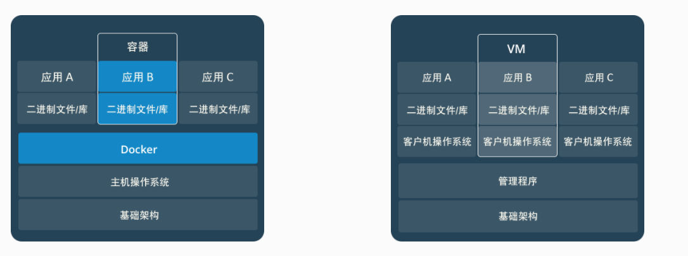
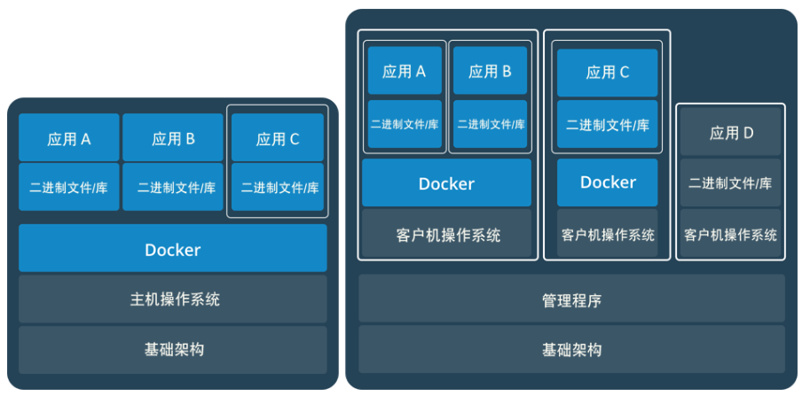

[TOC]

### Docker

#### 基础

##### 1. 什么是Docker

**Docker 是世界领先的软件容器平台**。Docker 使用 Google 公司推出的 **Go 语言** 进行开发实现，基于 **Linux 内核** 提供的 CGroup 功能和 name space 来实现的，以及 AUFS 类的 **UnionFS** 等技术，**对进程进行封装隔离，属于操作系统层面的虚拟化技术。** 由于隔离的进程独立于宿主和其它的隔离的进程，因此也称其为容器。**Docker 能够自动执行重复性任务，例如搭建和配置开发环境，从而解放了开发人员以便他们专注在真正重要的事情上：构建杰出的软件。**用户可以方便地创建和使用容器，把自己的应用放入容器。容器还可以进行版本管理、复制、分享、修改，就像管理普通的代码一样。

##### 2. Docker思想

- **集装箱**。
- **标准化：** ① 运输方式 ② 存储方式 ③ API 接口。
- **隔离**。

##### 3. Docker容器的特点

**轻量**：在一台机器上运行的多个 Docker 容器可以共享这台机器的操作系统内核；它们能够迅速启动，只需占用很少的计算和内存资源。镜像是通过文件系统层进行构造的，并共享一些公共文件。这样就能尽量降低磁盘用量，并能更快地下载镜像。

**标准**：Docker 容器基于开放式标准，能够在所有主流 Linux 版本、Microsoft Windows 以及包括 VM、裸机服务器和云在内的任何基础设施上运行。

**安全**：Docker 赋予应用的隔离性不仅限于彼此隔离，还独立于底层的基础设施。Docker 默认提供最强的隔离，因此应用出现问题，也只是单个容器的问题，而不会波及到整台机器。

##### 4. Docker优点

- **Docker 的镜像提供了除内核外完整的运行时环境，确保了应用运行环境一致性，从而不会再出现 “这段代码在我机器上没问题啊” 这类问题；——一致的运行环境**
- **可以做到秒级、甚至毫秒级的启动时间。大大的节约了开发、测试、部署的时间。——更快速的启动时间**
- **避免公用的服务器，资源会容易受到其他用户的影响。——隔离性**
- **善于处理集中爆发的服务器使用压力；——弹性伸缩，快速扩展**
- **可以很轻易的将在一个平台上运行的应用，迁移到另一个平台上，而不用担心运行环境的变化导致应用无法正常运行的情况。——迁移方便**
- **使用 Docker 可以通过定制应用镜像来实现持续集成、持续交付、部署。——持续交付和部署**


#### 容器与虚拟机

##### 1. 容器

一句话概括容器：**容器就是将软件打包成标准化单元，以用于开发、交付和部署**。

- **容器镜像是轻量的、可执行的独立软件包**，包含软件运行所需的所有内容：代码、运行时环境、系统工具、系统库和设置。
- **容器化软件适用于基于 Linux 和 Windows 的应用，在任何环境中都能够始终如一地运行。**
- **容器赋予了软件独立性**，使其免受外在环境差异（例如，开发和预演环境的差异）的影响，从而有助于减少团队间在相同基础设施上运行不同软件时的冲突。

 **容器虚拟化的是操作系统而不是硬件，容器之间是共享同一套操作系统资源的。虚拟机技术是虚拟出一套硬件后，在其上运行一个完整操作系统。因此容器的隔离级别会稍低一些。**

##### 2. 容器与虚拟机关系

简单来说： **容器和虚拟机具有相似的资源隔离和分配优势，但功能有所不同，因为容器虚拟化的是操作系统，而不是硬件，因此容器更容易移植，效率也更高。**

传统虚拟机技术是虚拟出一套硬件后，在其上运行一个**完整操作系统**，在该系统上再运行所需应用进程；而**容器内的应用进程直接运行于宿主的内核**，**容器内没有自己的内核**，而且也没有进行硬件虚拟。因此容器要比传统虚拟机更为轻便。



**容器是一个应用层抽象，用于将代码和依赖资源打包在一起。** **多个容器可以在同一台机器上运行，共享操作系统内核，但各自作为独立的进程在用户空间中运行** 。与虚拟机相比， **容器占用的空间较少**（容器镜像大小通常只有几十兆），**瞬间就能完成启动** 。

**虚拟机 (VM) 是一个物理硬件层抽象，用于将一台服务器变成多台服务器。** 管理程序允许多个 VM 在一台机器上运行。每个 VM 都包含一整套操作系统、一个或多个应用、必要的二进制文件和库资源，因此 **占用大量空间** 。而且 VM **启动也十分缓慢** 。

虚拟机与容器对比：


两者有不同的使用场景。**虚拟机更擅长于彻底隔离整个运行环境**。例如，云服务提供商通常采用虚拟机技术隔离不同的用户。而 **Docker 通常用于隔离不同的应用**，例如前端，后端以及数据库。



#### Docker基本概念

Docker 中有非常重要的三个基本概念，理解了这三个概念，就理解了 Docker 的整个生命周期。

- **镜像（Image）**
- **容器（Container）**
- **仓库（Repository）**

##### 1. 镜像(Image)

镜像即一个特殊的文件系统。

**操作系统分为内核和用户空间**。对于 Linux 而言，内核启动后，会挂载 root 文件系统为其提供用户空间支持。而 Docker 镜像（Image），就**相当于是一个 root 文件系统**。

**Docker 镜像是一个特殊的文件系统，除了提供容器运行时所需的程序、库、资源、配置等文件外，还包含了一些为运行时准备的一些配置参数（如匿名卷、环境变量、用户等）。** 镜像不包含任何动态数据，其内容在构建之后也**不会被改变**。

Docker 设计时，就充分利用 **Union FS**的技术，将其设计为 **分层存储的架构** 。 镜像实际是由多层文件系统联合组成。

**镜像构建时，会一层层构建，前一层是后一层的基础。每一层构建完就不会再发生改变，后一层上的任何改变只发生在自己这一层。**比如删除前一层文件的操作，实际不是真的删除前一层的文件，而是仅在当前层标记为该文件已删除。在最终容器运行的时候，虽然不会看到这个文件，但是实际上该文件会一直跟随镜像。因此在构建镜像的时候，需要额外小心，每一层尽量只包含该层需要添加的东西，任何额外的东西应该在该层构建结束前清理掉。

分层存储的特征还使得镜像的复用、定制变的更为容易。甚至可以用之前构建好的镜像作为基础层，然后进一步添加新的层，以定制自己所需的内容，构建新的镜像。

##### 2. 容器(Container)

容器即镜像运行时的实体。镜像（Image）和容器（Container）的关系，就像是面向对象程序设计中的 **类 和 实例** 一样，镜像是静态的定义，**容器是镜像运行时的实体。容器可以被创建、启动、停止、删除、暂停等** 。

容器的实质是进程，但与直接在宿主执行的进程不同，容器进程运行于属于自己的独立的 命名空间。前面讲过镜像使用的是分层存储，容器也是如此。

容器存储层的生存周期和容器一样，容器消亡时，容器存储层也随之消亡。因此，任何保存于容器存储层的信息都会随容器删除而丢失。

按照 Docker 最佳实践的要求，**容器不应该向其存储层内写入任何数据** ，容器存储层要保持无状态化。**所有的文件写入操作，都应该使用数据卷（Volume）、或者绑定宿主目录**，在这些位置的读写会跳过容器存储层，直接对宿主(或网络存储)发生读写，其性能和稳定性更高。数据卷的生存周期独立于容器，容器消亡，数据卷不会消亡。因此， **使用数据卷后，容器可以随意删除、重新 run ，数据却不会丢失。**

##### 3. 仓库(Repository)

仓库即集中存放镜像文件的地方。镜像构建完成后，可以很容易的在当前宿主上运行，但是， **如果需要在其它服务器上使用这个镜像，我们就需要一个集中的存储、分发镜像的服务，Docker Registry 就是这样的服务。**

一个 Docker Registry 中可以包含多个仓库（Repository）；每个仓库可以包含多个标签（Tag）；每个标签对应一个镜像。所以说：**镜像仓库是 Docker 用来集中存放镜像文件的地方类似于我们之前常用的代码仓库。**

通常，**一个仓库会包含同一个软件不同版本的镜像**，而**标签就常用于对应该软件的各个版本** 。可以通过 **<仓库名>:<标签>** 的格式来指定具体是这个软件哪个版本的镜像。如果不给出标签，将以 latest 作为默认标签。

**这里补充一下 Docker Registry 公开服务和私有 Docker Registry 的概念：**

**Docker Registry 公开服务** 是开放给用户使用、允许用户管理镜像的 Registry 服务。一般这类公开服务允许用户免费上传、下载公开的镜像，并可能提供收费服务供用户管理私有镜像。

在 Docker Hub 的搜索结果中，有几项关键的信息有助于选择合适的镜像：

- **OFFICIAL Image**：代表镜像为 Docker **官方提供**和维护，相对来说稳定性和安全性较高。
- **Stars**：和点赞差不多的意思，类似 GitHub 的 Star。
- **Dowloads**：代表镜像被拉取的次数，基本上能够表示镜像被使用的频度。

可以通过 **docker search** 这个命令搜索 Docker Hub 中的镜像，搜索的结果是一致的。

```bash
$ docker search mysql
NAME                              DESCRIPTION                                     STARS               OFFICIAL            AUTOMATED
mysql                             MySQL is a widely used, open-source relation…   8763                [OK]
mariadb                           MariaDB is a community-developed fork of MyS…   3073                [OK]
mysql/mysql-server                Optimized MySQL Server Docker images. Create…   650                                     [OK]
```


#### 常见命令

##### 1. 基本命令

```bash
docker version # 查看docker版本
docker images # 查看所有已下载镜像，等价于：docker image ls 命令
docker container ls # 查看所有容器
docker ps #查看正在运行的容器
docker image prune # 清理临时的、没有被使用的镜像文件。-a, --all: 删除所有没有用的镜像，而不仅仅是临时文件；
```

##### 2. 拉取镜像

```bash
docker search mysql # 查看mysql相关镜像
docker pull mysql:5.7 # 拉取mysql镜像
docker image ls # 查看所有已下载镜像
```

##### 3. 删除镜像

###### (1) 通过标签删除镜像

通过如下两个都可以删除镜像：

```
docker rmi [image]
```

或者：

```
docker image rm [image]
```

支持的子命令如下：

- `-f,-force`: 强制删除镜像，即便有容器引用该镜像。
- `-no-prune`: 不要删除未带标签的父镜像。

Docker 查看镜像信息

例如，我们想删除上章节创建的 `allen_mysql:5.7` 镜像，命令如下：

```shell
docker rmi allen_mysql:5.7
```


从上面章节中，我们知道 `allen_mysql:5.7` 和 `docker.io/mysql:5.7` 实际上指向的是同一个镜像，那么，您可以能会有疑问，我删除了 `allen_mysql:5.7`, 会不会将 `docker.io/mysql:5.7` 镜像也给删除了？

**实际上，当同一个镜像拥有多个标签时，执行 `docker rmi` 命令，只是会删除了该镜像众多标签中，您指定的标签而已，并不会影响原始的那个镜像文件。**

不信的话，我们可以执行 `docker images` 命令，来看下 `docker.io/mysql:5.7` 镜像还在不在：


可以看到， `docker.io/mysql:5.7` 镜像依然存在！

那么，如果某个镜像不存在多个标签，当且仅当只有一个标签时，执行删除命令时，您就要小心了，这会彻底删除镜像。

例如，这个时候，我们再执行 `docker rmi docker.io/mysql:5.7` 命令：


从上图可以看到，我们已经删除了 `docker.io/mysql:5.7` 镜像的所有文件层。该镜像在本地已不复存在了！

### 4.2 通过 ID 删除镜像

除了通过标签名称来删除镜像，我们还可以通过制定镜像 ID, 来删除镜像，如：

```
docker rmi ee7cbd482336
```

一旦制定了通过 ID 来删除镜像，它会先尝试删除所有指向该镜像的标签，然后在删除镜像本身。

### 4.3 删除镜像的限制

删除镜像很简单，但也不是我们何时何地都能删除的，它存在一些限制条件。

当通过该镜像创建的容器未被销毁时，镜像是无法被删除的。为了验证这一点，我们来做个试验。首先，我们通过 `docker pull alpine` 命令，拉取一个最新的 `alpine` 镜像, 然后启动镜像，让其输出 `hello,docker!`:


接下来，我们来删除这个镜像试试：


可以看到提示信息，无法删除该镜像，因为有容器正在引用他！同时，这段信息还告诉我们，除非通过添加 `-f` 子命令，也就是强制删除，才能移除掉该镜像！

```
docker rmi -f docker.io/alpine
```

但是，我们一般不推荐这样暴力的做法，正确的做法应该是：

1. 先删除引用这个镜像的容器；
2. 再删除这个镜像；

也就是，根据上图中提示的，引用该镜像的容器 ID ( `9d59e2278553`), 执行删除命令：

```
docker rm 9d59e2278553
```

然后，再执行删除镜像的命令：

```
docker rmi 5cb3aa00f899
```

Docker 删除镜像

这个时候，就能正常删除了！

### 4.4 清理镜像

我们在使用 Docker 一段时间后，系统一般都会残存一些临时的、没有被使用的镜像文件，可以通过以下命令进行清理：

```
docker image prune
```

它支持的子命令有：

- `-a,--all`: 删除所有没有用的镜像，而不仅仅是临时文件；
- `-f,--force`：强制删除镜像文件，无需弹出提示确认；

#### 镜像操作

##### 1. 概述

这里谈谈：Build, Ship, and Run。

如果搜索 Docker 官网，会发现如下的字样：**“Docker - Build, Ship, and Run Any App, Anywhere”**。

- **Build（构建镜像）**： 镜像就像是集装箱包括文件以及运行环境等等资源。
- **Ship（运输镜像）**：主机和仓库间运输，这里的仓库就像是超级码头一样。
- **Run（运行镜像）**：运行的镜像就是一个容器，容器就是运行程序的地方。

**Docker 运行过程也就是去仓库把镜像拉到本地，然后用一条命令把镜像运行起来变成容器。所以常常将 Docker 称为码头工人或码头装卸工，这和 Docker 的中文翻译搬运工人如出一辙。**

##### 2. 查看镜像详细信息

通过 **docker inspect** 命令，我们可以获取镜像的详细信息，其中，包括创建者，各层的数字摘要等。

```bash
docker inspect docker.io/mysql:5.7
```


docker inspect 返回的是 **JSON** 格式的信息，如果想获取其中指定的一项内容，可以通过 -f 来指定，如获取镜像大小：

```
docker inspect -f {{".Size"}} docker.io/mysql:5.7
```


#### Docker底层原理

##### 1. 基于LXC的虚拟容器技术

Docker 技术是基于 **LXC（Linux container- Linux 容器）虚拟容器技术**的。

LXC，其名称来自 Linux 软件容器（Linux Containers）的缩写，一种操作系统层虚拟化（Operating system–level virtualization）技术，为 Linux 内核容器功能的一个用户空间接口。它将应用软件系统打包成一个软件容器（Container），内含应用软件本身的代码，以及所需要的操作系统核心和库。通过统一的名字空间和共用 API 来分配不同软件容器的可用硬件资源，创造出应用程序的独立沙箱运行环境，使得 Linux 用户可以容易的创建和管理系统或应用容器。

LXC 技术主要是借助 Linux 内核中提供的 **CGroup 功能和 name space 来实现**的，通过 LXC 可以为软件提供一个独立的操作系统运行环境。

**cgroup 和 namespace 介绍：**

- **namespace 是 Linux 内核用来隔离内核资源的方式。** 通过 namespace 可以让一些进程只能看到与自己相关的一部分资源，而另外一些进程也只能看到与它们自己相关的资源，这两拨进程根本就感觉不到对方的存在。具体的实现方式是把一个或多个进程的相关资源指定在同一个 namespace 中。Linux namespaces 是对全局系统资源的一种封装隔离，使得处于不同 namespace 的进程拥有独立的全局系统资源，改变一个 namespace 中的系统资源只会影响当前 namespace 里的进程，对其他 namespace 中的进程没有影响。

- CGroup 是 Control Groups 的缩写，是 Linux 内核提供的一种可以限制、记录、隔离进程组 (process groups) 所使用的物力资源 (如 cpu memory i/o 等等) 的机制。


**cgroup 和 namespace 两者对比：**

两者都是将进程进行分组，但是两者的作用还是有本质区别。namespace 是为了隔离进程组之间的资源，而 cgroup 是为了对一组进程进行统一的资源监控和限制。


镜像作为 Docker 三大核心概念中，最重要的一个关键词，它有很多操作，是您想学习容器技术不得不掌握的。本文将带您一步一步，图文并重，上手操作来学习它。

### 目录

<!-- TOC -->

- [一 Docker 下载镜像](#一-docker-下载镜像)
    - [1.1 下载镜像](#11-下载镜像)
    - [1.2 验证](#12-验证)
    - [1.3 下载镜像相关细节](#13-下载镜像相关细节)
    - [1.4 PULL 子命令](#14-pull-子命令)
- [二 Docker 查看镜像信息](#二-docker-查看镜像信息)
    - [2.1 images 命令列出镜像](#21-images-命令列出镜像)
    - [2.2 使用 tag 命令为镜像添加标签](#22-使用-tag-命令为镜像添加标签)
    - [2.3 使用 inspect 命令查看镜像详细信息](#23-使用-inspect-命令查看镜像详细信息)
    - [2.4 使用 history 命令查看镜像历史](#24-使用-history-命令查看镜像历史)
- [三 Docker 搜索镜像](#三-docker-搜索镜像)
    - [3.1 search 命令](#31-search-命令)
    - [3.2 search 子命令](#32-search-子命令)
- [四 Docker 删除镜像](#四-docker-删除镜像)
    - [4.1 通过标签删除镜像](#41-通过标签删除镜像)
    - [4.2 通过 ID 删除镜像](#42-通过-id-删除镜像)
    - [4.3 删除镜像的限制](#43-删除镜像的限制)
    - [4.4 清理镜像](#44-清理镜像)
- [五 Docker 创建镜像](#五-docker-创建镜像)
    - [5.1 基于已有的镜像创建](#51-基于已有的镜像创建)
    - [5.2 基于 Dockerfile 创建](#52-基于-dockerfile-创建)
- [六 Docker 导出&加载镜像](#六-docker-导出加载镜像)
    - [6.1 导出镜像](#61-导出镜像)
    - [6.2 加载镜像](#62-加载镜像)
- [七 Docker 上传镜像](#七-docker-上传镜像)
    - [7.1 获取 Docker ID](#71-获取-docker-id)
    - [7.2 创建镜像仓库](#72-创建镜像仓库)
    - [7.3 上传镜像](#73-上传镜像)
- [八 总结](#八-总结)

<!-- /TOC -->

## 一 Docker 下载镜像

如果我们想要在本地运行容器，就必须保证本地存在对应的镜像。所以，第一步，我们需要下载镜像。当我们尝试下载镜像时，Docker 会尝试先从默认的镜像仓库（默认使用 Docker Hub 公共仓库）去下载，当然了，用户也可以自定义配置想要下载的镜像仓库。

### 1.1 下载镜像

镜像是运行容器的前提，我们可以使用 `docker pull[IMAGE_NAME]:[TAG]`命令来下载镜像，其中 `IMAGE_NAME` 表示的是镜像的名称，而 `TAG` 是镜像的标签，也就是说我们需要通过 “**镜像 + 标签**” 的方式来下载镜像。

**注意：** 您也可以不显式地指定 TAG, 它会默认下载 latest 标签，也就是下载仓库中最新版本的镜像。这里并不推荐您下载 latest 标签，因为该镜像的内容会跟踪镜像的最新版本，并随之变化，所以它是不稳定的。在生产环境中，可能会出现莫名其妙的 bug, 推荐您最好还是显示的指定具体的 TAG。

举个例子，如我们想要下载一个 Mysql 5.7 镜像，可以通过命令来下载：

```
docker pull mysql:5.7
```

会看到控制台输出内容如下：


**注意：** 由于官方 DockerHub 仓库服务器在国外，下载速度较慢，所以我将仓库的地址更改成了国内的 `docker.io` 的镜像仓库，所以在上图中，镜像前面会有 `docker.io` 出现。

当有 **Downloaded** 字符串输出的时候，说明下载成功了！！

### 1.2 验证

让我们来验证一下，本地是否存在 Mysql5.7 的镜像，运行命令：

```
docker images
```


可以看到本地的确存在该镜像，确实是下载成功了！

### 1.3 下载镜像相关细节

再说说上面下载镜像的过程：


通过下载过程，可以看到，一个镜像一般是由多个层（ `layer`） 组成，类似 `f7e2b70d04ae`这样的串表示层的唯一 ID（实际上完整的 ID 包括了 256 个 bit, 64 个十六进制字符组成）。

**您可能会想，如果多个不同的镜像中，同时包含了同一个层（ layer）,这样重复下载，岂不是导致了存储空间的浪费么?**

实际上，Docker 并不会这么傻会去下载重复的层（ `layer`）,Docker 在下载之前，会去检测本地是否会有同样 ID 的层，如果本地已经存在了，就直接使用本地的就好了。

**另一个问题，不同仓库中，可能也会存在镜像重名的情况发生, 这种情况咋办？**

严格意义上，我们在使用 `docker pull` 命令时，还需要在镜像前面指定仓库地址( `Registry`), 如果不指定，则 Docker 会使用您默认配置的仓库地址。例如上面，由于我配置的是国内 `docker.io` 的仓库地址，我在 `pull` 的时候，docker 会默认为我加上 `docker.io/library` 的前缀。

如：当我执行 `docker pull mysql:5.7` 命令时，实际上相当于 `docker pull docker.io/mysql:5.7`，如果您未自定义配置仓库，则默认在下载的时候，会在镜像前面加上 DockerHub 的地址。

Docker 通过前缀地址的不同，来保证不同仓库中，重名镜像的唯一性。

### 1.4 PULL 子命令

命令行中输入：

```
docker pull --help
```

会得到如下信息：

```
[root@iZbp1j8y1bab0djl9gdp33Z ~]# docker pull --help
Usage:  docker pull [OPTIONS] NAME[:TAG|@DIGEST]
Pull an image or a repository from a registry
Options:  -a, --all-tags                Download all tagged images in the repository      --disable-content-trust   Skip image verification (default true)      --help                    Print usage
```

我们可以看到主要支持的子命令有：

1. `-a,--all-tags=true|false`: 是否获取仓库中所有镜像，默认为否；
2. `--disable-content-trust`: 跳过镜像内容的校验，默认为 true;

## 二 Docker 查看镜像信息

### 2.1 images 命令列出镜像

通过使用如下两个命令，列出本机已有的镜像：

```
docker images
```

或：

```
docker image ls
```

如下图所示：


对上述红色标注的字段做一下解释：

- **REPOSITORY**: 来自于哪个仓库；
- **TAG**: 镜像的标签信息，比如 5.7、latest 表示不同的版本信息；
- **IMAGE ID**: 镜像的 ID, 如果您看到两个 ID 完全相同，那么实际上，它们指向的是同一个镜像，只是标签名称不同罢了；
- **CREATED**: 镜像最后的更新时间；
- **SIZE**: 镜像的大小，优秀的镜像一般体积都比较小，这也是我更倾向于使用轻量级的 alpine 版本的原因；

> 注意：图中的镜像大小信息只是逻辑上的大小信息，因为一个镜像是由多个镜像层（ `layer`）组成的，而相同的镜像层本地只会存储一份，所以，真实情况下，占用的物理存储空间大小，可能会小于逻辑大小。

### 2.2 使用 tag 命令为镜像添加标签

通常情况下，为了方便在后续工作中，快速地找到某个镜像，我们可以使用 `docker tag` 命令，为本地镜像添加一个新的标签。如下图所示：


为 `docker.io/mysql` 镜像，添加新的镜像标签 `allen_mysql:5.7`。然后使用 `docker images` 命令，查看本地镜像：


可以看到，本地多了一个 `allen_mysql:5.7` 的镜像。细心的你一定还会发现， `allen_mysql:5.7` 和 `docker.io/mysql:5.7` 的镜像 ID 是一模一样的，说明它们是同一个镜像，只是别名不同而已。

`docker tag` 命令功能更像是, 为指定镜像添加快捷方式一样。

### 2.3 2.4 使用 history 命令查看镜像历史

前面的小节中，我们知道了，一个镜像是由多个层（layer）组成的，那么，我们要如何知道各个层的具体内容呢？

通过 `docker history` 命令，可以列出各个层（layer）的创建信息，如我们查看 `docker.io/mysql:5.7` 的各层信息：

```
docker history docker.io/mysql:5.7
```


可以看到，上面过长的信息，为了方便展示，后面都省略了，如果您想要看具体信息，可以通过添加 `--no-trunc` 选项，如下面命令：

```
docker history --no-trunc docker.io/mysql:5.7
```

## 三 Docker 搜索镜像

### 3.1 search 命令

您可以通过下面命令进行搜索：

```
docker search [option] keyword
```

比如，您想搜索仓库中 `mysql` 相关的镜像，可以输入如下命令：

```
docker search mysql
```


### 3.2 search 子命令

命令行输入 `docker search--help`, 输出如下：

```
Usage:  docker search [OPTIONS] TERM
Search the Docker Hub for images
Options:  -f, --filter filter   Filter output based on conditions provided      --help            Print usage      --limit int       Max number of search results (default 25)      --no-index        Don't truncate output      --no-trunc        Don't truncate output
```

可以看到 `search` 支持的子命令有：

- `-f,--filter filter`: 过滤输出的内容；
- `--limitint`：指定搜索内容展示个数;
- `--no-index`: 不截断输出内容；
- `--no-trunc`：不截断输出内容；

举个列子，比如我们想搜索官方提供的 mysql 镜像，命令如下：

```
docker search --filter=is-official=true mysql
```


再比如，我们想搜索 Stars 数超过 100 的 mysql 镜像：

```
docker search --filter=stars=100 mysql
```


## 四 Docker 删除镜像

- 

## 五 Docker 创建镜像

此小节中，您将学习 Docker 如何创建镜像？Docker 创建镜像主要有三种：

1. 基于已有的镜像创建；
2. 基于 Dockerfile 来创建；
3. 基于本地模板来导入；

我们将主要介绍常用的 1，2 两种。

### 5.1 基于已有的镜像创建

通过如下命令来创建：

```
docker container commit
```

支持的子命令如下：

- `-a,--author`="": 作者信息；
- `-c,--change`=[]: 可以在提交的时候执行 Dockerfile 指令，如 CMD、ENTRYPOINT、ENV、EXPOSE、LABEL、ONBUILD、USER、VOLUME、WORIR 等；
- `-m,--message`="": 提交信息；
- `-p,--pause`=true: 提交时，暂停容器运行。

接下来，基于本地已有的 Ubuntu 镜像，创建一个新的镜像：


首先，让我将它运行起来，并在其中创建一个 test.txt 文件：


命令如下：

```
docker run -it docker.io/ubuntu:latest /bin/bashroot@a0a0c8cfec3a:/# touch test.txtroot@a0a0c8cfec3a:/# exit
```

创建完 test.txt 文件后，需要记住标注的容器 ID: `a0a0c8cfec3a`, 用它来提交一个新的镜像(**PS: 你也可以通过名称来提交镜像，这里只演示通过 ID 的方式**)。

执行命令：

```
docker container commit -m "Added test.txt file" -a "Allen" a0a0c8cfec3a test:0.1
```

提交成功后，会返回新创建的镜像 ID 信息，如下图所示：


再次查看本地镜像信息，可以看到新创建的 `test:0.1` 镜像了：


### 5.2 基于 Dockerfile 创建

通过 Dockerfile 的方式来创建镜像，是最常见的一种方式了，也是比较推荐的方式。Dockerfile 是一个文本指令文件，它描述了是如何基于一个父镜像，来创建一个新镜像的过程。

下面让我们来编写一个简单的 Dockerfile 文件，它描述了基于 Ubuntu 父镜像，安装 Python3 环境的镜像：

```
FROM docker.io/ubuntu:latest
LABEL version="1.0" maintainer="Allen <weiwosuo@github>"
RUN apt-get update && \    apt-get install -y python3 && \    apt-get clean && \    rm -rf /var/lib/apt/lists/*
```

创建完成后，通过这个 Dockerfile 文件，来构建新的镜像，执行命令：

```
docker image build -t python:3 .
```

**注意：** 命令的最后有个点，如果不加的话，会构建不成功 ！


编译成功后，再次查看本地镜像信息，就可以看到新构建的 python:3 镜像了。


## 六 Docker 导出&加载镜像

此小节中，您将学习 Docker 如何导出&加载镜像。

通常我们会有下面这种需求，需要将镜像分享给别人，这个时候，我们可以将镜像导出成 tar 包，别人直接通过加载这个 tar 包，快速地将镜像引入到本地镜像库。

要想使用这两个功能，主要是通过如下两个命令：

1. `docker save`
2. `docker load`

### 6.1 导出镜像

查看本地镜像如下：


例如，我们想要将 python:3 镜像导出来，执行命令：

```
docker save -o python_3.tar python:3
```

执行成功后，查看当前目录：

Docker 导出文件

可以看到 `python_3.tar` 镜像文件已经生成。接下来，你可以将它通过复制的方式，分享给别人了！

### 6.2 加载镜像

别人拿到了这个 `tar` 包后，要如何导入到本地的镜像库呢？

通过执行如下命令：

```
docker load -i python_3.tar
```

或者：

```
docker load < python_3.tar
```

导入成功后，查看本地镜像信息，你就可以获得别人分享的镜像了！怎么样，是不是很方便呢！

## 七 Docker 上传镜像

我们将以上传到 Docker Hub 上为示例，演示 Docker 如何上传镜像。

### 7.1 获取 Docker ID

想要上传镜像到 Docker Hub 上，首先，我们需要注册 Docker Hub 账号。打开 Docker Hub 网址 https://hub.docker.com，开始注册：


填写您的 Docker ID (也就是账号)，以及密码，Email, 点击继续。

接下来，Docker Hub 会发送验证邮件，到您填写的邮箱当中：


点击验证即可，接下来，再次返回 Docker Hub 官网，用您刚刚注册的 Docker ID 和密码来登录账号！


### 7.2 创建镜像仓库

登录成功后，会出现如下页面：


选择创建一个镜像仓库：


填写**仓库名称**、**描述信息**、**是否公开后**，点击创建。

仓库镜像展示页

我们看到，仓库已经创建成功了，但是里面还没有任何镜像，接下来开始上传镜像，到此新创建的仓库中。

### 7.3 上传镜像

进入命令行，**用我们刚刚获取的 Docker ID 以及密码登录**，执行命令：

```
docker login
```

命令行登录 Docker ID

登录成功后，我们开始准备上传本地的 `python:3` 镜像：


首先，我们对其打一个新的标签，**前缀与我们新创建的 Docker ID 、仓库名保持一致**:

```
docker tag python:3 weiwosuoai1991/python:3
```


查看本地信息，可以看到，标签打成功了。接下开，开始上传！执行命令：

```
docker push weiwosuoai1991/python:3
```


上传成功！去 Docker Hub 官网，新创建的仓库的信息页面验证一下，是否真的成功了：

仓库镜像展示页

大工告成！！！

## 八 总结

本文中，我们着重学习了 Docker 中下载镜像,、查看镜像信息、搜索镜像、删除镜像,、创建镜像、导出&加载镜像以及向 Docker Hub 上传镜像的相关操作。


#### 参考资料

- [10 分钟看懂 Docker 和 K8S](https://zhuanlan.zhihu.com/p/53260098 "10分钟看懂Docker和K8S")
- [从零开始入门 K8s：详解 K8s 容器基本概念](https://www.infoq.cn/article/te70FlSyxhltL1Cr7gzM "从零开始入门 K8s：详解 K8s 容器基本概念")

- [Linux Namespace 和 Cgroup](https://segmentfault.com/a/1190000009732550 "Linux Namespace和Cgroup")
- [LXC vs Docker: Why Docker is Better](https://www.upguard.com/articles/docker-vs-lxc "LXC vs Docker: Why Docker is Better")
- [CGroup 介绍、应用实例及原理描述](https://www.ibm.com/developerworks/cn/linux/1506_cgroup/index.html "CGroup 介绍、应用实例及原理描述")